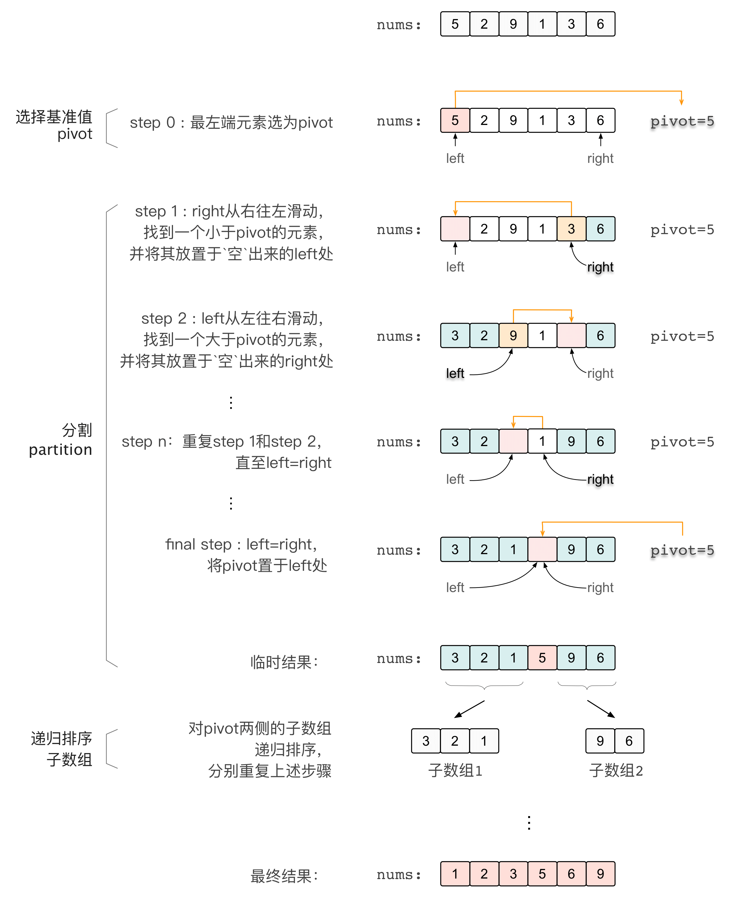

# TopK 

TopK 问题有两种解决方案:

- 借助快速选择算法，时间复杂度为 O(n)

- 借助大(小)顶堆，时间复杂度为 O(nlogk)

<br>

## 一、快速选择 (Quick Select)

快速选择 (Quick Select) 是一种选择算法，它与快速排序排序算法有关。核心思想都是分割 partition



`partition` 函数

```python
def partition(self, nums: List[int], left: int, right: int) -> int:
    i, j, pivot = left, right, nums[left]
    while i < j:
        # 先右边
        while i < j and nums[j] >= pivot:
            j -= 1
        nums[i], nums[j] = nums[j], nums[i]
        # 再左边
        while i < j and nums[i] <= pivot:
            i += 1
        nums[i], nums[j] = nums[j], nums[i]
    # 此时 i== j, 将 pivot 放到最终位置
    nums[i] = pivot
    # 返回分割数据下标
    return i
```

topk 切分

将快速排序改成快速选择，即我们希望寻找到一个位置，这个位置左边是 k 个比这个位置上的数更小的数，右边是 n-k-1 个比该位置上的数大的数，我将它命名为 `topk_split`，找到这个位置后停止迭代，完成了一次划分。

```python
def topk_split(nums, k, left, right):
    #寻找到第k个数停止递归，使得nums数组中index左边是前k个小的数，index右边是后面n-k个大的数
    if (left<right):
        index = partition(nums, left, right)
        if index==k:
            return 
        elif index < k:
            topk_split(nums, k, index+1, right)
        else:
            topk_split(nums, k, left, index-1)
```


### 0x01 快速排序

```python
#快速排序
def quicksort(nums, left, right):
    if left < right:
        index = partition(nums, left, right)
        quicksort(nums, left, index-1)
        quicksort(nums, index+1, right)

arr = [1,3,2,2,0]
quicksort(arr, 0, len(arr)-1)
```

### 0x02 获得前 k 小的数

```python
def topk_smalls(nums, k):
    topk_split(nums, k, 0, len(nums)-1)
    return nums[:k]

arr = [1,3,2,3,0,-19]
k = 2
print(topk_smalls(arr, k))
print(arr)
```

### 0x03 获得第 k 小的数

```python
def topk_small(nums, k-1):
    topk_split(nums, k, 0, len(nums)-1)
    return nums[k] 

arr = [1,3,2,3,0,-19]
k = 3
print(topk_small(arr, k))
print(arr)
```

### 0x04 获得前 k 大的数 

```python
def topk_larges(nums, k):
    # parttion是按从小到大划分的，如果让index左边为前n-k个小的数，则index右边为前k个大的数
    topk_split(nums, len(nums)-k, 0, len(nums)-1) #把k换成len(nums)-k
    return nums[len(nums)-k:] 

arr = [1,3,-2,3,0,-19]
k = 3
print(topk_larges(arr, k))
print(arr)
```

### 0x05 获得第 k 大的数 

```python
def topk_large(nums, k):
    # parttion是按从小到大划分的，如果让index左边为前n-k个小的数，则index右边为前k个大的数
    topk_split(nums, len(nums)-k, 0, len(nums)-1) #把k换成len(nums)-k
    return nums[len(nums)-k] 

arr = [1,3,-2,3,0,-19]
k = 2
print(topk_large(arr, k))
print(arr)
```

### 0x06 只排序前 k 个小的数
```python
# 获得前 k 小的数 O(n)，进行快排 O(klogk)
def topk_sort_left(nums, k):
    topk_split(nums, k, 0, len(nums)-1) 
    topk = nums[:k]
    quicksort(topk, 0, len(topk)-1)
    return topk+nums[k:] #只排序前k个数字

arr = [0,0,1,3,4,5,0,7,6,7]
k = 4
topk_sort_left(arr, k)
```

### 0x07 只排序后 k 个大的数

```python
# 获得前 n-k 小的数 O(n)，进行快排O(klogk)
def topk_sort_right(nums, k):
    topk_split(nums, len(nums)-k, 0, len(nums)-1) 
    topk = nums[len(nums)-k:]
    quicksort(topk, 0, len(topk)-1)
    return nums[:len(nums)-k]+topk #只排序后k个数字

arr = [0,0,1,3,4,5,0,-7,6,7]
k = 4
print(topk_sort_right(arr, k))
```

<br>


## 二、大(小)顶堆

```python


```

```python


```

```python


```

<br>

```python


```

```python


```

```python


```

```python


```

<br>

**Reference**

- [基于快排的所有 TopK 问题简单 python 模板](https://leetcode.cn/problems/kth-largest-element-in-an-array/solution/ji-yu-kuai-pai-de-suo-you-topkwen-ti-jia-ylsd/)

<br>
