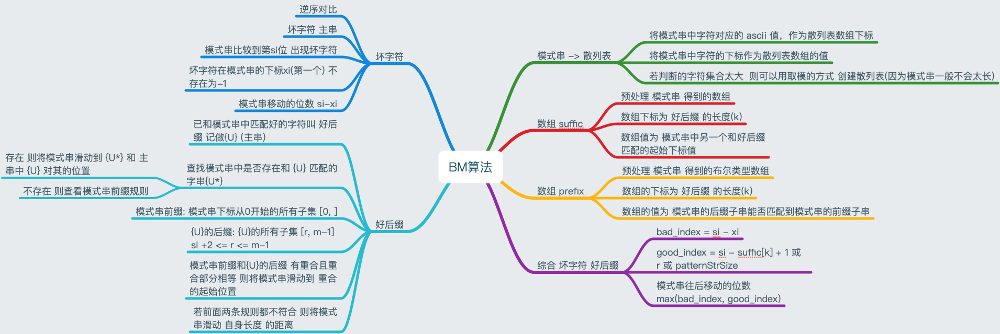
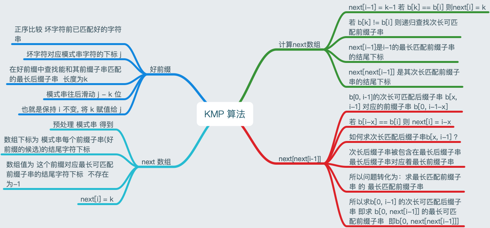

# 字符串匹配算法

### BM 算法

 

### KMP 算法

 

**参考：**

[Boyer-Moore](http://www.cs.jhu.edu/~langmea/resources/lecture_notes/boyer_moore.pdf)

[如何更好的理解和掌握 KMP 算法?](https://www.zhihu.com/question/21923021)

[KMP Algorithm for Pattern Searching](https://www.geeksforgeeks.org/kmp-algorithm-for-pattern-searching/)