`
# Flutter 在 Mac 环境下的安装与运行


<br>

本篇文章旨在记录安装 Flutter 过程中遇到的坑，具体安装细节也可参考文章最下面的官方文档。

本文运行环境 macOS Mojave 10.14.6、Xcode 11.0、iOS 真机: iOS 12.4.1、iOS 模拟器: iPhone 11 Pro Max、Android Stduio 3.6.1、Android 真机: Android 9、 `flutter_macos_v1.12.13+hotfix.8`

<br>

## 一、安装

### 0x01 获取 Flutter SDK

最新的 mac 环境下 Flutter SDK [在这](https://flutter.dev/docs/development/tools/sdk/releases?tab=macos)，下载之后打开终端

```
## 我是将 flutter 放在 ~/Documents/ZZFlutter 目录下，你随意
$ cd ~/Documents/ZZFlutter

## 解压下载 sdk
$ unzip ~/Downloads/flutter_macos_v1.12.13+hotfix.8-stable.zip
```

### 0x02 设置 Flutter 环境变量

```
$ open ~/.bash_profile
```

然后在`.bash_profile`文件中更改 PATH

```
## 国内用户需要设置
export PUB_HOSTED_URL=https://pub.flutter-io.cn 
## 国内用户需要设置
export FLUTTER_STORAGE_BASE_URL=https://storage.flutter-io.cnexport

PATH=PATH_TO_FLUTTER_GIT_DIRECTORY/flutter/bin:$PATH
```

注意上面的 `PATH_TO_FLUTTER_GIT_DIRECTORY `就是你解压 Flutter SDK的路径。如我的是

```
export PATH=~/Documents/ZZFlutter/flutter/bin:$PATH
```

运行 `source $HOME/.bash_profile` 刷新当前终端窗口

```
$ source ~/. bash_profile
```

但这样每次重启 Mac 后还会出现找不到 fluter 命令的错误

```
$ flutter doctor

zsh: command not found: flutter
```

这是因为终端启动时 `~/.bash_profile` 将不会被加载，解决办法就是修改 `~/.zshrc`, 在最后一行添加：`source ~/.bash_profile`

```
$ open ~/.zshrc 
              
## 最后一行添加：`source ~/.bash_profile`后 刷新
$ source ~/.zshrc

## 查看 flutter
$ which flutter
~/Documents/ZZFlutter/flutter/bin/flutter
```

### 0x03 运行 flutter doctor

该命令检查您的环境并在终端窗口中显示报告。Dart SDK 已经在捆绑在 Flutter 里了，没有必要单独安装 Dart。 仔细检查命令行输出以获取可能需要安装的其他软件或进一步需要执行的任务（以粗体显示）。


```
## 第一次运行 flutter doctor 命令要等待的时间有点久
$ flutter doctor

Doctor summary (to see all details, run flutter doctor -v):
[✓] Flutter (Channel stable, v1.12.13+hotfix.8, on Mac OS X 10.14.6 18G95, locale en-CN)
[✗] Android toolchain - develop for Android devices
    ✗ Unable to locate Android SDK.
      Install Android Studio from: https://developer.android.com/studio/index.html
      On first launch it will assist you in installing the Android SDK components.
      (or visit https://flutter.dev/setup/#android-setup for detailed instructions).
      If the Android SDK has been installed to a custom location, set ANDROID_HOME to that location.
      You may also want to add it to your PATH environment variable.

 
[✓] Xcode - develop for iOS and macOS (Xcode 11.0)
[!] Android Studio (not installed)
[!] Connected device
    ! No devices available

! Doctor found issues in 3 categories. 
```

我是做 iOS 的所以 Xcode 是早就安装好的，看打印信息是需要安装 Android Studio。
Android Studio 的下载网上搜一下就能找到，或者点击[这里](https://developer.android.com/studio/#downloads)。找对自己需要的安装就行了。

安装之后再执行 `flutter doctor`

```
## 除了第一次执行慢的很 剩下都比较快
$ flutter doctor

Doctor summary (to see all details, run flutter doctor -v):
[✓] Flutter (Channel stable, v1.12.13+hotfix.8, on Mac OS X 10.14.6 18G95, locale en-CN)
[!] Android toolchain - develop for Android devices (Android SDK version 29.0.3)
    ✗ Android license status unknown.
      Try re-installing or updating your Android SDK Manager.
      See https://developer.android.com/studio/#downloads or visit https://flutter.dev/setup/#android-setup for detailed instructions.
[✓] Xcode - develop for iOS and macOS (Xcode 11.0)
[!] Android Studio (version 3.6)
    ✗ Flutter plugin not installed; this adds Flutter specific functionality.
    ✗ Dart plugin not installed; this adds Dart specific functionality.
[!] Connected device
    ! No devices available

! Doctor found issues in 3 categories.
```

第一个 ✗ 的意思是，`Android license status unknown.`是没有证书。那我们需要安装证书。

```
$ flutter doctor --android-licenses

Android sdkmanager tool not found (~/Library/Android/sdk/tools/bin/sdkmanager).
Try re-installing or updating your Android SDK,
visit https://flutter.dev/setup/#android-setup for detailed instructions.
```

执行上述命令可能出现上述错误，然后我们打开`~/Library/Android/sdk/`路径发现没有tools 文件夹

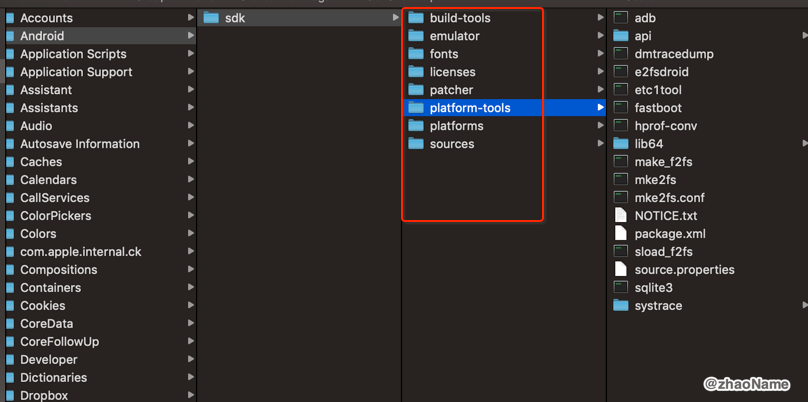

再打开 Android Studio 3.6.1 的 SDK Manager,发现也没有 Android SDK Tools(之前版本是有的)。

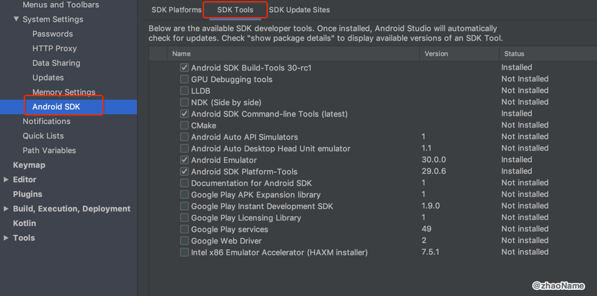

最后在[这里](https://github.com/flutter/flutter/issues/31116)找到解决办法(在最下面).打开 Android Studio 3.6.1的 SDK Manager,下载 Android SDK Command-Line Tools (laste)

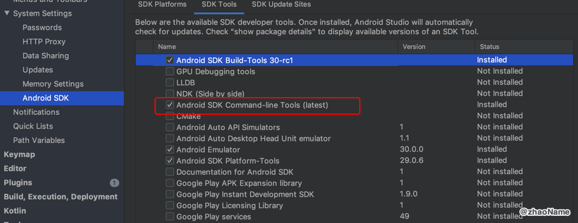


然后执行下属命令

```
$ cd ~/Library/Android/sdk/cmdline-tools/latest/bin

## 这步需要你一直 y
$ ./sdkmanager --licenses

$ mkdir -p tools/bin
$ cd tools/bin
$ ln -sv ../../cmdline-tools/latest/bin/sdkmanager .
```

然后再执行

```
$ flutter doctor --android-licenses

A newer version of the Android SDK is required. To update, run:
~/Library/Android/sdk/tools/bin/sdkmanager --update
```

按照提示执行 update

```
$ ~/Library/Android/sdk/tools/bin/sdkmanager --update

Exception in thread "main" java.lang.NoClassDefFoundError: javax/xml/bind/annotation/XmlSchema
        at com.android.repository.api.SchemaModule$SchemaModuleVersion.<init>(SchemaModule.java:156)
        at com.android.repository.api.SchemaModule.<init>(SchemaModule.java:75)
        at com.android.sdklib.repository.AndroidSdkHandler.<clinit>(AndroidSdkHandler.java:81)
        at com.android.sdklib.tool.sdkmanager.SdkManagerCli.main(SdkManagerCli.java:73)
        at com.android.sdklib.tool.sdkmanager.SdkManagerCli.main(SdkManagerCli.java:48)
Caused by: java.lang.ClassNotFoundException: javax.xml.bind.annotation.XmlSchema
        at java.base/jdk.internal.loader.BuiltinClassLoader.loadClass(BuiltinClassLoader.java:582)
        at java.base/jdk.internal.loader.ClassLoaders$AppClassLoader.loadClass(ClassLoaders.java:190)
        at java.base/java.lang.ClassLoader.loadClass(ClassLoader.java:499)
        ... 5 more
```

若 update 出现上述错误，是因为 jdk 版本有点低。可参照[在Mac上安装JDK1.8及环境变量配置](https://www.cnblogs.com/kareza/p/JDK.html)升级版本


然后在执行 `flutter doctor`,可以看到第一个 ✗ 已经解决了。

```
flutter doctor
Doctor summary (to see all details, run flutter doctor -v):
[✓] Flutter (Channel stable, v1.12.13+hotfix.8, on Mac OS X 10.14.6 18G95, locale en-CN)
[✓] Android toolchain - develop for Android devices (Android SDK version 30.0.0-rc1)
[✓] Xcode - develop for iOS and macOS (Xcode 11.0)
[!] Android Studio (version 3.6)
    ✗ Flutter plugin not installed; this adds Flutter specific functionality.
    ✗ Dart plugin not installed; this adds Dart specific functionality.
[!] Connected device
    ! No devices available

! Doctor found issues in 2 categories.
```

**注意：若手残把`sdkmanager --licenses`命令需要的 y 给成 n(说的就是我自己)，或者一直回车，到最后会出现如下提示**

```
$ flutter doctor   

Doctor summary (to see all details, run flutter doctor -v):
[✓] Flutter (Channel stable, v1.12.13+hotfix.8, on Mac OS X 10.14.6 18G95, locale en-CN)
[!] Android toolchain - develop for Android devices (Android SDK version 30.0.0-rc1)
    ! Some Android licenses not accepted.  To resolve this, run: flutter doctor --android-licenses
[✓] Xcode - develop for iOS and macOS (Xcode 11.0)
[!] Android Studio (version 3.6)
    ✗ Flutter plugin not installed; this adds Flutter specific functionality.
    ✗ Dart plugin not installed; this adds Dart specific functionality.
[!] Connected device
    ! No devices available

! Doctor found issues in 2 categories.
```

这时候需要你重新执行`sdkmanager --licenses`，一直 y, 不要按提示给的执行`flutter doctor --android-licenses`。

<br>

第二个和第三个 ✗ 意思是需要在 Android Studio 中安装 Flutter 和 Dart 插件。

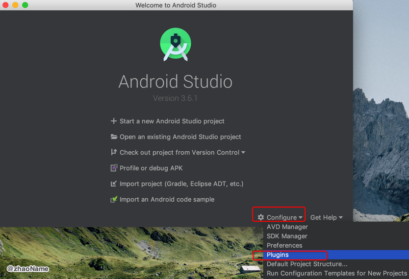

因为 Flutter 插件是基于 Dart 插件的，所以我们直接搜索 Flutter 插件，会自动帮我们把 Dart 插件也安装好

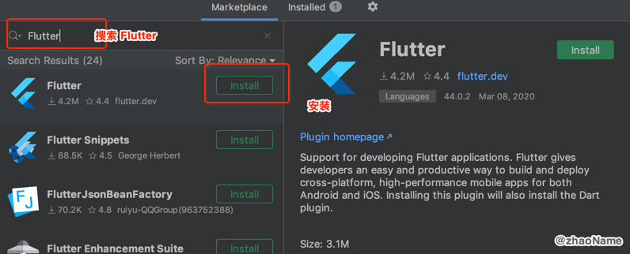


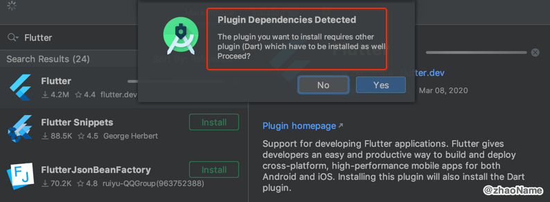

安装完成长这个样子

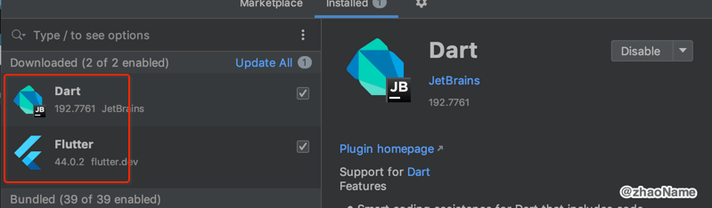


把这三个问题解决再执行`flutter doctor`

```
$ flutter doctor       

Doctor summary (to see all details, run flutter doctor -v):
[✓] Flutter (Channel stable, v1.12.13+hotfix.8, on Mac OS X 10.14.6 18G95, locale en-CN)
[✓] Android toolchain - develop for Android devices (Android SDK version 30.0.0-rc1)
[✓] Xcode - develop for iOS and macOS (Xcode 11.0)
[✓] Android Studio (version 3.6)
[!] Connected device
    ! No devices available

! Doctor found issues in 1 category.
```

`No devices available`可以不用管它，这个提示是因为我们没连上真机。

<br>

## 二、运行

### 0x01 创建第一个 Flutter 程序

flutter 的创建很简单

```
$ cd ~/Desktop

$ flutter create my_first_flutter
Creating project my_first_flutter... androidx: true
  my_first_flutter/ios/Runner.xcworkspace/contents.xcworkspacedata (created)
  my_first_flutter/ios/Runner/Info.plist (created)
  my_first_flutter/ios/Runner/Assets.xcassets/LaunchImage.imageset/LaunchImage@2x.png (created)
  ...
Running "flutter pub get" in my_first_flutter...                   60.5s
Wrote 68 files.

All done!
[✓] Flutter: is fully installed. (Channel stable, v1.12.13+hotfix.8, on Mac OS X 10.14.6 18G95, locale en-CN)
[✓] Android toolchain - develop for Android devices: is fully installed. (Android SDK version 30.0.0-rc1)
[✓] Xcode - develop for iOS and macOS: is fully installed. (Xcode 11.0)
[✓] Android Studio: is fully installed. (version 3.6)
[!] Connected device: is not available.

Run "flutter doctor" for information about installing additional components.

In order to run your application, type:

  $ cd my_first_flutter
  $ flutter run

Your application code is in my_first_flutter/lib/main.dart.
```

创建出来的文件结构大概长这样子

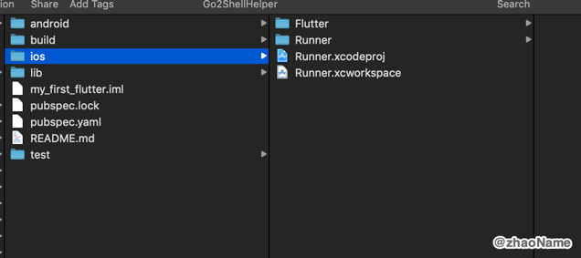


这里值得主要的是`Dart package name`必须是全小写中间用下划线分隔。像下面这种写法就会报错

```
$ flutter create MyFirstFlutter

"MyFirstFlutter" is not a valid Dart package name.
From the [Pubspec format description](https://www.dartlang.org/tools/pub/pubspec.html):

**DO** use `lowercase_with_underscores` for package names.

Package names should be all lowercase, with underscores to separate words,
`just_like_this`.  Use only basic Latin letters and Arabic digits: [a-z0-9_].
Also, make sure the name is a valid Dart identifier -- that it doesn't start
with digits and isn't a reserved word.
```

### 0x02 在 iOS 环境下中运行

因为我本身是做 iOS 的，所以像 cocoapods 这种插件早就安装好了。你可以[在这里](https://github.com/zhaoName/Notes/blob/master/iOS/CocoaPods(%E4%B8%80)%20-%20Uninstall%20And%20Install.md)查看 cocoapods 的安装方法。

- 选择证书

```
$ cd my_first_flutter
$ open Runner.xcworkspace
```

然后在`Command + ,`打开 Xcode 的偏好设置的`Account`中添加账号(也就是你平时在 Appstore 下载 APP 的账号), 你要是有付费账号也行。

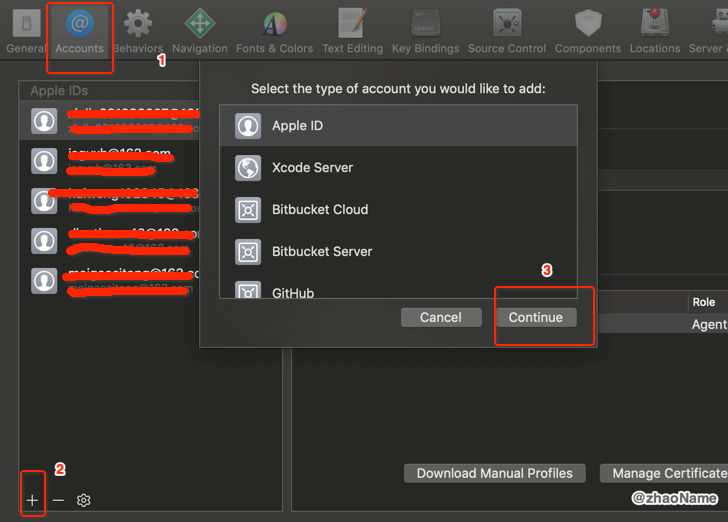

然后在`ProjectName(Runner) -> Signing & Capabilities` 

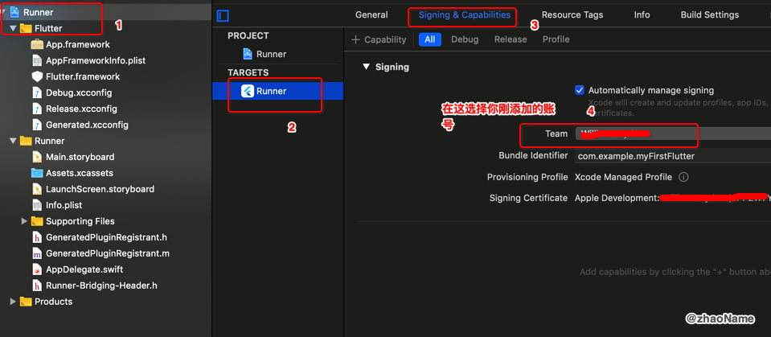

- 在 iOS 模拟器上运行

在 iOS 模拟器上运行一定要先打开模拟器，否则你在终端执行`flutter run`会报错

```
$ flutter run

No supported devices connected.
```

而模拟器也是分型号的如 iPhone 11、iPhone 11 Pro、iPhone 11 Pro Max。你可以选择用命令行打开模拟器然后在 Xcode 中选择对应的模拟器(这样打开模拟器的类型不好控制)。 你也可以先在 Xcode 中选择你想要打开模拟器的类型，再`Command + r`, 运行 Xcode，Xcode 会自动帮你打开你选择的模拟器。

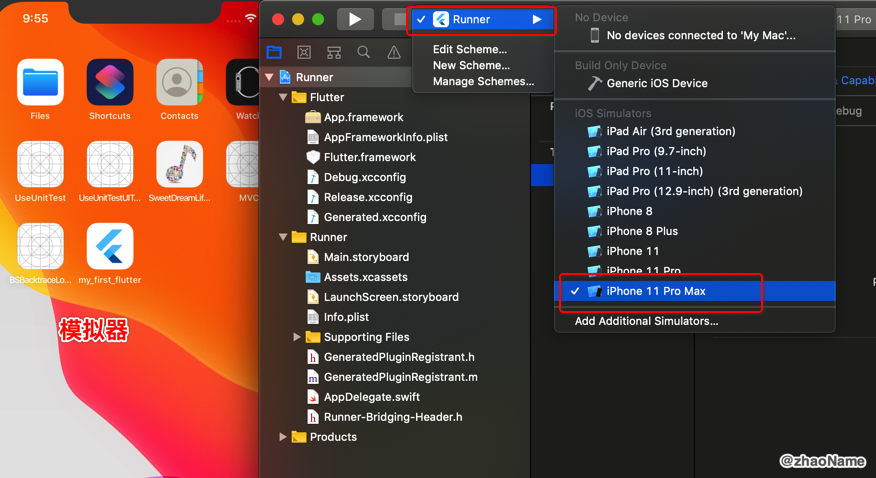

然后终端执行 `flutter run`

```
$ flutter run
 
Launching lib/main.dart on iPhone 11 Pro Max in debug mode...
Running Xcode build...                                                  
                                                   
 ├─Assembling Flutter resources...                          13.2s
 └─Compiling, linking and signing...                        19.0s
Xcode build done.                                           38.6s
Syncing files to device iPhone 11 Pro Max...                            
 8,938ms (!)                                       

🔥  To hot reload changes while running, press "r". To hot restart (and rebuild state), press "R".
An Observatory debugger and profiler on iPhone 11 Pro Max is available at: http://127.0.0.1:51824/USLaD5TgMOA=/
For a more detailed help message, press "h". To detach, press "d"; to quit, press "q".
```

这样就在 iOS 模拟器上跑起来了。

- 在 iOS 设备上运行

如果你的 iPhone 是第一次连接上 Xcode ，会有如下提示 这需要你稍等两分钟(这个过程会占用你 2~3G 磁盘空间)。

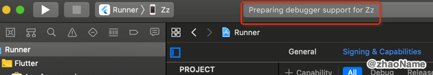

等它准备好后 选择真机设备，再终端运行`flutter run`, 可能出现如下提示

```
$ flutter run

More than one device connected; please specify a device with the '-d <deviceId>' flag, or use '-d all' to act on all devices.

Zz                • ******(就是手机的udid) • ios • iOS 12.4.1
iPhone 11 Pro Max • 6EEB6655-71CF-49AB-ABC5-BAFFC4FDDC98     • ios • com.apple.CoreSimulator.SimRuntime.iOS-13-0 (simulator)
```

根据提示选择真机运行，这样第一个 Flutter 就在 iPhone 上运行起来。

```
$ flutter run -d ******

Launching lib/main.dart on Zz in debug mode...
 
Automatically signing iOS for device deployment using specified development team in Xcode project: SHMGPM9485
Running Xcode build...                                                  
                                                   
 ├─Assembling Flutter resources...                           3.9s
 └─Compiling, linking and signing...                        46.3s
Xcode build done.                                           56.5s                                  
                                                                        
Installing and launching...                                        19.0s
Syncing files to device Zz...                                           
 7,448ms (!)                                       

🔥  To hot reload changes while running, press "r". To hot restart (and rebuild state), press "R".
An Observatory debugger and profiler on Zz is available at: http://127.0.0.1:1024/2QisMjrPJAk=/
For a more detailed help message, press "h". To detach, press "d"; to quit, press "q".
```

也有可能在这步会运行报错

```
$ flutter run -d 04ee59be188
 
Launching lib/main.dart on Zz in debug mode...
 
Automatically signing iOS for device deployment using specified development team in Xcode project: SHMGPM9485
Running Xcode build...                                                  
                                                   
Xcode build done.                                            8.4s
Failed to build iOS app
Error output from Xcode build:
↳
    ** BUILD FAILED **
    
Xcode's output:
↳
    error: unable to attach DB: error: accessing build database
    "/Users/chuangqi/Library/Developer/Xcode/DerivedData/Runner-aunujohoggirdoebgtyikstomjeq/Build/Intermediates.noindex/XCBuildData/build.db
    ": database is locked Possibly there are two concurrent builds running in the same filesystem location.
    note: Using new build systemnote: Planning buildnote: Constructing build description

Could not build the precompiled application for the device.

It appears that your application still contains the default signing identifier.
Try replacing 'com.example' with your signing id in Xcode:
  open ios/Runner.xcworkspace

Error launching application on Zz.
```

像这种`Try replacing 'com.example' with your signing`错误基本都是 bundleId (android 中叫 package name) 重复。修改 bundleId 就好。


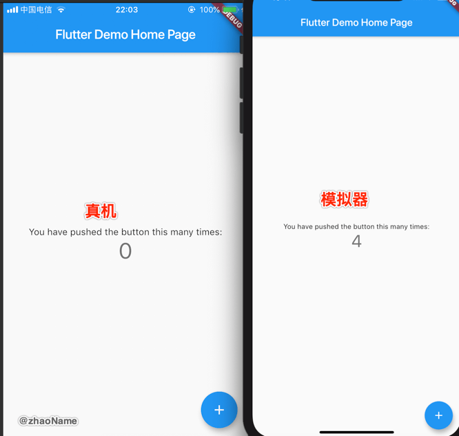


#### 0x03 在 Android 环境下中运行

- 在 Android 真机设备上运行

在 设置 -> 开发者选项 -> 启用 USB 调试, 具体可参考[Google 文档](https://developer.android.com/studio/run/device)。设备用 USB 连上电脑会给3个提示，选择传输文件或传输图片都可以。

然后终端运行`flutter devices`来验证 Flutter 识别您连接的 Android 设备。

```
$ flutter devices                                        
1 connected device:

RMX1901 • ***** • android-arm64 • Android 9 (API 28)
```

终端执行`flutter run`运行程序

```
$ flutter run

Launching lib/main.dart on RMX1901 in debug mode...
Running Gradle task 'assembleDebug'...                                  
Running Gradle task 'assembleDebug'... Done                         3.1s
✓ Built build/app/outputs/apk/debug/app-debug.apk.
D/FlutterActivity( 7784): Using the launch theme as normal theme.
D/FlutterActivityAndFragmentDelegate( 7784): Setting up FlutterEngine.
D/FlutterActivityAndFragmentDelegate( 7784): No preferred FlutterEngine was provided. Creating a new FlutterEngine for this FlutterFragment.
D/FlutterActivityAndFragmentDelegate( 7784): Attaching FlutterEngine to the Activity that owns this Fragment.
D/FlutterView( 7784): Attaching to a FlutterEngine: io.flutter.embedding.engine.FlutterEngine@a60bbb9
D/FlutterActivityAndFragmentDelegate( 7784): Executing Dart entrypoint: main, and sending initial route: /
Syncing files to device RMX1901...                                      
 7,962ms (!)                                       

🔥  To hot reload changes while running, press "r". To hot restart (and rebuild state), press "R".
An Observatory debugger and profiler on RMX1901 is available at: http://127.0.0.1:57670/5yGyffOcz84=/
For a more detailed help message, press "h". To detach, press "d"; to quit, press "q".
```


Android 模拟器上的调试这里就不尝试了(听说卡的丫批)。

<br>

<br>


**参考:**

- [macOS install](https://flutter.dev/docs/get-started/install/macos)

- [入门: 在macOS上搭建Flutter开发环境](https://flutterchina.club/setup-macos/)

- [Android license status unknown](https://github.com/flutter/flutter/issues/31116)

- [flutter doctor --android-licenses : Android sdkmanager tool not found](https://github.com/flutter/flutter/issues/51712)

<br>

`