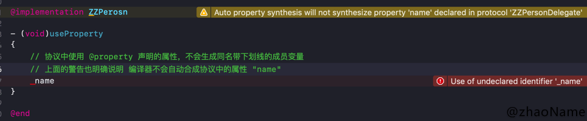
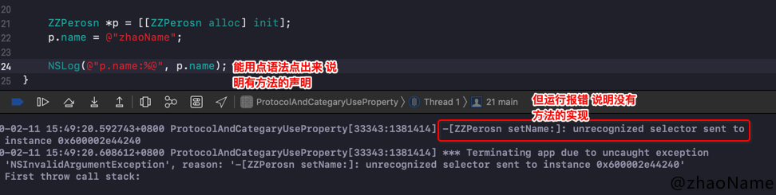

# 招聘一个靠谱的 iOS

<br>

本文题目来自于孙源的[招聘一个靠谱的iOS](https://github.com/ChenYilong/iOSInterviewQuestions)


### 0x01. 什么情况使用 weak 关键字，相比 assign 有什么不同？

> 什么情况使用 weak 关键字 ?

- 在 ARC 中，解循环引用时，如 block、delelgate

- 自身已对其进行强引用，没必要再强引用一次，如 IBOutlet

> 相比 assign 有什么不同 ？

- weak 修饰的变量在释放后所指向的内存空间会被置为 nil，而 assgin 只会针对“纯量类型”执行简单的赋值操作,容易造成野指针访问。

- weak 必然修饰 OC 对象，assgin 修饰非 OC 对象(修饰 OC 对象编译不会报错，但容易出问题，如被修饰的对象提前被释放、野指针访问等)


<br>

### 0x02. 怎么用 copy 关键字？

- NSString、NSArray、NSDictionary 等等经常使用 copy 关键字，是因为他们有对应的可变类型：NSMutableString、NSMutableArray、NSMutableDictionary

- block 也经常使用 copy 关键字，具体原因见官方文档：[Objects Use Properties to Keep Track of Blocks](https://developer.apple.com/library/archive/documentation/Cocoa/Conceptual/ProgrammingWithObjectiveC/WorkingwithBlocks/WorkingwithBlocks.html#//apple_ref/doc/uid/TP40011210-CH8-SW12)。在 MRC 环境下需要使用 copy 关键字将 block 从栈上拷贝到堆上，在 ARC 环境下编译器自动帮我们对 block 进行 copy 操作。所以在 ARC 环境下 block 使用 copy 或 strong 效果一样。但 ARC 环境下使用 copy 修饰 block 能时刻提醒我们不是不需要 copy，而是编译器帮我们做了。


<br>

### 0x03. 这个写法会出什么问题： @property (copy) NSMutableArray *array;

- array 实际类型是 NAArray。也就是说对 array 进行增删改查会报方法找不到的错误。

- 声明属性是未指定是 atomic 还是 nonatomic，默认是 atomic. 也就是上述代码会很消耗性能。

- 延伸：atomic 使用自旋锁，会在创建时生成一些额外的代码用于帮助编写多线程程序，这会带来性能问题，通过声明 nonatomic 可以节省这些虽然很小但是不必要额外开销。


<br>


### 0x04. 如何让自己的类用 copy 修饰符？如何重写带 copy 关键字的 setter？

> 如何让自己的类用 copy 修饰符？

若想令自己所写的对象具有拷贝功能，则需实现 NSCopying 协议。如果自定义的对象分为可变版本与不可变版本，那么就要同时实现 NSCopying 与 NSMutableCopying 协议

```
// ZZPerson.h
@interface ZNPerson : NSObject<NSCopying>

@property (nonatomic, assign) int age;
@property (nonatomic, copy) NSString *name;

@end

// ZZPerson.m
- (id)copyWithZone:(NSZone *)zone
{
    // [self class] 能防止子类未实现 NSCoping 协议调用copy 方法，出现崩溃(unrecognized selector sent to instance)
    // 但使用 [self class] 只能实现父类的属性拷贝，子类的属性值不能拷贝，需要子类重新实现 copyWithZone: 方法
    ZNPerson *p = [[[self class] allocWithZone:zone] init];
    p.age = self.age;
    p.name = self.name;
    // 浅拷贝
    p.friends = self.friends.mutableCopy;
    // 单层深拷贝
    //p.friends = [[NSMutableArray alloc] initWithArray:self.friends copyItems:YES];
    return p;
}
```

> 如何重写带 copy 关键字的 setter？

```
- (void)setName:(NSString *)name {
    //[_name release];
    _name = [name copy];
}
```

<br>


### 0x05. @property 的本质是什么？ivar、getter、setter 是如何生成并添加到这个类中的 ？

> @property 的本质是什么 ？

使用 @property 声明属性，编译器会自动帮我们干三件事：

- 自动生成同名带下划钱的成员变量 _property

- 自动生成 setter getter 方法的声明

- 自动生成 setter getter 方法的实现

property 在 runtime 中的声明是 `objc_property_t` 定义如下：

```
// objc-750 runtime.h
typedef struct objc_property *objc_property_t;
```

`objc_property `是一个结构体，定义如下

```
// objc-750 objc-runtime.mm
struct property_t {
    const char *name;
    const char *attributes;
};
```

`attributes` 的本质是`objc_property_attribute_t `结构体

```
// objc-750 runtime.h
/// Defines a property attribute
typedef struct {
    const char *name;           /**< The name of the attribute */
    const char *value;          /**< The value of the attribute (usually empty) */
} objc_property_attribute_t;
```

我们以上面的`ZZPerson`为例，打印下 property

```
+ (void)printfPropertyList
{
    int count = 0;
    objc_property_t *propertys = class_copyPropertyList(self.class, &count);
    for (int i=0; i<count; i++)
    {
        objc_property_t pro = propertys[i];
        printf("name:%s\n", property_getName(pro));
        printf("Attributes:%s\n",property_getAttributes(pro));
    }
}

// 打印结果
name:dog
Attributes:T@"ZNDog",&,N,V_dog
name:age
Attributes:Ti,N,V_age
name:name
Attributes:T@"NSString",C,N,V_name
name:friends
Attributes:T@"NSMutableArray",&,N,V_friends
```

`Attributes`具体的意思可以参考[Type Encodings](https://developer.apple.com/library/archive/documentation/Cocoa/Conceptual/ObjCRuntimeGuide/Articles/ocrtTypeEncodings.html#//apple_ref/doc/uid/TP40008048-CH100-SW1)

以 name 为例解释：T 是类型(后面紧跟着是具体类型)、C 就代表Copy，N 代表nonatomic，V 就代表对应的实例变量。

> ivar、getter、setter 是如何生成并添加到这个类中的 ？

(以下属于复制)完成属性定义后，编译器会自动编写访问这些属性所需的方法，此过程叫做“自动合成”(autosynthesis)。需要强调的是，这个过程由编译 器在编译期执行，所以编辑器里看不到这些“合成方法”(synthesized method)的源代码。

sunnyxx 为了搞清属性是怎么实现的,曾经反编译过相关的代码,他大致生成了五个东西

- `OBJC_IVAR_$类名$属性名称`: 该属性的“偏移量” (offset)，这个偏移量是“硬编码” (hardcode)，表示该变量距离存放对象的内存区域的起始地址有多远。

- setter 与 getter 方法对应的实现函数

- `ivar_list` ：成员变量列表

- `method_list` ：方法列表

- `property_list` ：属性列表

也就是说我们每次在增加一个属性,系统都会在 `ivar_list` 中添加一个成员变量的描述,在 `method_list` 中增加 setter 与 getter 方法的描述,在属性列表中增加一个属性的描述,然后计算该属性在对象中的偏移量,然后给出 setter 与 getter 方法对应的实现,在 setter 方法中从偏移量的位置开始赋值,在 getter 方法中从偏移量开始取值,为了能够读取正确字节数,系统对象偏移量的指针类型进行了类型强转。

<br>


### 0x06. @protocol 和 category 中如何使用 @property

@protocol 和 category 中都能使用 @property 声明属性，但只有 setter getter 方法的声明，没有带下划线的成员变量和 setter getter 方法的实现。

> @protocol 中使用 @property

```
@protocol ZZPersonDelegate <NSObject>
@property (nonatomic, copy) NSString *name;/**< */
@end

@interface ZZPerosn : NSObject<ZZPersonDelegate>
@end

@implementation ZZPerosn
- (void)useProperty
{
    // 协议中使用 @property 声明的属性，不会生成同名带下划线的成员变量
    // 上面的警告也明确说明 编译器不会自动合成协议中的属性 "name"
    // _name
}
@end

// ViewController.m
- (void)viewDidLoad {
    [super viewDidLoad];
    
    ZZPerosn *p = [[ZZPerosn alloc] init];
    p.name = @"zhaoName";
    
    NSLog(@"p.name:%@", p.name);
}
```

- 不会生成同名带下划线的成员变量



- 编译器只会生成 setter getter 的声明，不会自动生成 setter getter 方法的实现



- 在 protocol 中使用 @property 时，我们需要在遵守这个协议的类中，完善属性的方法实现和带成员变量

```
// 第一种方法 @synthesize 告诉编译器自动帮我们合成
@implementation ZZPerosn

@synthesize name = _name;
@end


// 第二种方法  @dynamic 手动合成
@implementation ZZPerosn
{
    NSString *_name;
}
@dynamic name;

- (void)setName:(NSString *)name
{
    _name = name;
}

- (NSString *)name
{
    return _name;
}
@end

// 打印结果
2020-02-11 16:16:12.353601+0800 ProtocolAndCategaryUseProperty[33612:1394241] p.name:zhaoName
```

> category 中使用 @property

category 中使用 @property 声明属性，也是只有 setter getter 方法的声明，没有带下划线的成员变量和 setter getter 方法的实现。但是也解决这个问题需要用到两个函数`objc_setAssociatedObject `、`objc_getAssociatedObject `

```
@implementation ZZperson (Property)

- (void)setName:(NSString *)name
{
    objc_setAssociatedObject(self, @"name", name, OBJC_ASSOCIATION_RETAIN_NONATOMIC);
}

- (NSString *)name
{
    return objc_getAssociatedObject(self, @"name");
}
@end
```

<br>

### 0x07. runtime 如何实现 weak 属性


<br>


### 0x08. @property 中有哪些属性关键字？/ @property 后面可以有哪些修饰符？

- 原子性：`nonatomic`、`atomic`

- 读写权限：`readonly`、`readwrite `

- 修饰符：`strong`、`copy`、`assgin`、`unsafe_unretained `、`weak`

- 方法名：`getter=<name>` 、`setter=<name>`

`setter=<name>`一般用在特殊的情境下，比如：

在数据反序列化、转模型的过程中，服务器返回的字段如果以 init 开头，所以你需要定义一个 init 开头的属性，但默认生成的 setter 与 getter 方法也会以 init 开头，而编译器会把所有以 init 开头的方法当成初始化方法，而初始化方法只能返回 self 类型，因此编译器会报错。

这时你就可以使用下面的方式来避免编译器报错：

```
@property(nonatomic, strong, getter=p_initBy, setter=setP_initBy:)NSString *initBy;
```

另外也可以用关键字进行特殊说明，来避免编译器报错：

```
@property(nonatomic, readwrite, copy, null_resettable) NSString *initBy;
- (NSString *)initBy __attribute__((objc_method_family(none)));
```

- 不常用的：`nonnull`、`null_resettable`、`nullable`

<br>


### 0x09. weak 属性需要在 dealloc 中置 nil 么？


<br>


### 0x0a. @synthesize 和 @dynamic 分别有什么作用？

`@property`有两个对应的词，一个是 `@synthesize`，一个是`@dynamic`。如果 `@synthesize`和`@dynamic`都没写，那么默认的就是`@syntheszie var = _var`

> `@synthesize` 作用

- `@synthesize` 不需要我们手动实现 setter 和 getter 方法，编译器会帮我们自动合成这两个方法

> `@dynamic` 的作用

- `@dynamic`的作用是告诉编译器，属性的 setter 与 getter 方法由用户自己实现，不用自动合成。

- 假如一个属性被声明为`@dynamic var`，然后你没有提供 setter、getter 方法，编译的时候没问题，但是当程序运行到`instanceObject.var = some`，就会由于缺 setter 方法会导致程序崩溃；或者当运行到`some = instanceObject.var`时，由于缺 getter 方法同样会导致崩溃。

<br>


### 0x0b. ARC下，不显式指定任何属性关键字时，默认的关键字都有哪些？

- 对应基本数据类型默认关键字是 `atomic、readwrite、assign `

- 对于普通的 OC 对象 `atomic、readwrite、strong`


<br>


### 0x0c. 用@property声明的NSString（或NSArray，NSDictionary）经常使用copy关键字，为什么？如果改用strong关键字，可能造成什么问题？

> 为什么用 copy 关键字 ？

为父类指针可以指向子类对象,使用 copy 的目的是为了让本对象的属性不受外界影响,使用 copy 无论给我传入是一个可变对象还是不可对象,我本身持有的就是一个不可变的副本.

> 用 strong 会造成什么问题 ？

如果我们使用是 strong ,那么这个属性就有可能指向一个可变对象,如果这个可变对象在外部被修改了,那么会影响该属性.

<br>


### 0x0d.


<br>


### 0x0e.


<br>


### 0x0f.

