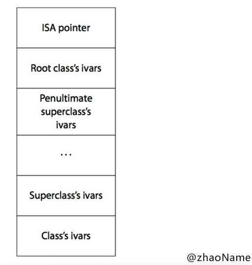

# 招聘一个靠谱的 iOS

<br>

本文题目来自于孙源的[招聘一个靠谱的iOS](https://github.com/ChenYilong/iOSInterviewQuestions)


### 0x01. 什么情况使用 weak 关键字，相比 assign 有什么不同？

> 什么情况使用 weak 关键字 ?

- 在 ARC 中，解循环引用时，如 block、delelgate

- 自身已对其进行强引用，没必要再强引用一次，如 IBOutlet

> 相比 assign 有什么不同 ？

- weak 修饰的变量在释放后所指向的内存空间会被置为 nil，而 assgin 只会针对“纯量类型”执行简单的赋值操作,容易造成野指针访问。

- weak 必然修饰 OC 对象，assgin 修饰非 OC 对象(修饰 OC 对象编译不会报错，但容易出问题，如被修饰的对象提前被释放、野指针访问等)


<br>

### 0x02. 怎么用 copy 关键字？

- NSString、NSArray、NSDictionary 等等经常使用 copy 关键字，是因为他们有对应的可变类型：NSMutableString、NSMutableArray、NSMutableDictionary

- block 也经常使用 copy 关键字，具体原因见官方文档：[Objects Use Properties to Keep Track of Blocks](https://developer.apple.com/library/archive/documentation/Cocoa/Conceptual/ProgrammingWithObjectiveC/WorkingwithBlocks/WorkingwithBlocks.html#//apple_ref/doc/uid/TP40011210-CH8-SW12)。在 MRC 环境下需要使用 copy 关键字将 block 从栈上拷贝到堆上，在 ARC 环境下编译器自动帮我们对 block 进行 copy 操作。所以在 ARC 环境下 block 使用 copy 或 strong 效果一样。但 ARC 环境下使用 copy 修饰 block 能时刻提醒我们不是不需要 copy，而是编译器帮我们做了。


<br>

### 0x03. 这个写法会出什么问题： @property (copy) NSMutableArray *array;

- array 实际类型是 NAArray。也就是说对 array 进行增删改查会报方法找不到的错误。

- 声明属性是未指定是 atomic 还是 nonatomic，默认是 atomic. 也就是上述代码会很消耗性能。

- 延伸：atomic 使用自旋锁，会在创建时生成一些额外的代码用于帮助编写多线程程序，这会带来性能问题，通过声明 nonatomic 可以节省这些虽然很小但是不必要额外开销。


<br>


### 0x04. 如何让自己的类用 copy 修饰符？如何重写带 copy 关键字的 setter？

> 如何让自己的类用 copy 修饰符？

若想令自己所写的对象具有拷贝功能，则需实现 NSCopying 协议。如果自定义的对象分为可变版本与不可变版本，那么就要同时实现 NSCopying 与 NSMutableCopying 协议

```
// ZZPerson.h
@interface ZNPerson : NSObject<NSCopying>

@property (nonatomic, assign) int age;
@property (nonatomic, copy) NSString *name;

@end

// ZZPerson.m
- (id)copyWithZone:(NSZone *)zone
{
    // [self class] 能防止子类未实现 NSCoping 协议调用copy 方法，出现崩溃(unrecognized selector sent to instance)
    // 但使用 [self class] 只能实现父类的属性拷贝，子类的属性值不能拷贝，需要子类重新实现 copyWithZone: 方法
    ZNPerson *p = [[[self class] allocWithZone:zone] init];
    p.age = self.age;
    p.name = self.name;
    // 浅拷贝
    p.friends = self.friends.mutableCopy;
    // 单层深拷贝
    //p.friends = [[NSMutableArray alloc] initWithArray:self.friends copyItems:YES];
    return p;
}
```

> 如何重写带 copy 关键字的 setter？

```
- (void)setName:(NSString *)name {
    //[_name release];
    _name = [name copy];
}
```

<br>


### 0x05. @property 的本质是什么？ivar、getter、setter 是如何生成并添加到这个类中的 ？

> @property 的本质是什么 ？

使用 @property 声明属性，编译器会自动帮我们干三件事：

- 自动生成同名带下划钱的成员变量 _property

- 自动生成 setter getter 方法的声明

- 自动生成 setter getter 方法的实现

property 在 runtime 中的声明是 `objc_property_t` 定义如下：

```
// objc-750 runtime.h
typedef struct objc_property *objc_property_t;
```

`objc_property `是一个结构体，定义如下

```
// objc-750 objc-runtime.mm
struct property_t {
    const char *name;
    const char *attributes;
};
```

`attributes` 的本质是`objc_property_attribute_t `结构体

```
// objc-750 runtime.h
/// Defines a property attribute
typedef struct {
    const char *name;           /**< The name of the attribute */
    const char *value;          /**< The value of the attribute (usually empty) */
} objc_property_attribute_t;
```

我们以上面的`ZZPerson`为例，打印下 property

```
+ (void)printfPropertyList
{
    int count = 0;
    objc_property_t *propertys = class_copyPropertyList(self.class, &count);
    for (int i=0; i<count; i++)
    {
        objc_property_t pro = propertys[i];
        printf("name:%s\n", property_getName(pro));
        printf("Attributes:%s\n",property_getAttributes(pro));
    }
}

// 打印结果
name:dog
Attributes:T@"ZNDog",&,N,V_dog
name:age
Attributes:Ti,N,V_age
name:name
Attributes:T@"NSString",C,N,V_name
name:friends
Attributes:T@"NSMutableArray",&,N,V_friends
```

`Attributes`具体的意思可以参考[Type Encodings](https://developer.apple.com/library/archive/documentation/Cocoa/Conceptual/ObjCRuntimeGuide/Articles/ocrtTypeEncodings.html#//apple_ref/doc/uid/TP40008048-CH100-SW1)

以 name 为例解释：T 是类型(后面紧跟着是具体类型)、C 就代表Copy，N 代表nonatomic，V 就代表对应的实例变量。

> ivar、getter、setter 是如何生成并添加到这个类中的 ？

(以下属于复制)完成属性定义后，编译器会自动编写访问这些属性所需的方法，此过程叫做“自动合成”(autosynthesis)。需要强调的是，这个过程由编译 器在编译期执行，所以编辑器里看不到这些“合成方法”(synthesized method)的源代码。

sunnyxx 为了搞清属性是怎么实现的,曾经反编译过相关的代码,他大致生成了五个东西

- `OBJC_IVAR_$类名$属性名称`: 该属性的“偏移量” (offset)，这个偏移量是“硬编码” (hardcode)，表示该变量距离存放对象的内存区域的起始地址有多远。

- setter 与 getter 方法对应的实现函数

- `ivar_list` ：成员变量列表

- `method_list` ：方法列表

- `property_list` ：属性列表

也就是说我们每次在增加一个属性,系统都会在 `ivar_list` 中添加一个成员变量的描述,在 `method_list` 中增加 setter 与 getter 方法的描述,在属性列表中增加一个属性的描述,然后计算该属性在对象中的偏移量,然后给出 setter 与 getter 方法对应的实现,在 setter 方法中从偏移量的位置开始赋值,在 getter 方法中从偏移量开始取值,为了能够读取正确字节数,系统对象偏移量的指针类型进行了类型强转。

<br>


### 0x06. @protocol 和 category 中如何使用 @property

@protocol 和 category 中都能使用 @property 声明属性，但只有 setter getter 方法的声明，没有带下划线的成员变量和 setter getter 方法的实现。

> @protocol 中使用 @property

```
@protocol ZZPersonDelegate <NSObject>
@property (nonatomic, copy) NSString *name;/**< */
@end

@interface ZZPerosn : NSObject<ZZPersonDelegate>
@end

@implementation ZZPerosn
- (void)useProperty
{
    // 协议中使用 @property 声明的属性，不会生成同名带下划线的成员变量
    // 上面的警告也明确说明 编译器不会自动合成协议中的属性 "name"
    // _name
}
@end

// ViewController.m
- (void)viewDidLoad {
    [super viewDidLoad];
    
    ZZPerosn *p = [[ZZPerosn alloc] init];
    p.name = @"zhaoName";
    
    NSLog(@"p.name:%@", p.name);
}
```

- 不会生成同名带下划线的成员变量


- 编译器只会生成 setter getter 的声明，不会自动生成 setter getter 方法的实现


- 在 protocol 中使用 @property 时，我们需要在遵守这个协议的类中，完善属性的方法实现和带成员变量

```
// 第一种方法 @synthesize 告诉编译器自动帮我们合成
@implementation ZZPerosn

@synthesize name = _name;
@end


// 第二种方法  @dynamic 手动合成
@implementation ZZPerosn
{
    NSString *_name;
}
@dynamic name;

- (void)setName:(NSString *)name
{
    _name = name;
}

- (NSString *)name
{
    return _name;
}
@end

// 打印结果
2020-02-11 16:16:12.353601+0800 ProtocolAndCategaryUseProperty[33612:1394241] p.name:zhaoName
```

> category 中使用 @property

category 中使用 @property 声明属性，也是只有 setter getter 方法的声明，没有带下划线的成员变量和 setter getter 方法的实现。但是也解决这个问题需要用到两个函数`objc_setAssociatedObject `、`objc_getAssociatedObject `

```
@implementation ZZperson (Property)

- (void)setName:(NSString *)name
{
    objc_setAssociatedObject(self, @"name", name, OBJC_ASSOCIATION_RETAIN_NONATOMIC);
}

- (NSString *)name
{
    return objc_getAssociatedObject(self, @"name");
}
@end
```

<br>

### 0x07. runtime 如何实现 weak 属性


<br>


### 0x08. @property 中有哪些属性关键字？/ @property 后面可以有哪些修饰符？

- 原子性：`nonatomic`、`atomic`

- 读写权限：`readonly`、`readwrite `

- 修饰符：`strong`、`copy`、`assgin`、`unsafe_unretained `、`weak`

- 方法名：`getter=<name>` 、`setter=<name>`

`setter=<name>`一般用在特殊的情境下，比如：

在数据反序列化、转模型的过程中，服务器返回的字段如果以 init 开头，所以你需要定义一个 init 开头的属性，但默认生成的 setter 与 getter 方法也会以 init 开头，而编译器会把所有以 init 开头的方法当成初始化方法，而初始化方法只能返回 self 类型，因此编译器会报错。

这时你就可以使用下面的方式来避免编译器报错：

```
@property(nonatomic, strong, getter=p_initBy, setter=setP_initBy:)NSString *initBy;
```

另外也可以用关键字进行特殊说明，来避免编译器报错：

```
@property(nonatomic, readwrite, copy, null_resettable) NSString *initBy;
- (NSString *)initBy __attribute__((objc_method_family(none)));
```

- 不常用的：`nonnull`、`null_resettable`、`nullable`

<br>


### 0x09. weak 属性需要在 dealloc 中置 nil 么？

在 ARC 环境无论是强指针还是弱指针都无需在 dealloc 设置为 nil, ARC 会自动帮我们处理。在属性所指的对象遭到摧毁时，属性值也会清空。

查看 runtime 的 dealloc 方法可以看到，在 dealloc 方法中会自动清空 weak_table,释放空间

```
// runtime-750  NSObject.mm

NEVER_INLINE void objc_object::clearDeallocating_slow()
{
    assert(isa.nonpointer  &&  (isa.weakly_referenced || isa.has_sidetable_rc));

    SideTable& table = SideTables()[this];
    table.lock();
    // 若对象被弱引用
    if (isa.weakly_referenced) {
    	// 清空 weak_table
        weak_clear_no_lock(&table.weak_table, (id)this);
    }
    // 若对象的引用计数存储在 SideTable 中，则清空引用计数表
    if (isa.has_sidetable_rc) {
        table.refcnts.erase(this);
    }
    table.unlock();
}
```

<br>


### 0x0a. @synthesize 和 @dynamic 分别有什么作用？

`@property`有两个对应的词，一个是 `@synthesize`，一个是`@dynamic`。如果 `@synthesize`和`@dynamic`都没写，那么默认的就是`@syntheszie var = _var`

> `@synthesize` 作用

- `@synthesize` 不需要我们手动实现 setter 和 getter 方法，编译器会帮我们自动合成这两个方法

> `@dynamic` 的作用

- `@dynamic`的作用是告诉编译器，属性的 setter 与 getter 方法由用户自己实现，不用自动合成。

- 假如一个属性被声明为`@dynamic var`，然后你没有提供 setter、getter 方法，编译的时候没问题，但是当程序运行到`instanceObject.var = some`，就会由于缺 setter 方法会导致程序崩溃；或者当运行到`some = instanceObject.var`时，由于缺 getter 方法同样会导致崩溃。

<br>


### 0x0b. ARC下，不显式指定任何属性关键字时，默认的关键字都有哪些？

- 对应基本数据类型默认关键字是 `atomic、readwrite、assign `

- 对于普通的 OC 对象 `atomic、readwrite、strong`


<br>


### 0x0c. 用@property声明的NSString（或NSArray，NSDictionary）经常使用copy关键字，为什么？如果改用strong关键字，可能造成什么问题？

> 为什么用 copy 关键字 ？

为父类指针可以指向子类对象,使用 copy 的目的是为了让本对象的属性不受外界影响,使用 copy 无论给我传入是一个可变对象还是不可对象,我本身持有的就是一个不可变的副本.

> 用 strong 会造成什么问题 ？

如果我们使用是 strong ,那么这个属性就有可能指向一个可变对象,如果这个可变对象在外部被修改了,那么会影响该属性.

<br>


### 0x0d. @synthesize 合成实例变量的规则是什么？假如 property 名为 foo，存在一个名为 _foo 的实例变量，那么还会自动合成新变量么？

> @synthesize 合成实例变量的规则

- 若指定了成员变量的名称,会生成一个指定的名称的成员变量, setter/getter 方法不变


- 若声明一个和成员变量相同名称的属性，则这个属性只有 setter/getter 方法的声明


- 若 `@synthesize foo`, 则会生成一个同名的成员变量


> 假如 property 名为 foo，存在一个名为 _foo 的实例变量，那么还会自动合成新变量么？

不会

```
@interface ViewController ()
@property (nonatomic, copy) NSString *string;/**< */
@end

@implementation ViewController
{
    NSString *_string;
}

- (void)viewDidLoad {
    [super viewDidLoad];
    
    self.string = @"1";
    self->_string = @"2";
    NSLog(@"%@  %@", self.string, self->_string);
}

// 打印结果
2020-02-12 22:02:51.443936+0800 ProtocolAndCategaryUseProperty[39673:1696341] 2  2
```


<br>


### 0x0e. 在有了自动合成属性实例变量之后，@synthesize还有哪些使用场景？

- 同时重写 setter、getter 方法，系统就不会生成 ivar（实例变量/成员变量），这时需要用`@synthesize foo = _foo`

- 在协议中声明的属性，遵守协议的类要想使用这个属性，必须手动添加 setter、getter 方法的实现或使用`@synthesize foo = _foo`由编译器帮我们自动合成。

- 修改成员变量的名称`@synthesize foo = _otherName`

更多信息请看[When should I use @synthesize explicitly?](https://stackoverflow.com/questions/19784454/when-should-i-use-synthesize-explicitly/19821816#19821816)

<br>


### 0x0f. objc 中向一个 nil 对象发送消息将会发生什么？

OC 中想一个对象发送消息在底层都会调用`objc_msgSend(receiver, selector)`。在 runtime 中查找`objc_msgSend()`的源码

```
ENTRY _objc_msgSend
    UNWIND _objc_msgSend, NoFrame

    // nil check and tagged pointer check
    // p0 中存放的是方法的第一个参数也就是消息接收者，也就是实例对象 或类对象
    // 当其为空时 直接 return, 这也就解释了 [nil xxx] 为什么不会崩溃
    cmp    p0, #0
    // (MSB tagged pointer looks negative)
    b.le    LNilOrTagged
    ...
    
#if SUPPORT_TAGGED_POINTERS
LNilOrTagged:
	b.eq	LReturnZero		// nil check
	...
#endif

LReturnZero:
	// x0 is already zero
	mov	x1, #0
	movi	d0, #0
	movi	d1, #0
	movi	d2, #0
	movi	d3, #0
	ret
    ......
END_ENTRY _objc_msgSend
```

进入到`objc_msgSend(receiver, selector)`中会判断`recevier`是否为 `nil`，若为`nil`则直接返回。

<br>


### 0x10. objc 中向一个对象发送消息`[obj foo]`和`objc_msgSend()`函数之间有什么关系？

我们用`clang`指令将`[obj foo]`转成 C++ 代码，可以得到如下代码

```
// 简化后的
((void ()(id, SEL))(void )objc_msgSend)((id)obj, sel_registerName("foo"));
```

也就是说`[obj foo]`在 objc 编译时，会被转意为：`objc_msgSend(obj, @selector(foo))`

<br>


### 0x11. 什么时候会报unrecognized selector的异常？

实例对象或类对象调用某个方法，而在类对象（包括他的父类对象）或元类对象（父元类对象）中都找不到这个方法的实现，就会报这个错误。


<br>


### 0x12. 一个 objc 对象如何进行内存布局？（考虑有父类的情况）

题目中的 对象 看他的回答是指实例对象。




<br>

### 0x13. 一个 objc 对象的 isa 的指针指向什么？有什么作用？

> 一个 objc 对象的 isa 的指针指向什么？

实例对象的`isa`指向类对象，类对象的`isa`指向元类对象，元类对象的`isa`指向根元类对象，根元类对象的`isa`指向自己。

> 有什么作用？

- 调用实现方法时(忽略方法缓存)，由实例对象的`isa`找到类对象，再查找存储在类对象中的实例方法，没找到则通过类对象的`superclass`找到父类对象，再查找存储在父类对象中的实例方法，以此类推知道根父类对象(`NSObject`)

- 调用类方法时(忽略方法缓存)，由实例对象的`isa`找到类对象，再由类对象的`isa`找到元类对象，然后遍历存储在元类对象中的类方法。若没找到则通过元类对象的`superclass`找到父元类对象，再查找存储在父元类对象中的类方法，以此类推知道根父元类对象。


<br>

### 0x14. 下面的代码输出什么？

```
@implementation Son : Father
- (id)init
{
   self = [super init];
   if (self) {
       NSLog(@"%@", NSStringFromClass([self class]));
       NSLog(@"%@", NSStringFromClass([super class]));
   }
   return self;
}
@end
```

两个都输出`Son`。第一个不用解释都懂。我们来解释第二个

- `[super class]`用`clang`指令转化为 C++ 代码底层调用的是`objc_msgSendSuper()`，但我们转成汇编看到调用的是`objc_msgSendSuper2()`。我们以汇编为准。

- `[super class]`的消息接收者仍然是当前实例 self，super 的作用是不要从当前类中查找实例方法，而从父类中开始查找实例方法。

- `[super class]`相当于调用`[self class]`从父类`Father `的`class对象`中开始查找实例方法`-class`。最终在`NSObject`的`class对象`中找到并调用。再由`NSObject.mm`的源码可知结果是`Son`。

```
// NSObject.mm
- (Class)class {
    return object_getClass(self);
}

```

<br>

### 0x15. runtime 如何通过 selector 找到对应的 IMP 地址？（分别考虑类方法和实例方法）

- 先从方法缓存缓存中找。方法缓存使用散列表实现，key是`selector & (count-1)`，value是 IMP.

- 再从类对象(元类对象)中查找。这里是遍历查找


<br>

### 0x16. 使用 runtime Associate 方法关联的对象，需要在主对象dealloc 的时候释放么？

无论在MRC下还是ARC下均不需要。

- **原文回答**

[2011年版本的Apple API 官方文档 - Associative References ](https://web.archive.org/web/20120818164935/https://developer.apple.com/library/ios/#/web/20120820002100/http://developer.apple.com/library/ios/documentation/cocoa/conceptual/objectivec/Chapters/ocAssociativeReferences.html)一节中有一个MRC环境下的例子：

```
// 在MRC下，使用runtime Associate方法关联的对象，不需要在主对象dealloc的时候释放
// http://weibo.com/luohanchenyilong/ (微博@iOS程序犭袁)
// https://github.com/ChenYilong
// 摘自2011年版本的Apple API 官方文档 - Associative References 

static char overviewKey;
 
NSArray *array =
    [[NSArray alloc] initWithObjects:@"One", @"Two", @"Three", nil];
// For the purposes of illustration, use initWithFormat: to ensure
// the string can be deallocated
NSString *overview =
    [[NSString alloc] initWithFormat:@"%@", @"First three numbers"];
 
objc_setAssociatedObject (
    array,
    &overviewKey,
    overview,
    OBJC_ASSOCIATION_RETAIN
);
 
[overview release];
// (1) overview valid
[array release];
// (2) overview invalid
```

文档指出

> At point 1, the string overview is still valid because the OBJC_ASSOCIATION_RETAIN policy specifies that the array retains the associated object. When the array is deallocated, however (at point 2), overview is released and so in this case also deallocated.

我们可以看到，在[array release];之后，overview就会被release释放掉了。

既然会被销毁，那么具体在什么时间点？

> 根据 WWDC 2011, Session 322 (第36分22秒) 中发布的内存销毁时间表，被关联的对象在生命周期内要比对象本身释放的晚很多。它们会在被 NSObject -dealloc 调用的 object_dispose() 方法中释放。

对象的内存销毁时间表，分四个步骤：

```
// 根据 WWDC 2011, Session 322 (36分22秒)中发布的内存销毁时间表 
1. 调用 -release ：引用计数变为零
	* 对象正在被销毁，生命周期即将结束.
	* 不能再有新的 __weak 弱引用， 否则将指向 nil.
	* 调用 [self dealloc] 
2. 子类 调用 -dealloc
	* 继承关系中最底层的子类 在调用 -dealloc
	* 如果是 MRC 代码 则会手动释放实例变量们（iVars）
	* 继承关系中每一层的父类 都在调用 -dealloc
3. NSObject 调 -dealloc
	* 只做一件事：调用 Objective-C runtime 中的 object_dispose() 方法
4. 调用 object_dispose()
	* 为 C++ 的实例变量们（iVars）调用 destructors 
	* 为 ARC 状态下的 实例变量们（iVars） 调用 -release 
	* 解除所有使用 runtime Associate方法关联的对象
	* 解除所有 __weak 引用
	* 调用 free()
```

对象的内存销毁时间表：[参考链接](http://stackoverflow.com/a/10843510/3395008)。

- **自己回答**

在主对象被释放时，会调用`dealloc`方法，我们查看 runtime 的 `dealloc` 方法可以看到，在 `dealloc` 方法中会自动释放 Associate 方法关联的对象

```
// objc-runtime-new.mm
void *objc_destructInstance(id obj) 
{
    if (obj) {
        // Read all of the flags at once for performance.
        bool cxx = obj->hasCxxDtor();
        bool assoc = obj->hasAssociatedObjects();

        // This order is important.
        if (cxx) object_cxxDestruct(obj); // 释放成员变量
        if (assoc) _object_remove_assocations(obj); // 移除关联对象
        // 清空弱引用表 清空引用计数表
        obj->clearDeallocating();
    }
    return obj;
}

// objc-references.mm
void _object_remove_assocations(id object) 
{
    vector< ObjcAssociation,ObjcAllocator<ObjcAssociation> > elements;
    {
        AssociationsManager manager;
        AssociationsHashMap &associations(manager.associations());
        if (associations.size() == 0) return;
        disguised_ptr_t disguised_object = DISGUISE(object);
        AssociationsHashMap::iterator i = associations.find(disguised_object);
        if (i != associations.end()) {
            // copy all of the associations that need to be removed.
            ObjectAssociationMap *refs = i->second;
            for (ObjectAssociationMap::iterator j = refs->begin(), end = refs->end(); j != end; ++j) {
                elements.push_back(j->second);
            }
            // remove the secondary table.
            delete refs;
            associations.erase(i);
        }
    }
    // the calls to releaseValue() happen outside of the lock.
    for_each(elements.begin(), elements.end(), ReleaseValue());
}
```


<br>

### 0x17.  objc 中的类方法和实例方法有什么本质区别和联系？

> 类方法

- 类方法是属于类对象的

- 类方法只能通过类对象调用

- 类方法中的self是类对象

- 类方法可以调用其他的类方法

- 类方法中不能访问成员变量

- 类方法中不能直接调用对象方法

> 实例方法

- 实例方法是属于实例对象的

- 实例方法只能通过实例对象调用

- 实例方法中的self是实例对象

- 实例方法中可以访问成员变量

- 实例方法中直接调用实例方法

- 实例方法中也可以调用类方法(通过类名)

<br>

`@property`部分主要参考 Apple 官方文档：[Properties Encapsulate an Object’s Values](https://developer.apple.com/library/archive/documentation/Cocoa/Conceptual/ProgrammingWithObjectiveC/EncapsulatingData/EncapsulatingData.html#//apple_ref/doc/uid/TP40011210-CH5-SW2) 

runtime 部分主要参考Apple官方文档：[Declared Properties](https://developer.apple.com/library/archive/documentation/Cocoa/Conceptual/ObjCRuntimeGuide/Articles/ocrtPropertyIntrospection.html)

<br>

### 0x18. `_objc_msgForward`函数是做什么的，直接调用它将会发生什么？

> `_objc_msgForward`函数是做什么的 ?

**原文答案**

`_objc_msgForward`消息转发做的几件事：

- 调用`resolveInstanceMethod:`方法 (或`resolveClassMethod:`)。允许用户在此时为该 Class 动态添加实现。如果有实现了，则调用并返回YES，那么重新开始`objc_msgSend`流程。这一次对象会响应这个选择器，一般是因为它已经调用过`class_addMethod`。如果仍没实现，继续下面的动作。

- 调用`forwardingTargetForSelector:`方法，尝试找到一个能响应该消息的对象。如果获取到，则直接把消息转发给它，返回非 nil 对象。否则返回 nil ，继续下面的动作。注意，这里不要返回 self ，否则会形成死循环。

- 调用`methodSignatureForSelector:`方法，尝试获得一个方法签名。如果获取不到，则直接调用`doesNotRecognizeSelector`抛出异常。如果能获取，则返回非nil：创建一个 `NSlnvocation` 并传给`forwardInvocation:`。

- 调用`forwardInvocation:`方法，将第3步获取到的方法签名包装成 `Invocation` 传入，如何处理就在这里面了，并返回非nil。

- 调用`doesNotRecognizeSelector:` ，默认的实现是抛出异常。如果第3步没能获得一个方法签名，执行该步骤。


**自己认为**

```
/***********************************************************************
* lookUpImpOrForward.
* The standard IMP lookup. 
* initialize==NO tries to avoid +initialize (but sometimes fails)
* cache==NO skips optimistic unlocked lookup (but uses cache elsewhere)
* Most callers should use initialize==YES and cache==YES.
* inst is an instance of cls or a subclass thereof, or nil if none is known. 
*   If cls is an un-initialized metaclass then a non-nil inst is faster.
* May return _objc_msgForward_impcache. IMPs destined for external use 
*   must be converted to _objc_msgForward or _objc_msgForward_stret.
*   If you don't want forwarding at all, use lookUpImpOrNil() instead.
**********************************************************************/
IMP lookUpImpOrForward(Class cls, SEL sel, id inst, 
                       bool initialize, bool cache, bool resolver)
{
	...
    // No implementation found. Try method resolver once.
    // 缓存和方法列表中都没找到且未曾动态解析 resolveClassMethod 和 resolveInstanceMethod
    if (resolver  &&  !triedResolver) {
        runtimeLock.unlock();
        _class_resolveMethod(cls, sel, inst);
        runtimeLock.lock();
        // Don't cache the result; we don't hold the lock so it may have 
        // changed already. Re-do the search from scratch instead.
        triedResolver = YES;
        goto retry;
    }

    // No implementation found, and method resolver didn't help. 
    // Use forwarding.
    // 是否实现 forwardingTargetForSelector 和 forwardInvocation
    imp = (IMP)_objc_msgForward_impcache;
    cache_fill(cls, sel, imp, inst);
 done:
    runtimeLock.unlock();
    return imp;
}


// objc-msg-arm64.s
STATIC_ENTRY __objc_msgForward_impcache
	// No stret specialization.
	b   __objc_msgForward
END_ENTRY __objc_msgForward_impcache


ENTRY __objc_msgForward
	adrp    x17, __objc_forward_handler@PAGE
	ldr p17, [x17, __objc_forward_handler@PAGEOFF]
	TailCallFunctionPointer x17
END_ENTRY __objc_msgForward
```

也就是说`_objc_msgForward`做的事不包括动态方法解析即 调用`resolveInstanceMethod:` 或 `resolveClassMethod:`方法。只有消息转发


> 直接调用它将会发生什么？

`_objc_msgForward`是 IMP 类型，用于消息转发的：当向一个对象发送一条消息，但它并没有实现的时候，`_objc_msgForward`会尝试做消息转发。

一旦直接调用`_objc_msgForward`，将跳过查找 IMP 的过程（即使你有这个方法的实现），直接触发“消息转发”。这时就看你写代码的能力了，用不好程序就会崩溃。


<br>

### 0x19. runtime 如何实现 weak 变量的自动置 nil？

runtime 中用全局哈希表`weak_table`存储，放 weak 修饰的对象被释放时，调用`dealloc`方法，`dealloc`方法中会将 weak 变量的自动置 nil。具体代码如下

```
/** 
 * Called by dealloc; nils out all weak pointers that point to the 
 * provided object so that they can no longer be used.
 * 
 * @param weak_table 
 * @param referent The object being deallocated. 
 */
void weak_clear_no_lock(weak_table_t *weak_table, id referent_id)
{
    // object
    objc_object *referent = (objc_object *)referent_id;
    // 取出 referent(object) 对应的 entry
    weak_entry_t *entry = weak_entry_for_referent(weak_table, referent);
    if (entry == nil) {
        /// XXX shouldn't happen, but does with mismatched CF/objc
        //printf("XXX no entry for clear deallocating %p\n", referent);
        return;
    }

    // zero out references
    weak_referrer_t *referrers;
    size_t count;
    
    if (entry->out_of_line()) {
        // hash 结构的数组
        referrers = entry->referrers;
        count = TABLE_SIZE(entry);
    } 
    else {
        // 正常顺序存储的数组
        referrers = entry->inline_referrers;
        count = WEAK_INLINE_COUNT;
    }
    
    for (size_t i = 0; i < count; ++i) {
        objc_object **referrer = referrers[i];
        if (referrer) {
            if (*referrer == referent) {
                // 将对象置为 nil
                *referrer = nil;
            }
            else if (*referrer) {
                _objc_inform("__weak variable at %p holds %p instead of %p. "
                             "This is probably incorrect use of "
                             "objc_storeWeak() and objc_loadWeak(). "
                             "Break on objc_weak_error to debug.\n", 
                             referrer, (void*)*referrer, (void*)referent);
                objc_weak_error();
            }
        }
    }
    // 从 weak_table 中移除对应的 entry
    weak_entry_remove(weak_table, entry);
}
```

<br>

### 0x1a. 能否向编译后得到的类中增加实例变量？能否向运行时创建的类中添加实例变量？为什么

**原文答案**

- 不能向编译后得到的类中增加实例变量；

- 能向运行时创建的类中添加实例变量；

解释下：

- 因为编译后的类已经注册在 runtime 中，类结构体中的 `objc_ivar_list` 实例变量的链表 和 `instance_size` 实例变量的内存大小已经确定，同时runtime 会调用 `class_setIvarLayout` 或 `class_setWeakIvarLayout` 来处理 `strong weak `引用。所以不能向存在的类中添加实例变量；

- 运行时创建的类是可以添加实例变量，调用 `class_addIvar` 函数。但是得在调用 `objc_allocateClassPair` 之后，`objc_registerClassPair` 之前，原因同上。


**自己答案**

- 类的底层结构式 `objc_class ` 结构体，而成员变量存储在`objc_class ` 结构体中的`struct class_rw_t`结构体中，`class_rw_t `是只读属性。所以在编译后得到的类不能再添加成员变量。


<br>

### 0x1b. runloop 和线程有什么关系？

在`CF-1153.18`的`CFRunLoop.h`中可以看到并没有暴露创建`RunLoop` 的结构。只提供了两个获取`RunLoop` 的函数：`CFRunLoopGetCurrent()`和`CFRunLoopGetMain()`。它们俩的内部实现逻辑大致如下：

```
static CFMutableDictionaryRef __CFRunLoops = NULL;
static CFLock_t loopsLock = CFLockInit;

// should only be called by Foundation
// t==0 is a synonym for "main thread" that always works
CF_EXPORT CFRunLoopRef _CFRunLoopGet0(pthread_t t)
{
    if (pthread_equal(t, kNilPthreadT)) {
        t = pthread_main_thread_np();
    }
    __CFLock(&loopsLock);
    if (!__CFRunLoops) {
        __CFUnlock(&loopsLock);
        // 创建字典
        CFMutableDictionaryRef dict = CFDictionaryCreateMutable(kCFAllocatorSystemDefault, 0, NULL, &kCFTypeDictionaryValueCallBacks);
        // 由主线程创建主线上的 RunLoop
        CFRunLoopRef mainLoop = __CFRunLoopCreate(pthread_main_thread_np());
        // 主线程为 key，RunLoop 为 value 存入字典
        CFDictionarySetValue(dict, pthreadPointer(pthread_main_thread_np()), mainLoop);
        if (!OSAtomicCompareAndSwapPtrBarrier(NULL, dict, (void * volatile *)&__CFRunLoops)) {
            CFRelease(dict);
        }
        CFRelease(mainLoop);
        __CFLock(&loopsLock);
    }
    
    // 由传进来的线程 取 loop
    CFRunLoopRef loop = (CFRunLoopRef)CFDictionaryGetValue(__CFRunLoops, pthreadPointer(t));
    __CFUnlock(&loopsLock);
    if (!loop) {
        // 取不出来就创建一个
        CFRunLoopRef newLoop = __CFRunLoopCreate(t);
        __CFLock(&loopsLock);
        loop = (CFRunLoopRef)CFDictionaryGetValue(__CFRunLoops, pthreadPointer(t));
        if (!loop) {
            CFDictionarySetValue(__CFRunLoops, pthreadPointer(t), newLoop);
            loop = newLoop;
        }
        // don't release run loops inside the loopsLock, because CFRunLoopDeallocate may end up taking it
        __CFUnlock(&loopsLock);
        CFRelease(newLoop);
    }
    if (pthread_equal(t, pthread_self())) {
        // 注册一个回调，当线程销毁时，顺便也销毁其对应的 RunLoop 
        _CFSetTSD(__CFTSDKeyRunLoop, (void *)loop, NULL);
        if (0 == _CFGetTSD(__CFTSDKeyRunLoopCntr)) {
            _CFSetTSD(__CFTSDKeyRunLoopCntr, (void *)(PTHREAD_DESTRUCTOR_ITERATIONS-1), (void (*)(void *))__CFFinalizeRunLoop);
        }
    }
    return loop;
}

CFRunLoopRef CFRunLoopGetMain(void) {
    CHECK_FOR_FORK();
    static CFRunLoopRef __main = NULL; // no retain needed
    if (!__main) __main = _CFRunLoopGet0(pthread_main_thread_np()); // no CAS needed
    return __main;
}

CFRunLoopRef CFRunLoopGetCurrent(void) {
    CHECK_FOR_FORK();
    CFRunLoopRef rl = (CFRunLoopRef)_CFGetTSD(__CFTSDKeyRunLoop);
    if (rl) return rl;
    return _CFRunLoopGet0(pthread_self());
}
```

由源码可知：

- 线程和`RunLoop` 是一对一的关系，保存在一个静态全局字典中，线程为`key `，`RunLoop`为`value `

- `RunLoop`的创建类似懒加载，刚创建的线程没有`RunLoop`，若不主动获取那它一直不会有

- `RunLoop`的创建是发生在第一次获取时，`RunLoop`的销毁是发生在线程结束时

- 只能在某个线程内容获取其`RunLoop`，主线程除外。

<br>

### 0x1c. runloop 的 mode 作用是什么？


model 主要是用来指定事件在运行循环中的优先级的，分为：

- NSDefaultRunLoopMode（kCFRunLoopDefaultMode）：默认，空闲状态

- UITrackingRunLoopMode：ScrollView滑动时

- UIInitializationRunLoopMode：启动时

- NSRunLoopCommonModes（kCFRunLoopCommonModes）：Mode集合

苹果公开提供的 Mode 有两个：

- NSDefaultRunLoopMode（kCFRunLoopDefaultMode）

- NSRunLoopCommonModes（kCFRunLoopCommonModes）

<br>

### 0x1d. 以`+ scheduledTimerWithTimeInterval...`的方式触发的 timer，在滑动页面上的列表时，timer 会暂定回调，为什么？如何解决？

> 为什么？

RunLoop 只能运行在一种 mode 下，如果要换 mode，当前的 loop 也需要停下重启成新的。利用这个机制，`ScrollView`滚动过程中`NSDefaultRunLoopMode（kCFRunLoopDefaultMode）`的mode会切换到`UITrackingRunLoopMode`来保证`ScrollView`的流畅滑动：只能在`NSDefaultRunLoopMode`模式下处理的事件会影响`ScrollView`的滑动。

如果我们把一个NSTimer对象以NSDefaultRunLoopMode（kCFRunLoopDefaultMode）添加到主运行循环中的时候, ScrollView滚动过程中会因为mode的切换，而导致NSTimer将不再被调度。

> 如何解决？

Timer 计时会被`scrollView`的滑动影响的问题可以通过将 timer 添加到`NSRunLoopCommonModes（kCFRunLoopCommonModes）`来解决.


<br>

### 0x1f. 猜想runloop内部是如何实现的？

一般来讲，一个线程一次只能执行一个任务，执行完成后线程就会退出。如果我们需要一个机制，让线程能随时处理事件但并不退出，通常的代码逻辑 是这样的：

```
function loop() {
    initialize();
    do {
        var message = get_next_message();
        process_message(message);
    } while (message != quit);
}
```

<br>

### 0x20. objc 使用什么机制管理对象内存？

通过 `retainCount` 的机制来决定对象是否需要释放。 每次 runloop 的时候，都会检查对象的 `retainCount`，如果`retainCount` 为 0，说明该对象没有地方需要继续使用了，可以释放掉了。

<br>

### 0x21. ARC 通过什么方式帮助开发者管理内存？

编译器在适当的时候添加`retain/release/autorelease`代码。

<br>

### 0x22. 不手动指定`autoreleasepool`的前提下，一个`autorealese`对象在什么时刻释放？（比如在一个 vc 的`viewDidLoad`中创建）

- **`@autoreleasepool{}`**

```
- (void)viewDidLoad {
    [super viewDidLoad];
    
    NSLog(@"1111");
    @autoreleasepool {
        ZNPerson *per = [[[ZNPerson alloc] init] autorelease];
    }
    NSLog(@"22222");
}

// 打印结果
2019-08-15 15:34:12.410255+0800 AutoreleasePool[39362:716481] 1111
2019-08-15 15:34:12.410489+0800 AutoreleasePool[39362:716481] -[ZNPerson dealloc]
2019-08-15 15:34:12.410611+0800 AutoreleasePool[39362:716481] 22222
```

可以看到加入到`@autoreleasepool{}`中的`autorelease`对象，会在调用`objc_autoreleasePoolPop `时调用`release`方法，释放对象。


- **对象直接调用`autorelease `**

```
- (void)viewDidLoad {
    [super viewDidLoad];
    
    NSLog(@"1111");
    ZNPerson *per = [[[ZNPerson alloc] init] autorelease];
    NSLog(@"22222");
}

- (void)viewWillAppear:(BOOL)animated
{
    [super viewWillAppear:animated];
    
    NSLog(@"%s", __func__);
}

- (void)viewDidAppear:(BOOL)animated
{
    [super viewDidAppear:animated];
    
    NSLog(@"%s", __func__);
}

// 打印结果
2019-08-15 17:29:28.898374+0800 AutoreleasePool[50485:807839] 1111
2019-08-15 17:29:28.898658+0800 AutoreleasePool[50485:807839] 22222
2019-08-15 17:29:28.899450+0800 AutoreleasePool[50485:807839] -[ViewController viewWillAppear:]
2019-08-15 17:29:28.905052+0800 AutoreleasePool[50485:807839] -[ZNPerson dealloc]
2019-08-15 17:29:28.925806+0800 AutoreleasePool[50485:807839] -[ViewController viewDidAppear:]
```

可以看到对象直接调用`autorelease `方法，对象的释放是在`viewWillAppear:`后，而不是在`viewDidLoad `执行结束。这是为什么呢 ？

这就和`RunLoop`有关了，iOS 在主线程的`Runloop`中注册了 2 个`Observer`。用于监听和自动释放池相关的事件。

```
"<CFRunLoopObserver 0x6000001c45a0 [0x1058e0ae8]>{activities = 0x1, callout = _wrapRunLoopWithAutoreleasePoolHandler (0x1083db87d) ...}}"

"<CFRunLoopObserver 0x6000001c4640 [0x1058e0ae8]>{activities = 0xa0,callout = _wrapRunLoopWithAutoreleasePoolHandler (0x1083db87d) ...)}}"
```

再结合`CFRunLoopActivity `的值

```
typedef CF_OPTIONS(CFOptionFlags, CFRunLoopActivity) {
    kCFRunLoopEntry = (1UL << 0),  // 1
    kCFRunLoopBeforeTimers = (1UL << 1), // 2
    kCFRunLoopBeforeSources = (1UL << 2), // 4
    kCFRunLoopBeforeWaiting = (1UL << 5), // 32
    kCFRunLoopAfterWaiting = (1UL << 6),  // 64
    kCFRunLoopExit = (1UL << 7), // 128
    kCFRunLoopAllActivities = 0x0FFFFFFFU
};
```

可知第一个 Observer 监听的是`kCFRunLoopEntry `事件，会调用`objc_autoreleasePoolPush()`

第二个 Observer 监听两个事件

- `kCFRunLoopBeforeWaiting`事件，会调用`objc_autoreleasePoolPop()`、`objc_autoreleasePoolPush()`

- `kCFRunLoopBeforeExit`事件，会调用`objc_autoreleasePoolPop()`


当启动 RunLoop 时，也就是`kCFRunLoopEntry`即将进入 RunLoop，会调用`objc_autoreleasePoolPush()`方法，初始化`AutoreleasePoolPage `对象。

当 RunLoop 即将进入休眠时(`kCFRunLoopBeforeWaiting`)，先调用`objc_autoreleasePoolPop()`，将步骤 2 3 4 5 中的 `autorelease`对象释放掉，再调用`objc_autoreleasePoolPush()`，初始化新的`AutoreleasePoolPage `对象。

若 RunLoop 没有被退出，会由步骤 9 跳转到步骤 2，然后再走到步骤6，即将进入休眠状态(`kCFRunLoopBeforeWaiting`)。此时依然先调用`objc_autoreleasePoolPop()`，将`autorelease`对象释放掉。再调用`objc_autoreleasePoolPush()`，初始化新的`AutoreleasePoolPage `对象。依次循环下去。

若 RunLoop 即将退出(`kCFRunLoopBeforeExit`)，会调用`objc_autoreleasePoolPop()`，释放调 8 9 中的`autorelease`对象。


这样`push`和`pop`一直都是成对出现，不会出现自动释放池中对象没有被释放的情况。


<br>

### 0x23. `BAD_ACCESS` 在什么情况下出现？

访问了悬垂指针，比如对一个已经释放的对象执行了`release`、访问已经释放对象的成员变量或者发消息。 死循环

<br>

### 0x24. 苹果是如何实现`autoreleasepool`的？

```
struct __AtAutoreleasePool {
    // 构造函数，创建此结构体变量时调用
    __AtAutoreleasePool() {
        atautoreleasepoolobj = objc_autoreleasePoolPush();
    }
    // 析构函数，销毁结构体时调用
    ~__AtAutoreleasePool() {
        objc_autoreleasePoolPop(atautoreleasepoolobj);
    }
    void * atautoreleasepoolobj;
};
```

在 runtime4-750 的 NSObject.mm 中找到其实现。可以看到这两个函数其内部会调用 C++ 实现的类`AutoreleasePoolPage `中的方法。也就是说加入到 `@autoreleasepool`中的对象，都是借助`AutoreleasePoolPage `管理的。

```
void *objc_autoreleasePoolPush(void)
{
    return AutoreleasePoolPage::push();
}

void objc_autoreleasePoolPop(void *ctxt)
{
    AutoreleasePoolPage::pop(ctxt);
}
```

```
// objc4-750 NSObject.mm

#define POOL_BOUNDARY  nil

#define I386_PGBYTES   4096 
#define PAGE_SIZE      I386_PGBYTES
#define PAGE_MAX_SIZE  PAGE_SIZE

class AutoreleasePoolPage 
{
	// 对当前 AutoreleasePoolPage 完整性的校验
    magic_t const magic;
    // 指向下一个 autorelease 对象将要存放的地址
    id *next;
    // 当前 AutoreleasePoolPage 所在的线程
    pthread_t const thread;
    // 双向链表 父节点 指向前一个 Page 对象
    AutoreleasePoolPage * const parent;
    // 双向链表 子节点 指向下一个 Page 对象
    AutoreleasePoolPage *child;
    // 链表深度 节点个数
    uint32_t const depth;
    // high water mark 数据容纳的一个上限
    uint32_t hiwat;
}
```

`AutoreleasePool`没有单独的结构，是通过一个或多个`AutoreleasePoolPage `类以双向链表的形式组合而成的栈结构。


<br>

### 0x25. 使用 block 时什么情况会发生引用循环，如何解决？

- **`__weak `** 

```
// ZNPreson.m
- (void)test
{
    __weak typeof (self) weakSelf = self;
    self.block = ^{
        NSLog(@"name is %@", weakSelf.name);
    };
    self.block();
}

// 打印结果
2019-06-19 16:59:43.846754+0800 BlockNature[14379:2181645] name is zhao
2019-06-19 17:00:22.600143+0800 BlockNature[14379:2181645] -[ZNPerson dealloc]
```

- **`__unsafe_unretained `**


```
- (void)test
{
    __unsafe_unretained ZNPerson *weakSelf = self;
    self.block = ^{
        NSLog(@"name is %@", weakSelf.name);
    };
    self.block();
}

// 打印结果
2019-06-19 17:08:20.955747+0800 BlockNature[14508:2185864] name is zhao
2019-06-19 17:08:24.310285+0800 BlockNature[14508:2185864] -[ZNPerson dealloc]
```

- **`__block `** 

```
// ZNPerson.m
- (void)test
{
    __block ZNPerson *weakSelf = self;
    self.block = ^{
        NSLog(@"name is %@", weakSelf.name);
        weakSelf = nil;
    };
    self.block();
}

// 打印结果
2019-06-19 18:35:24.183795+0800 BlockNature[17091:2230005] name is zhao
2019-06-19 18:35:24.184131+0800 BlockNature[17091:2230005] -[ZNPerson dealloc]
```

**总结**

- 用`__weak`修饰对象变量被释放后会自动将对象变量的值置为`nil`。

- 用`__unsafe_unretained `修饰的对象被释放后，对象所指向的内存被回收，但对象的值不变。这样是不安全的，容易造成野指针访问。

- ARC 环境下，用`__block`解决循环引用，必须要调用`block`且在`block`内部将对象置为`nil`。 （ MRC 环境下，`Block`永远不会强引用`__block`修饰的对象类型变量。）

<br>

### 0x26. 在 block 内如何修改 block 外部变量？

- 局部变量：block 内部捕获局部变量是值拷贝，需要用`__block`修饰 block 的外部变量，才能在其内部修改。

- 静态局部变量：block 内部捕获静态局部变量是直接捕获惊天局部变量的地址，所以可以在 block 内部直接修改静态局部变量的值。

- 全局变量：全局变量放在数据段，大家都可以随意访问。block 不会捕获全局变量，但也可以在其内部修改全局变量。


<br>

### 0x27.  使用系统的某些`block api`（如`UIView`的 block 版本写动画时），是否也考虑引用循环问题？


系统的某些block api中，UIView的block版本写动画时不需要考虑，但也有一些api 需要考虑：

所谓“引用循环”是指双向的强引用，所以那些“单向的强引用”（block 强引用 self ）没有问题，比如这些：

```
[UIView animateWithDuration:duration animations:^{ [self.superview layoutIfNeeded]; }]; 

[[NSOperationQueue mainQueue] addOperationWithBlock:^{ self.someProperty = xyz; }]; 

[[NSNotificationCenter defaultCenter] addObserverForName:@"someNotification" 
                                                 object:nil 
                          queue:[NSOperationQueue mainQueue]
                                             usingBlock:^(NSNotification * notification) {
                                                   self.someProperty = xyz; }]; 
                                                   
```
这些情况不需要考虑“引用循环”。

但如果你使用一些参数中可能含有 ivar 的系统 api ，如 GCD 、NSNotificationCenter就要小心一点：比如GCD 内部如果引用了 self，而且 GCD 的其他参数是 ivar，则要考虑到循环引用：

```
__weak __typeof__(self) weakSelf = self;
dispatch_group_async(_operationsGroup, _operationsQueue, ^
{
	__typeof__(self) strongSelf = weakSelf;
	[strongSelf doSomething];
	[strongSelf doSomethingElse];
});
```

类似的：

```
 __weak __typeof__(self) weakSelf = self;
 
 _observer = [[NSNotificationCenter defaultCenter] addObserverForName:@"testKey" object:nil queue:nil
                                                           usingBlock:^(NSNotification *note) {
     __typeof__(self) strongSelf = weakSelf;
     [strongSelf dismissModalViewControllerAnimated:YES];
 }];
```
 
`self --> _observer --> block --> self `显然这也是一个循环引用。

检测代码中是否存在循环引用问题，可使用 Facebook 开源的一个检测工具[FBRetainCycleDetector](https://github.com/facebook/FBRetainCycleDetector) 。


<br>

### 0x28. GCD 的队列（`dispatch_queue_t`）分哪两种类型？

- 串行 `DISPATCH_QUEUE_SERIAL `

- 并发 `DISPATCH_QUEUE_CONCURRENT `

- 体统提供 串行 `dispatch_get_main_queue()`

- 体统提供 串行 `dispatch_get_global_queue()`

<br>

### 0x29. 如何用 GCD 同步若干个异步调用？（如根据若干个url异步加载多张图片，然后在都下载完成后合成一张整图

使用`Dispatch Group`追加 block 到`Global Group Queue`,这些 block 如果全部执行完毕，就会执行`Main Dispatch Queue`中的结束处理的 block。

```
dispatch_queue_t queue = dispatch_get_global_queue(DISPATCH_QUEUE_PRIORITY_DEFAULT, 0);
dispatch_group_t group = dispatch_group_create();
dispatch_group_async(group, queue, ^{ /*加载图片1 */ });
dispatch_group_async(group, queue, ^{ /*加载图片2 */ });
dispatch_group_async(group, queue, ^{ /*加载图片3 */ }); 
dispatch_group_notify(group, dispatch_get_main_queue(), ^{
        // 合并图片
});
```

<br>

### 0x2a. `dispatch_barrier_async`的作用是什么？

看些文档上对`dispatch_barrier_async `的解释

> Calls to this function always return immediately after the block has been submitted and never wait for the block to be invoked. When the barrier block reaches the front of a private concurrent queue, it is not executed immediately. Instead, the queue waits until its currently executing blocks finish executing. At that point, the barrier block executes by itself. Any blocks submitted after the barrier block are not executed until the barrier block completes.

> The queue you specify should be a concurrent queue that you create yourself using the dispatch_queue_create function. If the queue you pass to this function is a serial queue or one of the global concurrent queues, this function behaves like the dispatch_async function.


- `dispatch_barrier_async `可以用来处理资源抢夺问题

```
- (void)viewDidLoad {
    [super viewDidLoad];
    // 初始化
    pthread_rwlock_init(&_rwlock, NULL);
    for (int i=0; i<5; i++) {
        dispatch_async(dispatch_get_global_queue(0, 0), ^{
            [self readFile];
        });
    }
    for (int i=0; i<5; i++) {
        dispatch_async(dispatch_get_global_queue(0, 0), ^{
            [self writeFile];
        });
    }
    // 销毁
    pthread_rwlock_destroy(&_rwlock);
}

- (void)readFile
{
    // 读加锁
    pthread_rwlock_rdlock(&_rwlock);
    sleep(.5);
    NSLog(@"%s===%@", __func__, [NSThread currentThread]);
    pthread_rwlock_unlock(&_rwlock);
}

- (void)writeFile
{
    // 写加锁
    pthread_rwlock_wrlock(&_rwlock);
    sleep(1);
    NSLog(@"%s===%@", __func__, [NSThread currentThread]);
    pthread_rwlock_unlock(&_rwlock);
}


// 打印结果
2019-07-21 16:34:16.356524+0800 GCD-Lock[26088:2988106] -[ViewController readFile]===<NSThread: 0x6000003258c0>{number = 6, name = (null)}
2019-07-21 16:34:16.356612+0800 GCD-Lock[26088:2988084] -[ViewController readFile]===<NSThread: 0x600000320280>{number = 4, name = (null)}
2019-07-21 16:34:16.356612+0800 GCD-Lock[26088:2988082] -[ViewController readFile]===<NSThread: 0x600000325800>{number = 5, name = (null)}
2019-07-21 16:34:16.356613+0800 GCD-Lock[26088:2988083] -[ViewController readFile]===<NSThread: 0x600000325740>{number = 3, name = (null)}
2019-07-21 16:34:16.356842+0800 GCD-Lock[26088:2988106] -[ViewController readFile]===<NSThread: 0x6000003258c0>{number = 6, name = (null)}

2019-07-21 16:34:17.358049+0800 GCD-Lock[26088:2988084] -[ViewController writeFile]===<NSThread: 0x600000320280>{number = 4, name = (null)}
2019-07-21 16:34:18.358945+0800 GCD-Lock[26088:2988083] -[ViewController writeFile]===<NSThread: 0x600000325740>{number = 3, name = (null)}
2019-07-21 16:34:19.359319+0800 GCD-Lock[26088:2988082] -[ViewController writeFile]===<NSThread: 0x600000325800>{number = 5, name = (null)}
2019-07-21 16:34:20.359749+0800 GCD-Lock[26088:2988106] -[ViewController writeFile]===<NSThread: 0x6000003258c0>{number = 6, name = (null)}
2019-07-21 16:34:21.360385+0800 GCD-Lock[26088:2988107] -[ViewController writeFile]===<NSThread: 0x60000032c180>{number = 7, name = (null)}
```

- `queue`必须是用`dispatch_queue_create `创建的并发队列，若是串行或全局并发队列，那`dispatch_barrier_sync `的效果等同于`dispatch_sync `

<br>
 
### 0x2b. 苹果为什么要废弃`dispatch_get_current_queue` ？

由于队列有层级关系，所以"检查当前队列是否是执行同步派发所有的队列"并不是总有效。如下依然会产生死锁

```
dispatch_queue_t queueA = dispatch_queue_create("A", NULL);
dispatch_queue_t queueB = dispatch_queue_create("B", NULL);
dispatch_sync(queueA, ^{
    dispatch_sync(queueB, ^{
        if (dispatch_get_current_queue() != queueA) {
            dispatch_sync(queueA, ^{
                printf("do something");
            });
        }
    });
});
```

参考：《Effective Objective-C 2.0 》

<br>

### 0x2c. 以下代码运行结果如何？

```
- (void)viewDidLoad
{
    [super viewDidLoad];
    NSLog(@"1");
    dispatch_sync(dispatch_get_main_queue(), ^{
        NSLog(@"2");
    });
    NSLog(@"3");
}
```

主线程死锁，只会打印 1


<br>

### 0x2d. `addObserver:forKeyPath:options:context:`各个参数的作用分别是什么，observer 中需要实现哪个方法才能获得 KVO 回调？

> 参数作用

```
// 添加键值观察
/*
1 观察者，负责处理监听事件的对象
2 观察的属性
3 观察的选项
4 上下文
*/
[self.person addObserver:self forKeyPath:@"name" options:NSKeyValueObservingOptionNew | NSKeyValueObservingOptionOld context:@"Person Name"];
```

> observer 中需要实现哪个方法才能获得 KVO 回调？

```
// 所有的 kvo 监听到事件，都会调用此方法
/*
 1. 观察的属性
 2. 观察的对象
 3. change 属性变化字典（新／旧）
 4. 上下文，与监听的时候传递的一致
 */
- (void)observeValueForKeyPath:(NSString *)keyPath ofObject:(id)object change:(NSDictionary *)change context:(void *)context;
```

<br>

### 0x2e. 如何手动触发一个 value 的 KVO ?

**KVO 本质**

- 用`runtime`动态生成一个子类，并让示例对象的`isa`指正指向这个子类

- 在子类中重写`setxxx:`方法，并在其内部调用`Foundation`框架下的`_NSSetXXXValueAndNotify()`函数

- 在`_NSSetXXXValueAndNotify()`内部
	
	-  调用`willChangeValueForKey:`
	
	- 调用父类的`setxxx:`方法，设置新值

	- 调用`didChangeValueForKey:`方法

	- 在`didChangeValueForKey:`方法中触发监听器的`observeValueForKeyPath:ofObject:change:context:`方法


**如何手动触发 KVO**

- 手动调用`willChangeValueForKey:`和`didChangeValueForKey:`方法就可手动触发`KVO`


<br>

### 0x2f. 若一个类有实例变量`NSString *_foo`，调用`setValue:forKey:`时，可以以`foo `还是`_foo `作为`key` ？


`setValue:forKey:`原理


<br>

### 0x30.  KVC 的`keyPath`中的集合运算符如何使用？

其实没懂题目啥意思。。

- 必须用在集合对象上或普通对象的集合属性上

- 简单集合运算符有@avg， @count ， @max ， @min ，@sum，

- 格式 @"@sum.age"或 @"集合属性.@max.age"


<br>

### 0x31. KVC 和 KVO 的`keyPath`一定是属性么？

KVC 支持实例变量，KVO 只能[手动支持手动设定实例变量的KVO实现监听](https://yq.aliyun.com/articles/30483)

<br>

### 0x32. 如何关闭默认的 KVO 的默认实现，并进入自定义的 KVO 实现？

总结一句话：修改实例对象的 isa,让其指向`NSKVONotifing_XXX`(`NSKVONotifing_XXX`继承自XXX)

- [如何自己动手实现 KVO](https://tech.glowing.com/cn/implement-kvo/)

- [KVO for manually implemented properties](https://stackoverflow.com/questions/10042588/kvo-for-manually-implemented-properties/10042641#10042641)


<br>

### 0x33. apple 用什么方式实现对一个对象的 KVO？

[Apple文档](https://developer.apple.com/library/archive/documentation/Cocoa/Conceptual/KeyValueObserving/Articles/KVOImplementation.html)对 KVO 实现的描述：

> Automatic key-value observing is implemented using a technique called isa-swizzling.

> The isa pointer, as the name suggests, points to the object's class which maintains a dispatch table. This dispatch table essentially contains pointers to the methods the class implements, among other data.

> When an observer is registered for an attribute of an object the isa pointer of the observed object is modified, pointing to an intermediate class rather than at the true class. As a result the value of the isa pointer does not necessarily reflect the actual class of the instance.

> You should never rely on the isa pointer to determine class membership. Instead, you should use the class method to determine the class of an object instance.


Apple 使用了 isa 混写（isa-swizzling）来实现 KVO 。

- 用`runtime`动态生成一个子类，并让示例对象的`isa`指正指向这个子类

- 在子类中重写`setxxx:`方法，并在其内部调用`Foundation`框架下的`_NSSetXXXValueAndNotify()`函数

- 在`_NSSetXXXValueAndNotify()`内部
	
	-  调用`willChangeValueForKey:`
	
	- 调用父类的`setxxx:`方法，设置新值

	- 调用`didChangeValueForKey:`方法

	- 在`didChangeValueForKey:`方法中触发监听器的`observeValueForKeyPath:ofObject:change:context:`方法


<br>

### 0x34. `IBOutlet`连出来的视图属性为什么可以被设置成 weak?

- 因为既然有外链那么视图在 xib 或者 storyboard 中肯定存在，视图已经对它有一个强引用了，所以可以用 weak

- 使用 storyboard（xib不行）创建的vc，会有一个叫`_topLevelObjectsToKeepAliveFromStoryboard`的私有数组强引用所有`top level`的对象，所以这时即便 outlet 声明成 weak 没关系。

[Should IBOutlets be strong or weak under ARC?](https://stackoverflow.com/questions/7678469/should-iboutlets-be-strong-or-weak-under-arc)

<br>

### 0x35. IB中`User Defined Runtime Attributes`如何使用？

它能够通过KVC的方式配置一些你在`interface builder` 中不能配置的属性。当你希望在IB中作尽可能多得事情，这个特性能够帮助你编写更加轻量级的`viewcontroller`。如设置圆角、切掉超出父试图的部分等。


<br>

### 0x36. 如何调试 BAD_ACCESS 错误

- 重写 object 的`respondsToSelector`方法，现实出现`EXEC_BAD_ACCESS`前访问的最后一个 object

- 通过 Project -> Edit Scheme -> Run -> Diagnosticts -> Zombie Objects

- 设置全局断点快速定位问题代码所在行

<br>

### 0x37. lldb（gdb）常用的调试命令？

- [The LLDB Debugger](https://lldb.llvm.org/use/map.html)

- [苹果官方文档： iOS Debugging Magic ](https://developer.apple.com/library/archive/technotes/tn2239/_index.html)


<br>


<br>


