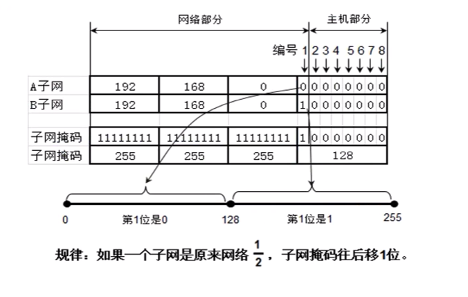

# IP 地址 - 子网、超网

 

## 一、子网

### 0x01 为什么要进行子网划分？

假如张三开个公司，公司有 200 个人。那这 200 个人上网只需要给一个 C 类 IP 地址就能满足要求。如 192.168.1.0/24, 最多可以连接 254 个主机，完全满足 200 个人上网的需求， 资源也没有浪费。

有天公司公司规模扩大，公司变成 500 人，那一个 C 类 IP 地址就不能满足需求。有两种解决思路

- 给两个 C 类 IP 地址，但是这样将会跨网段

- 给一个 B 类 IP 地址, 不会跨网段

但是一个 B 类 IP 地址 (如 191.1.0.0/16) 最多可以连接 256 * 256 - 2 = 65534 个主机，而公司只需要 500 个，这就造成极大的资源浪费。为了避免这种资源浪费，我们需要进行子网划分。

**子网划分：借用现有的主机位作子网位，划分出多个子网**。有两种划分方式：

- 等长子网划分：将一个网段等分成多个子网，每个子网可用的 IP 地址数量一样

- 变成子网划分：每个子网的可用 IP 地址可以不一样

子网划分的任务包括两部分：

- 确定子网的子网掩码的长度

- 确定子网中的第一个和最后一个可用的 IP 地址

### 0x02 等长子网划分

- 将一个 C 类 IP 地址等分成 2 个子网

- 将一个 C 类 IP 地址等分成 4 个子网

- 将一个 C 类 IP 地址等分成 8 个子网

### 0x03 变成子网划分

### 0x03 子网划分的注意点

 

## 二、超网
 

 

 