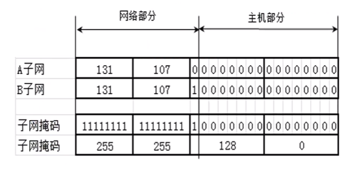
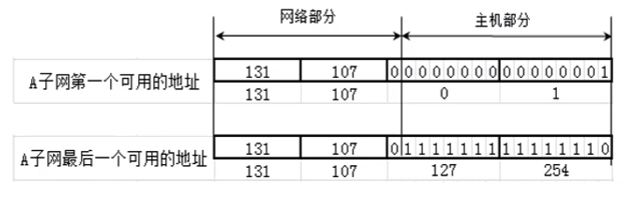
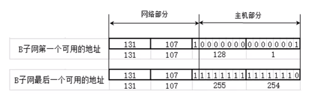
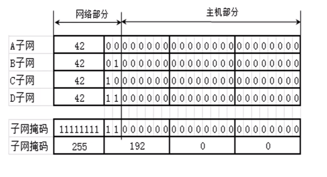

# IP 地址 - 子网、超网


<br>

## 一、子网

### 0x01 为什么要进行子网划分？

假如张三开个公司，公司有 200 个人。那这 200 个人上网只需要给一个 C 类 IP 地址就能满足要求。如 192.168.1.0/24, 最多可以连接 254 个主机，完全满足 200 个人上网的需求， 资源也没有浪费。

有天公司公司规模扩大，公司变成 500 人，那一个 C 类 IP 地址就不能满足需求。有两种解决思路

- 给两个 C 类 IP 地址，但是这样将会跨网段

- 给一个 B 类 IP 地址, 不会跨网段

但是一个 B 类 IP 地址 (如 191.1.0.0/16) 最多可以连接 256 * 256 - 2 = 65534 个主机，而公司只需要 500 个，这就造成极大的资源浪费。为了避免这种资源浪费，我们需要进行子网划分。

**子网划分：借用现有的主机位作子网位，划分出多个子网**。有两种划分方式：

- 等长子网划分：将一个网段等分成多个子网，每个子网可用的 IP 地址数量一样

- 变成子网划分：每个子网的可用 IP 地址可以不一样

子网划分的任务包括两部分：

- 确定子网的子网掩码的长度

- 确定子网中的第一个和最后一个可用的 IP 地址

### 0x02 等长子网划分

#### 将一个 C 类 IP 地址等分成 2 个子网

如将 192.168.0.0/24 等分成 2 个子网，首先我们需要从主机位借一位当作子网位

```
// 192.168.0.0/24
192.168.0.0       10000000.10101000.00000000.00000000
255.255.255.0     11111111.11111111.11111111.00000000
```

借一位

```
// 192.168.0.0/25
192.168.0.0       10000000.10101000.00000000.00000000
255.255.255.128   11111111.11111111.11111111.10000000
```
A 子网第四部分最高位固定为 0，B 子网第四部分最高位固定为 1 ， 子网掩码都是 255.255.255.128, 如下图


由于主机位全为0(网段)或全为 1 (广播)的地址保留所以

- A 子网主机可用 IP 地址： 192.168.0.1(0 0000001) ~ 192.168.0.126(0 1111111)

- B 子网主机可用 IP 地址： 192.168.0.129(1 0000001) ~ 192.168.0.254(1 1111110)


#### 将一个 C 类 IP 地址等分成 4 个子网

如将 192.168.0.0/24 等分成 4 个子网，我们需要从主机位借两位当作子网位。这样 IP 地址的第四部分可以分别取值 00、01、10、11， 子网掩码都是 255.255.255.192。 如下图


由于主机位全为0(网段)或全为 1 (广播)的地址保留所以

- A 子网主机可用 IP 地址： 192.168.0.1(00 000001) ~ 192.168.0.63 (00 111110)

- B 子网主机可用 IP 地址： 192.168.0.65(01 000001) ~ 192.168.0.126(01 111110)

- C 子网主机可用 IP 地址： 192.168.0.129(10 000001) ~ 192.168.0.190(10 111110)

- D 子网主机可用 IP 地址： 192.168.0.193(11 000001) ~ 192.168.0.254(11 111110)

#### 将一个 C 类 IP 地址等分成 8 个子网

如将 192.168.0.0/24 等分成 8 个子网，我们需要从主机位借三位当作子网位。这样 IP 地址的第四部分可以分别取值 000、001、010、011、100、101、110、111 子网掩码都是 255.255.255.224。 如下图


由于主机位全为0(网段)或全为 1 (广播)的地址保留所以

- A 子网主机可用 IP 地址： 192.168.0.1(000 00001) ~ 192.168.0.30 (000 11110)

- B 子网主机可用 IP 地址： 192.168.0.33(001 00001) ~ 192.168.0.62(001 11110)

- C 子网主机可用 IP 地址： 192.168.0.65(010 00001) ~ 192.168.0.94(010 11110)

- D 子网主机可用 IP 地址： 192.168.0.97(011 00001) ~ 192.168.0.126(011 11110)

- D 子网主机可用 IP 地址： 192.168.0.129(100 00001) ~ 192.168.0.158(100 11110)

- E 子网主机可用 IP 地址： 192.168.0.161(101 00001) ~ 192.168.0.190 (101 11110)

- G 子网主机可用 IP 地址： 192.168.0.193(110 00001) ~ 192.168.0.222(110 11110)

- H 子网主机可用 IP 地址： 192.168.0.225(111 00001) ~ 192.168.0.254(111 11110)

#### B 类子网划分

将 131.107.0.0/16 等分成两个子网








#### C 类子网划分

将 42.0.0.0/8 等分成四个子网



### 0x03 变成子网划分


### 0x04 子网划分的注意点

<br>

## 二、超网
<br>


<br>

<br>