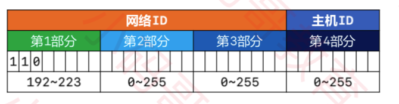

# IP 地址

 

## 一、子网掩码

网络设备在和其他网络设备通信前，会先判断目标设备和自己是否处在同一网段。若处在同一网段，则可以通过网线或交换机直接通信。若不是同一网段则需要交换机进行转发。那如何判断是否处在同一网段，就需要用到子网掩码。

子网掩码 (subnet mask) 的作用就是将某个 IP 地址划分成网络地址和主机地址两部分。

## 一、IP 简介

 

## 三、IP 地址分类

### 0x01 A 类地址

网络地址的最高位以 0 开头的是 A 类地址，默认子网掩码是 255.0.0.0。0 不能用，127 作为保留网段(127.0.0.1 是本地环回地址)，所以 A 类地址的网络部分的取值为  0000 0001 ~ 0111 1110,  转成 10 进制为 1 ~ 126。

主机ID 由第2、3、4部分组成，每部分的取值范围是 0 ~ 255。主机部分全为 0 表示网段地址，主机部分全为 1 表示本网段下的广播地址。所以一个 A 类地址所能容纳的最大主机数为： 256 * 256 * 256 - 2 = 16777214

### 0x02 B 类地址

网络地址的最高位以 10 开头的是 B 类地址，默认子网掩码是 255.255.0.0。B 类地址的网络部分的第一部分取值为 1000 0001 ~ 1011 1110， 也就是 128 ~ 191，第二部分取值 0 ~ 255 。

主机ID 由第3、4部分组成，每部分的取值范围是 0 ~ 255。主机部分全为 0 表示网段地址，主机部分全为 1 表示本网段下的广播地址。所以一个 B 类地址所能容纳的最大主机数为： 256 * 256 - 2 = 65534。

### 0x03 C 类地址

网络地址的最高位以 110 开头的是 C 类地址，默认子网掩码是 255.255.255.0。C 类地址的网络部分的第一部分取值为 1100 0001 ~ 1101 1110， 也就是 192 ~ 223，第2、3 部分取值 0 ~ 255 。

主机ID 由第四部分组成，取值范围是 0 ~ 255。主机部分全为 0 表示网段地址，主机部分全为 1 表示本网段下的广播地址。所以一个 C 类地址所能容纳的最大主机数为： 256 - 2 = 254。

 

 

 

 