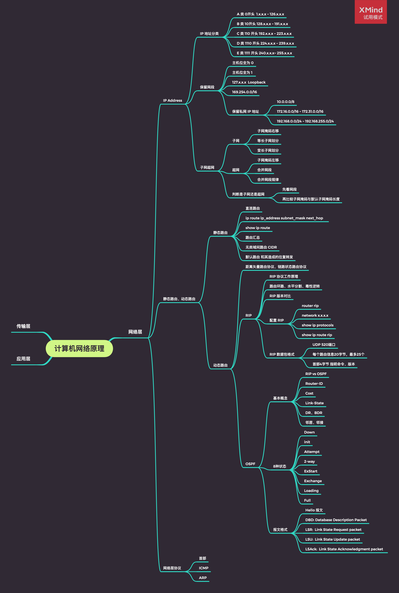

 

 

- 网络层
	- [IP 地址](https://github.com/zhaoName/Notes/blob/master/Netwotk/%E7%BD%91%E7%BB%9C%E5%B1%82-IP%E5%9C%B0%E5%9D%80.md)
	- [子网、超网](https://github.com/zhaoName/Notes/blob/master/Netwotk/%E7%BD%91%E7%BB%9C%E5%B1%82-%E5%AD%90%E7%BD%91%E8%B6%85%E7%BD%91.md)
	- [静态路由](https://github.com/zhaoName/Notes/blob/master/Netwotk/%E7%BD%91%E7%BB%9C%E5%B1%82-%E9%9D%99%E6%80%81%E8%B7%AF%E7%94%B1.md)
	- [RIP](https://github.com/zhaoName/Notes/blob/master/Netwotk/%E7%BD%91%E7%BB%9C%E5%B1%82-RIP.md)
	- [OSPF](https://github.com/zhaoName/Notes/blob/master/Netwotk/%E7%BD%91%E7%BB%9C%E5%B1%82-OSPF.md)
	- [首部](https://github.com/zhaoName/Notes/blob/master/Netwotk/%E7%BD%91%E7%BB%9C%E5%B1%82-%E9%A6%96%E9%83%A8.md)
	- [ICMP & ARP](https://github.com/zhaoName/Notes/blob/master/Netwotk/%E7%BD%91%E7%BB%9C%E5%B1%82-ICMP-ARP.md)

- 传输层

	- [传输层 - 概述](https://github.com/zhaoName/Notes/blob/master/Netwotk/%E4%BC%A0%E8%BE%93%E5%B1%82-%E6%A6%82%E8%BF%B0.md)
	- [UDP](https://github.com/zhaoName/Notes/blob/master/Netwotk/%E4%BC%A0%E8%BE%93%E5%B1%82-UDP.md)
	- [TCP 首部](https://github.com/zhaoName/Notes/blob/master/Netwotk/%E4%BC%A0%E8%BE%93%E5%B1%82-TCP%E9%A6%96%E9%83%A8.md)
	- [TCP 可靠传输](https://github.com/zhaoName/Notes/blob/master/Netwotk/%E4%BC%A0%E8%BE%93%E5%B1%82-TCP%E5%8F%AF%E9%9D%A0%E4%BC%A0%E8%BE%93.md)
	- [TCP 流量控制](https://github.com/zhaoName/Notes/blob/master/Netwotk/%E4%BC%A0%E8%BE%93%E5%B1%82-TCP%E6%B5%81%E9%87%8F%E6%8E%A7%E5%88%B6.md)
	- [TCP 拥塞控制](https://github.com/zhaoName/Notes/blob/master/Netwotk/%E4%BC%A0%E8%BE%93%E5%B1%82-TCP%E6%8B%A5%E5%A1%9E%E6%8E%A7%E5%88%B6.md)
	- [TCP 连接与释放](https://github.com/zhaoName/Notes/blob/master/Netwotk/%E4%BC%A0%E8%BE%93%E5%B1%82-TCP%E8%BF%9E%E6%8E%A5%E4%B8%8E%E9%87%8A%E6%94%BE.md)

- 应用层

	- [DNS](https://github.com/zhaoName/Notes/blob/master/Netwotk/%E5%BA%94%E7%94%A8%E5%B1%82-DNS.md)

 

 