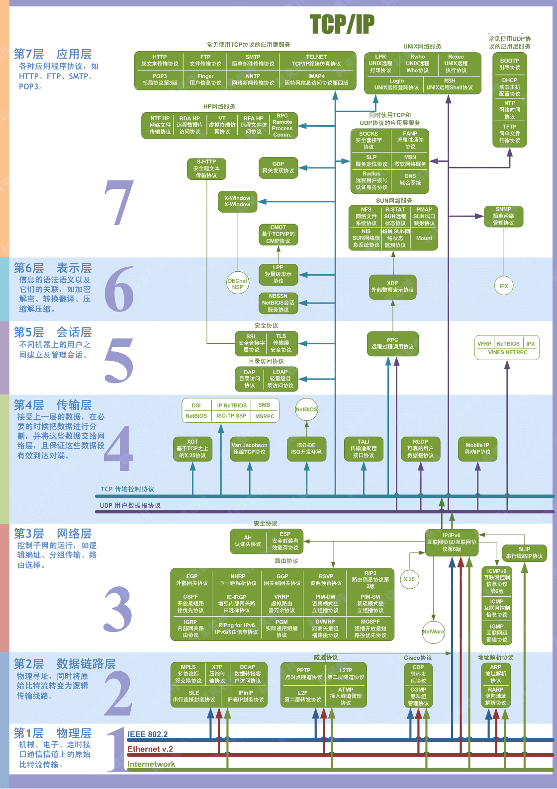
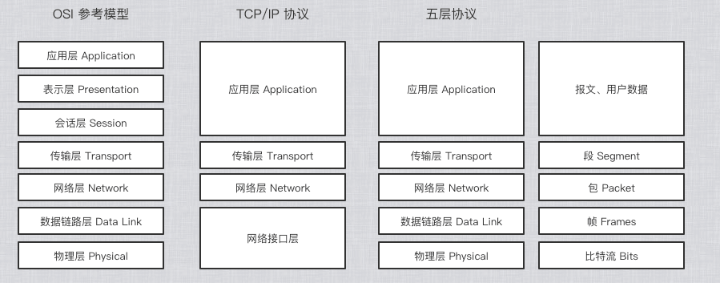
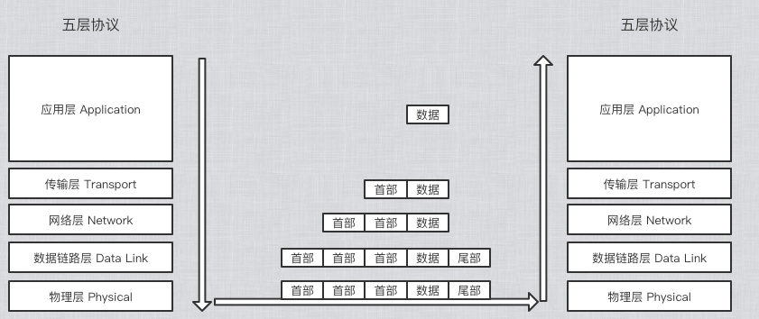

 

 

 

 

#### OSI 参考模型每层的功能

- 应用层：根据互联网中需要的应用程序的功能，定义客户端和服务端程序通信的规范，应用层向表示层发出请求

- 表示层：定义数据格式、是否加密或压缩。如 FTP 允许你选择以二进制或 ASCII 格式传输。若选择二进制，那发送方和接收方都不改变文件的内容，若选择 ASCII 格式，发送方将把文本从发送方的字符集转换成标准 ASCII 后发送数据，接收方收到数据后需要把标准 ASCII 转换成接收方计算机的字符集。
- 会话层：它定义如何开始、控制、结束一个会话，包括对多个双向小时的控制和管理，以便在只完成连续消息的一部分时可以通知应用，从而使表示层看到数据是连续的。
- 传输层：常规数据传输，实现可靠或不可靠的数据通信，能够实现发送方和接收方的丢包重传，流量控制。
- 网络层：根据 IP 地址为数据包选择转发路径。网络层为传输层提供服务，只是尽力转发数据包，不保证不丢包，也不保证按顺序到达接收端。
- 数据链路层：不同的网络类型，发送数据的机制不同，数据链路层就是将数据包装成能够在不同网络传输的帧。能够进行差错检验，但不纠错，检验出错误就丢掉该帧。
- 物理层：在物理层所传数据的单位是比特，该层规定了网络设备接口标准、电压标准。尽可能的通过频分服用技术、时分服用技术在通信链路上更快的传输数据。

#### 将网络互相连接起来要使用一些中间设备，根据中间设备所在的层次不同，可以有一下四种设备

- 物理层使用的中间设备叫转发器 (repeater)

- 数据链路层使用的中间设备叫网桥或桥接器 (bridge)
- 网络层使用的中间设备叫路由器 (router)
- 网络层以上使用的中间设备叫网关 (gateway)

 

 

### 数据链路层

- [概述](https://github.com/zhaoName/Notes/blob/master/Netwotk/%E6%95%B0%E6%8D%AE%E9%93%BE%E8%B7%AF%E5%B1%82-%E6%A6%82%E8%BF%B0.md)
- [PPP](https://github.com/zhaoName/Notes/blob/master/Netwotk/%E6%95%B0%E6%8D%AE%E9%93%BE%E8%B7%AF%E5%B1%82-PPP.md)

### 网络层

- [IP 地址](https://github.com/zhaoName/Notes/blob/master/Netwotk/%E7%BD%91%E7%BB%9C%E5%B1%82-IP%E5%9C%B0%E5%9D%80.md)
- [子网、超网](https://github.com/zhaoName/Notes/blob/master/Netwotk/%E7%BD%91%E7%BB%9C%E5%B1%82-%E5%AD%90%E7%BD%91%E8%B6%85%E7%BD%91.md)
- [静态路由](https://github.com/zhaoName/Notes/blob/master/Netwotk/%E7%BD%91%E7%BB%9C%E5%B1%82-%E9%9D%99%E6%80%81%E8%B7%AF%E7%94%B1.md)
- [RIP](https://github.com/zhaoName/Notes/blob/master/Netwotk/%E7%BD%91%E7%BB%9C%E5%B1%82-RIP.md)
- [OSPF](https://github.com/zhaoName/Notes/blob/master/Netwotk/%E7%BD%91%E7%BB%9C%E5%B1%82-OSPF.md)
- [首部](https://github.com/zhaoName/Notes/blob/master/Netwotk/%E7%BD%91%E7%BB%9C%E5%B1%82-%E9%A6%96%E9%83%A8.md)
- [ICMP & ARP](https://github.com/zhaoName/Notes/blob/master/Netwotk/%E7%BD%91%E7%BB%9C%E5%B1%82-ICMP-ARP.md)
- [IPv6](https://github.com/zhaoName/Notes/blob/master/Netwotk/%E7%BD%91%E7%BB%9C%E5%B1%82-IPv6.md)

### 传输层

- [传输层 - 概述](https://github.com/zhaoName/Notes/blob/master/Netwotk/%E4%BC%A0%E8%BE%93%E5%B1%82-%E6%A6%82%E8%BF%B0.md)
- [UDP](https://github.com/zhaoName/Notes/blob/master/Netwotk/%E4%BC%A0%E8%BE%93%E5%B1%82-UDP.md)
- [TCP 首部](https://github.com/zhaoName/Notes/blob/master/Netwotk/%E4%BC%A0%E8%BE%93%E5%B1%82-TCP%E9%A6%96%E9%83%A8.md)
- [TCP 可靠传输](https://github.com/zhaoName/Notes/blob/master/Netwotk/%E4%BC%A0%E8%BE%93%E5%B1%82-TCP%E5%8F%AF%E9%9D%A0%E4%BC%A0%E8%BE%93.md)
- [TCP 流量控制](https://github.com/zhaoName/Notes/blob/master/Netwotk/%E4%BC%A0%E8%BE%93%E5%B1%82-TCP%E6%B5%81%E9%87%8F%E6%8E%A7%E5%88%B6.md)
- [TCP 拥塞控制](https://github.com/zhaoName/Notes/blob/master/Netwotk/%E4%BC%A0%E8%BE%93%E5%B1%82-TCP%E6%8B%A5%E5%A1%9E%E6%8E%A7%E5%88%B6.md)
- [TCP 连接与释放](https://github.com/zhaoName/Notes/blob/master/Netwotk/%E4%BC%A0%E8%BE%93%E5%B1%82-TCP%E8%BF%9E%E6%8E%A5%E4%B8%8E%E9%87%8A%E6%94%BE.md)

### 应用层

- [DNS](https://github.com/zhaoName/Notes/blob/master/Netwotk/%E5%BA%94%E7%94%A8%E5%B1%82-DNS.md)
- [DHCP](https://github.com/zhaoName/Notes/blob/master/Netwotk/%E5%BA%94%E7%94%A8%E5%B1%82-DHCP.md)
- [HTTP](https://github.com/zhaoName/Notes/blob/master/Netwotk/%E5%BA%94%E7%94%A8%E5%B1%82-HTTP.md)
	

 

 