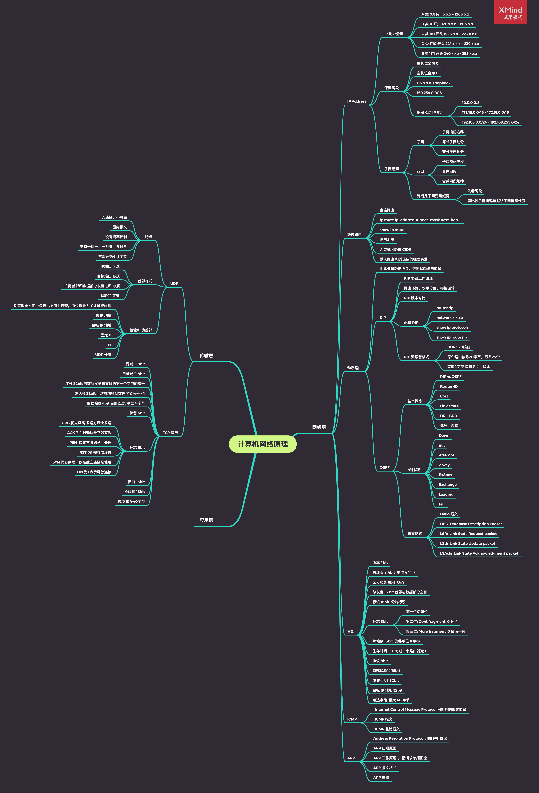

 

 

- 网络层
	- [IP 地址](https://github.com/zhaoName/Notes/blob/master/Netwotk/%E7%BD%91%E7%BB%9C%E5%B1%82-IP%E5%9C%B0%E5%9D%80.md)
	- [子网、超网](https://github.com/zhaoName/Notes/blob/master/Netwotk/%E7%BD%91%E7%BB%9C%E5%B1%82-%E5%AD%90%E7%BD%91%E8%B6%85%E7%BD%91.md)
	- [静态路由](https://github.com/zhaoName/Notes/blob/master/Netwotk/%E7%BD%91%E7%BB%9C%E5%B1%82-%E9%9D%99%E6%80%81%E8%B7%AF%E7%94%B1.md)
	- [RIP](https://github.com/zhaoName/Notes/blob/master/Netwotk/%E7%BD%91%E7%BB%9C%E5%B1%82-RIP.md)
	- [OSPF](https://github.com/zhaoName/Notes/blob/master/Netwotk/%E7%BD%91%E7%BB%9C%E5%B1%82-OSPF.md)
	- [网络层 - 首部](https://github.com/zhaoName/Notes/blob/master/Netwotk/%E7%BD%91%E7%BB%9C%E5%B1%82-%E9%A6%96%E9%83%A8.md)
	- [ICMP & ARP](https://github.com/zhaoName/Notes/blob/master/Netwotk/%E7%BD%91%E7%BB%9C%E5%B1%82-ICMP-ARP.md)

- 传输层
	
	
 

 