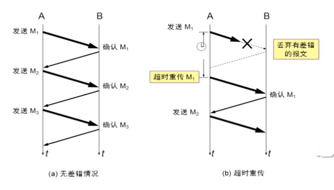
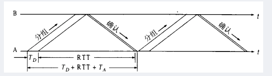
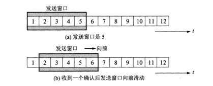

# 传输层 - TCP 可靠传输

 

## 一、 ARQ

ARQ（Automatic repeat request，自动重传请求）是OSI模型中数据链路层和传输层的错误纠正协议之一。它通过使用确认和超时这两个机制，在不可靠服务的基础上实现可靠的信息传输。如果发送方在发送后一段时间之内没有收到确认帧，它通常会重新发送。ARQ可能包括停止等待 ARQ 协议和连续 ARQ 协议，错误检测（Error Detection）、正面确认（Positive Acknowledgment）、超时重传（Retransmission after Timeout）和负面确认及重传（Negative Acknowledgment and Retransmission）等机制。

### 0x01 停止等待 ARQ 协议

TCP 连接是全双工的连接，也就是说在通信的时候，双方既是发送方，也是接收方。下面为了简化问题，只考虑一方发送，一方接受的情况。其中 A 作为发送方，B 作为接收方。

#### 无差错情况

A 发送分组 M1，发送完就暂停发送，等待 B 的确认。B 收到 M1 就向 A 发送确认。A在收到了对 M1 的确认后，就再发送下一个分组 M2。依次下去发送剩余的数据...

#### 超时重传

如果 A 发送的过程中出现差错，B 在接收 M1 时检测出了差错，就丢弃M1，其他什么都不做。又或者 A 传送的过程中分组丢失了，以上这两种情况下，B不会发送任何信息。 

可靠传输协议是这样设计的：如果发生以上的情况，A 只要超过了一段时间仍然没有收到确认，就认为刚才发送的分组丢失了，所以它会重传刚刚的发送过的分组，也就是所谓的超时重传。 

超时重传的原理：发送方发送完一个分组后，就会设置一个超时计时器，如果超时计时器到期之前没有收到接收方发来的确认信息，则会重发刚发送过的分组；如果收到确认信息，则撤销该超时计时器。

#### 确认超时

没有正常进行通信，除了发送方出现问题外，接收方同时也可能存在问题。

如 A 发送了 M1 分组到达 B，B 发送了 M1 确认信息。但由于网络原因，该确认信息丢失。那么这个时候，A 在超时重传时间内，没有收到 B 的确认信息，而且它并不知道是自己的分组有差错、丢失，还是 B 发生的确认丢失了。因此 A 会在超时重传过后，重传 M1 分组。 

接收方 B 会采取这两个行动： 

- B 会丢弃 M1 分组，不向上层交付。（B之前已经收到过M1分组了） 
- 重新向 A 发送确认（因为A重发了，肯定重传时间内没有收到确认信息）

#### 确认延迟

还有种情况就是 B 发送了确认，没有丢失，但是延迟了。也就是说，B 发送的确认在 A 超时计时器过期后才到达。 这种情况下，A 超时重传刚才的分组，B收到后丢弃重复的分组，并重传确认信息。A 后面收到延迟的确认，不作任何操作。

### 0x02 连续 ARQ 协议

 停止等待 ARQ 协议的优点是简答，但也有很严重的确定，就是信道利用率太低。
 
 
 
- TD：A 发送需要分组的时间
- RTT：往返时间
- TA：B 发送确认分组需要的时间
- 忽略 B 处理分组的时间、A 处理确认分组的时间

信道利用率 U = TD / TD + RTT + TA
 
 为了提高传输效率，发送发可以采用流水线传输。流水线传输就是发送方可连续发送多个分组，不必每发完一个分组就停顿下来等待对方的确认。这样可使信道上一直有数据不间断的传输。
 
 

当使用流水线传输时，就需要使用连续 ARQ 协议和滑动窗口协议。且连续 ARQ 协议通常是结合滑动窗口协议来使用的，发送方需要维持一个发送窗口。

图（a）是发送方维持的发送窗口，它的意义是：位于发送窗口内的5个分组都可以连续发送出去，而不需要等待对方的确认，这样就提高了信道利用率。 

连续 ARQ 协议规定，发送方每收到一个确认，就把发送窗口向前滑动一个分组的位置。例如上面的图（b），当发送方收到第一个分组的确认，就把发送窗口向前移动一个分组的位置。如果原来已经发送了前 5 个分组，则现在可以发送窗口内的第 6 个分组。 

接收方一般都是采用累积确认的方式。也就是说接收方不必对收到的分组逐个发送确认。而是在收到几个分组后，对按序到达的最后一个分组发送确认。如果收到了这个分组确认信息，则表示到这个分组为止的所有分组都已经正确接收到了。 

累积确认的优点是容易实现，即使确认丢失也不必重传。但缺点是，不能正确的向发送方反映出接收方已经正确收到的所以分组的信息。比如发送方发送了前 5 个分组，而中间的第3个分组丢失了，这时候接收方只能对前 2 个发出确认。而不知道后面 3 个分组的下落，因此只能把后面的 3 个分组都重传一次，这种机制叫 Go-back-N（回退 N），表示需要再退回来重传已发送过的 N 个分组。

 

## 二、滑动窗口协议

 

## 三、TCP 可靠传输的实现

### 0x01 以字节为单位的滑动窗口

### 0x02 超时重传时间的选择

### 0x03 选择确认 SACK 

 

参考：

- 计算机网络第 7 版 - 谢希仁

 