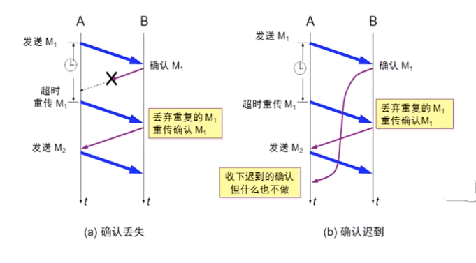

# 传输层 - TCP 可靠传输

<br>

## 一、 ARQ

ARQ（Automatic Repeat-reQuest，自动重传请求）是OSI模型中数据链路层和传输层的错误纠正协议之一。它通过使用确认和超时这两个机制，在不可靠服务的基础上实现可靠的信息传输。如果发送方在发送后一段时间之内没有收到确认帧，它通常会重新发送。ARQ可能包括停止等待 ARQ 协议和连续 ARQ 协议，错误检测（Error Detection）、正面确认（Positive Acknowledgment）、超时重传（Retransmission after Timeout）和负面确认及重传（Negative Acknowledgment and Retransmission）等机制。

### 0x01 停止等待 ARQ 协议

TCP 连接是全双工的连接，也就是说在通信的时候，双方既是发送方，也是接收方。下面为了简化问题，只考虑一方发送，一方接受的情况。其中 A 作为发送方，B 作为接收方。

#### 无差错情况

A 发送分组 M1，发送完就暂停发送，等待 B 的确认。B 收到 M1 就向 A 发送确认。A在收到了对 M1 的确认后，就再发送下一个分组 M2。依次下去发送剩余的数据...


#### 超时重传

如果 A 发送的过程中出现差错，B 在接收 M1 时检测出了差错，就丢弃M1，其他什么都不做。又或者 A 传送的过程中分组丢失了，以上这两种情况下，B不会发送任何信息。 

可靠传输协议是这样设计的：如果发生以上的情况，A 只要超过了一段时间仍然没有收到确认，就认为刚才发送的分组丢失了，所以它会重传刚刚的发送过的分组，也就是所谓的超时重传。 

超时重传的原理：发送方发送完一个分组后，就会设置一个超时计时器，如果超时计时器到期之前没有收到接收方发来的确认信息，则会重发刚发送过的分组；如果收到确认信息，则撤销该超时计时器。

超时重传不会无限重传，会根据系统设置到达一定次数后就会发送 reset (RST) 报文，断开 TCP 连接。

#### 确认超时

没有正常进行通信，除了发送方出现问题外，接收方同时也可能存在问题。

如 A 发送了 M1 分组到达 B，B 发送了 M1 确认信息。但由于网络原因，该确认信息丢失。那么这个时候，A 在超时重传时间内，没有收到 B 的确认信息，而且它并不知道是自己的分组有差错、丢失，还是 B 发生的确认丢失了。因此 A 会在超时重传过后，重传 M1 分组。 

接收方 B 会采取这两个行动： 

- B 会丢弃 M1 分组，不向上层交付。（B之前已经收到过M1分组了） 
- 重新向 A 发送确认（因为A重发了，肯定重传时间内没有收到确认信息）



#### 确认延迟

还有种情况就是 B 发送了确认，没有丢失，但是延迟了。也就是说，B 发送的确认在 A 超时计时器过期后才到达。 这种情况下，A 超时重传刚才的分组，B收到后丢弃重复的分组，并重传确认信息。A 后面收到延迟的确认，不作任何操作。

### 0x02 连续 ARQ 协议

 停止等待 ARQ 协议的优点是简答，但也有很严重的确定，就是信道利用率太低。
 
 
 
- T<sub>D</sub>：A 发送需要分组的时间
- RTT：往返时间
- T<sub>A</sub>：B 发送确认分组需要的时间
- 忽略 B 处理分组的时间、A 处理确认分组的时间

信道利用率 U = T<sub>D</sub> / T<sub>D</sub> + RTT + T<sub>A</sub>
 
 为了提高传输效率，发送发可以采用流水线传输。流水线传输就是发送方可连续发送多个分组，不必每发完一个分组就停顿下来等待对方的确认。这样可使信道上一直有数据不间断的传输。
 
 

当使用流水线传输时，就需要使用连续 ARQ 协议和滑动窗口协议。且连续 ARQ 协议通常是结合滑动窗口协议来使用的，发送方需要维持一个发送窗口。


图（a）是发送方维持的发送窗口，它的意义是：位于发送窗口内的 5 个分组都可以连续发送出去，而不需要等待对方的确认，这样就提高了信道利用率。 

连续 ARQ 协议规定，发送方每收到一个确认，就把发送窗口向前滑动一个分组的位置。例如上面的图（b），当发送方收到第一个分组的确认，就把发送窗口向前移动一个分组的位置。如果原来已经发送了前 5 个分组，则现在可以发送窗口内的第 6 个分组。 

接收方一般都是采用累积确认的方式。也就是说接收方不必对收到的分组逐个发送确认。而是在收到几个分组后，对按序到达的最后一个分组发送确认。如果收到了这个分组确认信息，则表示到这个分组为止的所有分组都已经正确接收到了。 

累积确认的优点是容易实现，即使确认丢失也不必重传。但缺点是，不能正确的向发送方反映出接收方已经正确收到的所以分组的信息。比如发送方发送了前 5 个分组，而中间的第3个分组丢失了，这时候接收方只能对前 2 个发出确认。而不知道后面 3 个分组的下落，因此只能把后面的 3 个分组都重传一次，这种机制叫 Go-back-N（回退 N），表示需要再退回来重传已发送过的 N 个分组。

<br>

## 二、滑动窗口协议

### 0x01 滑动窗口

滑动窗口协议在发送方和接收方之间各自维持一个滑动窗口，发送发是发送窗口，接收方是接收窗口，而且这个窗口是随着时间变化可以向前滑动的。它允许发送方发送多个分组而不需等待确认。**TCP的滑动窗口是以字节为单位的。**


如图所示，发送窗口中有四个概念：：已发送并收到确认的数据（不在发送窗口和发送缓冲区之内）、已发送但未收到确认的数据（位于发送窗口之内）、允许发送但尚未发送的数据（位于发送窗口之内）、发送窗口之外的缓冲区内暂时不允许发送的数据。

接收窗口中也有四个概念：已发送确认并交付主机的数据（不在接收窗口和接收缓冲区之内）、未按序收到的数据（位于接收窗口之内）、允许的数据（位于接收窗口之内）、不允许接收的数据（位于发送窗口之内)

规则：

- 凡是已经发送过的数据，在未收到确认之前，都必须暂时保留，以便在超时重传时使用。
- 只有当发送方 A 收到了接收方的确认报文段时，发送方窗口才可以向前滑动几个序号。
- 当发送方 A 发送的数据经过一段时间没有收到确认（由超时计时器控制），就要使用回退 N 步协议，回到最后接收到确认号的地方，重新发送这部分数据。

### 0x02 窗口与缓存

发送方维护的发送缓存和发送窗口，接收方维护的接收缓存和接收窗口。


发送缓存用来暂时存放：

- 发送应用程序传送给发送方 TCP 准备发送的数据
- TCP 已发送但尚未确认的数据

已被确认的数据应当从发送缓存中删除，因此发送缓存和发送窗口的后沿是重合的。发送应用程序必须控制写入缓存的速率，不能太快，否则发送缓存就会没有存放数据的空间。

接收缓存用来暂时存放：

- 按序到达、但尚未被接收应用程序读取的数据
- 为按序到达的数据

收到的分组被检测出有差错，则丢弃。接收应用程序来不及读取收到的数据，接收缓存最终就会被填满，使接收窗口减小到零。接收应用程序能够及时从接收缓存中读取收到的数据，接收窗口就可以增大，最大亦不能超过接收缓存的大小。上图 (b) 中还指出来下一个期望收到的字节号，这个字节号也就是接收方给发送方的报文段首部中额确认号。

### 0x03 总结

- 虽然 A 的发送窗口是根据 B 的接收窗口设置的，但在同一时刻，A 的发送窗口并不总是和 B 的接收窗口一样大。通过网络传送窗口值需要经历一定的时间滞后，该时间并不确定的。且发送方 A 还可能根据网络当时的拥塞情况适当减少自己的发送窗口数值。

- 对于不按序到达的数据，TCP 通常是先临时存放在接收窗口，等字节流中所缺少的字节收到后，在按序交付上层的应用进程
- TCP 要求接收方必须有累积确认的功能，这样可以减少传输开销

<br>

## 三、TCP 可靠传输的实现

### 0x01 以字节为单位的滑动窗口


### 0x02 选择确认 SACK 

TCP 通信时，如果发送序列中间某个数据包丢失，TCP 会通过重传最后确认的分组后续的分组，这样原先已经被正确传输的分组也可能重复发送，降低了 TCP 性能。为改善此情况发展处 SACK (Selective Acknowledgment) 技术，使 TCP 指重传发送丢失的包，不用发送后续的所有分组，而提供相应机制使接收方能告诉发送方哪些数据丢失，哪些数据提前收到。

如上图中发送 5、6、7、8 四个分组时，接收方只收到 5、6、8三个分组，那接收方的确认中包含序号 601 和已经收到的第 8 个分组的边界信息。


左边界指出缺失字节快的第一个字节序号，而后边界值减 1 才是缺失字节快的最后一个序号。

RFC 2018 中规定如果要使用 SACK，那在建立 TCP 连接时，就要在 TCP 首部的选项中加上 "允许 SACK" 选项。

由于 TCP 首部选项长度最多只有 40 个字节，而指明一个边界需要 4 个字节 (序号占 4 字节)，另外还需要 2 个字节，一个字节指明是 SACK 选项，一个字节指明这个选项占多少字节。因此选项中最多指明 4 个字节块的边界信息。


### 0x03 超时重传时间的调整

由于 TCP 的下层是互联网环境，发送的报文段可能只经过一个高速率的局域网，也可能经过多个低速率的网络，并且每个 IP 数据报所选择的路由还可能不同。如果把超时重传时间设置得太短，就会引起很多报文段的必须要的重传，使网络负荷增大。但若把超时重传时间设置的过长，则又使网络的空闲时间增大，减低了传输效率。

TCP 采用了一种自适应算法，它记录一个报文段发出的时间，以及收到相应的确认的时间，这两个时间之差就是报文段的往返时间 RTT。

```
新的 RTTs = (1 - α) x (旧的 RTTs) + α x (新的 RTT 样本)
```

RTT：报文段往返时间 RTTs：加权平均往返时间 α： 0 ≤ α < 1，RFC 6298 推荐的 α 值为 1/8，即 0.125

```
RTO = RTTs + 4 x RTTD
```

RTO：超时重传时间 RTTD：RTT 的偏差的加权平均值

```
新的 RTTD = (1 - β) x (旧的 RTTD) + β x |RTTs - 新的 RTT 样本|
```

β：小于1的系数，推荐值是 1/4，即 0.25

Karm 算法修正：报文段没重传一次，就把超时重传时间 RTO 增加大一些。典型的做法是取新的重传时间为旧的重传时间的 2 倍。当不再发生报文段的重传时，才根据`RTO = RTTs + 4 x RTTD` 算出重传时间。

<br>

参考：

- 计算机网络第 7 版 - 谢希仁

<br>