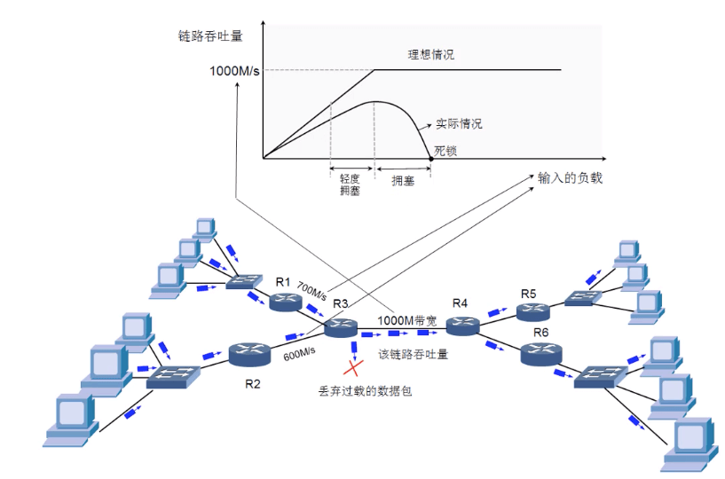
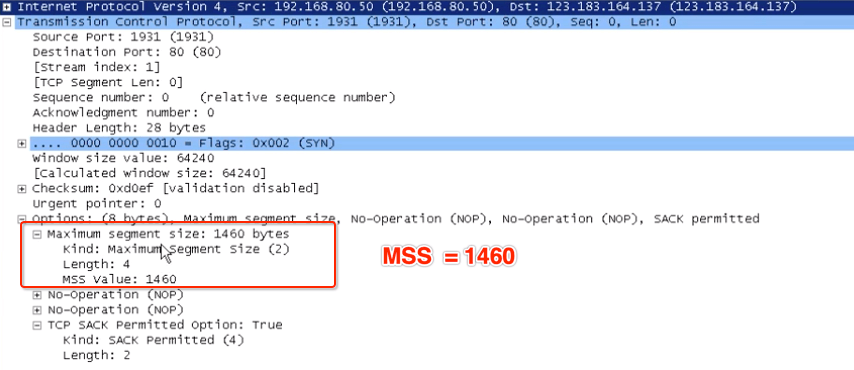
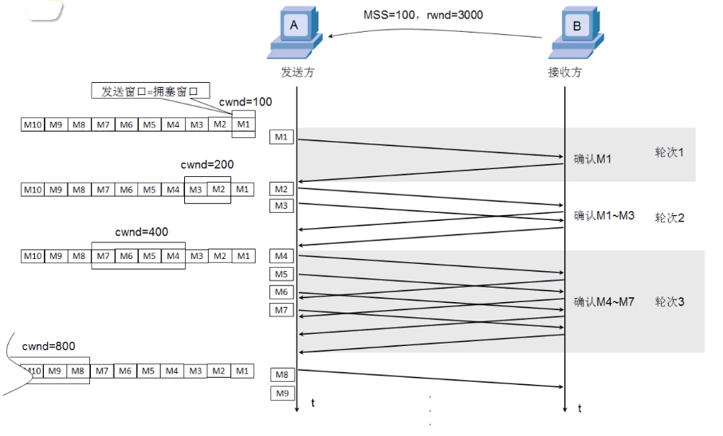
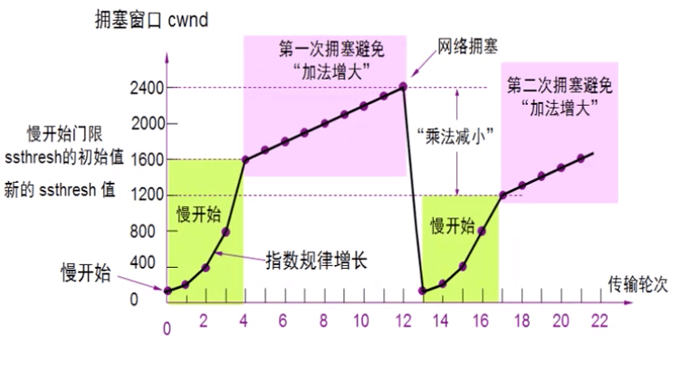
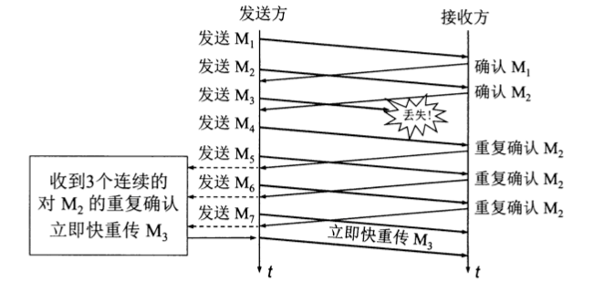
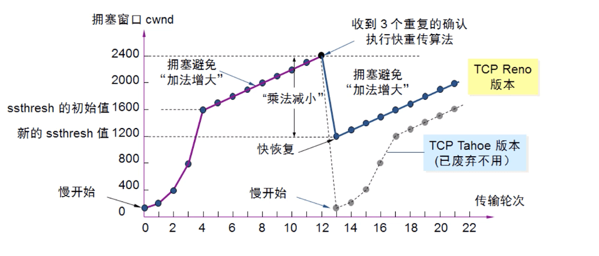

# 传输层 - TCP 拥塞控制

 

## 一、拥塞控制

### 0x01 什么是网络拥塞

在计算机网络中的链路容量(即宽带)、交换结点中的缓存和处理机等，都是网络资源。在某段时间，若对网络中某一资源的需求超过了该资源所能提供的可用部分，网络的性能就要变坏。这种情况就叫做拥塞 (congestion)。

拥塞控制就是防止过多的数据注入到网络中，这样可以使网络中的路由器或链路不致过载。拥塞控制所要做的都是一个前提，就是网络能够承受现有的网络负荷。

- 理想情况下，在吞吐量 (throughput) 饱和之前，网络吞吐量应该等于提供的负载。当提供的负载超过某一限度时，由于网络资源受限，吞吐量达到饱和而保持水平线。这时所提供的负载中有一部分丢失了。

- 从上图可以看出，实际情况随着提供的负载增大，网络吞吐量的斜率在逐渐变小。也就是说在吞吐量还未饱和前，就已经有一部分数据被丢弃。

- 当网络吞吐量明显小于理想的吞吐量时，网络就处于轻度拥塞状态。当提供的负载再大到一定值时，网络的吞吐量会随着负载增大而下降，这时网络处于拥塞状态。当提供的负载继续增大到某一数值时，网络吞吐量会下降到 0，这时网络已无法工作，进入死锁状态。

### 0x02 拥塞控制与流量控制的区别

拥塞控制是一个全局性的过程，涉及到所有的主机、所有的路由器、以及与降低网络传输性能相关的所有因素。 而流量控制往往是指点对点通信量的控制，流量控制所要做的就是抑制发送端发送数据的速率，以便使接收端来得及接收。

举例说明两者之间的区别。假设某个光纤网络的链路传输速率为 1000 Gbit/s。有台巨型计算机向一台个人电脑以 1 Gbit/s 的速率传送文件。显然网络本身的宽带是足够的，不存在拥塞问题。但流量控制是必须的，因为巨型计算机必须经常停下来，以便个人电脑来得及接收。

假设有另外一个网络，其链路传输速率为 1 Mbit/s，而有 1000 台大型计算机连接在这个网络上。现在其中 500 台计算机以 100 kbit/s 的速率向另外 500 台计算机发送文件。那现在的问题不是接收端的计算机是否来得及接收数据，而是整个网络的输入负载已超过网络所能承受，造成拥塞。

 

## 二、慢开始、拥塞避免

### 0x01 MSS

MSS (Maximum Segment Size)：传输层报文段数据部分的最大值，在建立 TCP 连接时确定。我们也能推算出来，数据链路层的 MTU = 1500，减去网络层首部 20 个字节，剩下的就是传输层的报文段大小。再减去传输层首部最少 20 字节，算出 MSS = 1460 字节。

下面为介绍原理我们假定：

- 数据是单向传送的，对方只传送确认报文。
- 接收方有足够的缓存空间，因为发送窗口的大小由网络的拥塞情况决定。

### 0x02 慢开始

慢开始 (slow start) 算法：当主机开始发送数据时，由于并不清楚网络的负荷情况，如果立即把大量数据字节注入到网络，就有可能引起网络发生拥塞。经验证明，较好的方法是先探测一下，即由小到大逐渐增大发送窗口，也就是说，由小到大逐渐增大拥塞窗口数值。

- 为叙述方便，用报文段的个数当作窗口的大小。

- 慢开始算法每经过一个传输轮次，拥塞窗口 (congestion window, cwnd) 就会加倍。

- 一个传输轮次所经历的时间就是往返时间 RTT。 传输轮次是指将 cwnd 所允许发送的报文段都连续发送出去，并收到对方发送的最后一个字节的确认所需要的时间。如 cwnd 大小是 4 个报文段，那么 RTT 就是发送方发送 4 个报文段后并收到 4 个报文段的确认，总共经历的时间。

- 慢开始指的是 TCP 开始设置的 cwnd 较小，但其增长速率是指数级的。

- 在 TCP 实际运行中，发送方并不会像图中要收到这个轮次的所有确认后，才会发送新的报文段。而是发送方只要收到一个对新报文的确认，其 cwnd 就会立即加 1。可以这样认为： 实际过程中，每收到一个报文段的确认 cwnd 的大小会加 1。每经过一个 RTT 的时间 cwnd 大小直接翻倍。

由于 cwnd 是指数级增长，为了防止其增长过大引起网络拥塞，需要设置一个慢开始门限 (slow start threshold, ssthresh)

- 当 cwnd < ssthresh 时， 使用上述慢开始算法

- 当 cwnd > ssthresh 时，停止使用慢开始算法而改用拥塞避免算法

- 当 cwnd = ssthresh 时，即可使用慢开始算法，也可使用拥塞避免算法

### 0x03 拥塞避免算法

拥塞避免 (congestion avoidance) 算法是让 cwnd 的大小缓慢增大，即每过一个 RTT 就把发送方的 cwnd 加 1，以防止网络过早出现拥塞。

上图对报文段丢失的处理方法是 TCP Tahoe 算法：当发生网络拥塞时，会进入 "快速重传" 机制，慢启动阈值设为之前拥塞窗口值的一半，拥塞窗口值降为初始值，重新进入慢开始阶段。当拥塞窗口值达到慢启动阈值时，每 RTT 内拥塞窗口增加值则为 "MSS 除以 CWND " 的值，所以拥塞窗口按线性速度增加。

当网络出现频繁拥塞时，ssthresh 的值会下降的很快。

 

## 三、快重传、快恢复

### 0x01 快重传

有时个别报文会因为各种原因丢失，但实际上网络并未发生拥塞。这时如果发送方迟迟未收到确认，就会产生超时，从而误认为网络拥塞。也就错误的启动 Tahoe 算法，把 cwnd 设置为 1，降低了传输速率。

快重传 (fast retransmit) 算法的目的是让发送方尽早的知道个别报文段丢失。它要求接收方不要等待自己发送数据时才进行捎带确认，而是每收到一个失序的报文段后就立即发送重复确认。

快重传算法规定：发送方只要连续收到三个重复确认 (总共 4 个重复确认) 就应当立即重传对方尚未收到的报文段，而不必继续等待到报文段超时再重传。使用快重传可以使整个网络的吞吐量提高约 20% 。

如上图报文段 M3 丢失，当接收方收到报文段 M4 时，会立即发送对 M2 的重复确认，以便让发送方知道接收方没有收到报文段 M3。发送方接着发送 M5、M6，接收方收到后还是发送对 M2 的重复确认。

发送方收到 3 个连续的对 M2 的重复确认，就会立即重传 M3。这样就不会出现超时，也就不会误认为是网络拥塞。

### 0x02 快恢复

快恢复 (fast recovery)：慢开始阈值 ssthresh 设为之前拥塞窗口 cwnd 值的一半，同时作为新的拥塞窗口值，并跳过慢开始阶段，直接进入拥塞避免阶段。

上图可以看出在拥塞避免阶段，cwnd 的值是按现行规律增大，称为加法增大 (Additive Increase)。而一旦出现超时或 3 个重复确认。就会把 ssthresh 设置为当前 cwnd 值得一半，并大大减小 cwnd 的值，称为乘法减小 (Multiplicative Decrease)。二者合在一起就是 AIMD 算法。

### 0x03 发送窗口的大小

发送窗口的大小受到接收窗口和拥塞窗口的共同限制。swnd = min(rwnd, cwnd)

- 当 rwnd < cwnd 时，是接收方的接收能力限制发送方窗口的最大值

- 当 rwnd > cwnd 时，是网络中的拥塞程度限制发送方窗口的最大值

 

 