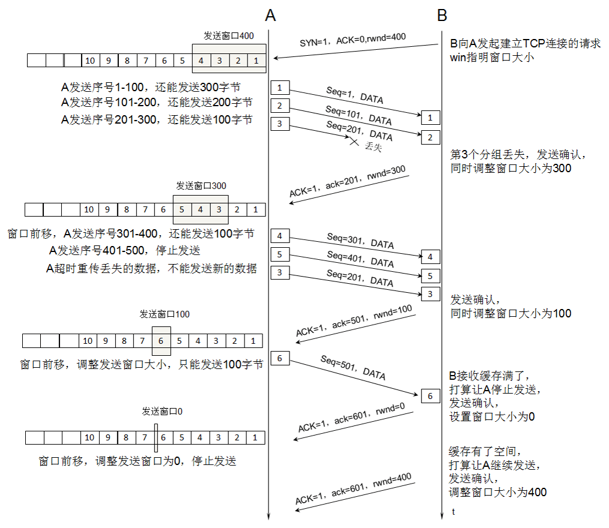

# 传输层 - TCP 流量控制

 

流量控制 (flow control) ：就是让发送方的发送速率不要太快，要让接收方来得及接收。利用滑动窗口的机制可以很方便在 TCP  连接上实现对发送方的流量控制。

- 发送方的发送窗口不能超过接收方给出的接收窗口的数值。TCP 窗口的单位是字节，不是报文段。

- TCP 建立连接时就会确认接收窗口大小，如上图建立连接时 rwnd = 400
- 接收方主机 B 进行了 3 次流量控制，第一次窗口减小到 rwnd = 300，第二次窗口减小到 rwnd = 100，最后减小到 rwnd = 300
- 当 rwnd = 0 时就不允许发送方发送数据。
- TCP 规定及时设置 0 窗口，也必须接收 零窗口探测报文段、确认报文段和携带紧急数据的报文段 三种报文。

0 窗口报文可能导致死锁问题：如上 A 收到 0 窗口报文段就不会再发送数据，但过会 B 的接收缓存释放了一些控制，于是 B 向 A 发送了非 0 窗口报文段。然后这个报文段在传送过程丢了。A 一直等待收到 B 发送的非 0 窗口的通知，而 B 也一直等待 A 发送的数据。这就造成死锁局面。

解决办法：TCP 为每一个连接设有一个持续计时器 (persistence timer)。只要 TCP 连接的一方收到对方的零窗口通知，就启动持续计时器。若持续计时器设置的时间到期，就发送一个零窗口探测报文段(仅携带 1 字节的数据)，而对方就在确认这个探测报文段时给出了现在的窗口值。如果窗口仍是零，那么收到这个报文段的一方就重新设置持续计时器。如果窗口不是零，那么死锁的僵局就可以打破了。

 

 

 