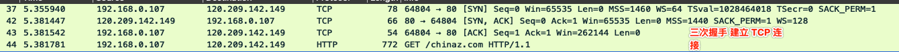
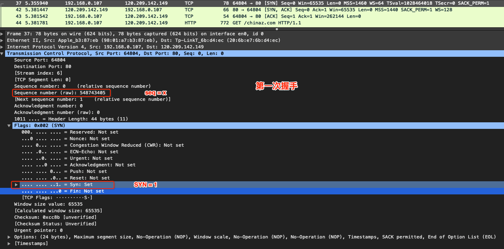
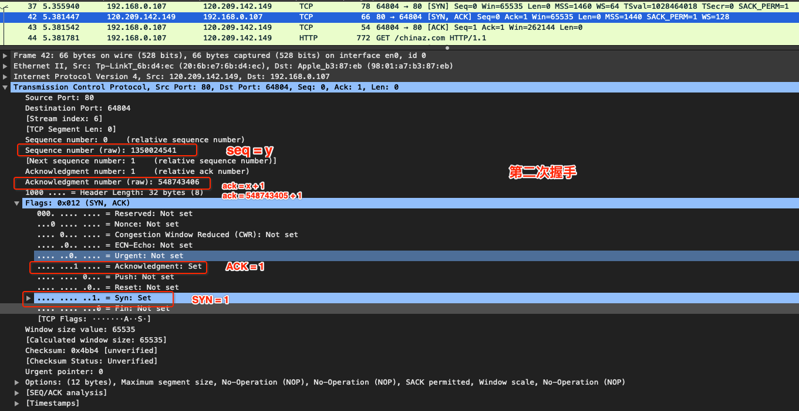
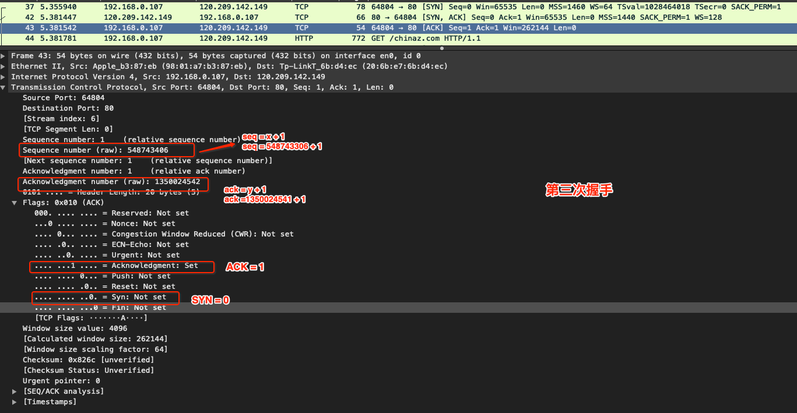

# 传输层 - TCP 连接与释放

 

## 一、 TCP 建立连接

TCP 是面向连接的协议，TCP 运输连接的建立和释放是每一次面向连接的通信中必不可少的过程。TCP 建立连接的过程叫做握手，握手需要在客户和服务器之间交换三个 TCP 报文段。

TCP 建立连接采用客户服务器方式。主动发起建立连接的应用进程交客户端 (clinet)，而被动等待连接建立的应用进程叫服务器 (server)。

### 0x01 三次握手

TCP 是全双工通信，三次握手 (three way handshake) 的目的就是为了确认双方的接收能力和发送能力是否正常、指定自己的初始化序号、交换窗口大小。

抓包查看 TCP 三次握手

第一次握手：client A 想建立 TCP 连接，向 server B 发出连接请求报文，这时 TCP 首部中 SYN = 1，同时选择一个初始序号 seq = x 。client A 进入 SYN-SENT 状态 (同步已发送)。

TCP 规定 SYN 报文段 (即 SYN = 1 的报文段) 不能携带数据，**但要消耗一个序号。**

第二次握手：server B 收到连接请求后，若同意建立连接，则向 client A 发送确认。确认报文段中 SYN = 1、ACK = 1、确认号 ack = x + 1，同时也为自己选择初始序号 seq = y。server B 进入 SYN-RCVD (同步收到) 状态。

这个报文段也不能携带数据，但同样要消耗一个序号

第三次握手：client A 收到 server B 的确认后，还要向 server B 给出确认。确认报文中 ACK = 1、seq = x + 1、ack = y +1 。这时 client A 进入 ESTABLISHED (已建立连接) 状态。

TCP 标准规定，ACK 报文段可以携带数据，但若不携带数据则不消耗序号。

server B 收到 client A 的确认后，也进入 EATABLISHED 状态。

### 0x02 为什么握手需要三次？

上面说到三次握手的目的就是为了确认通信双方的接收能力和发送能力是否正常。

- 第一次握手：客户端发送建立连接请求，服务端收到了。这样服务端就确定客户端的发送能力没问题。

- 第二次握手：服务端给出对请求的确认，客户端收到了。这样客户端就确定服务端的发送、接收能力都没问题。

经过两次握手之后，客户端确定服务端的发送、接受能力没问题，但服务端只能确定客户端的发送能力没问题，并不知道客户端的接收能力是否有问题。

- 第三次握手：客户端收到服务端的确认后，还要给服务端确认。服务端收到确认后就知道发送端的的接收能力没有问题。

因此需要三次握手才能确认双方的接收与发送能力是否正常。还有种情况可以说明为什么握手要三次，两次不行。

第三次握手主要是为了防止 "已失效的连接请求报文段" 突然又传到了 server  B 。假设 client A 发出连接请求后没有丢失，而是在网络节点中长时间滞留，以致延误到连接释放以后的某个时间才到达 server B。本来这是个失效的连接请求，但 server B 收到失效的连接请求报文段，以为 client A 又要建立一次新的连接请求。于是向 client A 发出确认报文，同意建立连接。

若不采用三次握手，只要 server B 发出确认，就建立新的连接了。此时 client A 并不会理财 server B 的确认，也不会向 B 发送数据。但 B 却认为新的连接已经建立，并一直等待 client A 发送数据。这就造成 server B 的资源浪费。

 

## 二、TCP 释放连接

 

 

 

 

 