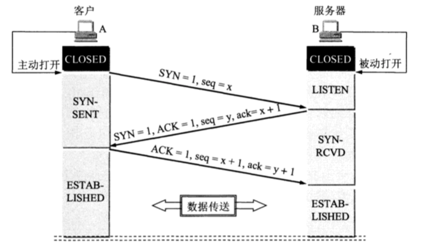

# 传输层 - TCP 连接与释放

 

## 一、 TCP 建立连接

TCP 是面向连接的协议，TCP 运输连接的建立和释放是每一次面向连接的通信中必不可少的过程。TCP 建立连接的过程叫做握手，握手需要在客户和服务器之间交换三个 TCP 报文段。

TCP 建立连接采用客户服务器方式。主动发起建立连接的应用进程交客户端 (clinet)，而被动等待连接建立的应用进程叫服务器 (server)。

### 0x01 三次握手

TCP 是全双工通信，三次握手 (three way handshake) 的目的就是为了确认双方的接收能力和发送能力是否正常、指定自己的初始化序号、交换窗口大小。

- 第一次握手：clinet A 想建立 TCP 连接，向 server B 发出连接请求报文，这时 TCP 首部中 SYN = 1，同时选择一个初始序号 seq = x 。client A 进入 SYN-SENT 状态 (同步已发送)。

- TCP 规定 SYN 报文段 (即 SYN = 1 的报文段) 不能携带数据，**但要消耗一个序号。**

- 第二次握手：server B 收到连接请求后，若同意建立连接，则向 client A 发送确认。确认报文段中 SYN = 1、ACK = 1，确认号 ack = x + 1，同时也为自己选择初始序号 seq = y。server B 进入 SYN-RCVD (同步受到) 状态。

### 0x02 为什么握手需要三次？

 

 

 

 

 

 