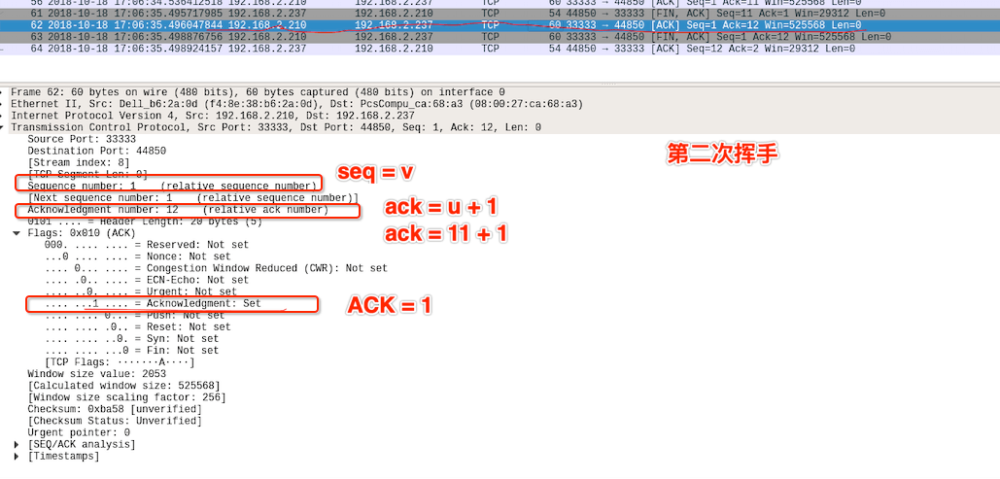

# 传输层 - TCP 连接与释放

 

## 一、 TCP 建立连接

TCP 是面向连接的协议，TCP 运输连接的建立和释放是每一次面向连接的通信中必不可少的过程。TCP 建立连接的过程叫做握手，握手需要在客户和服务器之间交换三个 TCP 报文段。

TCP 建立连接采用客户服务器方式。主动发起建立连接的应用进程交客户端 (clinet)，而被动等待连接建立的应用进程叫服务器 (server)。

### 0x01 三次握手

TCP 是全双工通信，三次握手 (three way handshake) 的目的就是为了确认双方的接收能力和发送能力是否正常、指定自己的初始化序号、交换窗口大小。

抓包查看 TCP 三次握手

第一次握手：client A 想建立 TCP 连接，向 server B 发出连接请求报文，这时 TCP 首部中 SYN = 1，同时选择一个初始序号 seq = x 。client A 进入 SYN-SENT 状态 (同步已发送)。

TCP 规定 SYN 报文段 (即 SYN = 1 的报文段) 不能携带数据，**但要消耗一个序号。**

第二次握手：server B 收到连接请求后，若同意建立连接，则向 client A 发送确认。确认报文段中 SYN = 1、ACK = 1、确认号 ack = x + 1，同时也为自己选择初始序号 seq = y。server B 进入 SYN-RCVD (同步收到) 状态。

这个报文段也不能携带数据，但同样要消耗一个序号

第三次握手：client A 收到 server B 的确认后，还要向 server B 给出确认。确认报文中 ACK = 1、seq = x + 1、ack = y +1 。这时 client A 进入 ESTABLISHED (已建立连接) 状态。

TCP 标准规定，ACK 报文段可以携带数据，但若不携带数据则不消耗序号。

server B 收到 client A 的确认后，也进入 EATABLISHED 状态。

### 0x02 为什么握手需要三次？

上面说到三次握手的目的就是为了确认通信双方的接收能力和发送能力是否正常。

- 第一次握手：客户端发送建立连接请求，服务端收到了。这样服务端就确定客户端的发送能力没问题。

- 第二次握手：服务端给出对请求的确认，客户端收到了。这样客户端就确定服务端的发送、接收能力都没问题。

经过两次握手之后，客户端确定服务端的发送、接受能力没问题，但服务端只能确定客户端的发送能力没问题，并不知道客户端的接收能力是否有问题。

- 第三次握手：客户端收到服务端的确认后，还要给服务端确认。服务端收到确认后就知道发送端的的接收能力没有问题。

因此需要三次握手才能确认双方的接收与发送能力是否正常。还有种情况可以说明为什么握手要三次，两次不行。

第三次握手主要是为了防止 "已失效的连接请求报文段" 突然又传到了 server  B 。假设 client A 发出连接请求后没有丢失，而是在网络节点中长时间滞留，以致延误到连接释放以后的某个时间才到达 server B。本来这是个失效的连接请求，但 server B 收到失效的连接请求报文段，以为 client A 又要建立一次新的连接请求。于是向 client A 发出确认报文，同意建立连接。

若不采用三次握手，只要 server B 发出确认，就建立新的连接了。此时 client A 并不会理睬 server B 的确认，也不会向 B 发送数据。但 B 却认为新的连接已经建立，并一直等待 client A 发送数据。这就造成 server B 的资源浪费。

### 0x03 第三次握手失败

第二次握手成功后， server B 进入 SYN-RCVD 状态。若等不到 client A 的确认包，server B 会重新发送 SYN-ACK 报文段。重发多次后仍然收不到 client A 的确认包，server B 就会发送 RST 包，强制关闭连接。

 

## 二、TCP 释放连接

### 0x01 四次挥手

TCP 的释放连接需要发送四个包，称四次挥手 (four way handshake) ，通信双方都可以主动释放连接。

第一次挥手：client A 发送一个报文段，报文中会指定 FIN = 1、seq = u。此时 client A 停止再发送数据，主动关闭 TCP 连接，进入 FIN_WAIT1（终止等待1）状态，等待 server B  的确认。

第二次挥手：server B 收到连接释放报文段后即发出确认报文段，ACK =1 、ack = u+1、seq = v，server B 进入 CLOSE_WAIT (关闭等待) 状态，此时的 TCP 处于半关闭状态，client A 到 server B 的连接释放。client A 收到 server B 的确认后，进入 FIN_WAIT2(终止等待2) 状态，等待 server B 发出的连接释放报文段。

第三次挥手：此时若 server B 也没有想要发送的数据，会向 client A 发送释放练级的 FIN 报文段，FIN = 1、ACK = 1、seq = w、ack = u + 1。server B 进入 LAST_ACK (最后确认) 状态，等待客户端的确认。

第四次挥手：即 client A 收到 server B 的连接释放报文段后，对此发出确认报文段 ACK = 1、seq = u + 1、ack = w + 1，client A 进入 TIME_WAIT（时间等待）状态。此时 TCP 未释放掉，需要经过时间等待计时器设置的时间 2MSL 后，client A 才进入 CLOSED 状态。

### 0x02 四次挥手中的状态

| 状态 | 解释 |
| ---- | ---- |
| FIN\_WAIT\_1 | FIN\_WAIT\_1 状态实际上是当主动方在 ESTABLISHED 状态时，它想主动关闭连接，向对方发送了 FIN 报文，此时该主动方进入到 FIN\_WAIT\_1 状态。 |
| CLOSE_WAIT | 等待关闭，当收到主动方发送 FIN 报文后，会马上返回 ACK 确认报文，进入 CLOSE_WAIT 状态。此时还需要考虑自己是否还有数据发送给对方。如果没有发送 FIN 报文给对方 |
| FIN\_WAIT\_2 | 当收到对方回应 ACK 报文后，就会进入 FIN\_WAIT\_2 状态，然后等待对方发送 FIN 报文 |
| LAST_ACK | 它是被动关闭一方在发送 FIN 报文后，最后等待对方的 ACK 报文。当收到 ACK 报文后，也即可以进入到 CLOSED 可用状态了 |
| TIME_WAIT| 表示收到了对方的 FIN 报文，并发送出了 ACK 报文，就等 2MSL 后即可回到 CLOSED 可用状态了。如果  FIN\_WAIT\_1 状态下，收到了对方同时带 FIN 标志和 ACK 标志的报文时，可以直接进入到 TIME\_WAIT 状态，而无须经过 FIN\_WAIT\_2 状态 |
| CLOSEING | 表示若双方几乎同时想要关闭连接的话，就会同时发送 FIN 报文，这时就会进入 CLOSEING 状态 |
| CLOSED | 关闭连接 |

如果  FIN\_WAIT\_1 状态下，收到了对方同时带 FIN 标志和 ACK 标志的报文时，可以直接进入到 TIME\_WAIT 状态，而无须经过 FIN\_WAIT\_2 状态

### 0x03 为什么 TIME_WAIT 状态要等待 2MSL ？

MSL (Maximum Segment Lifetime) 最大报文段寿命，它是任何报文在网络上存在的最长时间，超过这个时间报文将被丢弃。

- 保证客户端发送的最后一个ACK报文段能够到达服务端。这个ACK报文段有可能丢失，使得处于 LAST-ACK 状态的 B 收不到对已发送的 FIN+ACK 报文段的确认，服务端超时重传 FIN+ACK 报文段，而客户端能在 2MSL 时间内收到这个重传的 FIN+ACK 报文段，接着客户端重传一次确认，重新启动 2MSL 计时器，最后客户端和服务端都进入到 CLOSED 状态，若客户端在 TIME-WAIT 状态不等待一段时间，而是发送完 ACK 报文段后立即释放连接，则无法收到服务端重传的 FIN+ACK 报文段，所以不会再发送一次确认报文段，则服务端无法正常进入到 CLOSED 状态。

- 防止 "已失效的连接请求报文段" 出现在本连接中。 客户端在发送完最后一个 ACK 报文段后，再经过 2MSL，就可以使本连接持续的时间内所产生的所有报文段都从网络中消失，使下一个新的连接中不会出现这种旧的连接请求报文段。

### 0x04 挥手为什么要四次？

TCP 是全双工模式，这是理解四次挥手的关键。可以这样理解三次握手的目的是检验通信双方的发送和接收能力，那四次挥手就是为了释放通信双方的发送和接收能力。

若只有两次挥手，意味着主动方 A 发出 FIN 报文后，被动方 B 返回一个 ACK 确认。这时只能判定主动方 A 的发送能力和被动方的接收能力没了。但主动方 A 的接受能力和被动方 B 的发送能力还在，B 仍然可以向 A 正常发送数据。所以还需要 B 也发送一个 FIN 报文，释放 A 的接收能力和 B 的发送能力，也就是四次挥手。

 

## 三、TCP 的有限状态

粗的实线箭头表示正常的客户端状态变迁，粗的虚线箭头表示正常的服务器状态变迁，细线箭头表示异常状态

 

参考：

- [面试官，不要再问我三次握手和四次挥手](https://zhuanlan.zhihu.com/p/86426969)
- [TCP三次握手与四次分手](https://juejin.cn/post/6844903880501755917)
- [老背题却记不住TCP为什么三次握手？](https://juejin.cn/post/6844904067601268744)

 

 

 