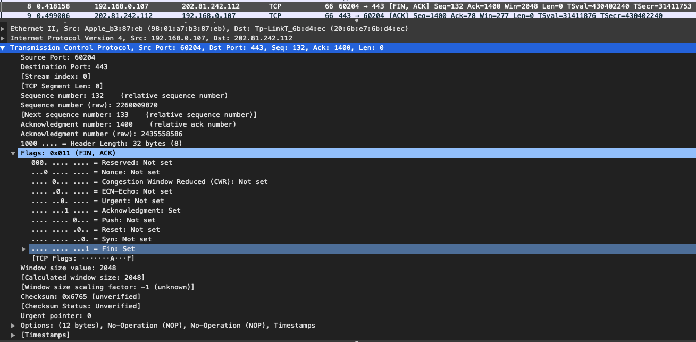
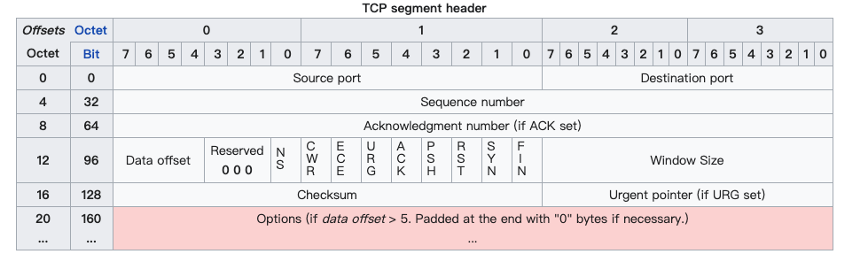
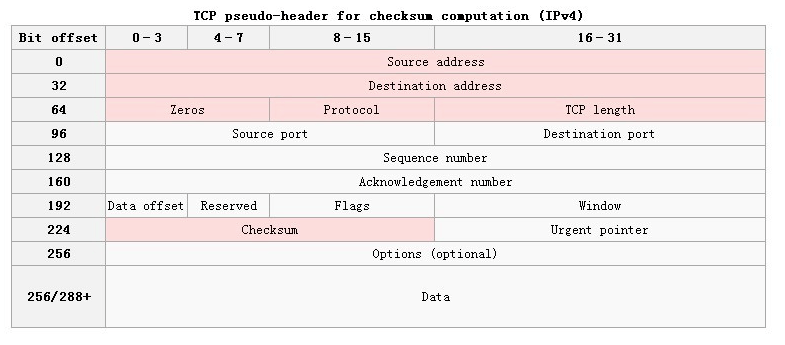

# 传输层 - TCP 首部

 

TCP (Transmission Control Protocol, 传输控制协议) 是一种面向连接的、可靠的、基于字节流的传输层通信协议。

## 一、TCP 特点

- TCP 是面向连接的运输层协议。应用程序在使用 TCP 协议之前，必须先建立 TCP 连接。在传送数据完毕后，必须释放已经建立的 TCP 连接。

- 每一条 TCP 连接只能有两个端点 (endpoint)，每一条 TCP 连接只能是点对点的(一对一)。
- TCP 提供可靠交付的服务。通过 TCP 连接传送的数据，无差错、不丢失、不重复，并且按序到达。
- TCP 提供全双工通信。TCP 允许通信双方的应用进程在任何时候都能发送数据。TCP 连接的两端都设有发送缓存和接受缓存，用来临时存放双向通信的数据。
- 面向字节流。TCP 中的"流" (stream) 指的是流入到进程或从进程流出的字节序列。

TCP 和 UDP 在发送报文时采用的方式完全不同。TCP 并不关心应用进程一次把多长的报文发送到 TCP 的缓存中，而是根据对方给出的窗口值和当前网络拥塞的程度来决定一个报文段应包含多少个字节(UDP 发送的报文长度是应用进程给出的)。如果应用进程传送到 TCP 缓存的数据块太长，TCP 就可以把它划分短一些再传送。如果应用进程一次只发来一个字节，TCP 也可以等待积累有足够多的字节后再构成报文段发送出去。

 

## 二、TCP 首部格式

TCP 首部格式

- 源端口 (Source Port)：发送方端口号，标识报文的返回地址，占16位二进制。端口号取值范围为 0 ~ 65535

- 目标端口 (Destination Port)：接收方端口，指明报文接收计算机上的应用程序地址接口。

- 序号 (Sequence number)：占 32 位二进制，取值范围是 0 ~ 2^32-1。序号增加到 2^32 - 1 后，下个序号又回到 0。TCP 是面向字节流的，在一个 TCP 连接中传送的字节流中的每一个字节都按顺序编号。
 
- 确认号 (Acknowledgment number)：占 32 位二进制，是指期望接收到对方下一个报文段的第一个数据字节的序号。
	- TCP 能实现可靠传输，接收方收到几个数据包后，就会给发送方发送一个确认数据包，告诉发送方下一个数据包该从第多少个字节开始发送。
	
	- 若确认号是 N，则表明到序号 N - 1 为止的所有数据都已正确收到

- 数据偏移 (Data Offset)：占 4 为二进制，指出 TCP 报文段的数据起始处距离 TCP 报文段的起始处有多远。实际上指出 TCP 报文首部的长度。偏移单位是 4 字节，4 位二进制数能够表示的最大十进制数是 15。也就是说 TCP 首部的最大长度是 15 * 4 = 60 字节，同时意味着 TCP 选项的长度最大为 40 字节。

- 保留 (Reserved)：占 6 位二进制，保留位今后使用，目前都置为 0。

- 标志 (Flags)：占 6 位二进制，每个标志位占 1 bit。
	- URG (URGent)：当 URG = 1 时表示高优先级的数据包，因尽快发送，而不是按照排队顺序发送。且此时紧急指针字段有效。
	
	- ACK (ACKnowlegment)：当 ACK = 1 时确认号字段有效。TCP 规定在建立连接后所有传送的报文段都必须将 ACK 置为 1。
	- PSH (Push)：当两个应用进程进行交互式的通信时，有时在一端的应用程序希望在键入一个命令后立即就能收到对方的相应。 **URG 对发送方，PSH 对接收方。**
	- RST (ReSeT)：当 RST = 1 时表示 TCP 连接出现严重差错，必须释放连接，然后重新建立连接。
	- SYN (SYNchronization)：在连接建立时用来同步序号。当 SYN = 1 而 ACK = 0 时，表明这是一个连接请求报文段。对方若同意建立连接，则应在响应的报文段中使 SYN = 1 和 ACK = 1。因此 SYN = 1 就表示这是一个连接请求或连接接受报文。
	- FIN (FINish)：用来释放一个连接。当 FIN = 1 时，表明此报文段的发送方的数据已发送完毕，并要求释放运输连接。

- 窗口 (Window Size)：占 16 位二进制，此字段明确指出现在允许对方发送的数据量，它告诉对方本端的 TCP 接收缓冲区还能容纳多少字节的数据，这样对方就可以控制发送数据的速度。 窗口大小的值是指，从本报文段首部中的确认号算起，接收方目前允许对方发送的数据量。例如，假如确认号是 701 ，窗口字段是 1000。这就表明，从 701 号算起，发送此报文段的一方还有接收 1000 （字节序号是 701 ~ 1700） 个字节的数据的接收缓存空间。

- 检验和 (Checksum)：占 16 位二进制，由发送端填充，接收端对 TCP 报文段执行 CRC 算法，以检验 TCP 报文段在传输过程中是否损坏，如果损坏这丢弃。

- 紧急指正 (Urgent pointer)：占 16 位二进制，仅在 URG = 1 时才有意义，它指出本报文段中的紧急数据的字节数。 当 URG = 1 时，发送方 TCP 就把紧急数据插入到本报文段数据的最前面，而在紧急数据后面的数据仍是普通数据。因此紧急指针指出了紧急数据的末尾在报文段中的位置。

- 选项 (Options)：选项最多 40 字节。

 

## 三、注意

在维基百科中可以看到 TCP 首部的保留位只占 3 个二进制位，而由 9 个标志位。

- NS：ECN-nonce -- -- 隐蔽保护

- CWR：拥塞窗口减少(CWR)标志由发送主机设置，表示它收到了一个设置了ECE标志的TCP段，并在拥塞控制机制中作出了响应。

- ECE：ECN-Echo具有双重作用，取决于 SYN 标志的值。它表示。
	- 如果 SYN 标志被设置为 1，说明 TCP 对等体具有ECN功能。
	- 如果 SYN 标志被设置为 0，说明在正常传输过程中收到了 IP 头中设置了Congestion Experienced 标志 (ECN=11) 的数据包，这对 TCP 发送方来说是一个网络拥塞(或即将发生的拥塞)的指示。

从上图 WireShark 抓包中可以看到，TCP 首部由 3 位保留位，9 位标志位。这两种说法都正确。

 

## 四、校验和

和 UDP 一样，TCP 的校验和的计算内容：伪首部 + 首部 + 数据。伪首部占 12 个字节，仅在计算校验和时起作用，并不会传递给网络层。

TCP 校验和计算方式和 UDP 一样。把 TCP 数据报看成是由许多 16 位的子串连接起来，若 TCP 数据报的数据部分不是偶数个字节，则要在数据部分末尾增加一个全零字节（此字节不发送），接下来就按照二进制反码计算出这些 16 位字的和。将此和的二进制反码写入校验和字段。

不同：

TCP 校验和与 IP 校验和的区别是：TCP 和 UDP 检验和覆盖首部和数据，而 IP 首部中的检验和只覆盖 IP 的首部，不覆盖 IP 数据报中的任何数据。

TCP 校验和和 UDP 校验和的区别是：TCP 的检验和是必需的，而 UDP 的检验和是可选的；TCP 伪首部中 Protocol 字段固定是 6， TCP 伪首部中 Protocol 字段固定是 17。 

 

参考:

- [Transmission Control Protocol](https://en.wikipedia.org/wiki/Transmission_Control_Protocol)

- 计算机网络第 7 版 - 谢希仁

 