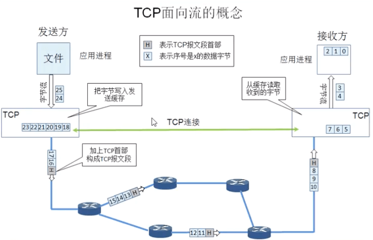
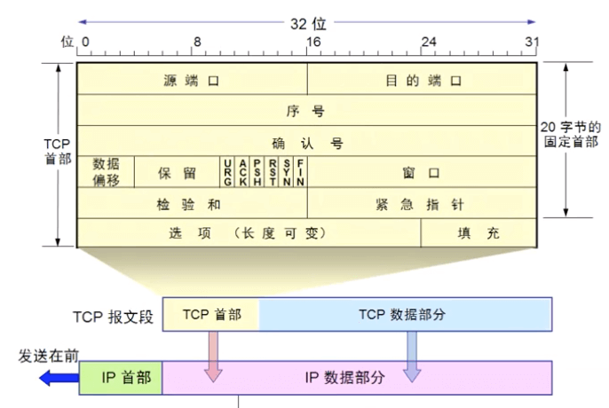
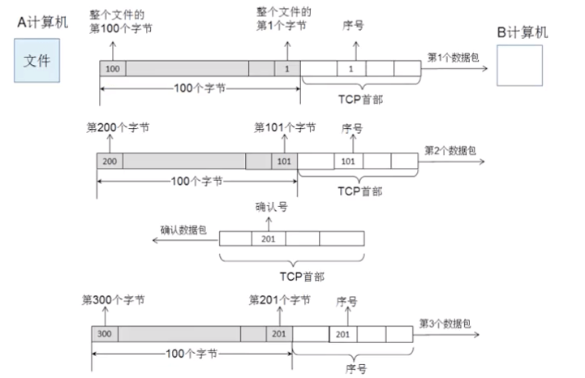

# 传输层 - TCP 首部

 

TCP (Transmission Control Protocol, 传输控制协议) 是一种面向连接的、可靠的、基于字节流的传输层通信协议。

## 一、TCP 特点

- TCP 是面向连接的运输层协议。应用程序在使用 TCP 协议之前，必须先建立 TCP 连接。在传送数据完毕后，必须释放已经建立的 TCP 连接。

- 每一条 TCP 连接只能有两个端点 (endpoint)，每一条 TCP 连接只能是点对点的(一对一)。
- TCP 提供可靠交付的服务。通过 TCP 连接传送的数据，无差错、不丢失、不重复，并且按序到达。
- TCP 提供全双工通信。TCP 允许通信双方的应用进程在任何时候都能发送数据。TCP 连接的两端都设有发送缓存和接受缓存，用来临时存放双向通信的数据。
- 面向字节流。TCP 中的"流" (stream) 指的是流入到进程或从进程流出的字节序列。

TCP 和 UDP 在发送报文时采用的方式完全不同。TCP 并不关心应用进程一次把多长的报文发送到 TCP 的缓存中，而是根据对方给出的窗口值和当前网络拥塞的程度来决定一个报文段应包含多少个字节(UDP 发送的报文长度是应用进程给出的)。如果应用进程传送到 TCP 缓存的数据块太长，TCP 就可以把它划分短一些再传送。如果应用进程一次只发来一个字节，TCP 也可以等待积累有足够多的字节后再构成报文段发送出去。

 

## 二、TCP 首部格式

TCP 首部格式

- 源端口 (Source Port)：发送方端口号，标识报文的返回地址，占16位二进制。端口号取值范围为 0 ~ 65535

- 目标端口 (Destination Port)：接收方端口，指明报文接收计算机上的应用程序地址接口。

- 序号 (Sequence number)：占 32 位二进制，取值范围是 0 ~ 2^32-1。序号增加到 2^32 - 1 后，下个序号又回到 0。TCP 是面向字节流的，在一个 TCP 连接中传送的字节流中的每一个字节都按顺序编号。
 
- 确认号 (Acknowledgment number)：占 32 位二进制，是指期望接收到对方下一个报文段的第一个数据字节的序号。
	- TCP 能实现可靠传输，接收方收到几个数据包后，就会给发送方发送一个确认数据包，告诉发送方下一个数据包该从第多少个字节开始发送。
	
	- 若确认号是 N，则表明到序号 N - 1 为止的所有数据都已正确收到

- 数据偏移 (Data Offset)：占 4 为二进制，指出 TCP 报文段的数据起始处距离 TCP 报文段的起始处有多远。实际上指出 TCP 报文首部的长度。偏移单位是 4 字节，4 位二进制数能够表示的最大十进制数是 15。也就是说 TCP 首部的最大长度是 15 * 4 = 60 字节，同时意味着 TCP 选项的长度最大为 40 字节。

 

 

 