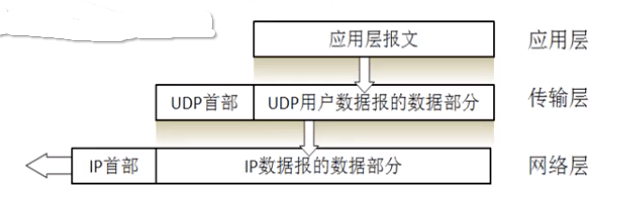
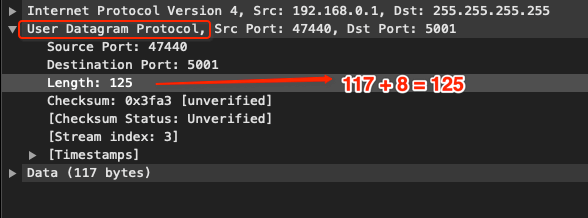
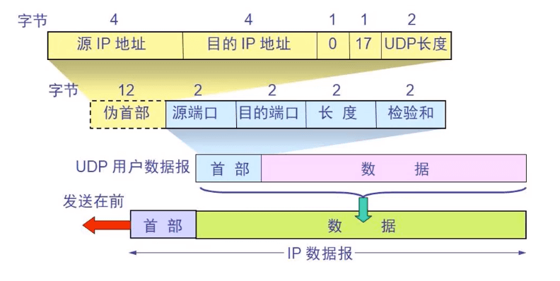
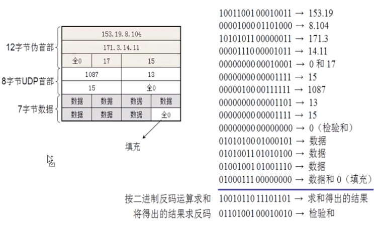

# 传输层 - UDP

<br>

UDP (User Datagram Protocol, 用户数据协议) 是一个面向数据报的传输层通信协议。


## 一、UDP 特点

- UDP 是无连接的，即发送数据之前不需要建立连接(发送数据结束时也没有连接可释放)，减少了开销和发送数据之前的时延

- UDP 使用尽最大努力交付，即不保证可靠交付，主机不需要维持复杂的连接状态表，节省系统资源
- UDP 是面向报文的，发送方的 UDP 对应用程序交下来的报文，在添加首部后就向下交付 IP 层。UDP 对应用层交下来的报文，既不合并，也不拆分，而是保留这些报文的边界。



- UDP 没有拥塞控制，网络出现的拥塞不会使源主机的发送速率降低
- UDP 支持一对一、一对多、多对一和多对多的交互通信
- UDP 的首部开销小，只有8个字节，比 TCP 的20个字节的首部要短

<br>

## 二、UDP 首部格式


```
 0      7 8     15 16    23 24    31  
+--------+--------+--------+--------+ 
|     Source      |   Destination   | 
|      Port       |      Port       | 
+--------+--------+--------+--------+ 
|                 |                 | 
|     Length      |    Checksum     | 
+--------+--------+--------+--------+ 
|                                     
|          data octets ...            
+---------------- ...                 

     User Datagram Header Format
```

UDP 首部共占用 8 个字节，由 4 个字段组成，每个字段占用 2 个字节。

- Source Port : 源端口号，由于UDP不需要应答，所以源端口是可选的，如果源端口不用，那么置为零。

- Destination Port： 目标端口，在终点交付报文的时候需要用到。
- Length：长度，这里指首部和数据部分长度之和，最小是 8 字节(只有首部)。
- Checksum：检验和，检测UDP数据报在传输中是否有错，有错则丢弃。该字段是可选的，当源主机不想计算校验和，则直接令该字段全为 0。




<br>

## 三、UDP 检验和

### 0x01 伪首部

在计算校验和的时候，需要在 UDP 数据报之前增加 12 字节的伪首部，伪首部并不是 UDP 真正的首部。只是在计算校验和，临时添加在 UDP 数据报的前面，得到一个临时的 UDP 数据报。校验和就是按照这个临时的 UDP 数据报计算的。

**伪首部既不向下传送也不向上递交，而仅仅是为了计算校验和**。这样的校验和，既检查了 UDP 数据报，又对 IP 数据报的源 IP 地址和目的 IP 地址进行了检验。

```
 0      7 8     15 16    23 24    31 
+--------+--------+--------+--------+
|          source address           |
+--------+--------+--------+--------+
|        destination address        |
+--------+--------+--------+--------+
|  zero  |protocol|   UDP length    |
+--------+--------+--------+--------+

            Pseudo Header
```




### 0x02 计算检验和

UDP 的校验和是把首部和数据部分一起校验。



发送方首先是把全零放入校验和字段并且添加伪首部，然后把 UDP 数据报看成是由许多 16 位的子串连接起来，若 UDP 数据报的数据部分不是偶数个字节，则要在数据部分末尾增加一个全零字节（此字节不发送），接下来就按照二进制反码计算出这些 16 位字的和。将此和的二进制反码写入校验和字段。

在接收方把收到得 UDP 数据报加上伪首部（如果不为偶数个字节，还需要补上全零字节）后，按二进制反码计算出这些 16 位字的和。当无差错时其结果全为 1。否则就表明有差错出现，接收方应该丢弃这个 UDP 数据报。

<br>

参考：

- [UDP协议的详细解析](https://www.cnblogs.com/lijunji/p/11537092.html)

<br>