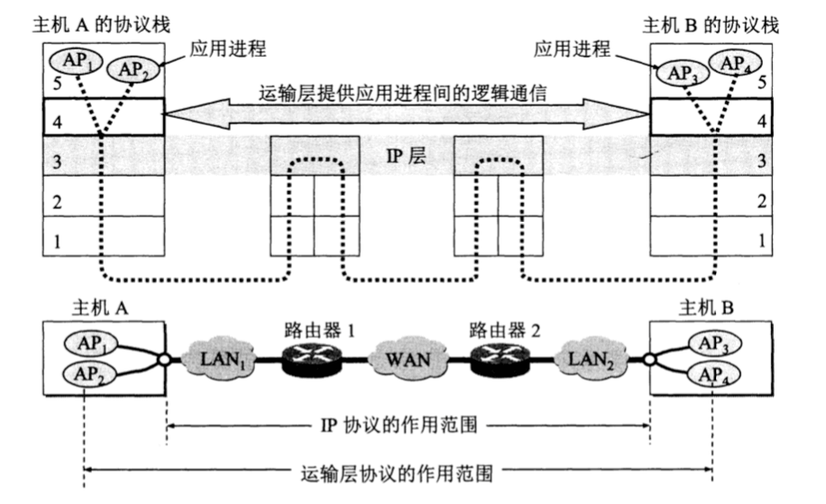
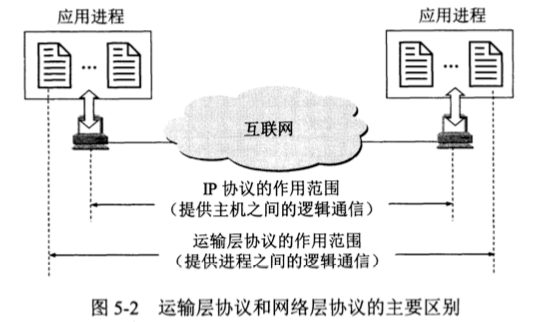

# 传输层 - 概述

 

## 一、进程之间通信

从通信和信息处理的角度看，传输层向它上面的应用层提供通信服务，它属于面向通信部分的最高层，同时也是用户功能中的最底层。当网络的边缘部分中的两台主机使用网络的核心部分的功能进行端到端通信时，只有主机的协议栈才有传输层，而网络核心部分中的路由器在转发分组时都只用到下三层 (网络层、数据链路层、物理层)的功能。

### 0x01 为什么需要传输层？

如上图，局域网 LAN1 中的主机 A 和 局域网 LAN2 中的主机 B 通过广域网 WAN 相互通信。网络层协议能够把主机 A 发送的报文分片，按照首部中的目标 IP 地址发送到主机 B。这已经实现通信，那我们为什么还需要传输层呢？

从网络层来说，通信的双方是两台主机，网络层首部中明确的标出了这两台主机的 IP 地址。但实际上进行通信的是主机中的进程，是 A 中的某个进程和 B 中的某个进程在交换数据。也就是说网络层虽然能把数据送到目的主机，但这个数据仍然在网络层，并没有把数据交付给主机的某个进程。

而传输层首部中的目标端口，指出了数据应该交付给主机的哪个进程。也就是说传输层指出通信的真正端点并不是主机而是主机中的进程。

### 0x02 传输层作用

实际使用中，一台主机经常有多个应用进程同时分别和另一台主机中的多个应用进程通信。如上图中的主机 A 的应用程序 AP1 和主机 B 的应用程序 AP3 通信，同时主机 A 的应用程序 AP2 和主机 B 的应用程序 AP4 也在通信。这表明传输层有个很重要的功能： 复用和分用。

- 复用 (multiplexing)：指发送方不同的应用进程都可以使用同一个传输层协议传送数据(首部不同)。

- 分用 (demultiplexing)：指接收方的传输层在剥去报文的首部后能把数据部分正确的交付给目的应用进程。

### 0x03 逻辑通信

逻辑通信：从应用层看，只要把应用层报文交付给下面的传输层，传输层就可以把报文传送到对方的传输层。好像这种通信是沿水平方向直接传送数据 (上图中的双向粗箭头)。但实际上两个传输层之间没有水平方向的物理连接，数据的传送是沿图中的虚线方向传送的。

网络层为主机之间提供逻辑通信，传输层为应用程序之间提供端到端的逻辑通信。

传输层向高层用户屏蔽了下面的网络核心细节，它使应用进程看见的就是好像两个传输层之间有一条端到端逻辑通信通道，但这条通道对上层的表现却因传输层使用不同协议而有很大的差异。

- 当传输层采用 TCP 协议时，尽管下面的网络是不可靠的，但这种逻辑通信通道就相当于一条全双工可靠信道。

- 当传输层采用 UDP 协议时，这种逻辑通信通道仍然时一条不可靠的信道。

 

## 二、TCP、UDP

UDP (User Datagram Protocol) 用户数据协议，不需要建立连接，只保证尽可能的传送数据。

TCP (Transimission Control Protocol) 传输控制协议，提供面向连接、可靠的服务。因此增加了需要不可避免的开销，如确认、流量控制、计时器、连接管理等。

使用 TCP 和 UDP 协议的各种应用和应用层协议

| 应用 | 应用层协议 | 传输层协议 |
| ---- | ---- | ---- |
| 域名转换 | DNS (域名系统) | UDP |
| 文件传送 | TFTP (简单文件传送协议) | UDP |
| 路由选择协议 | RIP (路由信息协议) | UDP |
| IP 地址配置 | DHCP (动态主机配置协议) | UDP |
| 网络管理 | SNMP (简单网络管理协议) | UDP |
| 远程文件服务器 | NFS (网络文件系统) | UDP |
| IP 电话 | 专用协议 | UDP |
| 流式多媒体通信 | 专用协议 | UDP |
| 多播 | IGMP (网际组管理协议) | UDP |
| 电子邮件 | SMTP (简单邮件传送协议) | TCP |
| 远程终端接入 | TELNET (远程终端协议) | TCP |
| 万维网 | HTTP (超文本传输协议) | TCP |
| 文件传送 | FTP (文件传送协议) | TCP |
| 屏幕共享 | RDP (远程桌面协议) | TCP |

 

## 三、端口

上面说到传输层两个很重要的功能：复用和分用。分用是指传输层收到网络层发送给各个应用进程的数据后，必须分别交付给指明的各个应用进程。因此给应用层的每个应用程序赋予一个特殊标志是至关重要的。

解决这个问题办法就是在传输层使用协议端口号 (protocol port number)，简称端口 (port)。虽然通信的终点是应用进程，但只要把所传送的报文交到目的主机的某个合适的端口，剩下的工作就有 TCP 或 UDP 完成。

由此可见，两个主机的进程要相互通信，不仅要知道对方的 IP 地址(为了找到对方的主机)，还要知道对方的端口号(为了找到对方主机的应用进程)。**端口号只具有本地意义，它是为了标志计算机应用层中各个进程在和传输层交互时的层间接口。**

### 0x01 服务器使用的端口号

- 熟知端口号 (well-know port number，也叫系统端口号)，数值为 0 ~ 1023。IANA 把这些端口号指派给 TCP/IP 最重要的一些应该程序，让所有用户都知道。

常用应用程序的默认端口号

| 应用程序 | FTP | TELNET | SMTP | DNS | TFTP | HTTP | POP3 | SNMP | SNMP(trap) | HTTPS |
| ---- | ---- | ---- | ---- | ---- | ---- | ---- | ---- | ---- | ---- | ---- |
| 默认端口 | 21 | 23 | 25 | 53 | 69 | 80 | 110 | 161 | 162 | 443 |

- 登记端口号 数值为 1024 ~ 49151。使用这些端口号必须在 IANA 按照规定登记，以防止重复。

### 0x02 客户端使用的端口号

客户端口号的数值为 49152 ~ 65535。由于这类端口号仅在客户进程运行时才动态选择，通信结束时客户端口号就不复存在，因此也叫短暂端口号。

客户进程并不在操作系统给它分配的是哪一个端口号，因为客户进程之所以必须有一个端口号 (在本地主机中必须是唯一的)，是为了让传输层的实体能够找到自己。而系统端口不同，服务器一旦连通电源，服务器上的程序就运行起来，为了让互联网上的所有客户程序都能找到服务器程序，服务器程序所使用的的端口就必须是固定的，且是众所周知的。

 

 