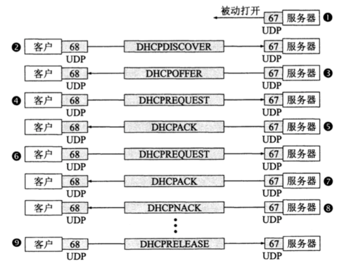
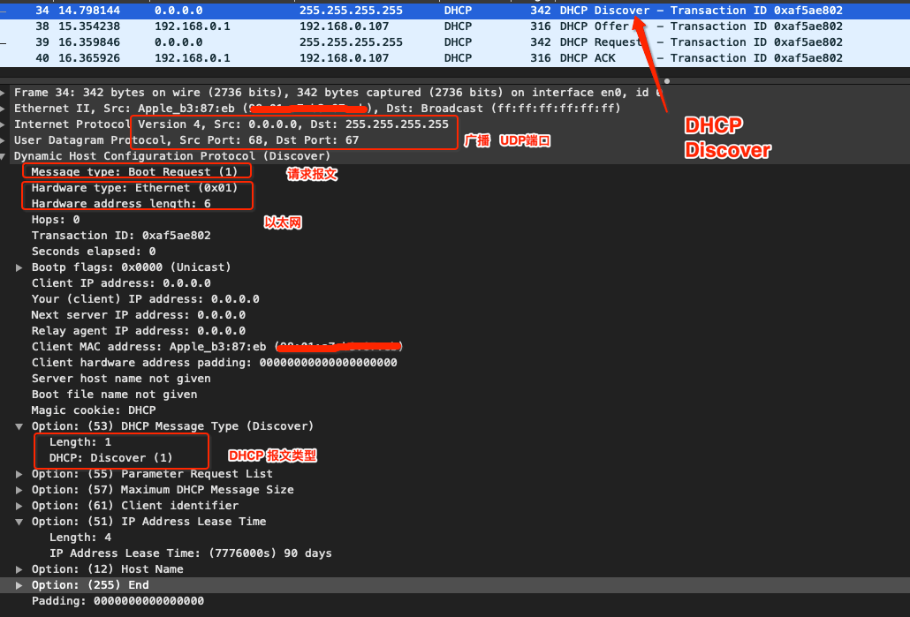
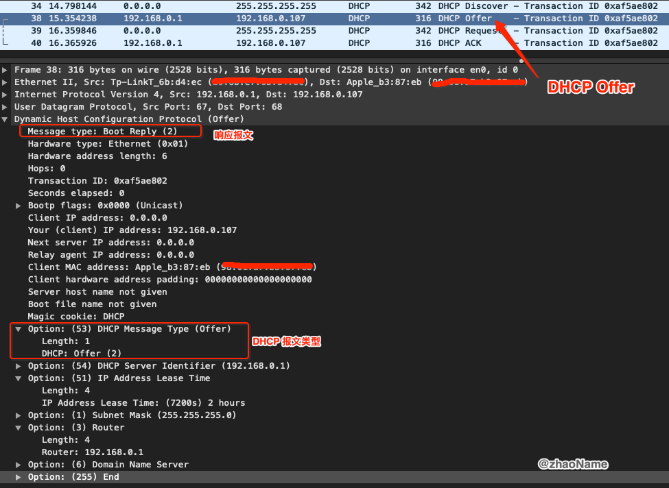
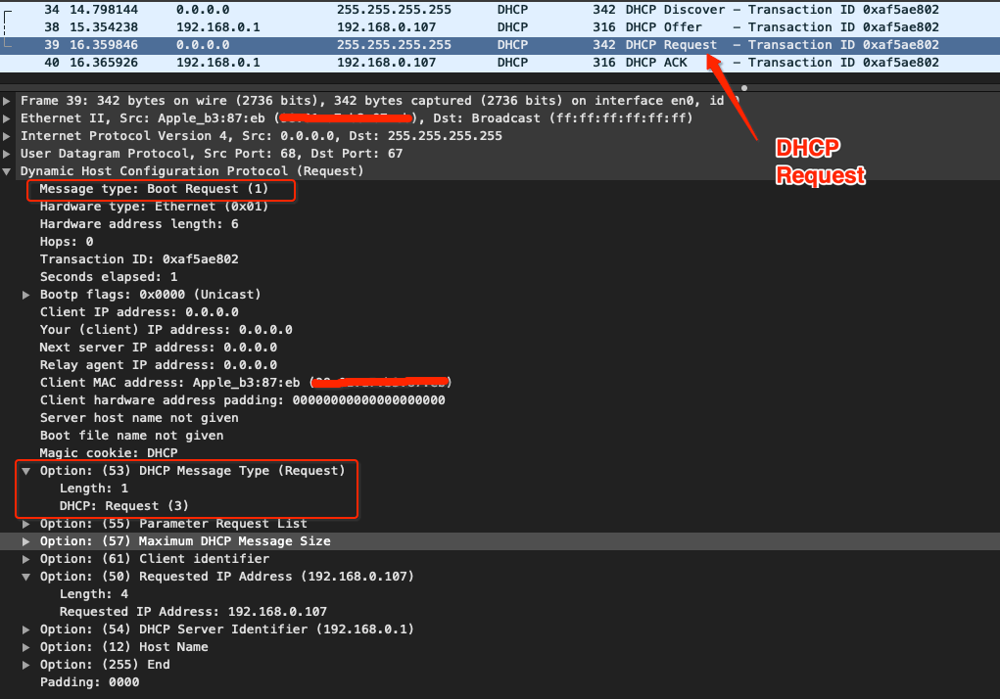
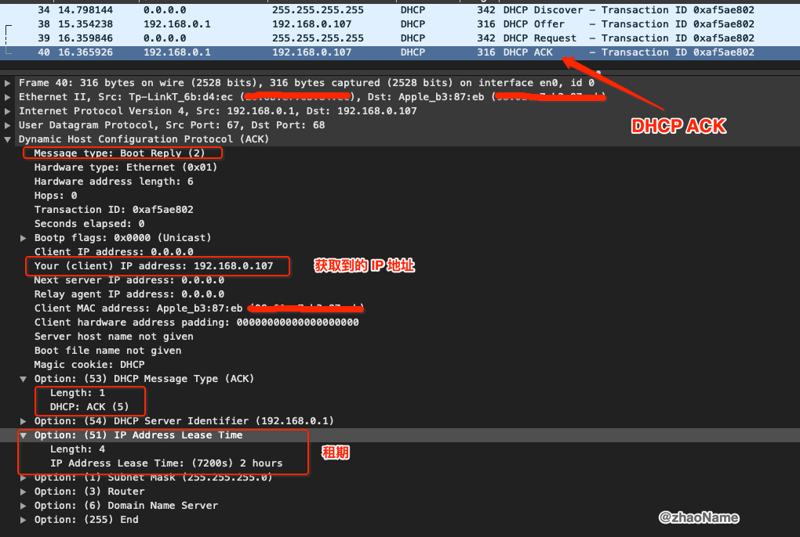
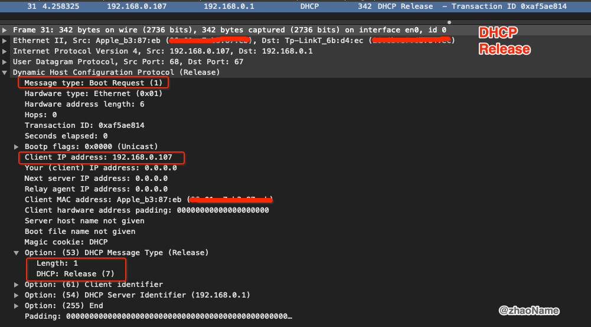

# 应用层 - DHCP

<br>


DHCP (Dynamic Host Configuration Protocol) 动态主机配置协议，前身是 BOOTP 协议。它是一个应用层协议，借助 UDP 协议工作。DHCP 客户端使用 UDP 68 端口，DHCP 服务端使用 UDP 67 端口。DHCP 通常被用于局域网环境，主要作用是集中的管理、分配IP地址，使 client 动态的获得 IP 地址、Gateway 地址、DNS 服务器地址等信息，并能够提升地址的使用率。

### 0x01 为什么使用 DHCP？

基于 TCP/IP 的网络上的每个设备都必须具有唯一的单播 IP 地址，才能访问网络及其资源。 如果没有 DHCP，必须手动配置从一个子网移到另一个子网的新计算机或计算机的 IP 地址;必须手动回收从网络中删除的计算机的 IP 地址。这样既麻烦且容易出错。

对于 DHCP，这整个过程是自动进行的，并集中管理。 DHCP 服务器维护 IP 地址池，并在网络上启动时为任何启用了 DHCP 的客户端租用一个地址。 由于 IP 地址是动态的 (租赁) 而不是静态 (永久分配) ，因此不再使用的地址会自动返回到池中进行重新分配。

DHCP 的优点

- 可靠的 IP 地址配置。 DHCP 最大程度地减少了由手动 IP 地址配置（如录入错误）导致的配置错误，或将 IP 地址分配给多台计算机时导致的地址冲突。

- 降低了网络管理。 DHCP 包含以下功能来减少网络管理：
	- 集中式和自动 TCP/IP 配置。
	- 能够从一个中心位置定义 TCP/IP 配置。
	- 通过 DHCP 选项分配其他所有 TCP/IP 配置值的功能。
	- 有效地处理必须经常更新的客户端的 IP 地址更改，例如，移动到无线网络上不同位置的便携设备的 IP 地址更改。
	- 使用 DHCP 中继代理转发初始 DHCP 消息，这样就无需在每个子网上使用 DHCP 服务器。


### 0x02 DHCP 报文格式

```
DHCP format

	0                   1                   2                   3
   0 1 2 3 4 5 6 7 8 9 0 1 2 3 4 5 6 7 8 9 0 1 2 3 4 5 6 7 8 9 0 1
   +-+-+-+-+-+-+-+-+-+-+-+-+-+-+-+-+-+-+-+-+-+-+-+-+-+-+-+-+-+-+-+-+
   |     op (1)    |   htype (1)   |   hlen (1)    |   hops (1)    |
   +---------------+---------------+---------------+---------------+
   |                            xid (4)                            |
   +-------------------------------+-------------------------------+
   |           secs (2)            |           flags (2)           |
   +-------------------------------+-------------------------------+
   |                          ciaddr  (4)                          |
   +---------------------------------------------------------------+
   |                          yiaddr  (4)                          |
   +---------------------------------------------------------------+
   |                          siaddr  (4)                          |
   +---------------------------------------------------------------+
   |                          giaddr  (4)                          |
   +---------------------------------------------------------------+
   |                                                               |
   |                          chaddr  (16)                         |
   |                                                               |
   |                                                               |
   +---------------------------------------------------------------+
   |                                                               |
   |                          sname   (64)                         |
   +---------------------------------------------------------------+
   |                                                               |
   |                          file    (128)                        |
   +---------------------------------------------------------------+
   |                                                               |
   |                          options (variable)                   |
   +---------------------------------------------------------------+
```


- op：报文的操作类型。分为请求报文和响应报文。1：请求报文，2：应答报文
	- 请求报文：DHCP Discover、DHCP Request、DHCP Release、DHCP Inform和DHCP Decline。
	- 应答报文：DHCP Offer、DHCP ACK和DHCP NAK。

- htype：DHCP 客户端的 MAC 地址类型。MAC 地址类型其实是指明网络类型。htype 值为 1 时表示为最常见的以太网 MAC 地址类型。
- hlen：DHCP 客户端的 MAC 地址长度。以太网 MAC 地址长度为6个字节
- hops：DHCP 报文经过的 DHCP 中继的数目，默认为 0。DHCP 请求报文每经过一个 DHCP 中继，该字段就会增加 1。没有经过 DHCP 中继时值为0。(若数据包需经过 router 传送，每站加 1，若在同一网内为 0。)
- xid：客户端通过 DHCP Discover 报文发起一次 IP 地址请求时选择的随机数，相当于请求标识。用来标识一次IP地址请求过程。在一次请求中所有报文的 Xid 都是一样的。
- secs：DHCP 客户端从获取到 IP 地址或者续约过程开始到现在所消耗的时间，以秒为单位。在没有获得 IP 地址前该字段始终为0。(DHCP客户端开始DHCP请求后所经过的时间。目前尚未使用，固定为0。)
- flags：标志位，只使用第 0 比特位，是广播应答标识位，用来标识 DHCP 服务器应答报文是采用单播还是广播发送，0 表示采用单播发送方式，1 表示采用广播发送方式。其余位尚未使用。(即从 0-15 bits，最左 1bit 为 1 时表示 server 将以广播方式传送封包给 client。)
	- 注意：在客户端正式分配了 IP 地址之前的第一次 IP 地址请求过程中，所有 DHCP 报文都是以广播方式发送的，包括客户端发送的 DHCP Discover 和 DHCP Request 报文，以及 DHCP 服务器发送的 DHCP Offer、DHCP ACK 和 DHCP NAK 报文。当然，如果是由 DHCP 中继器转的报文，则都是以单播方式发送的。另外 IP 地址续约、IP 地址释放的相关报文都是采用单播方式进行发送的。
- ciaddr：DHCP 客户端的 IP 地址。仅在 DHCP 服务器发送的 ACK 报文中显示，因为在得到DHCP 服务器确认前，DHCP 客户端是还没有分配到 IP 地址的。在其他报文中均显示，只有客户端是Bound、Renew、Rebinding状态，并且能响应 ARP 请求时，才能被填充。
- yiaddr：DHCP 服务器分配给客户端的 IP 地址。仅在 DHCP 服务器发送的 Offer 和 ACK 报文中显示，其他报文中显示为 0。
- siaddr：下一个为 DHCP 客户端分配 IP 地址等信息的 DHCP 服务器IP地址。仅在DHCP Offer、DHCP ACK 报文中显示，其他报文中显示为 0。(用于 bootstrap 过程中的IP地址)
一般来说是服务器的 ip 地址。但是注意根据 openwrt 源码给出的注释，当报文的源地址、siaddr、option­>server_id 字段不一致（有经过跨子网转发）时，通常认为 option­>srever_id 字段为真正的服务器 ip，siaddr 有可能是多次路由跳转中的某一个路由的 IP。
- giaddr：DHCP 客户端发出请求报文后经过的第一个 DHCP 中继的 IP 地址。如果没有经过DHCP 中继，则显示为0。(转发代理（网关）IP地址)
- chaddr：DHCP 客户端的 MAC 地址。在每个报文中都会显示对应 DHCP 客户端的 MAC 地址。
- sname：为 DHCP 客户端分配 IP 地址的 DHCP 服务器名称（DNS域名格式）。在 Offer 和 ACK报文中显示发送报文的 DHCP 服务器名称，其他报文显示为 0。
- file：DHCP 服务器为 DHCP 客户端指定的启动配置文件名称及路径信息。仅在 DHCP Offer 报文中显示，其他报文中显示为空。
- options：可选项字段，长度可变，格式为"代码+长度+数据"

```
$ ipconfig getpacket en0
op = BOOTREPLY
htype = 1
flags = 0
hlen = 6
hops = 0
xid = 0x2b3b3a7b
secs = 0
ciaddr = 0.0.0.0
yiaddr = 192.168.0.107
siaddr = 0.0.0.0
giaddr = 0.0.0.0
chaddr = xx:xx:xx:xx:xx:eb
sname =
file =
options:
Options count is 7
dhcp_message_type (uint8): ACK 0x5
server_identifier (ip): 192.168.0.1
lease_time (uint32): 0x1c20
subnet_mask (ip): 255.255.255.0
router (ip_mult): {192.168.0.1}
domain_name_server (ip_mult): {192.168.0.1}
end (none):
```


### 0x02 DHCP 报文类型

| 报文类型 | 说明 |
| ---- | ---- |
| Discover (0x01) | DHCP 客户端在请求 IP 地址时并不知道 DHCP 服务器的位置，因此 DHCP 客户端会在本地网络内以广播方式发送 Discover 请求报文，以发现网络中的 DHCP 服务器。所有收到 Discover 报文的 DHCP 服务器都会发送应答报文，DHCP 客户端据此可以知道网络中存在的 DHCP 服务器的位置。 |
| Offer (0x02) | DHCP 服务器收到 Discover 报文后，就会在所配置的地址池中查找一个合适的 IP 地址，加上相应的租约期限和其他配置信息（如网关、DNS 服务器等），构造一个 Offer 报文，发送给 DHCP 客户端，告知用户本服务器可以为其提供 IP 地址。但这个报文只是告诉 DHCP 客户端可以提供IP地址，最终还需要客户端通过ARP来检测该 IP 地址是否重复。 |
| Request (0x03) | DHCP 客户端可能会收到很多 Offer 请求报文，所以必须在这些应答中选择一个。通常是选择第一个 Offer 应答报文的服务器作为自己的目标服务器，并向该服务器发送一个广播的 Request 请求报文，通告选择的服务器，希望获得所分配的 IP 地址。另外，DHCP客户端在成功获取 IP 地址后，在地址使用租期达到 50% 时，会向 DHCP 服务器发送单播 Request 请求报文请求续延租约，如果没有收到 ACK 报文，在租期达到 87.5% 时，会再次发送广播的 Request 请求报文以请求续延租约。 |
| ACK (0x05) | DHCP 服务器收到 Request 请求报文后，根据 Request 报文中携带的用户 MAC来查找有没有相应的租约记录，如果有则发送 ACK 应答报文，通知用户可以使用分配的 IP 地址。 |
| NAK (0x06) | 如果 DHCP 服务器收到 Request 请求报文后，没有发现有相应的租约记录或者由于某些原因无法正常分配 IP 地址，则向 DHCP 客户端发送 NAK 应答报文，通知用户无法分配合适的 IP 地址。 |
| Release (0x07) | 当 DHCP 客户端不再需要使用分配 IP 地址时（一般出现在客户端关机、下线等状况）就会主动向 DHCP 服务器发送 RELEASE 请求报文，告知服务器用户不再需要分配 IP 地址，请求 DHCP 服务器释放对应的 IP 地址。 |
| Decline (0x04) | DHCP 客户端收到 DHCP 服务器 ACK 应答报文后，通过地址冲突检测发现服务器分配的地址冲突或者由于其他原因导致不能使用，则会向 DHCP 服务器发送 Decline 请求报文，通知服务器所分配的 IP 地址不可用，以期获得新的 IP 地址。 |
| Inform (0x08) | DHCP 客户端如果需要从 DHCP 服务器端获取更为详细的配置信息，则向 DHCP 服务器发送 Inform 请求报文；DHCP 服务器在收到该报文后，将根据租约进行查找到相应的配置信息后，向 DHCP 客户端发送 ACK 应答报文。目前基本上不用了。 |


### 0x04 DHCP 工作流程

DHCP 工作流程



- DHCP 服务器被动打开 DUP 67 端口， 等待客户端发来的报文

- DHCP 客户端在请求 IP 地址时并不知道 DHCP 服务器的位置，因此 DHCP 客户端会在本网段中以广播方式发送 Discover 请求报文，以发现网络中的 DHCP 服务器。

	
	
- 所有收到 Discover 报文的 DHCP 服务器，会在所配置的地址池中查找一个合适的 IP 地址，加上相应的租约期限和其他配置信息 (如网关、DNS 服务器等)，构造一个 Offer 报文发送给客户端。

	

- DHCP 客户端可能会收到很多 Offer 请求报文，所以必须在这些应答中选择一个。通常是选择第一个 Offer 应答报文的服务器作为自己的目标服务器，并向该服务器发送一个广播的 Request 请求报文，通告选择的服务器，希望获得所分配的 IP 地址。

	
	
- DHCP 服务器收到 Request 请求报文后，根据 Request 报文中携带的用户 MAC 来查找有没有相应的租约记录，如果有则发送 ACK 应答报文，通知用户可以使用分配的 IP 地址。

	

- DHCP 客户端要根据服务器提供的租期 T 设置两个定时期 T1、T2。T1 = 0.5 T, T2 = 0.875 T。T1 时间到了， DHCP 发送请求报文 Request 要求更新租期。

- DHCP 服务器若同意，则发回 ACK 确认报文。DHCP 客户端得到新的租用期 (IP 很有可能还是原来的 IP 地址)，重置定时器时间。

- 若 DHCP 服务器不同意则发回 NAK 报文，这时客户端必须立即停止原来的 IP 地址，重新申请 (回到步骤 2)。若 DHCP 服务器不响应 Request，租用期到 T2，客户端必须重新发送 Request 报文。

- DHCP 客户端可以提前终止服务器提供的租用期，这时需向 DHCP 服务器发送 Release 报文。

	

### 0x04 更新租约

DHCP 服务器向 DHCP 客户机出租的 IP 地址一般都有一个租借期限，期满后 DHCP 服务器便会收回出租的IP地址。如果 DHCP 客户机要延长其 IP 租约，则必须更新其 IP 租约。

客户端会在租期过去 50% 的时候，直接向为其提供 IP 地址的 DHCP 服务器发送 DHCP request 消息包。如果客户端接收到该服务器回应的 DHCP ack 消息包，客户端就根据包中所提供的新的租期以及其它已经更新的 TCP/IP 参数，更新自己的配置，IP租用更新完成。如果没有收到该服务器的回复，则客户端继续使用现有的 IP 地址，因为当前租期还有50%。

如果在租期过去 50% 的时候没有更新，则客户端将在租期过去 87.5% 的时候再次向为其提供 IP 地址的 DHCP 联系。如果还不成功，到租约的 100% 时候，客户端必须放弃这个IP地址重新申请。

如果此时无 DHCP 可用，客户端会使用 169.254.0.0/16 中随机的一个地址，并且每隔 5 分钟再进行尝试。

<br>


<br>


<br>


<br>

参考：

- [Dynamic Host Configuration Protocol](https://tools.ietf.org/html/rfc2131)

- [DHCP协议详解](https://zhuanlan.zhihu.com/p/265293856)

<br>