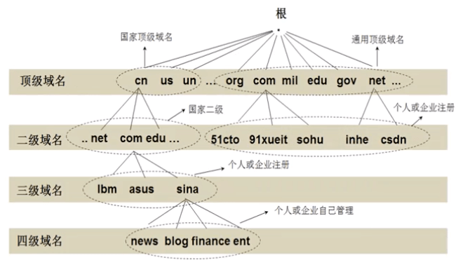
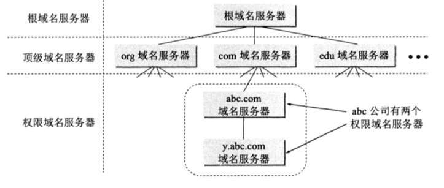
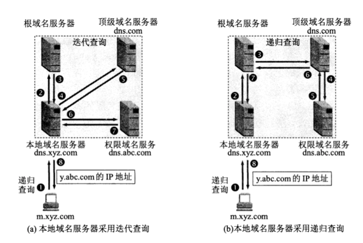
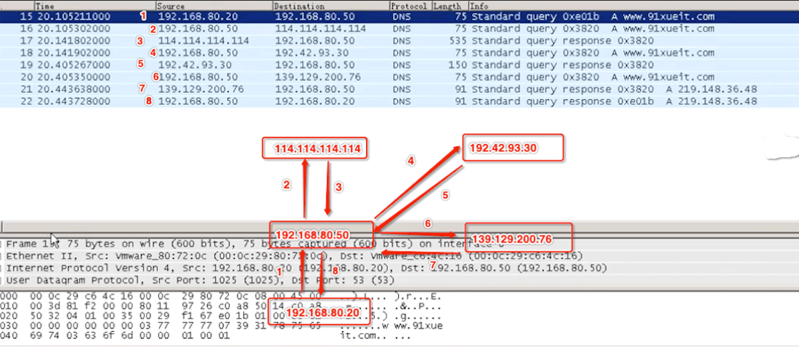
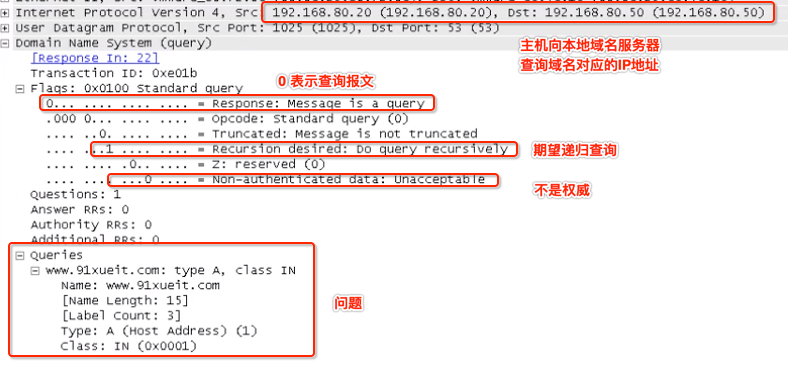
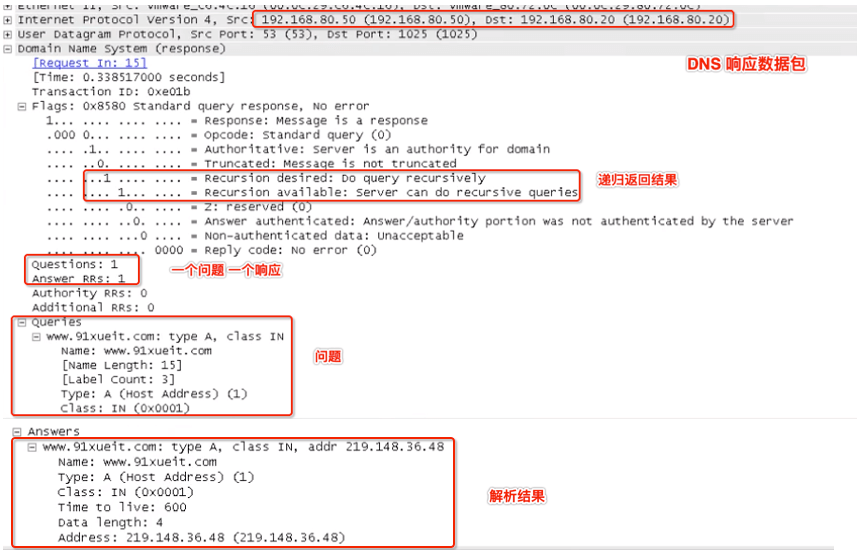
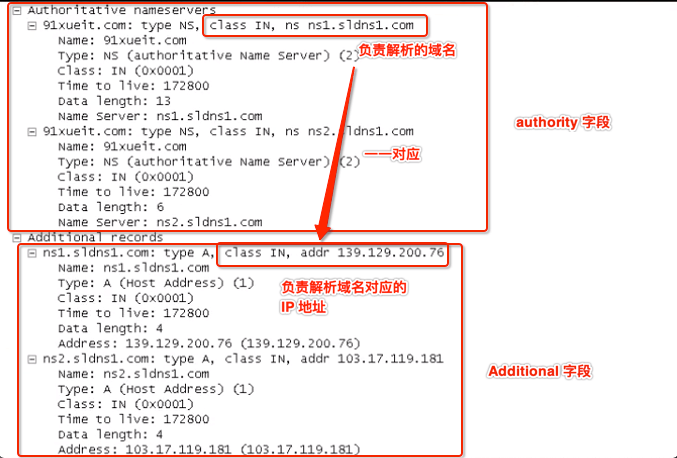

# 应用层 - DNS
 
<br> 

## 一、DNS

### 0x01 什么是域名

用户和互联网某天主机通信时，必须知道对方的 IP 地址。然后用户很难记住长达 32 位的主机地址，即使是点分十进制 IP 地址也不方便记忆。这时引入了便于人们使用的域名系统。

DNS (Domain Name System) 域名系统是互联网上作为域名和 IP 地址相互映射的一个分布式数据库，能够把互联网上的主机名转换为 IP 地址。

变长的域名和使用有助于记忆的字符串，是为了便于人们使用，而定长的 32 位二进制数字的 IP 地址则有利于机器进行处理。

域名和 IP 地址不是一对一的关系，一个域名可以对应多个 IP 地址，比如说 baidu.com，若 baidu.com 只对应一个 IP 地址，这么多人访问百度，那服务将直接爆炸。

```
## 解析 baidu.com 域名，对应两个 IP 地址
$ nslookup baidu.com
Server:		192.168.1.1
Address:	192.168.1.1

Non-authoritative answer:
Name:	baidu.com
Address: 39.156.69.79
Name:	baidu.com
Address: 220.181.38.148
```

### 0x02 域名的层次结构

DNS 规定域名中的符号都由英文字母和数字组成，不区分大小写。级别最低的域名写在最左边，级别最高的顶级域名写在最右边，且完整域名总共不超过 255 个字符。



所有域名都必须带根域名 "." ，但通常忽略，由系统拼接上。如 www.example.com 完整的域名是 www.example.com.

### 0x03 DNS 服务器



- 根域名服务器 (root name server)：最高层次的域名服务器，所有的根域名服务器都知道所有的顶级域名服务器的域名和 IP 地址。

- 顶级域名服务器 (top level domain server)：管理着在该顶级域名服务器注册的所有二级域名

- 权限域名服务器 (authoritative name server)：用来保护该区中所有主机的域名到 IP 地址的映射。

- 本地域名服务器：也称默认域名服务器，Mac 电脑在 网络偏好设置 --> 高级 --> DNS 中可以查看 DNS 服务器的 IP 地址。这个 DNS 服务器及时本地域名服务器。

<br> 

## 二、域名解析过程

主机向本地域名服务器的查询一般是递归查询 (recursive query)，本地域名服务器向根域名服务器的查询一般是迭代查询 (iterative query)。

递归查询：若主机所询问的本地域名服务器不知道被查询的 IP 地址，那么本地域名服务器就以 DNS 客户的身份，向其他根域名服务器发出查询报文，而不是该主机进行下一步查询。

迭代查询：当根域名服务器收到本地域名服务器发出的迭代查询请求后，要么给出所要查询的 IP 地址，要么告诉本地域名服务器自己所知道的顶级域名服务器的 IP 地址。然后本地域名服务器向顶级域名服务器发出查询请求。本地域名服务器就这样本地进行查询迭代。



如上图 (a) 假设域名为 m.xyz.com 的主机想知道另一台主机 (y.abc.com) 的 IP 地址 (忽略缓存)

- 主机 m.xyz.com 先向本地域名服务器 dns.xyz.com 进行递归查询 (本地域名服务器缓存中有，会直接返回对应的 IP 地址)

- 本地域名服务器采用迭代查询，先向根域名服务器发出查询 dns.xyz.com 对应 IP 地址的请求
- 根域名服务器会告诉本地域名服务器自己所知道的 dns.com 顶级域名服务器对应的 IP 地址
- 本地域名服务器知道顶级域名服务器 IP 地址，就会向其发出查询  dns.xyz.com 对应 IP 地址的请求
- 顶级域名服务器 dns.com 告诉本地域名服务器，下一次应查询权限域名服务器 dns.abc.com 的 IP 地址
- 本地域名服务器向权限域名服务器 dns.abc.com 进行查询
- 权限域名服务器 dns.abc.com 告诉本地域名服务器，所查询主机的 IP 地址
- 本地域名服务器将查询的结果告诉主机 m.xyz.com (并缓存到本地)




命令查看域名解析过程 

```
$ dig +trace www.baidu.com

; <<>> DiG 9.10.6 <<>> +trace www.baidu.com
;; global options: +cmd
.			2393	IN	NS	h.root-servers.net.
.			2393	IN	NS	j.root-servers.net.
.			2393	IN	NS	c.root-servers.net.
.			2393	IN	NS	e.root-servers.net.
.			2393	IN	NS	l.root-servers.net.
.			2393	IN	NS	i.root-servers.net.
.			2393	IN	NS	k.root-servers.net.
.			2393	IN	NS	d.root-servers.net.
.			2393	IN	NS	b.root-servers.net.
.			2393	IN	NS	f.root-servers.net.
.			2393	IN	NS	g.root-servers.net.
.			2393	IN	NS	m.root-servers.net.
.			2393	IN	NS	a.root-servers.net.
;; Received 239 bytes from 192.168.0.1#53(192.168.0.1) in 15 ms

com.			172800	IN	NS	m.gtld-servers.net.
com.			172800	IN	NS	b.gtld-servers.net.
com.			172800	IN	NS	l.gtld-servers.net.
com.			172800	IN	NS	f.gtld-servers.net.
com.			172800	IN	NS	e.gtld-servers.net.
com.			172800	IN	NS	c.gtld-servers.net.
com.			172800	IN	NS	h.gtld-servers.net.
com.			172800	IN	NS	j.gtld-servers.net.
com.			172800	IN	NS	g.gtld-servers.net.
com.			172800	IN	NS	d.gtld-servers.net.
com.			172800	IN	NS	i.gtld-servers.net.
com.			172800	IN	NS	a.gtld-servers.net.
com.			172800	IN	NS	k.gtld-servers.net.
com.			86400	IN	DS	30909 8 2 E2D3C916F6DEEAC73294E8268FB5885044A833FC5459588F4A9184CF C41A5766
com.			86400	IN	RRSIG	DS 8 1 86400 20210328050000 20210315040000 42351
;; Received 1173 bytes from 202.12.27.33#53(m.root-servers.net) in 83 ms

baidu.com.		172800	IN	NS	ns2.baidu.com.
baidu.com.		172800	IN	NS	ns3.baidu.com.
baidu.com.		172800	IN	NS	ns4.baidu.com.
baidu.com.		172800	IN	NS	ns1.baidu.com.
baidu.com.		172800	IN	NS	ns7.baidu.com.
CK0POJMG874LJREF7EFN8430QVIT8BSM.com. 86400 IN NSEC3 1 1 0 - CK0Q1GIN43N1ARRC9OSM6QPQR81H5M9A  NS SOA RRSIG DNSKEY NSEC3PARAM
CK0POJMG874LJREF7EFN8430QVIT8BSM.com. 86400 IN RRSIG NSEC3 8 2 86400 
HPVUSBDNI26UDNIV6R0SV14GC3KGR4JP.com. 86400 IN NSEC3 1 1 0 - HPVVN3Q5E5GOQP2QFE2LEM4SVB9C0SJ6  NS DS RRSIG
HPVUSBDNI26UDNIV6R0SV14GC3KGR4JP.com. 86400 IN RRSIG NSEC3 8 2 86400 20210321071459 20210314060459 58540 com. 
;; Received 761 bytes from 192.48.79.30#53(j.gtld-servers.net) in 244 ms

www.baidu.com.		1200	IN	CNAME	www.a.shifen.com.
a.shifen.com.		1200	IN	NS	ns5.a.shifen.com.
a.shifen.com.		1200	IN	NS	ns1.a.shifen.com.
a.shifen.com.		1200	IN	NS	ns2.a.shifen.com.
a.shifen.com.		1200	IN	NS	ns3.a.shifen.com.
a.shifen.com.		1200	IN	NS	ns4.a.shifen.com.
;; Received 239 bytes from 220.181.33.31#53(ns2.baidu.com) in 31 ms
```

<br> 

## 三、DNS 数据报格式

DNS 报文格式，不论是请求报文，还是 DNS 服务器返回的应答报文，都使用统一的格式。

```
  DNS format

  +--+--+--+--+--+--+--+
  |        Header      |  固定 12 字节长度
  +--+--+--+--+--+--+--+
  |      Question      |  长度可变
  +--+--+--+--+--+--+--+
  |      Answer        |  长度可变
  +--+--+--+--+--+--+--+
  |      Authority     |  长度可变
  +--+--+--+--+--+--+--+
  |      Additional    |  长度可变
  +--+--+--+--+--+--+--+
```
- Header：DNS 报文首部
- Question：查询的问题
- Answer：应答
- Authority：授权应答
- Additional：附加信息


### 0x01 Header

DNS 首部占 12 个字节长度，报文格式如下


```
  Header format

    0  1  2  3  4  5  6  7  0  1  2  3  4  5  6  7
  +--+--+--+--+--+--+--+--+--+--+--+--+--+--+--+--+
  |                      ID                       |
  +--+--+--+--+--+--+--+--+--+--+--+--+--+--+--+--+
  |QR|  opcode   |AA|TC|RD|RA|   Z    |   RCODE   |
  +--+--+--+--+--+--+--+--+--+--+--+--+--+--+--+--+
  |                    QDCOUNT                    |
  +--+--+--+--+--+--+--+--+--+--+--+--+--+--+--+--+
  |                    ANCOUNT                    |
  +--+--+--+--+--+--+--+--+--+--+--+--+--+--+--+--+
  |                    NSCOUNT                    |
  +--+--+--+--+--+--+--+--+--+--+--+--+--+--+--+--+
  |                    ARCOUNT                    |
  +--+--+--+--+--+--+--+--+--+--+--+--+--+--+--+--+
```

- ID: 2个字节(16bit)，标识字段，客户端会解析服务器返回的DNS应答报文，获取ID值与请求报文设置的ID值做比较，如果相同，则认为是同一个DNS会话。

- FLAGS: 2 个字节 (16bit) 的标志字段。包含以下属性:
	- QR: 0表示查询报文，1表示响应报文;
	
	- opcode: 通常值为 0(标准查询)，其他值为 1(反向查询)和 2(服务器状态请求),[3,15] 保留值;
	- AA: 表示授权回答（authoritative answer）-- 这个比特位在应答的时候才有意义，指出给出应答的服务器是查询域名的授权解析服务器;
	- TC: 表示可截断的（truncated）--用来指出报文比允许的长度还要长，导致被截断;
	- RD: 表示期望递归 (Recursion Desired) -- 这个比特位被请求设置，应答的时候使用的相同的值返回。如果设置了 RD，就建议域名服务器进行递归解析，递归查询的支持是可选的;
	- RA: 表示支持递归 (Recursion Available) --  这个比特位在应答中设置或取消，用来代表服务器是否支持递归查询;
	- Z : 保留值，暂未使用;
	- RCODE: 应答码 (Response code) - 这4个比特位在应答报文中设置，代表的含义如下:
		- 0 : 没有错误。
		
		- 1 : 报文格式错误 (Format error) - 服务器不能理解请求的报文;
		- 2 : 服务器失败 (Server failure) - 因为服务器的原因导致没办法处理这个请求;
		- 3 : 名字错误 (Name Error) - 只有对授权域名解析服务器有意义，指出解析的域名不存在;
		- 4 : 没有实现 (Not Implemented) - 域名服务器不支持查询类型;
		- 5 : 拒绝 (Refused) - 服务器由于设置的策略拒绝给出应答.比如，服务器不希望对某些请求者给出应答，或者服务器不希望进行某些操作 (比如区域传送 zone transfer);
[6,15] : 保留值，暂未使用。

- QDCOUNT: 无符号 16bit 整数表示报文请求段中的问题记录数。
- ANCOUNT: 无符号 16bit 整数表示报文回答段中的回答记录数。
- NSCOUNT: 无符号 16bit 整数表示报文授权段中的授权记录数。
- ARCOUNT: 无符号 16bit 整数表示报文附加段中的附加记录数。

查询报文



响应报文




### 0x02 Question

Question 查询字段报文格式如下

```
Question format

    0  1  2  3  4  5  6  7  0  1  2  3  4  5  6  7
  +--+--+--+--+--+--+--+--+--+--+--+--+--+--+--+--+
  |                     ...                       |
  |                    QNAME                      |
  |                     ...                       |
  +--+--+--+--+--+--+--+--+--+--+--+--+--+--+--+--+
  |                    QTYPE                      |
  +--+--+--+--+--+--+--+--+--+--+--+--+--+--+--+--+
  |                    QCLASS                     |
  +--+--+--+--+--+--+--+--+--+--+--+--+--+--+--+--+
```

- QNAME: 变长，域名被编码为一些 labels 序列，每个 labels 包含一个字节表示后续字符串长度，以及这个字符串，以 0 长度和空字符串来表示域名结束。注意这个字段可能为奇数字节，不需要进行边界填充对齐。

- QTYPE: 2 字节，表示查询类型，.取值可以为任何可用的类型值，以及通配码来表示所有的资源记录。
- QCLASS: 2 字节，表示查询的协议类，比如，IN代表Internet。


### 0x03 Answer / Authority / Additional

Answer / Authority / Additional 三个字段是 DNS 报文格式中的资源记录部分，即回答问题区域字段、权威名称服务器区域字段、附加信息区域字段。格式统一如下

```
  Answer/Authority/Additional format

    0  1  2  3  4  5  6  7  0  1  2  3  4  5  6  7
  +--+--+--+--+--+--+--+--+--+--+--+--+--+--+--+--+
  |                    NAME                       |
  +--+--+--+--+--+--+--+--+--+--+--+--+--+--+--+--+
  |                    TYPE                       |
  +--+--+--+--+--+--+--+--+--+--+--+--+--+--+--+--+
  |                    CLASS                      |
  +--+--+--+--+--+--+--+--+--+--+--+--+--+--+--+--+
  |                    TTL                        |
  +--+--+--+--+--+--+--+--+--+--+--+--+--+--+--+--+
  |                    RDLENGTH                   |
  +--+--+--+--+--+--+--+--+--+--+--+--+--+--+--+--+
  |                    RDATA                      |
  +--+--+--+--+--+--+--+--+--+--+--+--+--+--+--+--+
```

- NAME: 不定长，资源记录包含的域名.

- TYPE: 2个字节, 表示 DNS 协议的类型.
- CLASS: 2个字节, 表示 RDATA 的类.
- TTL: 4字节, 无符号整数表示资源记录可以缓存的时间。0 代表只能被传输，但是不能被缓存。
- RDLENGTH: 2个字节, 无符号整数表示 RDATA 的长度
- RDATA: 不定长, 字符串来表示记录，格式根 TYPE 和 CLASS 有关。比如，TYPE 是 A，CLASS 是 IN，那么 RDATA 就是一个 4 个字节的 ARPA 网络地址



<br> 

参考：

- [面试官:讲讲DNS的原理？](https://zhuanlan.zhihu.com/p/79350395)

- [DNS 原理入门](https://www.ruanyifeng.com/blog/2016/06/dns.html)

- [DNS 请求报文详解](https://juejin.cn/post/6844903582441963527)

- [DNS报文格式解析（非常详细）](http://c.biancheng.net/view/6457.html)

<br> 