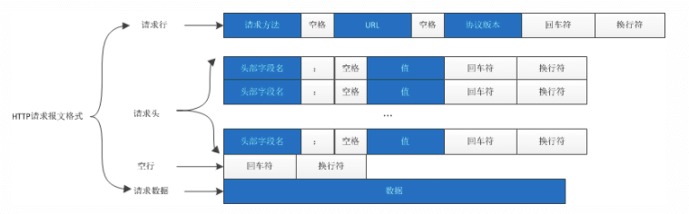
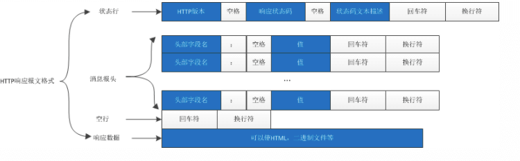

# HTTP

<br>

## 一、HTTP 是什么

HTTP (Hypertext Transfer Protocol) 超文本传输协议 是基于 TCP/IP 的应用层协议，主要规定客户端和服务端的通信格式，默认使用 80 端口。

超文本传输协议可以拆分成：超文本、传输、协议三个词来理解。

首先 HTTP 是一个协议，而协议必须有两个或多个参与者 (若只有一个人，那你想怎么玩就怎么玩)，同时协议也是对参与者的一种约束和规范。所以 HTTP 是一个用在计算机世界里的协议。它使用计算机能够理解的语言确立了一种计算机之间交流通信的规范，以及相关的各种控制和错误处理方式。

传输 (Transfer) 也可以理解为双方在交换信息，即 "A <===> B"。既然在交换信息那就意味着 HTTP 是一个双向协议，通常我们把先发起传输动作的 A 叫做请求方，把后接到传输的 B 叫做应答方或者响应方。

数据虽然在 A 和 B 之间传输，但并没有限制只能有 A 和 B 两个角色，它允许中间有 "中转"。那传输就从 "A <===> B" 变成 "A <===> X <===> Y <===> B"，从 A 到 B 可以有很多中间人。如安全认证、DNS、编码转换等。

HTTP 是一个传输协议，传送的超文本。在互联网早期，文本只是简单的字符文字，但发展到现在 "文本" 已经被大大的扩展了。图片、音频、视频、甚至是压缩包，在 HTTP 眼里都可以算做是“文本”。

所谓"超文本"，就是"超越了普通文本的文本"，它是文字、图片、音频和视频等的混合体，最关键的是含有"超链接"，能够从一个"超文本"跳跃到另一个"超文本"，形成复杂的非线性、网状的结构关系。

**HTTP 是一个在计算机世界里专门在两点之间传输文字、图片、音频、视频等超文本数据的约定和规范。**

**HTTP 不是编程语言，但我们能用编程语言来实现 HTTP，告诉计算机如何用 HTTP 和外界通信。**


<br>

## 二、报文格式

HTTP 协议访问资源是通过 URL（Uniform Resource Locator）统一资源定位符来实现的。URL 的格式如下

```
scheme://host:port/path?query

scheme: 表示协议，如Http, Https, Ftp等；
host: 表示所访问资源所在的主机名：如：www.baidu.com;
port: 表示端口号，默认为80；
path: 表示所访问的资源在目标主机上的储存路径；
query: 表示查询条件；

如： http://www.baidu.com/search?words=Baidu

```

#### 请求报文格式




```
Hypertext Transfer Protocol
    GET /s.gif?l=http://icp.chinaz.com/ HTTP/1.1\r\n
        [Expert Info (Chat/Sequence): GET /s.gif?l=http://icp.chinaz.com/ HTTP/1.1\r\n]
        Request Method: GET
        Request URI: /s.gif?l=http://icp.chinaz.com/
        Request Version: HTTP/1.1
    Host: api.share.baidu.com\r\n
    User-Agent: Mozilla/5.0 (Macintosh; Intel Mac OS X 10_14_6) AppleWebKit/537.36 (KHTML, like Gecko) Chrome/88.0.4324.182 Safari/537.36\r\n
    Accept: image/avif,image/webp,image/apng,image/svg+xml,image/*,*/*;q=0.8\r\n
    Accept-Encoding: gzip, deflate\r\n
    Accept-Language: zh-CN,zh;q=0.9,en;q=0.8,no;q=0.7\r\n
    Referer: http://icp.chinaz.com/\r\n
    \r\n
    [Full request URI: http://api.share.baidu.com/s.gif?l=http://icp.chinaz.com/]
    [HTTP request 1/1]
    [Response in frame: 902]

```

#### 响应报文格式



```
Hypertext Transfer Protocol
    HTTP/1.1 200 OK\r\n
        [Expert Info (Chat/Sequence): HTTP/1.1 200 OK\r\n]
        Response Version: HTTP/1.1
        Status Code: 200
        [Status Code Description: OK]
        Response Phrase: OK
    Content-Encoding: gzip\r\n
    Content-Length: 23\r\n
    Content-Type: image/gif\r\n
    Server: bfe\r\n
    Date: Wed, 24 Mar 2021 15:46:11 GMT\r\n
    \r\n
    [HTTP response 1/1]
    [Time since request: 0.031963000 seconds]
    [Request in frame: 900]
    [Request URI: http://api.share.baidu.com/s.gif?l=http://icp.chinaz.com/]
    Content-encoded entity body (gzip): 23 bytes -> 0 bytes
    File Data: 0 bytes
    [Expert Info (Note/Malformed): HTTP body subdissector failed, trying heuristic subdissector]

```

<br>


<br>

<br>


<br>


<br>


<br>