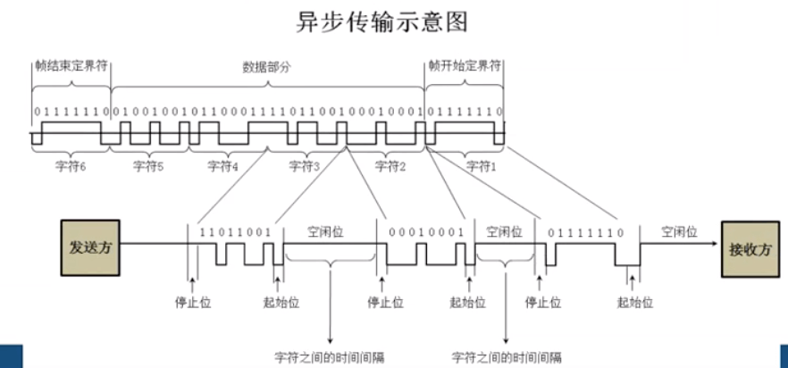

# 数据链路层 - PPP

 

## 一、PPP 协议特点

### 0x01 PPP 协议应满足的要求

- 简单：IETF 将最复杂的结构放在 TCP 协议，IP 协议相对简单，所以数据链路层没有必要设计的比 IP 协议更为复杂。要求在同一条物理链路上进行点对点的数据传输，对数据链路层的帧不进行纠错，不需要序号，不需要流量控制。

- 封装成帧：PPP 协议必须使用特定的字符作为帧定界符（即一个帧的开始和结束的字符）
- 透明性：PPP 协议必须保证数据传输的透明性。也就是说若数据中刚好出现和帧定界符一样的比特组合，要能采取有效的方法解决这个问题。
- 多种网络层协议：PPP 协议必须能够在同一条物理链路上同时支持多种网络层协议 (如 IP 或 IPX 等) 的运行。
- 多种类型链路：PPP 必须能够在多种类型的链路上运行，如串行的、并行的、同步的、异步的、低速的或高速的点对点链路。
- 差错检验：PPP 协议必须能够对接收端收到的帧进行差错检验，并立即丢弃有差错的帧。
- 检测连接状态：PPP 协议必须有种能够及时自动检测出链路是否处于正常状态的机制。
- 最大传输单元：PPP 协议必须对每一种类型的点对点链路设置最大传输单元 MTU 的标准默认值
- 网络层地址协商：PPP 协议必须提供一种机制使通信的两个网络层的实体能够通过协商知道或能够配置彼此的网络地址。
- 数据压缩协商：PPP 协议必须提供一种方法来协商使用的数据压缩算法。
- PPP 协议只支持全双工通信

### 0x02 PPP 协议组成

- 将 IP 数据封装到串行链路的方法 (HDLC)

- 用来建立、配置和测试数据链路连接的链路控制协议 LCP (Link Control Protocol)
- 网络控制协议 NCP (Network Control Procotol)，其中每一个协议支持不同的网络层协议

 

## 二、传输方式

### 0x01 同步传输

同步传输 (Synchronous Transmission) 以数据帧为单位传输数据，可采用字符形式或位组合形式的同步信号。在短距离的高速传输中，该时钟信号可由专门的时钟线路传输，由发送端或接收端提供专用于同步的时钟信号。

计算机网络采用同步传输方式时，常将时钟同步信号植入信号帧中，以实现接收端与发送端的时钟同步。

### 0x02 异步传输

异步传输 (Asynchronous Transmission) 以字符为单位传输数据，发送端和接收端具有相互独立的时钟，并且两者中任一方都不向对方提供时钟同步信号。

 

## 三、PPP 帧格式

### 0x01 帧格式

PPP 帧的首部和尾部分别为四个字段和两个字段

- 0x7E (二进制 0111 1110) PPP 帧的界定符，标志一个帧的开始或结束

- 首部中的 0xFF 和 0x03 保留字段，至今没有携带 PPP 帧的信息
- 首部中的协议标识数据部分是什么协议的数据，若值为 0x0021 则 PPP 帧的信息字段就是 IP 数据报
- 信息部分为可变的，不超过 1500 字节
- 尾部中的第一个字段是使用 CRC 的帧检验序列 FCS

常用几种 Procotol 取值

| Procotol | 0x0021 | 0x8021 | 0xc021 | 0xc023 | 0xc223 |
| ---- | ---- | ---- | ---- | ---- | ---- |
| 信息字段 | IP数据报 | 网络控制数据NCP | 链路控制数据LCP | 安全性认证PAP | 安全性认证CHAP |

抓包工具获取的内容都是经过网卡去掉帧定界符和差错检验后，提交给上层的数据。所以只能看到 PPP 协议的首部。

### 0x02 PPP 协议透明传输填充方式

当 PPP 协议使用异步传输时，采用字节填充方式保证透明传输

- PPP 帧定义的转义字符为 0x7D

- 把信息字段中出现的每一个 0x7E 转变成 2 字节序列 (0x7D，0x5E)
- 若信息字段中出现 0x7D 的字节，则把 0x7D 转变成 2 字节序列 (0x7D，0x5E)
- 若信息字段中出现 ASCII 码的控制字符，则在该字符前添加一个 0x7D 字节，同时将该字符的编码加以改变。如 0x03 转变为 0x7D, 0x23

 

当 PPP 协议使用同步传输时，采用零比特填充方式保证透明传输

- PPP 协议的帧界定符 0x7E 写成二进制为 0111 1110，也就是说只要想办法在数据部分不出现连续的 6 个 1，就肯定不会出现帧界定符。

- 在发送端扫描整个信息字段，只要发现 5 个连续的 1，就立即插入一个 0
- 在接收端用硬件对比特流进行扫描，每发现 5 个连续的 1，就把 5 个连续的 1 后面的 0 删除

 

### 0x03 PPP 协议工作状态

 
 
- 链路静止 (Link Dead)：PPP 链路的起始和终止状态，这时在个人主机和 ISP 的路由器之间并不存在物理层的连接

- 链路建立 (Link Establish)：目的是建立链路层的 LCP 连接
- LCP 配置协商，即发送 LCP 的配置请求 (Configure-Requesqt)
	- 配置确认帧 (Configure-Ack)
	- 配置否认帧 (Configure-Nak)
	- 配置拒绝帧 (Configure-Reject)
- 鉴别 (Authenticate) ：协商结束后双方建立 LCP 链路，接着进入 Authenticate 状态
- 网络层状态：PPP 链路两端的网络控制协议 NCP 根据网络层的不同协议互相交换网络层特定的网络控制分组。
- 链路打开 (Link Open)：链路的两个 PPP 端点可以彼此向对方发送分组，两个端点还可发送会送请求 LCP 分组 (Echo-Request) 和回送回答 LCP 分组 (Echo-Reply)，以检查链路的状态
- 链路终止：数据传输结束后，可以由链路的一端发送终止请求 LCP 分组 (Terminate-Request)请求终止链路连接，在收到对方发来的终止确认 LCP 分组 (Terminate-Ack) 后 ，转到 "链路终止" 状态。

 

 

参考

- [The Point-to-Point Protocol (PPP)](https://tools.ietf.org/html/rfc1661)

- [PPP协议实例详解](https://www.qingsword.com/qing/661.html)

 