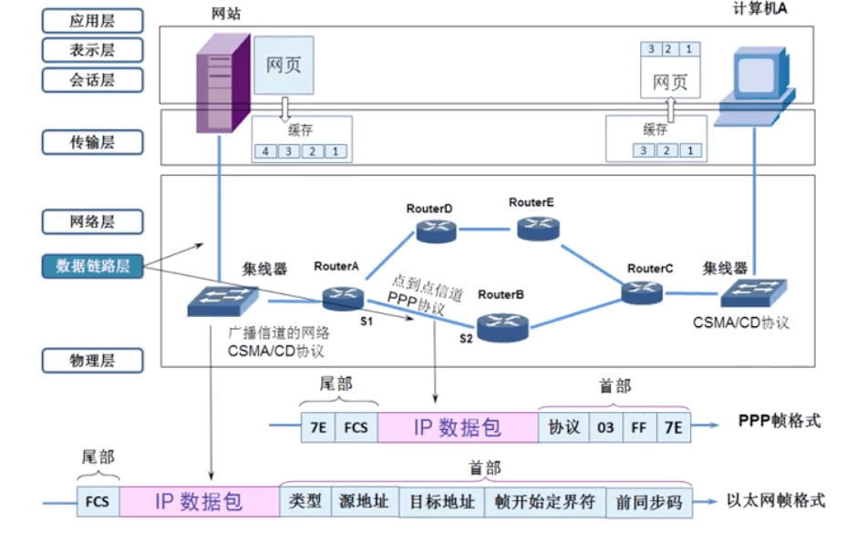
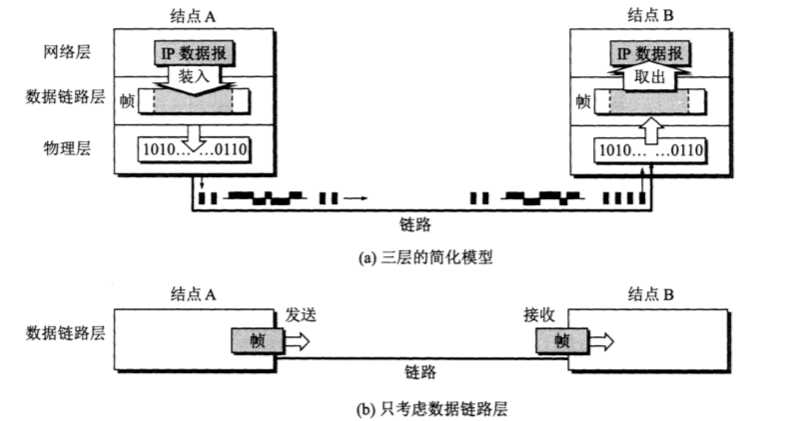
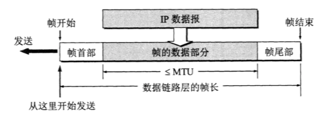
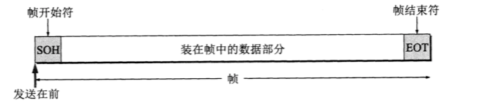
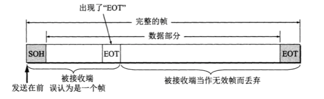
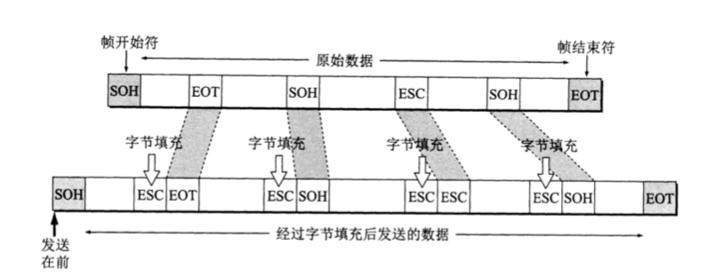
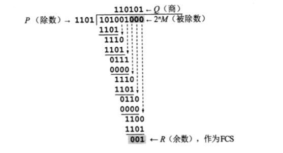

# 数据链路层 - 概述


<br>

## 一、基本概念

链路 (link)：从一个节点到相邻节点的一段物理线路 (有线或无线)，而中间没有任何其他交换节点。

数据链路 (data link)：除了物理线路外，还必须有通信协议来控制这些数据的传输。若把实现这些协议的硬件和软件加到链路上，就构成了数据链路。 

现在最常用的方法是使用适配器（即网卡）来实现这些协议的硬件和软件。 一般的适配器都包括了数据链路层和物理层这两层的功能。


### 0x01 数据链路层的两种信道



- 点对点信道：一对一点对点通信方式，主要用于路由器之间

- 广播信道：一对多的广播通信方式，主要用于通过集线器相连接的主机


### 0x02 使用 PPP 信道的数据链路层



点对点通信的数据链路层在进行通信是主要步骤如下：

- 节点 A 的数据链路层把网络层交付下来的数据添加首部和尾部，封装成帧

- 节点 A 把封装好的帧发送给节点 B 的数据链路层
- 若节点 B 的数据链路层收到的帧无差错，则从收到的帧中提取 IP 数据报交给上面的网络层，否则丢弃这个帧


<br>

## 二、三个基本问题

### 0x01 封装成帧

封装成帧 (framing) 就是在一段数据的前后分别添加首部和尾部，这样就构成一个帧。接收方在收到物理层上交的比特流后，能够根据首部和尾部的标记识别出帧的开始和结束。



一个帧的帧长等于帧的数据部分加上帧首部和帧尾部的长度。首部和尾部的一个重要作用就是进行帧界定。在发送帧时，需从帧首部开始发送，为了提高帧的传输效率，应当是帧的数据部分长度尽可能地大于首部和尾部的长度。但数据链路层也规定了所能传送的帧的**数据部分长度上限** - 最大传送单元 MTU (Maximum Transfer Unit)。

我们通常用不可打印的 ASCII 码来当作帧界定符。

- 控制字符 SOH (Start Of Header) 放在帧的最前面，表示帧的首部开始，十六进制编码为 0x01。

- 控制字符 EOT (End Of Transmission) 表示帧结束，十六进制编码为 0x04。

- 注意 SOH (或 EOT) 并不表示 S、O、H (或 E、O、T) 三个字符。




### 0x02 透明传输

当数据是非 ASCII 码的文本文件时 (如二进制代码图像)，若某个字节的二进制代码刚好和 SOH 或 EOT 字符一样，那数据链路层会错误的找到边界，把部分帧收下，把剩下的那部分帧丢弃。



数据链路层的透明传输：表示无论所传数据是什么样的比特组合，都能够按照原样无差错的通过数据链路层。因此这些数据就 "看不见" 数据链路层有什么妨碍数据传输的东西。



为解决透明传输问题，可使用字符填充 (character stuffing)，也叫字节填充 (byte stuffing)

- 发送端数据链路层数据在出现控制字符 (SOH 或 EOT) 的前面插入转移字符 ESC (十六进制 1B，二进制 00011011)

- 发送端数据链路层数据在出现转义字符 (ESC) 的前面再插入转义字符 ESC，接收端收到两个连续转义字符就会删除前面的一个。

### 0x03 差错检验

比特差错：比特在传输过程中可能会产生差错，1 可能变成 0，0 可能变成 1。

误码率 BER (Bit Error Rate)：在一段时间内，传输错误的比特占所传输比特总的比率，它和信噪比有很大关系。数据链路层广泛采用循环冗余检验 CRC (Cyclic Redundancy Check) 来保证数据传输的可靠性。

#### 循环冗余检验 CRC 原理

在发送端先把数据分组，假定每个组 k 个比特。假设待传送的数据 M = 101001 (k = 6)，CRC 运算就是在数据 M 之后添加供差错检验用的 n 为冗余码，然后构成一个长度为 k + n 位的帧发送出去。

模 2 运算：加法无进位，减法无借位(减法按加加法的规则计算)，与异或等价 

```
  1001 1011 			0101 0101 
+ 1100 1010		      - 1010 1111
-------------		  --------------
  0101 0001			    1111 1010
```

n 位冗余码计算方法



- 在数据 M 后添加 n 个 0，得到 k + n 位数 101001000

-  101001000 除以收发双方实现约定好的长度为 n + 1 位的除数 P = 1101
- 得到商 Q (没啥用)，余数 R = 001 (n 位，比 P 少一位) 就是我们需要的冗余码

这种为了进行差错检验而添加的冗余码常被称为 帧检验序列 FCS (Frame Check Sequence)

接收端对收到的每一帧经过 CRC 检验后

- 若余数 R = 0, 则判定这个帧没有差错，就接受

- 若余数 R != 0，则认为这个帧出现差错，就丢弃

在数据链路层，发送端帧检验序列 FCS 和接收端 CRC 检验都是用硬件来完成的，处理很迅速，不会延误数据的传输。

### 0x04 传输差错

传输差错分为两类：上面所说的叫比特差错，还有就是收到的帧没有出现比特差错，但出现帧差错。

发送方连续发送三个帧：[#1]-[#2]-[#3]

- 帧丢失：收到 [#1]-[#3]， [#2]丢失

- 帧重复：收到 [#1]-[#2]-[#2]-[#3]
- 帧失序：收到 [#1]-[#3]-[#2]

这三种都属于帧差错，所以 "无比特差错" 和 "无传输差错" 是不同的概念。在数据链路层使用 CRC 检验，能够实现无比特差错的传输，但这并不是可靠传输。


过去的 OSI 观点是：必须让数据链路层向上提供可靠传输，因此在 CRC 的基础上，增加了帧编号、确认和重传机制。收到的真确帧要向发送端发送确认，发送端一定期限内没有没有收到对方的确认，就认为出现差错，从而会重传，直到收到对方确认为止。

但现在通信线路的质量大大提高，由通信链路质量不好引起差错的概率已大大减低，所以现在采用区别对待的方法：

- 对于通信质量良好的有线传输链路，数据链路层不使用确认和重传机制，将可靠传输放到上层 (传输层) 来完成

- 对于通信质量较差的无线传输链路，数据链路层采用确认和重传机制，提供可靠传输。


<br>


<br>