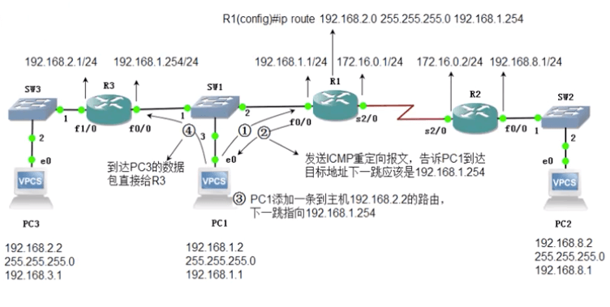
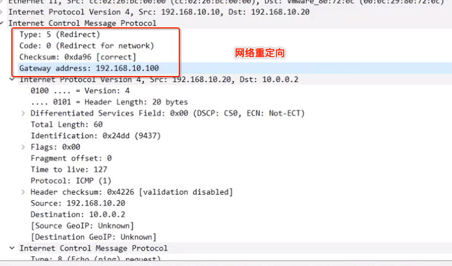
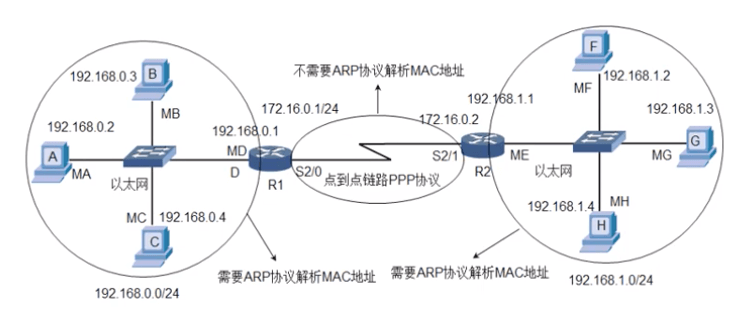
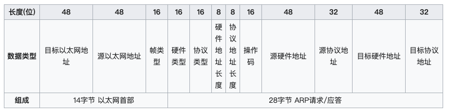
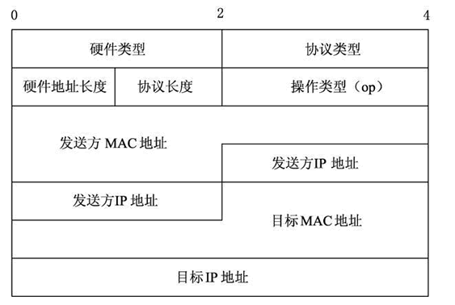
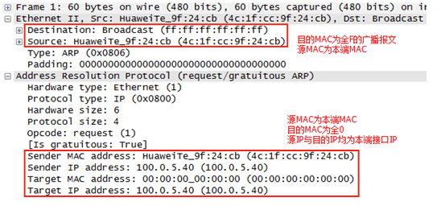
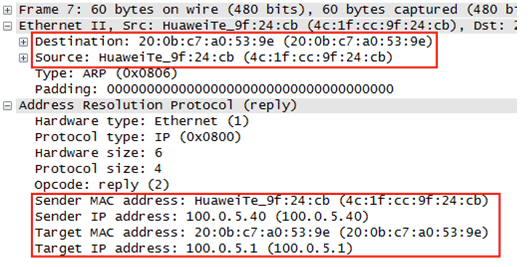

# 网络层 - ICMP & ARP

<br>

## 一、 ICMP

ICMP（Internet Control Message Protocol）Internet 控制报文协议。它是 TCP/IP 协议簇的一个子协议，用于在 IP 主机、路由器之间传递控制消息。控制消息是指网络通不通、主机是否可达、路由是否可用等网络本身的消息。这些控制消息虽然并不传输用户数据，但是对于用户数据的传递起着重要的作用。

### 0x01 ICMP 报文格式

ICMP 报文包含在 IP 数据报中，IP 首部在 ICMP 报文的最前面。一个 ICMP 报文包括 IP 首部（至少 20 字节）、ICMP报头（至少 8 字节）和 ICMP 报文的数据部分。当 IP 首部中的协议字段值为 1 时，就说明这是一个 ICMP 报文。ICMP 报文格式如下


常用 ICMP 报文类型和代码


抓包查看 ICMP 请求报文格式


### 0x02 ICMP 差错报告报文格式


- TTL 耗尽

```
$ ping baidu.com -m 2
PING baidu.com (39.156.69.79): 56 data bytes
92 bytes from 192.168.1.1 (192.168.1.1): Time to live exceeded
Vr HL TOS  Len   ID Flg  off TTL Pro  cks      Src      Dst
 4  5  00 5400 da0e   0 0000  01  01 b19c 192.168.0.107  39.156.69.79
```


- 应用程序返回 ICMP 差错报告

不仅是 `ping` 命令可以使用 ICMP 协议。当我们在浏览器中输入一个不可访问的 IP 地址，也能得到一个 ICMP 差错报告。如访问 192.168.20.20， 192.168.0.1 网关返回 192.168.20.20 不可到达


- 路由重定向

如果一个主机在通信时将数据报发送给了路由器 R1，而 R1 将这个数据报转发给了另一个路由器R2，且主机到路由器 R2 之间有一条直连的路径（也就是说此主机和路由器 R2 处于同一以太网段上），那么路由器R1会发送一条重定向报文给主机，来通知它到路由器 R2 可用路径里有一条更短、更优化的路径。这个主机在接收到这个重定向报文之后应该改变其路由至这个优化版本的路由信息，来将抵达这个目的地的数据报直接发送到路由器 R2，并且路由器仍将原始数据报发送到预期目的地。

但如果一个数据报携带有路由信息，那么即使有更加优化的路径，路由器也不会发送重定向报文。并且，RFC 1122 指出，重定向报文应该只由网关发送，而不应该由互联网主机发送。





<br>

## 二、 ARP

ARP (Address Resolution Protocol, 地址解析协议) 是一个通过解析网络层地址 (IP 地址) 来找寻数据链路层地址 (MAC 地址) 的网络传输协议。它在 IPv4 中极其重要，在 IPv6 中邻居发现协议（NDP）用于代替 ARP 。

### 0x01 ARP 出现原因

在以太网协议中规定，同一局域网中的一台主机要和另一台主机进行直接通信，必须要知道目标主机的 MAC 地址。而在 TCP/IP 协议中，网络层和传输层只关心目标主机的 IP 地址。这就导致在以太网中使用 IP 协议时，数据链路层的以太网协议接到上层IP协议提供的数据中，只包含目的主机的 IP地址。于是需要一种方法，根据目的主机的 IP 地址，获得其 MAC 地址。这就是 ARP 协议要做的事情。所谓地址解析（address resolution）就是主机在发送帧前将目标IP地址转换成目标 MAC 地址的过程。

当发送主机和目的主机不在同一个局域网中时，即便知道对方的MAC地址，两者也不能直接通信，必须经过路由转发才可以。所以此时发送主机通过 ARP 协议获得的将不是目标主机的真实 MAC 地址，而是一台可以通往局域网外的路由器的 MAC 地址。于是此后发送主机发往目的主机的所有帧，都将通过该路由器向外发送。这种情况称为委托 ARP 或 ARP 代理（ARP Proxy）。

> 这也就解释了 IP 地址和 MAC 地址的不同之处： 数据包的目标 IP 地址决定了数据包最终到达的哪一台计算机，而目标 MAC 地址决定了该数据包下一跳由哪个设备接收，不一定是终点。

在点对点链路中不使用ARP，实际上在点对点网络中也不使用MAC地址，因为在此类网络中分别已经获取了对端的IP地址




### 0x02 ARP 工作原理

ARP 原理可以总结为**广播请求单播回应**，以主机A (192.168.0.1) 向主机B (192.168.0.107) 发送数据为例

- 当发送数据时，主机 A 会在自己的 ARP 缓存表中寻找是否有目标 IP 地址。

- 如果找到目标 IP 地址对应的 MAC 地址，直接把目标 MAC 地址写入帧里面发送就可。

- 如果在 ARP 缓存表中没有找到相对应的 IP 地址，主机A就会在网络上发送一个广播（ARP request），目标MAC地址是"FF.FF.FF.FF.FF.FF" (请求包的 Ethernet 协议目标 MAC 地址是FF.FF.FF.FF.FF.FF，ARP 协议目标 MAC 是 00.00.00.00.00.00)，这表示向同一网段内的所有主机发出这样的询问："192.168.0.107 的 MAC 地址是什么？"

- 网络上其他主机并不响应 ARP 询问，只有主机 B 接收到这个帧时，才向主机 A 做出这样的回应（ARP response）："192.168.0.107 的 MAC 地址是xx-xx-xx-xx-xx-xx"，此回应以单播方式。

- 这样主机 A 就知道主机 B 的 MAC 地址，它就可以向主机 B 发送信息。同时它还更新自己的 ARP高速缓存（ARP cache），下次再向主机 B 发送信息时，直接从 ARP 缓存表里查找即可。


查看 ARP 缓存

```
## Windows 平台
$ arp -a
Internet Address      Physical Address      Type
192.168.0.1           20xx.xx6b.xxxx        dynamic

## Mac 平台
$ arp -a
192.168.0.1 (192.168.0.1) at 20:xx:xx:6b:xx:xx on en0 ifscope [ethernet]
192.168.0.101 (192.168.0.101) at d4:61:xx:xx:xx:xx on en0 ifscope [ethernet]
```

### 0x03 ARP 报文格式

ARP 帧格式



- 目标以太网地址：目标 MAC 地址。FF:FF:FF:FF:FF:FF （二进制全1）为广播地址。

- 源以太网地址：发送方 MAC 地址。

- 帧类型：以太类型，ARP为 0x0806

ARP 报文格式



- ARP 报文总长度为 28 字节，MAC 地址长度为 6 字节，IP 地址长度为 4 字节

- 硬件类型：指明了发送方想知道的硬件接口类型，以太网的值为 1。
- 协议类型：表示要映射的协议地址类型。它的值为 0x0800，表示 IP 地址。
- 硬件地址长度：指出硬件地址长度，以字节为单位，对于ARP请求或应答来说，该值为6。
- 协议长度：协议的长度，以字节为单位，对于ARP请求或应答来说，该值为 4。
- 操作类型：用来表示这个报文的类型，ARP 请求为 1，ARP 响应为 2，RARP 请求为 3，RARP 响应为 4。
- 发送方 MAC 地址：发送方设备的硬件地址。
- 发送方 IP 地址：发送方设备的 IP 地址。
- 目标 MAC 地址：接收方设备的硬件地址。
- 目标 IP 地址：接收方设备的IP地址

ARP 请求报文



ARP 响应报文



### 0x04 ARP 欺骗

ARP 欺骗 (ARP spoofing) 是针对以太网地址解析协议的一种攻击技术。此种攻击可让攻击者获取局域网上的数据包甚至可篡改数据包，且可让网络上特定电脑或所有电脑无法正常连线。

用一个简单的案例来说明 ARP 欺骗的核心步骤。假设在一个 LAN 里，只有三台主机 A、B、C，且 C 是攻击者。

- 攻击者聆听局域网上的 MAC 地址。它只要收到两台主机洪泛的ARP Request，就可以进行欺骗活动。

- 主机 A、B 都洪泛了 ARP Request.攻击者现在有了两台主机的 IP、MAC 地址，开始攻击。
- 攻击者发送一个ARP Reply给主机B，把此包 protocol header 里的 sender IP设为A的IP地址，sender mac设为攻击者自己的MAC地址。
- 主机 B  收到 ARP Reply 后，更新它的 ARP 表，把主机A的MAC地址（IP_A, MAC_A）改为（IP_A, MAC_C）。
- 当主机 B 要发送数据包给主机 A 时，它根据 ARP 表来封装数据包的 Link 报头，把目的 MAC 地址设为 MAC_C，而非 MAC_A。
- 当交换机收到 B 发送给 A 的数据包时，根据此包的目的 MAC 地址（MAC_C）而把数据包转发给攻击者 C。
- 攻击者收到数据包后，可以把它存起来后再发送给 A，达到偷听效果。攻击者也可以篡改数据后才发送数据包给 A，造成伤害。


ARP欺骗亦有正当用途。

- 是在一个需要登录的网络中，让未登录的电脑将其浏览网页强制转向到登录页面，以便登录后才可使用网络。

- 有些设有备援机制的网络设备或服务器，亦需要利用 ARP 欺骗以在设备出现故障时将讯务导到备用的设备上。

<br>


<br>

参考： 

- [ICMP 互联网控制消息协议](https://zh.wikipedia.org/wiki/%E4%BA%92%E8%81%94%E7%BD%91%E6%8E%A7%E5%88%B6%E6%B6%88%E6%81%AF%E5%8D%8F%E8%AE%AE)
- [ARP 地址解析协议](https://zh.wikipedia.org/wiki/%E5%9C%B0%E5%9D%80%E8%A7%A3%E6%9E%90%E5%8D%8F%E8%AE%AE)
- [ARP 欺骗](https://zh.wikipedia.org/wiki/ARP%E6%AC%BA%E9%A8%99)

<br>