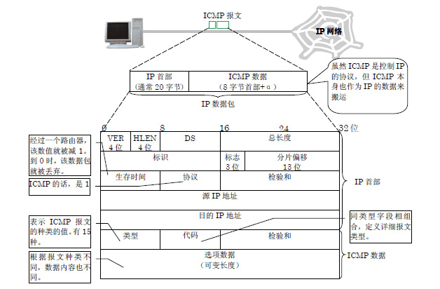
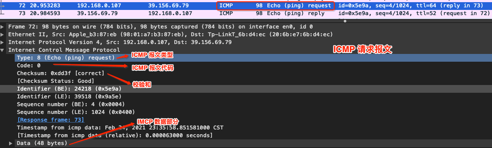

# 网络层 - ICMP & ARP

<br>

## 一、 ICMP

ICMP（Internet Control Message Protocol）Internet控制报文协议。它是 TCP/IP 协议簇的一个子协议，用于在 IP 主机、路由器之间传递控制消息。控制消息是指网络通不通、主机是否可达、路由是否可用等网络本身的消息。这些控制消息虽然并不传输用户数据，但是对于用户数据的传递起着重要的作用。

### 0x01 ICMP 报文格式

ICMP 报文包含在 IP 数据报中，IP 首部在 ICMP 报文的最前面。一个 ICMP 报文包括 IP 首部（至少 20 字节）、ICMP报头（至少 8 字节）和 ICMP 报文的数据部分。当 IP 首部中的协议字段值为 1 时，就说明这是一个 ICMP 报文。ICMP 报文格式如下




常用 ICMP 报文类型和代码


抓包查看 ICMP 请求报文格式



### 0x02 ICMP 差错报告报文格式


- TTL 耗尽

```
$ ping baidu.com -m 2
PING baidu.com (39.156.69.79): 56 data bytes
92 bytes from 192.168.1.1 (192.168.1.1): Time to live exceeded
Vr HL TOS  Len   ID Flg  off TTL Pro  cks      Src      Dst
 4  5  00 5400 da0e   0 0000  01  01 b19c 192.168.0.107  39.156.69.79
```


不仅是 `ping` 命令可以使用 ICMP 协议。当我们在浏览器中输入一个不可访问的 IP 地址，也能得到一个 ICMP 差错报告。如访问 192.168.20.20， 192.168.0.1 网关返回 192.168.20.20 不可到达


<br>

## 二、 ARP

<br>


<br>


<br>