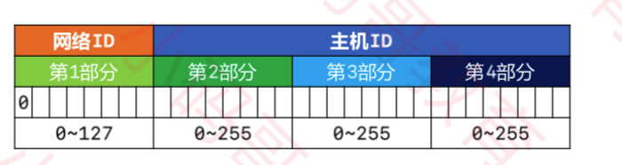
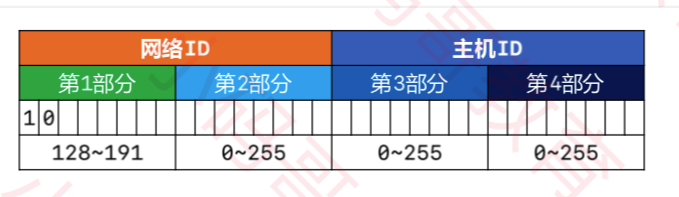
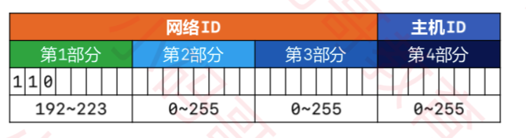
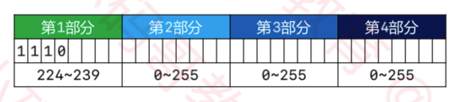
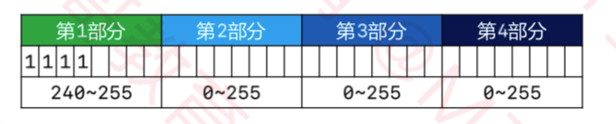
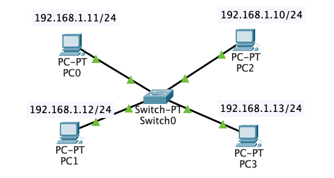
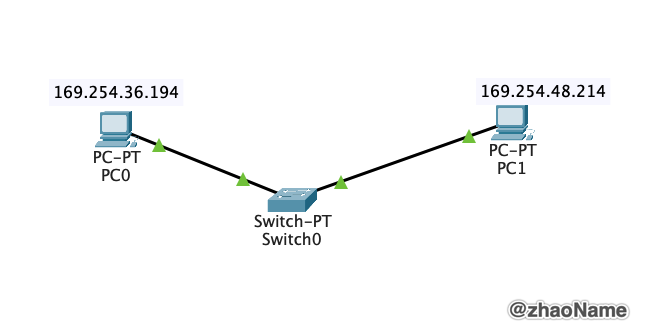
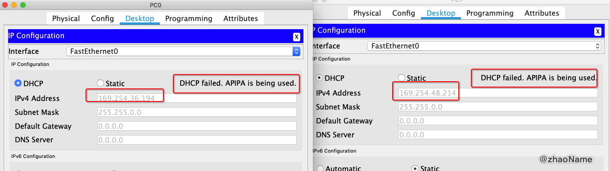
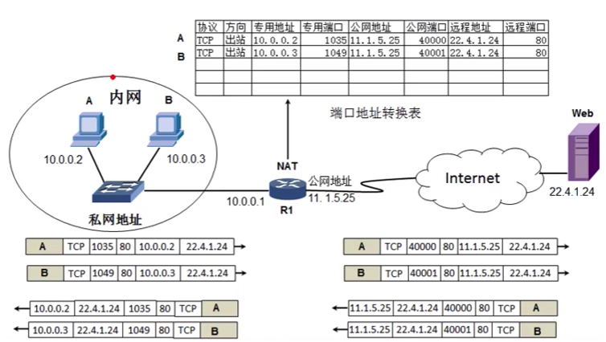

# IP 地址

本文只介绍 IPv4， 没有特殊标出默认环境为 Mac 电脑。

<br>

## 一、IP 地址简介

### 0x01 子网掩码

网络设备在和其他网络设备通信前，会先判断目标设备和自己是否处在同一网段。若处在同一网段，则可以通过网线或交换机直接通信。若不是同一网段则需要路由器进行转发。那如何判断是否处在同一网段，就需要用到子网掩码。

子网掩码 (subnet mask) 的作用就是将某个 IP 地址划分成网络地址和主机地址两部分。IP 地址要搭配子网掩码来使用。

子网掩码有两种表示方式：

- 点分十进制表示法： 如 192.168.1.1  255.255.255.0
- 无类别域间路由 (Classless Inter-Domain Routing, CIDR): 如 192.168.1.1/24。24 代码子网掩码有24 个 1，也就是 255.255.255.0

### 0x02 简介

IP 地址（英语：IP Address，全称 Internet Protocol Address），又译为网际协议地址、互联网协议地址。当设备连接网络，设备将被分配一个IP地址，用作标识。

常见的IP地址分为 IPv4 与 IPv6 两大类，IP 地址由一串数字组成。

- IPv4 由 32位二进制数组成，常以 xxx.xxx.xxx.xxx 形式的十进制数字表示，并以点分隔，如：172.16.254.1 ，该表示方法称为点分十进制。

- IPv6 由128位二进制数组成，常以十六进制数字组成，以冒号分割，如：2001:db8:0:1432:0:567:8:1 。

### 0x03 IP 地址组成

上面说到子网掩码将某个 IP 地址划分成网络地址和主机地址两部分

- 网络地址(主机所在网段) = IP 地址 & 子网掩码
- 主机地址 = IP 地址去掉网络地址部分

如 192.168.1.199/24

```
  11000000.10101000.00000001.11000111
& 11111111.11111111.11111111.00000000
---------------------------------------------------
  11000000.10101000.00000001.00000000
```

所以 192.168.1.199/24 的网络地址为 11000000.10101000.00000001.00000000 也就是 192.168.1.0， 主机地址为 199

<br>


## 三、IP 地址分类

### 0x01 A 类地址

网络地址的最高位以 0 开头的是 A 类地址，默认子网掩码是 255.0.0.0。0 不能用，127 作为保留网段(127.0.0.1 是本地环回地址)，所以 A 类地址的网络部分的取值为  0000 0001 ~ 0111 1110,  转成 10 进制为 1 ~ 126。



主机ID 由第2、3、4部分组成，每部分的取值范围是 0 ~ 255。主机部分全为 0 表示网段地址，主机部分全为 1 表示本网段下的广播地址。所以一个 A 类地址所能容纳的最大主机数为： 256 * 256 * 256 - 2 = 16777214


### 0x02 B 类地址

网络地址的最高位以 10 开头的是 B 类地址，默认子网掩码是 255.255.0.0。B 类地址的网络部分的第一部分取值为 1000 0000 ~ 1011 1111， 也就是 128 ~ 191，第二部分取值 0 ~ 255 。



主机ID 由第3、4部分组成，每部分的取值范围是 0 ~ 255。主机部分全为 0 表示网段地址，主机部分全为 1 表示本网段下的广播地址。所以一个 B 类地址所能容纳的最大主机数为： 256 * 256 - 2 = 65534。

### 0x03 C 类地址

网络地址的最高位以 110 开头的是 C 类地址，默认子网掩码是 255.255.255.0。C 类地址的网络部分的第一部分取值为 1100 0000 ~ 1101 1111， 也就是 192 ~ 223，第2、3 部分取值 0 ~ 255 。



主机ID 由第四部分组成，取值范围是 0 ~ 255。主机部分全为 0 表示网段地址，主机部分全为 1 表示本网段下的广播地址。所以一个 C 类地址所能容纳的最大主机数为： 256 - 2 = 254。

### 0x04 D 类地址

网络地址的最高位以 1110 开头的是 D 类地址，没有子网掩码。用于多播(组播)地址。D 类地址的网络部分的第一部分取值为 1110 0000 ~ 1110 1111， 也就是 224 ~ 239。



### 0x05 E 类地址

网络地址的最高位以 1111 开头的是 E 类地址，保留为今后使用。E 类地址的网络部分的第一部分取值为 1111 0000 ~ 1111 1111， 也就是 240 ~ 255。



**注意**

- 只有 A、B、C 类地址才能分配给主机

- 判断 IP 地址属于哪一类只看 IP 地址最高 8 位对应在哪个数值范围。


<br>

## 四、保留的 IP 地址

### 0x01 主机位全为 0

在A类、B类、C类IP地址中，主机位全为 0 的地址特指某个网段。如 192.168.1.10/24, 指 192.168.1.0 网段。

### 0x02 主机位全为 1

在A类、B类、C类IP地址中，如果主机号是全 1，那么这个地址为广播地址。

下面我们使用使用 ping 命令验证主机部分全为 1 是广播地址。在 Packet Tracer 中配置如下图设置，子网掩码为 255.255.255.0。



并在 PC2 的终端中执行 `ping 192.168.1.255`, 结果如下

```
$ ping 192.168.1.255

Pinging 192.168.1.255 with 32 bytes of data:

Reply from 192.168.1.11: bytes=32 time=2ms TTL=128
Reply from 192.168.1.12: bytes=32 time=2ms TTL=128
Reply from 192.168.1.13: bytes=32 time=2ms TTL=128

Reply from 192.168.1.12: bytes=32 time<1ms TTL=128
Reply from 192.168.1.13: bytes=32 time<1ms TTL=128
Reply from 192.168.1.11: bytes=32 time=1ms TTL=128

Reply from 192.168.1.11: bytes=32 time<1ms TTL=128
Reply from 192.168.1.12: bytes=32 time=1ms TTL=128
Reply from 192.168.1.13: bytes=32 time<1ms TTL=128

Reply from 192.168.1.11: bytes=32 time=1ms TTL=128
Reply from 192.168.1.12: bytes=32 time=1ms TTL=128
Reply from 192.168.1.13: bytes=32 time=1ms TTL=128

Ping statistics for 192.168.1.255:
    Packets: Sent = 4, Received = 12, Lost = 0 (0% loss),
Approximate round trip times in milli-seconds:
    Minimum = 0ms, Maximum = 2ms, Average = 0ms
```

可以看到  `ping 192.168.1.255` 会给当前网段下的所有主机发送数据包

### 0x03 127.x.x.x

127.x.x.x 是本地环回地址 (Loopback)，特指本机地址，一般用于测试。常用到的是 127.0.0.1

只要是你的操作系统封装了 TCP/IP 协议，哪怕没有网卡也能 `ping ` 通。换句话说设备在断网情况下也能`ping `通。

```
$ ping 127.0.0.1

PING 127.0.0.1 (127.0.0.1): 56 data bytes
64 bytes from 127.0.0.1: icmp_seq=0 ttl=64 time=0.043 ms
64 bytes from 127.0.0.1: icmp_seq=1 ttl=64 time=0.079 ms
64 bytes from 127.0.0.1: icmp_seq=2 ttl=64 time=0.070 ms
64 bytes from 127.0.0.1: icmp_seq=3 ttl=64 time=0.070 ms
^C
--- 127.0.0.1 ping statistics ---
4 packets transmitted, 4 packets received, 0.0% packet loss
round-trip min/avg/max/stddev = 0.043/0.066/0.079/0.014 ms
```

或者 `ping 127.0.0.2` (注意 mac 电脑需要[配置](https://serverfault.com/questions/293874/why-cant-i-ping-an-address-on-the-loopback-device-under-freebsd)才能`ping` 通)

```
$ ping 127.0.0.2

PING 127.0.0.2 (127.0.0.2): 56 data bytes
64 bytes from 127.0.0.1: icmp_seq=0 ttl=64 time=0.045 ms
64 bytes from 127.0.0.1: icmp_seq=1 ttl=64 time=0.079 ms
64 bytes from 127.0.0.1: icmp_seq=2 ttl=64 time=0.070 ms
64 bytes from 127.0.0.1: icmp_seq=3 ttl=64 time=0.070 ms
^C
--- 127.0.0.2 ping statistics ---
4 packets transmitted, 4 packets received, 0.0% packet loss
round-trip min/avg/max/stddev = 0.045/0.066/0.079/0.014 ms
```

### 0x04 169.254.0.0/16

169.254.0.0 ~ 169.254.255.255 实际上是自动私有 IP 地址。

当一台没有 IP 地址的主机接入到了网络中时，如果设置的时 DHCP 自动获取地址，就会向网络中发送 DHCP 请求获得IP地址，源 IP 为 0.0.0.0，目的 IP 为 255.255.255.255，源 MAC 地址正常，目的Mac 地址为全 F 的广播包。

当客户端为 windows 主机时，网卡配置为 DHCP 获得地址时，就开始向网络中请求地址，先发送一个广播包，等待 1 秒之后，如果没有服务器应答，就发送第二个广播包，如果 9 秒后没有收到应答，则发送第三个广播包，等 13 秒，还没有应答，最后再发送一个包，等待16 秒后，最终在四个广播包没有应答的情况下，默认是放弃请求，为网卡自动配上一个私有 IP 地址，地址段为169.254.0.0/16，网络状态为“受限制或无连接”。

Packet Tracer 上模拟这个实验，



将两台 PC 的网卡设置成 DHCP 获取地址，但是不配置 DHCP 服务器，过段时间，PC 会自动获取一个地址，地址段为169.254.0.0/16。



然后在 PC0 终端执行 `ping 169.254.48.214`

```
$ ping 169.254.48.214

Pinging 169.254.48.214 with 32 bytes of data:

Reply from 169.254.48.214: bytes=32 time<1ms TTL=128
Reply from 169.254.48.214: bytes=32 time<1ms TTL=128
Reply from 169.254.48.214: bytes=32 time<1ms TTL=128
Reply from 169.254.48.214: bytes=32 time<1ms TTL=128

Ping statistics for 169.254.48.214:
    Packets: Sent = 4, Received = 4, Lost = 0 (0% loss),
Approximate round trip times in milli-seconds:
    Minimum = 0ms, Maximum = 0ms, Average = 0ms
```

### 0x05 0.0.0.0

IPV4 中，0.0.0.0 地址被用于表示一个无效的，未知的或者不可用的目标。如果本机的 IP 地址和网络中其他设备的 IP 地址冲突，使用 `ipconfig` 看到的就是 0.0.0.0 子网掩码也是 0.0.0.0

- 在服务器中，0.0.0.0指的是本机上的所有IPV4地址，如果一个主机有两个IP地址，192.168.1.1 和 10.1.2.1，并且该主机上的一个服务监听的地址是0.0.0.0,那么通过两个ip地址都能够访问该服务。
- 在路由中，0.0.0.0表示的是默认路由，即当路由表中没有找到完全匹配的路由的时候所对应的路由。

用途总结

- 当一台主机还没有被分配一个IP地址的时候，用于表示主机本身。（DHCP分配IP地址的时候）
- 用作默认路由，表示”任意IPV4主机”。
- 用来表示目标机器不可用。
- 用作服务端，表示本机上的任意IPV4地址

<br>


## 五、公网 IP 地址、私网 IP 地址

### 0x01 简介

- 公网 IP 地址的分配和管理是由因特网信息中心（Internet Network Information Center, Inter NIC）负责，各级 ISP 使用的公网 IP 地址需要向 Inter NIC 提出申请，有其统一发放以保证地址不冲突。
- 私网 IP 地址主要用于局域网。
- Internet 上的路由器中只有到达公网的路由表，没有到达私网的路由表。

### 0x02 保留的私网网段

- A 类：10.0.0.0/8，保留一个 A 类网络
- B 类：172.16.0.0/16 ~ 172.31.0.0/16，保留 16 个 B 类网络
- C 类：192.168.0.0/24 ~ 192.168.255.0/24，保留 256 个 C 类网络

### 0x03 NAT & PAT

私网 IP 地址访问 Internet 需要进行 NAT 转换为公网 IP 地址。NAT 可以节约公网 IP 地址，隐藏内部的真实IP 地址。



NAT 分类：

- 静态转换：手动配置 NAT 映射表，一对一转换
- 动态转换：定义外部地址池，动态随机转换，一对一转换
- PAT(Port Address Translation)：多对一转换，最大程度节约公网 IP 资源。采用端口多路复用方式，通过端口号标志不同的数据。

注意私网 IP 地址最好使用保留的私网网段，否则一旦私网 IP 地址和公网 IP 一样，会导致错误。

<br>

参考： 

- [子网掩码有那么难吗？](https://mp.weixin.qq.com/s/jAITB4o1nnO5M2wt0hDqjw)

- [对 169.254.0.0/16 网段的一点解释](https://zhuanlan.zhihu.com/p/100732856)

- [127.0.0.1和0.0.0.0地址的区别](https://zhuanlan.zhihu.com/p/72988255)

<br>

<br>