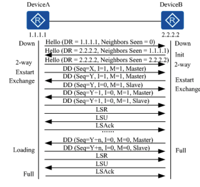
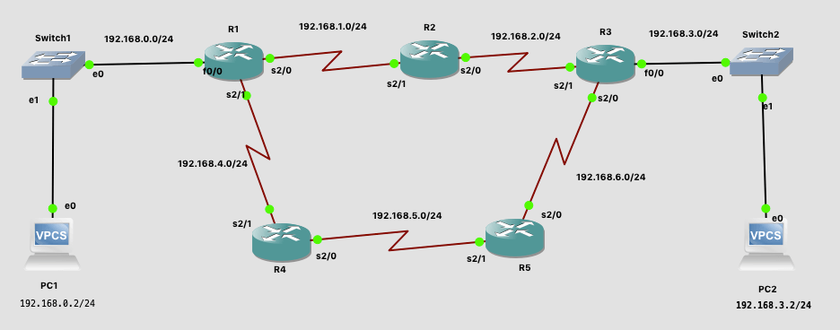

# 网络层 - OSPF


<br>

OSPF（Open Shortest Path First）开放式最短路径优先协议：是 IETF 组织开发的一个基于链路状态的内部网关协议（Interior Gateway Protocol）。当前，在 RFC 2328 中定义的 OSPF 版本2 用于 IPv4，在 RFC 2740 中定义的 OSPF 版本 3 用于 IPv6。如无特殊说明，本文中所指的 OSPF 均为 OSPF Version 2。

开放是指 OSPF 是一种基于开放标准的路由选择协议，其中 OSPFV2 参考 RFC2328，OSPFV3 参考 RFC5340. 路径最短优先是指 OSPF 在路由选择上采用 Dijkstra 所提出的最短路径算法

<br>

## 一、基本概念

### 0x01 RIP vs OSPF

当今网络的快速增长和扩展已将RIP推向了极限。RIP 具有某些局限性，可能会导致大型网络出现问题：

- RIP 的限制为 15 跳。跨越 15 个跃点（15 个路由器）的 RIP 网络被认为是不可访问的。
- RIP 无法处理可变长度子网掩码（Variable Length Subnet Masks VLSM）。鉴于 IP 地址的短缺和 VLSM 在有效分配 IP 地址方面的灵活性，这被认为是一个主要缺陷。
- 完整路由表的定期广播会消耗大量带宽。这是大型网络的主要问题，尤其是在慢速链接和WAN云上。
- RIP 的收敛速度比 OSPF 慢。在大型网络中，收敛时间只有几分钟左右。RIP路由器经历了一段时间的压制和垃圾收集，并缓慢地超时了最近未收到的信息。这在大型环境中是不合适的，并且可能导致路由不一致。
- RIP 没有网络延迟和链接成本的概念。路由决策基于跳数。即使更长的路径具有更好的聚合链路带宽和更少的延迟，也总是首选到达目的地的跳数最少的路径。
- RIP 网络是平面网络。没有区域或边界的概念。随着无类路由的引入以及聚合和汇总的智能使用，RIP 网络似乎已经落后了。

RIP 的新版本 RIP2 中引入了一些增强功能。RIP2 解决了 VLSM，身份验证和多播路由更新的问题。RIP2 并不是 RIP（现在称为RIP 1）的重大改进，因为它仍然具有跳数和慢速收敛的局限性，这在当今的大型网络中至关重要。

另一方面，OSPF 解决了先前提出的大多数问题：

- 使用OSPF，跳数没有限制。
- VLSM 的使用在 IP 地址分配中非常有用。
- OSPF 使用 IP 多播发送链接状态更新。这样可确保在不监听 OSPF 数据包的路由器上进行更少的处理。同样仅在发生路由更改的情况下发送更新，而不是定期发送，这样可以确保更好地利用带宽。
- OSPF 具有比 RIP 更好的收敛性。这是因为路由更改是实时的，而不是周期性的。
- OSPF 允许更好的负载平衡。
- OSPF 允许对网络进行逻辑定义，其中可以将路由器划分为多个区域。这限制了整个网络上链接状态更新的爆炸式增长。这也提供了一种聚合路由并减少不必要的子网信息传播的机制。
- OSPF 允许使用不同的密码验证方法进行路由验证。
- OSPF 允许传输和标记注入自治系统的外部路由。这样可以跟踪由外部协议（例如BGP）注入的外部路由。

### 0x02 术语

#### Router-ID

如果要运行 OSPF 协议，必须存在 Router ID。Router ID 是一个32比特无符号整数，用于唯一标识 AS (Autonomous System 自治系统) 中的路由器。Router ID 的设置方式有两种：

- 通过命令手动设置，实际网络部署中建议手动设置以保证 OSPF 协议的稳定性。
- 通过协议自动选取
	- 路由器优先选择 Lookback 地址中最大的 IP 地址作为其 Router ID
	- 如果未配置 Lookback 接口，则路由器将在其他接口地址中选择最大的IP地址作为其 Router ID

在路由器运行了 OSPF 并确定了 Router ID 后，如果该 Router ID 对应的接口 Down 或者接口消失（例如执行了undo interface loopback loopback-number）或者出现更大的 IP 地址，OSPF 将仍然保持原 Router ID。只有在为路由器重新配置了 Router ID 或者重新配置 OSPF 的 Router ID 并且重新启动 OSPF 进程后，路由器才能获取才重新选取的 Router ID。

#### COST

- OSPF 使用 cost 作为路由度量值(metric)。
- 每一个激活 OSPF 的接口都有一个 cost 值。cost 计算公式 = 100M / 接口带宽，其中 100M 为 OSPF 的参考带宽（reference-bandwidth）。如一个 10Mbit/s 的接口，它的 cost =  100000000 / 10000000  = 10，OSPF 认为该接口的 Metric 值为 10。
- cost 的最小值为 1。即有个 1000Mbit/s 的接口，cost 算出来是 0.1，但要被四舍五入为1。
- OSPF 路由的成本是从源路由器到目标路由器的所有传入接口的 cost 值之和

#### Link

Link（链路）就是路由器上的接口，在这里特指运行在 OSPF 进程下的接口。

#### Link-State

OSPF 是一种链路状态协议。链路状态(LSA) 是对接口及接口与相邻路由器的关系的描述。接口的信息包括接口的 IP 地址、掩码、所连接的网络的类型、连接的邻居等。**OSPF 路由器之间交换的不是路由表信息，而是链路状态通告( Link-State Advertisemen LSA)。**

#### DR、BDR

- DR: Designate router，指定路由器
- BDR：Backup Disignate router，备用指定路由器
- DR Others：其余非 DR/BDR 路由器
- DR/BDR 选举规则：先比较接口优先级，越大越优先。优先级相同，比较 RID，越大越优先。

### 0x03 报文类型

- Hello 报文，用于 OSPF 邻居动态发现，邻居参数协商，邻居关系维护。
- DBD 报文（Database Description Packet），数据库描述数报文。
	- 用于传递 LSDB（Link State Database）摘要信息，实际上是 LSDB 中 所有 LSA 的头部信息。OSPF 路由器通过交换 DBD 报文，来统计自己缺少的 LSA 并向对端发送 LSR 报文进行请求。
	- 用于主从路由器的选举
- LSR 报文（Link State Request packet），用于向邻居请求自己 LSDB 中没有的 LSA
- LSU 报文（Link State Update packet），LSU 用于给邻居发送它们请求的 LSA，只有 LSU 报文中会包含完整的 LSA
- LSAck 报文（Link State Acknowledgment packet），LSAck 用于向邻居确认收到的 LSU，如果没收到 LSAck 的话，邻居会不断重传请求的 LSU。注意区分 LSA 和 LSAck

### 0x04 OSPF报文认证

OSPF 支持报文验证功能，只有通过验证的 OSPF 报文才能接收，否则将不能正常建立邻居。路由器支持两种验证方式：

- 区域验证方式
- 接口验证方式

当两种验证方式都存在时，优先使用接口验证方式

### 0x05 邻居（Neighbor）、邻接（Adjacency）

在 OSPF 网络中，为了交换路由信息，邻居设备之间首先要建立邻接关系，邻居（Neighbors）关系和邻接（Adjacencies）关系是两个不同的概念。

- 邻居关系：OSPF 设备启动后，会通过 OSPF 接口向外发送 Hello 报文，收到 Hello 报文的 OSPF 设备会检查报文中所定义的参数，如果双方一致就会形成邻居关系，两端设备互为邻居。
- 邻接关系：形成邻居关系后，如果两端设备成功交换 DBD 报文和 LSA，才建立邻接关系。

OSPF 共有 8 种状态机，分别是：Down、Attempt、Init、2-way、Exstart、Exchange、Loading、Full。

- Down：邻居会话的初始阶段，表明没有在邻居失效时间间隔内收到来自邻居路由器的 Hello 数据包。
- Attempt：该状态仅发生在 NBMA 网络中，表明对端在邻居失效时间间隔（dead interval）超时前仍然没有回复 Hello 报文。此时路由器依然每发送轮询 Hello 报文的时间间隔（poll interval 20s）向对端发送 Hello 报文。
- Init：收到 Hello 报文后状态为 Init。
- 2-way：收到的 Hello 报文中包含有自己的 Router ID，则状态为 2-way；如果不需要形成邻接关系则邻居状态机就停留在此状态，否则进入 Exstart 状态。
- Exstart：开始协商主从关系，并确定 DBD 的序列号，此时状态为 Exstart。
- Exchange：主从关系协商完毕后开始交换 DBD 报文，此时状态为 Exchange。
- Loading：DBD 报文交换完成即 Exchange done，此时状态为 Loading。
- Full：LSR 重传列表为空，此时状态为 Full

<br>

## 二、OSPF 原理

### 0x01 建立邻接关系

#### 在广播网络中建立 OSPF 邻居关系



在广播网络中，DR、BDR和网段内的每一台路由器都形成邻接关系，但DR other之间只形成邻居关系

- RouterA 的一个连接到广播类型网络的接口上激活了 OSPF 协议，并发送了一个 Hello 报文（使用组播地址224.0.0.5）。此时，RouterA 认为自己是DR路由器（DR=1.1.1.1），但不确定邻居是哪台路由器（Neighbors Seen=0）。

- RouterB 收到 RouterA 发送的 Hello 报文后，发送一个Hello报文回应给 RouterA，并且在报文中的Neighbors Seen字段中填入RouterA的Router ID（Neighbors Seen=1.1.1.1），表示已收到 RouterA 的 Hello 报文，并且宣告DR路由器是RouterB（DR=2.2.2.2），然后 RouterB 的邻居状态机置为 Init。

- RouterA 收到 RouterB 回应 的 Hello 报文后，将邻居状态机置为  2-way 状态，下一步双方开始发送各自的链路状态数据库。

#### 主/从关系协商、DD报文交换

- RouterA 首先发送一个 DD 报文，宣称自己是 Master（MS=1），并规定序列号Seq=X。I=1表示这是第一个 DD 报文，报文中并不包含 LSA 的摘要，只是为了协商主从关系。M=1说明这不是最后一个报文。

	为了提高发送的效率，RouterA 和 RouterB 首先了解对端数据库中哪些 LSA 是需要更新的，如果某一条 LSA 在 LSDB 中已经存在，就不再需要请求更新了。为了达到这个目的， RouterA 和 RouterB 先发送 DD 报文，DD 报文中包含了对 LSDB 中 LSA 的摘要描述（每一条摘要可以惟一标识一条 LSA）。为了保证在传输的过程中报文传输的可靠性，在 DD 报文的发送过程中需要确定双方的主从关系，作为 Master 的一方定义一个序列号 Seq，每发送一个新的 DD 报文将 Seq 加一，作为 Slave 的一方，每次发送 DD 报文时使用接收到的上一个 Master 的 DD 报文中的 Seq。

- RouterB 在收到 RouterA 的 DD 报文后，将 RouterA 的邻居状态机改为 Exstart，并且回应了一个DD报文（该报文中同样不包含LSA的摘要信息）。由于 RouterB 的 Router ID较大，所以在报文中RouterB认为自己是Master，并且重新规定了序列号Seq=Y。

- RouterA 收到报文后，同意了 RouterB 为 Master，并将 RouterB 的邻居状态机改为Exchange。RouterA 使用 RouterB 的序列号 Seq=Y 来发送新的 DD 报文，该报文开始正式地传送 LSA 的摘要。在报文中 RouterA 将 MS=0，说明自己是 Slave。

- RouterB 收到报文后，将 RouterA 的邻居状态机改为 Exchange，并发送新的 DD 报文来描述自己的LSA摘要，此时 RouterB 将报文的序列号改为 Seq=Y+1。
上述过程持续进行，RouterA 通过重复 RouterB 的序列号来确认已收到RouterB的报文。RouterB通过将序列号 Seq 加 1 来确认已收到 RouterA 的报文。当 RouterB 发送最后一个 DD报文时，在报文中写上 M=0。

#### LSDB同步（LSA请求、LSA传输、LSA应答）

- RouterA 收到最后一个 DD 报文后，发现 RouterB 的数据库中有许多 LSA 是自己没有的，将邻居状态机改为 Loading 状态。此时 RouterB 也收到了 RouterA 的最后一个 DD 报文，但RouterA的 LSA，RouterB 都已经有了，不需要再请求，所以直接将 RouterA 的邻居状态机改为Full状态。

- RouterA 发送 LSR 报文向 RouterB 请求更新 LSA。RouterB 用 LSU 报文来回应 RouterA 的请求。RouterA 收到后，发送 LSAck 报文确认。
上述过程持续到 RouterA 中的 LSA 与 RouterB的LSA 完全同步为止，此时 RouterA 将 RouterB的邻居状态机改为 Full 状态。当路由器交换完 DD 报文并更新所有的LSA后，此时邻接关系建立完成。

### 0x02 路由计算

- 计算区域内路由。Router LSA 和 Network LSA 可以精确的描述出整个区域内部的网络拓扑，根据 SPF 算法，可以计算出到各个路由器的最短路径。根据 Router LSA 描述的与路由器的网段情况，得到了到达各个网段的具体路径。

- 计算区域外路由。从一个区域内部看，相邻区域的路由对应的网段好像是直接连接在 ABR 上，而到 ABR 的最短路径已经在上一过程中计算完毕，所以直接检查 Network Summary LSA，就可以很容易得到这些网段的最短路径。另外，ASBR 也可以看成是连接在 ABR 上，所以 ASBR 的最短路径也可以在这个阶段计算出来。

- 计算自治系统外路由。由于自治系统外部的路由可以看成是直接连接在 ASBR 上，而到 ASBR 的最短路径在上一过程中已经计算完毕，所以逐条检查 AS External LSA 就可以得到到达各个外部网络的最短路径。

<br>

## 三、OSPF 实验

搭建如下图配置的实验环境，计算机和路由器关于 IP 地址的设置可以查看上一篇文章[RIP](https://github.com/zhaoName/Notes/blob/master/Netwotk/%E7%BD%91%E7%BB%9C%E5%B1%82-RIP.md)




以 R1 为例让路由器启动 OSPF，并宣告网段。OSPF 协议宣告网段时要带上子网掩码信息0.0.0.255 表示 255.255.255.0。

```
// 进入配置路由器
R1# configure t 
Enter configuration commands, one per line.  End with CNTL/Z.

// 启动 ospf
R1(config)# router ospf 1

// 宣告网段 
R1(config-router)#network 192.168.0.0 0.0.0.255 area 0 
R1(config-router)#network 192.168.1.0 0.0.0.255 area 0
R1(config-router)#network 192.168.4.0 0.0.0.255 area 0
```

同样配置 R2、R3、R4、R5 后查看 OSPF 协议和路由器学习到的路由信息。

```
// 查看被配置在路由器上的所有动态路由协议
R1# show ip protocols 
*** IP Routing is NSF aware ***

Routing Protocol is "ospf 1"
  Outgoing update filter list for all interfaces is not set
  Incoming update filter list for all interfaces is not set
  Router ID 192.168.4.1
  Number of areas in this router is 1. 1 normal 0 stub 0 nssa
  Maximum path: 4
  Routing for Networks:
    192.168.0.0 0.0.0.255 area 0
    192.168.1.0 0.0.0.255 area 0
    192.168.4.0 0.0.0.255 area 0
  Routing Information Sources:
    Gateway         Distance      Last Update
    192.168.2.1          110      00:03:24
    192.168.6.2          110      00:01:50
    192.168.6.1          110      00:00:15
  Distance: (default is 110)

```

```
// 查看所有路由
R1# show ip route 
Codes: L - local, C - connected, S - static, R - RIP, M - mobile, B - BGP
       D - EIGRP, EX - EIGRP external, O - OSPF, IA - OSPF inter area 
       N1 - OSPF NSSA external type 1, N2 - OSPF NSSA external type 2
       E1 - OSPF external type 1, E2 - OSPF external type 2
       i - IS-IS, su - IS-IS summary, L1 - IS-IS level-1, L2 - IS-IS level-2
       ia - IS-IS inter area, * - candidate default, U - per-user static route
       o - ODR, P - periodic downloaded static route, H - NHRP, l - LISP
       + - replicated route, % - next hop override

Gateway of last resort is not set

      192.168.0.0/24 is variably subnetted, 2 subnets, 2 masks
C        192.168.0.0/24 is directly connected, FastEthernet0/0
L        192.168.0.1/32 is directly connected, FastEthernet0/0
      192.168.1.0/24 is variably subnetted, 2 subnets, 2 masks
C        192.168.1.0/24 is directly connected, Serial2/0
L        192.168.1.1/32 is directly connected, Serial2/0
O     192.168.2.0/24 [110/128] via 192.168.1.2, 00:01:27, Serial2/0
O     192.168.3.0/24 [110/129] via 192.168.1.2, 00:01:27, Serial2/0
      192.168.4.0/24 is variably subnetted, 2 subnets, 2 masks
C        192.168.4.0/24 is directly connected, Serial2/1
L        192.168.4.1/32 is directly connected, Serial2/1
O     192.168.5.0/24 [110/256] via 192.168.1.2, 00:01:27, Serial2/0
O     192.168.6.0/24 [110/192] via 192.168.1.2, 00:01:27, Serial2/0


// 只查看通过 OSPF 协议学习到的路由信息
R1# show ip route ospf
Codes: L - local, C - connected, S - static, R - RIP, M - mobile, B - BGP
       D - EIGRP, EX - EIGRP external, O - OSPF, IA - OSPF inter area 
       N1 - OSPF NSSA external type 1, N2 - OSPF NSSA external type 2
       E1 - OSPF external type 1, E2 - OSPF external type 2
       i - IS-IS, su - IS-IS summary, L1 - IS-IS level-1, L2 - IS-IS level-2
       ia - IS-IS inter area, * - candidate default, U - per-user static route
       o - ODR, P - periodic downloaded static route, H - NHRP, l - LISP
       + - replicated route, % - next hop override

Gateway of last resort is not set

O     192.168.2.0/24 [110/128] via 192.168.1.2, 00:01:43, Serial2/0
O     192.168.3.0/24 [110/129] via 192.168.1.2, 00:01:43, Serial2/0
O     192.168.5.0/24 [110/256] via 192.168.1.2, 00:01:43, Serial2/0
O     192.168.6.0/24 [110/192] via 192.168.1.2, 00:01:43, Serial2/0
R1#
```

然后 PC1 和 PC2 就可以相互通信了

```
PC1> ping 192.168.3.2
84 bytes from 192.168.3.2 icmp_seq=1 ttl=61 time=58.922 ms
84 bytes from 192.168.3.2 icmp_seq=2 ttl=61 time=79.237 ms
84 bytes from 192.168.3.2 icmp_seq=3 ttl=61 time=57.636 ms
84 bytes from 192.168.3.2 icmp_seq=4 ttl=61 time=58.326 ms
84 bytes from 192.168.3.2 icmp_seq=5 ttl=61 time=58.091 ms
```

查看邻居表

```
R1# show ip ospf neighbor 

Neighbor ID     Pri   State           Dead Time   Address         Interface
192.168.5.1       0   FULL/  -        00:00:04    192.168.4.2     Serial2/1
192.168.2.1       0   FULL/  -        00:00:04    192.168.1.2     Serial2/0


R1# show ip ospf neighbor detail 
 Neighbor 192.168.5.1, interface address 192.168.4.2
    In the area 0 via interface Serial2/1
    Neighbor priority is 0, State is FULL, 6 state changes
    DR is 0.0.0.0 BDR is 0.0.0.0
    Options is 0x12 in Hello (E-bit, L-bit)
    Options is 0x52 in DBD (E-bit, L-bit, O-bit)
    LLS Options is 0x1 (LR)
    Dead timer due in 00:00:22
    Neighbor is up for 00:02:22
    Index 1/1, retransmission queue length 0, number of retransmission 1
    First 0x0(0)/0x0(0) Next 0x0(0)/0x0(0)
    Last retransmission scan length is 1, maximum is 1
    Last retransmission scan time is 0 msec, maximum is 0 msec
 Neighbor 192.168.2.1, interface address 192.168.1.2
    In the area 0 via interface Serial2/0
    Neighbor priority is 0, State is FULL, 6 state changes
    DR is 0.0.0.0 BDR is 0.0.0.0
    Options is 0x12 in Hello (E-bit, L-bit)
    Options is 0x52 in DBD (E-bit, L-bit, O-bit)
    LLS Options is 0x1 (LR)
    Dead timer due in 00:00:24
    Neighbor is up for 00:02:20
    Index 2/2, retransmission queue length 0, number of retransmission 0
    First 0x0(0)/0x0(0) Next 0x0(0)/0x0(0)
    Last retransmission scan length is 0, maximum is 0
    Last retransmission scan time is 0 msec, maximum is 0 msec
```

- 查看 OSPF 数据库信息

```
R1# show ip ospf  database 

            OSPF Router with ID (192.168.4.1) (Process ID 1)

		Router Link States (Area 0)

Link ID         ADV Router      Age         Seq#       Checksum Link count
192.168.2.1     192.168.2.1     197         0x80000072 0x007AB2 4
192.168.4.1     192.168.4.1     195         0x80000065 0x00A517 5
192.168.5.1     192.168.5.1     199         0x80000066 0x005CB8 2
192.168.6.1     192.168.6.1     197         0x8000004D 0x00FE68 3
192.168.6.2     192.168.6.2     195         0x80000092 0x0081FB 5
R1#

```


<br>

## 四、抓包 OSPF 通信过程

在 GNS3 中用 wireshark 抓 192.168.2.1 的数据包。

### 0x01 OSPF Header


- Version: OSPF 的版本
- Message Type: 标记报文格式，共 5 中（hello、DBD、LSR、LAU、LSAck）
- Packet Lenght: OSPF 报文长度
- Source OSPF Router：发送者的 Router-id
- Area ID：发送接口表示所在区域
- Checksum: 整个数据包的校验和
- Auth Type:
	- 0：没有认证
	- 1：明文认证
	- 2：MD5 认证
- Auth Data: 所需要的认证信息

### 0x02 Hello 报文


- Network Mask: 发送接口的网络掩码
- Hello Interval [sec]: Hello 报文发送的时间间隔
- Options: OSPF 启用的功能
- Router Priority: 优先级，用于 DR 和 BDR 的选举
- Router Dead Interval [sec]: 路由失效周期
- Designated Router: 选举出的 DR IP
- Backup Designated Router: 选举出的 BDR IP
- Active Neighbor: 当前的邻居，在刚开始的 Hello 包中并没有

### 0x03 DBD 报文

空 DBD 用于选举：


正常 DBD 用于同步状态：


- Interface MTU: 在数据包不分片的情况下，始发路由器接口可以发送的最大 IP 数据包的大小，如果 MTU 不一致，会导致邻接关系无法建立
- Options: OSPF 启用的功能
- DB Description:
	- R：保留位
	- I：Init = 1，代表此报文用于选举主从，I = 0，表示主从选择完毕，发送带摘要信息的 DBD.
	- M：M = 1，表示 DBD 并未发完，后续还有。M = 0，报名此 DBD 报文最 last DBD.
	- MS: 表示主从位，MS=1 为 Master，=0 为 Slave.
- DD Sequence: DBD 的序列号，主从双方利用序列号来确保DD报文传输的可靠性和完整性
- LSA - type: LSA 头部信息


### 0x04 LSR 报文


- LS Type: LSA 种类
- Link State ID：根据 LS Type 而变化
- Advertising Router: 始发这条 LSA 的路由器的 Router Id.

### 0x05 LSU 报文


- number of LSAs: 包含 LSA 的数量
- LSA ：具体的 LSA 信息

### 0x06 Router-LSA（Type 1）

LSA 头部：

- Age：16 bit，后 15 位表示 age，最多在数据库存在 3600s，LSA 每 1800s 泛洪一次，最高位为 1 表示 LSA 在 LSDB 永不老化.
- Option: 表示 LSA 支持的可选性能
- LS Type：标识 LSA 类型, 这里是类型1
- Link State ID：产生该 LSA 路由器的 Router ID
- advertising Router：产生该 LSA 路由器的 Router ID
- Sequence Number：识别 LSA 新旧问题，初始值从Ox80000001 开始
- Checksum：对 Age 外的字段进行校验
- Length：包含 LSA 头部的 LSA 大小

LSA 内容：

- Flags：
	- V：1 表示始发路由器是一条或者多条具有完全邻接关系的虚链路的端带
	- E：1 表示始发路由是一个 ASBR 路由器
	- B：1表示是 ABR 路由器
- Number of links：链路的数量
- Type：OSPF 定义了四种 Link 类型（根据网络类型不同）

	| Link Type | Link ID |	Link Data |
	| ---- | ---- | ---- |
	| 1 |	P2P（P2P 网络）|	邻居路由器的 Router ID |	自己接口 IP |
	| 2 |	Transit（广播型网络）|	DR 的接口 IP 地址 |	自己接口 IP |
	| 3 |	Stub（描述环回接口）|	IP 所在网络 |	子网掩码 |
	| 4 |	Virtual-Link	| 虚拟邻居路由器 Router ID |	本虚链路 IP |
- number of Metrics：开销 metrics


### 0x07 LSAck 报文


<br>

<br>

<br>

参考：

- [Cisco - OSPF Design Guide](https://www.cisco.com/c/en/us/support/docs/ip/open-shortest-path-first-ospf/7039-1.html)
- [Huawe - i What Is OSPF and How Is It Configured?](https://support.huawei.com/enterprise/en/doc/EDOC1100082074)
- [动态路由 - OSPF 一文详解](https://www.cnblogs.com/michael9/p/13638479.html#%E9%80%89%E5%8F%96-dr-%E5%92%8C-bdr-%E7%9A%84%E5%8C%BA%E5%88%AB)