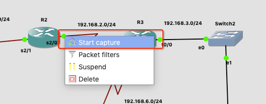

# 网络层: 动态路由 - RIP

<br>


## 一、动态路由

### 0x01 简述

- 动态路由是与静态路由相对的一个概念，指路由器能够根据路由器之间的交换的特定路由信息自动地建立自己的路由表，并且能够根据链路和节点的变化适时地进行自动调整
- 当网络中节点或节点间的链路发生故障，或存在其它可用路由时，动态路由可以自行选择最佳的可用路由并继续转发报文
- 相对于静态路由来说，动态路由减少了网络管理，但占用了网络带宽。

### 0x02 动态路由的度量值

度量值是衡量动态路由路径优劣的参数

- 跳数：一个路由器就是一跳，跳数越小越好
- 带宽：用来标识信号传输的数据传输能力、标识单位时间内通过链路的数据量、标识显示器的显示能力。
- 负载：承载的传输数据量。
- 时延：指一个报文或分组从一个网络的一端传送到另一个端所需要的时间
- 可靠性：数据传输的稳定性和效率。
- 成本：带宽越高，路径成本越低

### 0x03 动态路由协议分类

- 距离矢量路由协议：依据从源网络到目标网络所经过的路由器个数(跳数)选择路由，如 RIP、IGRP
- 链路状态路由协议：综合考虑从源网络到目标网络的各条路径的情况这种路由，如 OSPF、IS-IS

<br>

## 二、RIP

RIP (Routing Information Protocol) 是一个距离矢量路由选择协议，它每隔 30s 就会就会将自己完整的路由表信息，以广播的形式通知到所有激活的接口(相连的路由器)。

RIP 协议选择最佳路径的标准是跳数，认为到达目标网络所经过的路由器最少的路径就是最佳路径。默认它所允许的最大跳数是 15 跳，也就是说 16 跳的距离将被认为是不可到达的。

RIP 虽处在网络层，但实际用的是传输层 UDP 协议，端口为 520。

### 0x01 RIP 协议工作原理

##### 路由器学习到直连路由的网段，并添加到路由表中。


##### 第一个更新周期 30s 时间到后，每个路由器都会给邻居路由器广播 RIP 报文，报文的内容就是路由器当前的路由表信息。


- R1 将第一步学习到的直连路由 10.0.0.0 和 20.0.0.0 发送给自己的邻居路由器 R2。R2 收到后将自己没有的 10.0.0.0 网段直接添加到自己的路由表中。
- R2 将第一步学习到的直连路由 20.0.0.0 和 30.0.0.0 发送给自己的邻居路由器 R2、R3。R1 收到后将自己没有的 30.0.0.0 网段直接添加到自己的路由表中，R3 收到后将自己没有的 20.0.0.0 网段直接添加到自己的路由表中。
- R3 将第一步学习到的直连路由 30.0.0.0 和 40.0.0.0 发送给自己的邻居路由器 R2。R2 收到后将自己没有的 40.0.0.0 网段直接添加到自己的路由表中。

##### 再过 30s 第二个更新周期到后，再次给邻居路由器发送路由表信息。


- R1 将第二步建立的路由 10.0.0.0、20.0.0.0、30.0.0.0 发送给自己的邻居路由器 R2。R2 收到后发现这三个路由都在自己的路由表中，且跳数一样则不做更新。
- R2 将第二步建立的路由 10.0.0.0、20.0.0.0、30.0.0.0、40.0.0.0 发送给自己的邻居路由器 R2、R3。R1 收到后将自己没有的 40.0.0.0 网段添加到自己的路由表中，跳数加 1。R3 收到后将自己没有的 10.0.0.0 网段添加到自己的路由表中，跳数加 1。
- R3 将第二步建立的路由 20.0.0.0、30.0.0.0、40.0.0.0 发送给自己的邻居路由器 R2。R2 收到后发现这三个路由都在自己的路由表中，且跳数一样则不做更新。

##### 当存在有一个以上的路由到同一目的地，则将跳数最小的路由添加到路由表中。


##### 当一个现有路由不可用时，不会立刻丢弃路由信息而会等待180秒，如果到 180 秒链路还是没有恢复，那么会再等待 60 秒，如果在这 60 秒内链路恢复了，那就继续正常使用，如果 60 秒以后还没有恢复，那么就到了 180+60 = 240 秒了，这个时候路由信息就被刷新丢弃了。

### 0x02 路由环路

由于路由器在学习路由时，存在 30s (默认)的时间差，这就有可能出现路由环路的现象。如图若 R3 的 40.0.0.0 网段突然坏了，R3 会立即将 40.0.0.0 网段的跳数设为 16。


- 若 R3 更新周期先到，将 40.0.0.0 网段坏掉的信息通告给 R2，则万事大吉
- 若 R2 更新周期先到，这时 R2 并不知道 40.0.0.0 已经出问题。依旧会将自身的路由表信息广播出去。R3 收到后将 40.0.0.0 网段添加到自己的路由表中。


此时 R2 的路由表中有 40.0.0.0 网段，下一跳是 30.0.0.2。R3 的路由表中也有40.0.0.0 网段，下一跳是 30.0.0.1。


当有数据包从 R1 转发到 40.0.0.0 网段时，数据包会在 R2 和 R3 之间一直往复传递下去，直到 TTL = 0 丢弃数据包。这就是路由环路。

为了解决路由环路的问题：

- 设置最大路由跳数：为路由跳数作限制，RIP的最大跳数是 15 跳，16跳就不可达了。
- 水平分割(split horizon)：路由器从某个接口接收到的路由信息，不允许再从这个接口发回去。如上图 R2 在 Se2/0（假设）接口收到 R3 中到达 40.0.0.0 网段的路由信息，就在自己更新周期到来时将 40.0.0.0 的消息再告诉 R3。
- 毒性逆转(poison reverse)：指的是 RIP 从某个接口学到路由后，将该路由的开销设置为16（即指明该路由不可达），并从原接口发回邻居设备。
- 触发更新：指路由信息发生变化时，立即向邻居设备发送触发更新报文，通知变化的路由信息。

### 0x03 RIP 版本

RIP v1:

- 发送路由更新时不携带子网掩码，属于有类路由协议，不支持子网划分。
- 发送路由更新时，目标地址为广播地址：255.255.255.255
- 在主网边界的自动汇总是无法关闭的。

RIP v2：

- 发送路由更新是携带子网掩码，属于无类路由协议，支持子网划分。
- 发送路由更新时，目标地址为组播地址：224.0.0.9
- 可以关闭主网边界的路由自动汇总

<br>

## 三、RIP 动态路由实验

搭建如下图配置的实验环境


### 0x01 配置电脑和路由的 IP 地址

- 设置电脑 PC1 

```
// 设置 ip 子网掩码 网关
PC1> ip 192.168.0.2 255.255.255.0 192.168.0.1
Checking for duplicate address...
PC1 : 192.168.0.2 255.255.255.0 gateway 192.168.0.1

// 保存
PC1> save
Saving startup configuration to startup.vpc
.  done

// 查看配置
PC1> show ip  
NAME        : PC1[1]
IP/MASK     : 192.168.0.2/24
GATEWAY     : 192.168.0.1
DNS         : 
MAC         : 00:50:79:66:68:00
LPORT       : 10008
RHOST:PORT  : 127.0.0.1:10009
MTU:        : 1500
```

- 设置路由器 R1

```
// 进入配置状态
R1# configure terminal

// 配置端口
R1(config)# interface fastEthernet 0/0
// 配置 IP 地址和子网掩码
R1(config-if)# ip address 192.168.0.1 255.255.255.0
// 启动端口
R1(config-if)#no shutdown 
*Jan 29 15:01:28.371: %LINK-3-UPDOWN: Interface FastEthernet0/0, changed state to up
*Jan 29 15:01:29.371: %LINEPROTO-5-UPDOWN: Line protocol on Interface FastEthernet0/0, changed state to up

// 配置 serial 2/0
R1(config-if)# exit
R1(config)# interface serial 2/0
R1(config-if)# ip address 192.168.1.1 255.255.255.0
R1(config-if)# no shutdown 

// 配置 serial 2/1
R1(config-if)# exit
R1(config)# interface serial 2/1
R1(config-if)# ip address 192.168.4.1 255.255.255.0
R1(config-if)# no shutdown 

// 查看所有端口的配置信息
R1# show ip interface brief 
Interface                  IP-Address      OK? Method Status                Protocol
FastEthernet0/0            192.168.0.1     YES manual up                    up      
FastEthernet0/1            unassigned      YES unset  administratively down down    
GigabitEthernet1/0         unassigned      YES unset  administratively down down    
Serial2/0                  192.168.1.1     YES manual up                    down    
Serial2/1                  192.168.4.1     YES manual up                    down    
Serial2/2                  unassigned      YES unset  administratively down down    
Serial2/3                  unassigned      YES unset  administratively down down    
Serial2/4                  unassigned      YES unset  administratively down down    
Serial2/5                  unassigned      YES unset  administratively down down    
Serial2/6                  unassigned      YES unset  administratively down down    
Serial2/7                  unassigned      YES unset  administratively down down  
```

同理可配置其他路由器和电脑的 IP 地址。

### 0x02 检查同网段下是否能通信

- R1 `ping `自己直连的三个网段

```
R1# ping 192.168.0.2 
Type escape sequence to abort.
Sending 5, 100-byte ICMP Echos to 192.168.0.2, timeout is 2 seconds:
.!!!!
Success rate is 80 percent (4/5), round-trip min/avg/max = 24/274/964 ms

R1# ping 192.168.1.2
Type escape sequence to abort.
Sending 5, 100-byte ICMP Echos to 192.168.1.2, timeout is 2 seconds:
!!!!!
Success rate is 100 percent (5/5), round-trip min/avg/max = 8/30/92 ms

R1# ping 192.168.4.2
Type escape sequence to abort.
Sending 5, 100-byte ICMP Echos to 192.168.4.2, timeout is 2 seconds:
!!!!!
Success rate is 100 percent (5/5), round-trip min/avg/max = 16/34/100 ms
```

- R3 `ping `自己直连的三个网段

```
R3# ping 192.168.3.2
Type escape sequence to abort.
Sending 5, 100-byte ICMP Echos to 192.168.3.2, timeout is 2 seconds:
.!!!!
Success rate is 80 percent (4/5), round-trip min/avg/max = 8/36/88 ms

R3# ping 192.168.2.1
Type escape sequence to abort.
Sending 5, 100-byte ICMP Echos to 192.168.2.1, timeout is 2 seconds:
!!!!!
Success rate is 100 percent (5/5), round-trip min/avg/max = 28/121/452 ms

R3# ping 192.168.6.1
Type escape sequence to abort.
Sending 5, 100-byte ICMP Echos to 192.168.6.1, timeout is 2 seconds:
!!!!!
Success rate is 100 percent (5/5), round-trip min/avg/max = 16/40/116 ms
```

- R4 只需`ping `和 R5 直连的网段

```
R4# ping 192.168.5.2
Type escape sequence to abort.
Sending 5, 100-byte ICMP Echos to 192.168.5.2, timeout is 2 seconds:
!!!!!
Success rate is 100 percent (5/5), round-trip min/avg/max = 16/35/100 ms
```

- 保存路由器配置，以便下次使用

```
R1# copy running-config startup-config
Destination filename [startup-config]? 
Warning: Attempting to overwrite an NVRAM configuration previously written
by a different version of the system image.
Overwrite the previous NVRAM configuration?[confirm]
Building configuration...
[OK]
```

### 0x03 配置 RIP 

- 路由器启动 RIP 并宣告自己的直连网段，以 R1 为例

```
R1# configure terminal 
Enter configuration commands, one per line.  End with CNTL/Z.

// 查看路由器支持哪些动态路由协议
R1(config)# router ?
  bgp       Border Gateway Protocol (BGP)
  eigrp     Enhanced Interior Gateway Routing Protocol (EIGRP)
  isis      ISO IS-IS
  iso-igrp  IGRP for OSI networks
  lisp      Locator/ID Separation Protocol
  mobile    Mobile routes
  odr       On Demand stub Routes
  ospf      Open Shortest Path First (OSPF)
  ospfv3    OSPFv3
  rip       Routing Information Protocol (RIP)

// 启动 RIP（默认是 RIP v1）
R1(config)# router rip

// 宣告直连网段
R1(config-router)# network 192.168.0.0
R1(config-router)# network 192.168.1.0
R1(config-router)# network 192.168.4.0
```

- 配置好了，我们也可以查看

```
// 查看被配置在路由器上的所有动态路由协议
R1# show ip protocols 
*** IP Routing is NSF aware ***

Routing Protocol is "rip"
  Outgoing update filter list for all interfaces is not set
  Incoming update filter list for all interfaces is not set
  Sending updates every 30 seconds, next due in 17 seconds
  // 无效计时器180s、抑制计时器30s、刷新计数器240s
  Invalid after 180 seconds, hold down 180, flushed after 240
  Redistributing: rip
  Default version control: send version 1, receive any version
    // 发送支持 RIP v1，发送 v1 v2 都支持
    Interface             Send  Recv  Triggered RIP  Key-chain
    FastEthernet0/0       1     1 2                                  
    Serial2/0             1     1 2                                  
    Serial2/1             1     1 2 
  // 边界路由汇总生效中                                
  Automatic network summarization is in effect
  // 到达某个网段的跳数一样时，最多支持4条路径
  Maximum path: 4
  Routing for Networks:
    192.168.0.0
    192.168.1.0
    192.168.4.0
  Routing Information Sources:
    Gateway         Distance      Last Update
    192.168.1.2          120      00:00:11
    192.168.4.2          120      00:00:10
  Distance: (default is 120)
```

- 当 R2、R3、R4、R5 都配置好 RIP 时，可以查看通过 RIP 学到的路由信息，以 R2 为例

```
// 查看路由表
R2# show ip route 
Codes: L - local, C - connected, S - static, R - RIP, M - mobile, B - BGP
       D - EIGRP, EX - EIGRP external, O - OSPF, IA - OSPF inter area 
       N1 - OSPF NSSA external type 1, N2 - OSPF NSSA external type 2
       E1 - OSPF external type 1, E2 - OSPF external type 2
       i - IS-IS, su - IS-IS summary, L1 - IS-IS level-1, L2 - IS-IS level-2
       ia - IS-IS inter area, * - candidate default, U - per-user static route
       o - ODR, P - periodic downloaded static route, H - NHRP, l - LISP
       + - replicated route, % - next hop override

Gateway of last resort is not set

R     192.168.0.0/24 [120/1] via 192.168.1.1, 00:00:11, Serial2/1
      192.168.1.0/24 is variably subnetted, 2 subnets, 2 masks
C        192.168.1.0/24 is directly connected, Serial2/1
L        192.168.1.2/32 is directly connected, Serial2/1
      192.168.2.0/24 is variably subnetted, 2 subnets, 2 masks
C        192.168.2.0/24 is directly connected, Serial2/0
L        192.168.2.1/32 is directly connected, Serial2/0
// 包括上面的 192.168.0.0/24 已下都是学习到的路有信息
R     192.168.3.0/24 [120/1] via 192.168.2.2, 00:00:07, Serial2/0
R     192.168.4.0/24 [120/1] via 192.168.1.1, 00:00:11, Serial2/1
// 到 192.168.5.0/24 有两条路径可供选择
R     192.168.5.0/24 [120/2] via 192.168.2.2, 00:00:07, Serial2/0
                     [120/2] via 192.168.1.1, 00:00:11, Serial2/1
R     192.168.6.0/24 [120/1] via 192.168.2.2, 00:00:07, Serial2/0
```

- 然后我们让两台计算机相互通信

```
PC1> ping 192.168.3.2
192.168.3.2 icmp_seq=1 timeout
192.168.3.2 icmp_seq=2 timeout
84 bytes from 192.168.3.2 icmp_seq=3 ttl=61 time=60.982 ms
84 bytes from 192.168.3.2 icmp_seq=4 ttl=61 time=47.074 ms
84 bytes from 192.168.3.2 icmp_seq=5 ttl=61 time=55.709 ms
```

### 0x04 `network`

`network `的作用是宣告直连网段，如 `network 192.168.1.0`。它根据 IP 地址是哪一类(A类、B类、C类)选择默认的子网掩码。某些情况下可以汇总

如 R1 的三个直连网段分别是 172.168.0.0/24、172.168.1.0/24、172.168.4.0/24，172开头的是 B 类地址，我们可以只宣告一次涵盖上述三个网段。

```
network 172.168.0.0
```

但 R1 的三个直连网段分别是 172.168.0.0/24、172.168.1.0/24、172.169.4.0/24，则不能汇总，因为 172.168.0.0 和 172.169.0.0 是两个不同的 B 类地址。需要宣告两次

```
network 172.168.0.0
network 172.169.0.0
```

同样若 R1 直连的三个网段分别是 10.168.0.0/24、10.169.0.0/24、10.170.0.0/24，也可以汇总成一个 A 类地址。但不能汇总两个不同的 A 类地址。

```
network 10.0.0.0
```

## 四、RIP 协议的健壮性

### 0x01 选择最佳路径

在计算机 PC1 上 `ping 192.168.3.2`

```
PC1> ping 192.168.3.2
84 bytes from 192.168.3.2 icmp_seq=1 ttl=60 time=71.830 ms
84 bytes from 192.168.3.2 icmp_seq=2 ttl=60 time=97.867 ms
84 bytes from 192.168.3.2 icmp_seq=3 ttl=60 time=101.391 ms
84 bytes from 192.168.3.2 icmp_seq=4 ttl=60 time=101.838 ms
84 bytes from 192.168.3.2 icmp_seq=5 ttl=60 time=94.137 ms
```

跟踪 PC1 上的数据包路径

```
PC1> tracer 192.168.3.2
trace to 192.168.3.2, 8 hops max, press Ctrl+C to stop
 1   192.168.0.1   21.995 ms  9.858 ms  9.099 ms
 2   192.168.1.2   40.097 ms  30.148 ms  29.302 ms
 3   192.168.2.2   49.988 ms  50.261 ms  39.851 ms
 4   *192.168.3.2   60.163 ms (ICMP type:3, code:3, Destination port unreachable)
```

可以看到数据包路径： PC0 -> R1 (192.168.0.1) -> R2 (192.168.1.2) -> R3 (192.168.2.2) -> PC2 (192.168.3.2)。

当 R2 和 R3 之间的连接断开时，PC0 再去`ping 192.168.3.2` 是不通的，过会路由器学习到别的路径又能`ping`通

```
PC1> ping 192.168.3.2  
192.168.3.2 icmp_seq=1 timeout
192.168.3.2 icmp_seq=2 timeout
192.168.3.2 icmp_seq=3 timeout
192.168.3.2 icmp_seq=4 timeout
192.168.3.2 icmp_seq=5 timeout

PC1> ping 192.168.3.2
84 bytes from 192.168.3.2 icmp_seq=1 ttl=61 time=55.967 ms
84 bytes from 192.168.3.2 icmp_seq=2 ttl=61 time=58.360 ms
84 bytes from 192.168.3.2 icmp_seq=3 ttl=61 time=65.680 ms
84 bytes from 192.168.3.2 icmp_seq=4 ttl=61 time=65.388 ms
84 bytes from 192.168.3.2 icmp_seq=5 ttl=61 time=76.718 ms
```

此时再去跟踪数据包路径

```
PC1> tracer 192.168.3.2
trace to 192.168.3.2, 8 hops max, press Ctrl+C to stop
 1   192.168.0.1   16.645 ms  9.405 ms  19.083 ms
 2   192.168.4.2   39.591 ms  39.749 ms  29.678 ms
 3   192.168.5.2   70.180 ms  51.523 ms  49.717 ms
 4   192.168.6.2   60.506 ms  69.755 ms  49.794 ms
 5   *192.168.3.2   70.595 ms (ICMP type:3, code:3, Destination port unreachable)
```


可以看到数据包路径： PC0 -> R1 (192.168.0.1) -> R4 (192.168.4.2) -> R5 (192.168.5.2) -> R3 (192.168.6.2) -> PC2 (192.168.3.2)。


### 0x02 192.168.3.0/24 网段 down 掉路由信息更新

在 R2、R3 上查看路由更新信息，并将 192.168.3.0/24 网段 down 掉

```
// 跟踪 R2 RIP 协议路由更新信息
R2# debug ip rip
RIP protocol debugging is on
R2#
*Jan 30 09:13:47.099: RIP: sending v1 update to 255.255.255.255 via Serial2/0 (192.168.2.1)
*Jan 30 09:13:47.099: RIP: build update entries
*Jan 30 09:13:47.103: 	network 192.168.0.0 metric 2
*Jan 30 09:13:47.103: 	network 192.168.1.0 metric 1
*Jan 30 09:13:47.107: 	network 192.168.4.0 metric 2
R2#
*Jan 30 09:14:04.151: RIP: sending v1 update to 255.255.255.255 via Serial2/1 (192.168.1.2)
*Jan 30 09:14:04.151: RIP: build update entries
*Jan 30 09:14:04.155: 	network 192.168.2.0 metric 1
*Jan 30 09:14:04.159: 	network 192.168.3.0 metric 2
*Jan 30 09:14:04.159: 	network 192.168.6.0 metric 2
R2#
*Jan 30 09:14:07.067: RIP: received v1 update from 192.168.1.1 on Serial2/1
*Jan 30 09:14:07.071:      192.168.0.0 in 1 hops
*Jan 30 09:14:07.071:      192.168.4.0 in 1 hops
*Jan 30 09:14:07.071:      192.168.5.0 in 2 hops
R2#
*Jan 30 09:14:08.519: RIP: received v1 update from 192.168.2.2 on Serial2/0
*Jan 30 09:14:08.523:      192.168.3.0 in 1 hops
*Jan 30 09:14:08.523:      192.168.5.0 in 2 hops
*Jan 30 09:14:08.527:      192.168.6.0 in 1 hops

// 跟踪 R3 RIP 协议路由更新信息
R3# debug ip rip
RIP protocol debugging is on
R3#
*Jan 30 09:14:32.527: RIP: sending v1 update to 255.255.255.255 via Serial2/0 (192.168.6.2)
*Jan 30 09:14:32.527: RIP: build update entries
*Jan 30 09:14:32.531: 	network 192.168.0.0 metric 3
*Jan 30 09:14:32.531: 	network 192.168.1.0 metric 2
*Jan 30 09:14:32.535: 	network 192.168.2.0 metric 1
*Jan 30 09:14:32.535: 	network 192.168.3.0 metric 1
*Jan 30 09:14:33.407: RIP: sending v1 update to 255.255.255.255 via Serial2/1 (192.168.2.2)
*Jan 30 09:14:33.407: RIP: build update entries
*Jan 30 09:14:33.407: 	network 192.168.3.0 metric 1
*Jan 30 09:14:33.407: 	network 192.168.5.0 metric 2
*Jan 30 09:14:33.407: 	network 192.168.6.0 metric 1
R3#
*Jan 30 09:14:35.419: RIP: sending v1 update to 255.255.255.255 via FastEthernet0/0 (192.168.3.1)
*Jan 30 09:14:35.419: RIP: build update entries
*Jan 30 09:14:35.423: 	network 192.168.0.0 metric 3
*Jan 30 09:14:35.423: 	network 192.168.1.0 metric 2
*Jan 30 09:14:35.427: 	network 192.168.2.0 metric 1
*Jan 30 09:14:35.427: 	network 192.168.4.0 metric 3
*Jan 30 09:14:35.431: 	network 192.168.5.0 metric 2
*Jan 30 09:14:35.431: 	network 192.168.6.0 metric 1
R3#
*Jan 30 09:14:43.019: RIP: received v1 update from 192.168.2.1 on Serial2/1
*Jan 30 09:14:43.019:      192.168.0.0 in 2 hops
*Jan 30 09:14:43.023:      192.168.1.0 in 1 hops
*Jan 30 09:14:43.023:      192.168.4.0 in 2 hops
R3#
*Jan 30 09:14:44.679: RIP: received v1 update from 192.168.6.1 on Serial2/0
*Jan 30 09:14:44.683:      192.168.0.0 in 3 hops
*Jan 30 09:14:44.683:      192.168.4.0 in 2 hops
*Jan 30 09:14:44.687:      192.168.5.0 in 1 hops

// 关掉 fastEthernet0/0 端口，即关掉 192.168.3.0/24 网段
R3# configure terminal 
R3(config)# interface fastEthernet0/0
R3(config-if)# shutdown
```

当我们关掉 fastEthernet0/0 端口时可以马上看到如下更新信息

- 当 down 掉 192.168.3.0/24 网段时，R3 会将 192.168.3.0/24  的 metric 设置为 16，并且马上触发刷新定时器，将 `network 192.168.3.0 metric 16` 从 192.168.2.2、192.168.6.2 广播出去。

```
R3#
*Jan 30 09:15:58.031: RIP: sending v1 flash update to 255.255.255.255 via Serial2/1 (192.168.2.2)
*Jan 30 09:15:58.031: RIP: build flash update entries
*Jan 30 09:15:58.035: 	network 192.168.3.0 metric 16
*Jan 30 09:15:58.039: RIP: sending v1 flash update to 255.255.255.255 via Serial2/0 (192.168.6.2)
*Jan 30 09:15:58.039: RIP: build flash update entries
*Jan 30 09:15:58.043: 	network 192.168.3.0 metric 16
*Jan 30 09:15:58.911: RIP: sending v1 update to 255.255.255.255 via Serial2/0 (192.168.6.2)
*Jan 30 09:15:58.911: RIP: build update entries
*Jan 30 09:15:58.915: 	network 192.168.0.0 metric 3
*Jan 30 09:15:58.915: 	network 192.168.1.0 metric 2
*Jan 30 09:15:58.919: 	network 192.168.2.0 metric 1
*Jan 30 09:15:58.919: 	network 192.168.3.0 metric 16
```

- R2 收到 192.168.3.0/24 为 16 跳(inaccessible)，也会触发刷新定时器将 `network 192.168.3.0 metric 16`的消息从自身直连的接口 192.168.1.2、192.168.2.1 广播出去。同理 R6 也会收到 192.168.3.0 down 掉的消息，并反馈出去。

```
R2#
*Jan 30 09:16:28.331: RIP: received v1 update from 192.168.2.2 on Serial2/0
*Jan 30 09:16:28.331:      192.168.3.0 in 16 hops (inaccessible)
R2#
*Jan 30 09:16:30.335: RIP: sending v1 flash update to 255.255.255.255 via Serial2/1 (192.168.1.2)
*Jan 30 09:16:30.335: RIP: build flash update entries
*Jan 30 09:16:30.335: 	network 192.168.3.0 metric 16
*Jan 30 09:16:30.335: RIP: sending v1 flash update to 255.255.255.255 via Serial2/0 (192.168.2.1)
*Jan 30 09:16:30.339: RIP: build flash update entries
*Jan 30 09:16:30.339: 	network 192.168.3.0 metric 16
```

- R3 收到 R2、R6 反馈回来的确认消息后，广播路由信息时会将 192.168.3.0  设置为 `192.168.3.0 in 16 hops (inaccessible)` 广播出去。

```
*Jan 30 09:15:59.747: RIP: received v1 update from 192.168.6.1 on Serial2/0
*Jan 30 09:15:59.747:      192.168.3.0 in 16 hops (inaccessible)
*Jan 30 09:15:59.751: RIP: received v1 update from 192.168.2.1 on Serial2/1
*Jan 30 09:15:59.751:      192.168.3.0 in 16 hops (inaccessible)
R3)#
*Jan 30 09:16:04.199: RIP: received v1 update from 192.168.2.1 on Serial2/1
*Jan 30 09:16:04.199:      192.168.0.0 in 2 hops
*Jan 30 09:16:04.203:      192.168.1.0 in 1 hops
*Jan 30 09:16:04.203:      192.168.3.0 in 16 hops (inaccessible)
*Jan 30 09:16:04.207:      192.168.4.0 in 2 hops
```

- 一段时间（180s）后 192.168.3.0  就会从路由表中删除。

```
R3#
*Jan 30 09:17:44.739: RIP: sending v1 update to 255.255.255.255 via Serial2/0 (192.168.6.2)
*Jan 30 09:17:44.739: RIP: build update entries
*Jan 30 09:17:44.743: 	network 192.168.0.0 metric 3
*Jan 30 09:17:44.743: 	network 192.168.1.0 metric 2
*Jan 30 09:17:44.743: 	network 192.168.2.0 metric 1
R3#
*Jan 30 09:17:46.167: RIP: sending v1 update to 255.255.255.255 via Serial2/1 (192.168.2.2)
*Jan 30 09:17:46.167: RIP: build update entries
*Jan 30 09:17:46.171: 	network 192.168.5.0 metric 2
*Jan 30 09:17:46.171: 	network 192.168.6.0 metric 1
```


### 0x03 重启 192.168.3.0/24 网段路由信息更新

```
// 重启 fastEthernet0/0 端口
R3# configure terminal 
R3(config)# interface fastEthernet0/0
R3(config-if)# no shutdown
```

- 当重启  fastEthernet0/0 端口时，R3 会将 192.168.3.0/24  的 metric 设置为 1，并且触发刷新定时器将 `network 192.168.3.0 metric 1` 从 192.168.2.2、192.168.6.2 广播出去。

```
R3#
*Jan 30 10:04:11.019: %LINK-3-UPDOWN: Interface FastEthernet0/0, changed state to up
*Jan 30 10:04:12.019: %LINEPROTO-5-UPDOWN: Line protocol on Interface FastEthernet0/0, changed state to up
*Jan 30 10:04:12.031: RIP: sending request on FastEthernet0/0 to 255.255.255.255
R3#
*Jan 30 10:04:14.047: RIP: sending v1 flash update to 255.255.255.255 via Serial2/1 (192.168.2.2)
*Jan 30 10:04:14.047: RIP: build flash update entries
*Jan 30 10:04:14.051: 	network 192.168.3.0 metric 1
*Jan 30 10:04:14.051: RIP: sending v1 flash update to 255.255.255.255 via Serial2/0 (192.168.6.2)
*Jan 30 10:04:14.055: RIP: build flash update entries
*Jan 30 10:04:14.055: 	network 192.168.3.0 metric 1
*Jan 30 10:04:14.055: RIP: sending v1 flash update to 255.255.255.255 via FastEthernet0/0 (192.168.3.1)
*Jan 30 10:04:14.055: RIP: build flash update entries - suppressing null update
```

- R3 的邻居路由器收到`192.168.3.0 in 1 hops` 时也会触发定时间器将新的路由信息 1`network 192.168.3.0 metric 2`广播给自己邻居路由器

```
R2#
*Jan 30 10:05:04.107: RIP: received v1 update from 192.168.2.2 on Serial2/0
*Jan 30 10:05:04.107:      192.168.3.0 in 1 hops
R2#
*Jan 30 10:05:06.111: RIP: sending v1 flash update to 255.255.255.255 via Serial2/1 (192.168.1.2)
*Jan 30 10:05:06.111: RIP: build flash update entries
*Jan 30 10:05:06.115: 	network 192.168.3.0 metric 2
*Jan 30 10:05:06.115: RIP: sending v1 flash update to 255.255.255.255 via Serial2/0 (192.168.2.1)
*Jan 30 10:05:06.115: RIP: build flash update entries - suppressing null update
*Jan 30 10:05:06.159: RIP: sending v1 update to 255.255.255.255 via Serial2/0 (192.168.2.1)
*Jan 30 10:05:06.159: RIP: build update entries
*Jan 30 10:05:06.163: 	network 192.168.0.0 metric 2
*Jan 30 10:05:06.163: 	network 192.168.1.0 metric 1
```

- R3 每次广播自身的路由表时，就会带着 192.168.3.0

```
R3#
*Jan 30 10:05:25.947: RIP: sending v1 update to 255.255.255.255 via Serial2/1 (192.168.2.2)
*Jan 30 10:05:25.947: RIP: build update entries
*Jan 30 10:05:25.947: 	network 192.168.3.0 metric 1
*Jan 30 10:05:25.947: 	network 192.168.5.0 metric 2
*Jan 30 10:05:25.947: 	network 192.168.6.0 metric 1
R3#
*Jan 30 10:05:29.439: RIP: sending v1 update to 255.255.255.255 via Serial2/0 (192.168.6.2)
*Jan 30 10:05:29.439: RIP: build update entries
*Jan 30 10:05:29.443: 	network 192.168.0.0 metric 3
*Jan 30 10:05:29.443: 	network 192.168.1.0 metric 2
*Jan 30 10:05:29.447: 	network 192.168.2.0 metric 1
*Jan 30 10:05:29.447: 	network 192.168.3.0 metric 1
```

<br>


## 四、RIP 协议数据包格式

### 0x01 格式


- 首部占 4 字节
	- 命令：指出报文的意义。如 1 表示请求路由的信息，2 表示对请求路由信息的相应或未被请求而发出的路由报文更新。
	- 版本： 指明当前 RIP 协议的版本。
	- 必为0：为了 4 字节对齐

- 路由部分：由若干路由信息组成，每个路由信息需要 20 字节
	- 地址族标志符：用来标志所使用的协议地址，如 IP 地址就把这个字段的值设为 2
	- 路由标记填入自治系统号 ASN，这是为了考虑使用 RIP 有可能收到本自治系统之外的路由选择信息
	- 网络地址、子网掩码、下一跳路由、到此网络距离

一个 RIP 报文最多可以包括 25 个路由信息，因此 RIP 报文的最大长度为 4 + 20 * 25 = 504 字节。若超出则需要另外一个 RIP 报文来传送。

### 0x02 wireshark 抓包

安装 GNS3 会自动关联到 wireshark(若本地有安装)。选中连接路由的线，右键然后选择 Start capture



然后选择 HDLC 格式，点击 OK 就会启动 wireshark。


然后就可以看到 RIP v1 格式的数据包。


### 0x03 RIP v2

将 RIP 协议从 v1 改成 v2，以 R1 为例

```
R1# configure terminal
R1(config)# router rip 
// 修改为 v2 版本
R1(config-router)#version 2

// 查看
R1# show ip protocols 
*** IP Routing is NSF aware ***

Routing Protocol is "rip"
  Outgoing update filter list for all interfaces is not set
  Incoming update filter list for all interfaces is not set
  Sending updates every 30 seconds, next due in 29 seconds
  Invalid after 180 seconds, hold down 180, flushed after 240
  Redistributing: rip
  Default version control: send version 2, receive version 2
    // 收发都是 v2 版本
    Interface             Send  Recv  Triggered RIP  Key-chain
    FastEthernet0/0       2     2                                    
    Serial2/0             2     2                                    
    Serial2/1             2     2                                    
  Automatic network summarization is in effect
  Maximum path: 4
  Routing for Networks:
    192.168.0.0
    192.168.1.0
    192.168.4.0
  Routing Information Sources:
    Gateway         Distance      Last Update
    192.168.1.2          120      00:01:00
    192.168.4.2          120      00:01:10
  Distance: (default is 120)
```

同样将 R2、R3、R4、R5 的 RIP 协议都修改为 v2版本，然后在查看 wireshark 抓包结果


<br>

<br>

参考：

- [RIP动态路由原理与实验详解](https://blog.csdn.net/CN_TangZheng/article/details/102644103)

- [静态路由，动态路由 RIP](https://www.cnblogs.com/michael9/p/13376928.html)

- [常见动态路由协议之———RIP动态路由实验](https://blog.51cto.com/14464303/2436512)

<br>