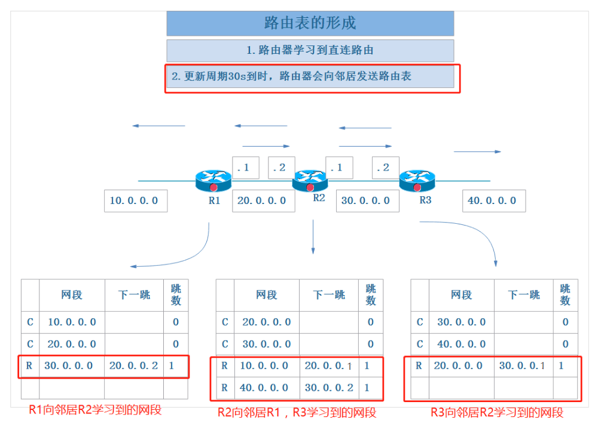

# 网络层: 动态路由 - RIP

<br>


## 一、动态路由

### 0x01 简述

- 动态路由是与静态路由相对的一个概念，指路由器能够根据路由器之间的交换的特定路由信息自动地建立自己的路由表，并且能够根据链路和节点的变化适时地进行自动调整
- 当网络中节点或节点间的链路发生故障，或存在其它可用路由时，动态路由可以自行选择最佳的可用路由并继续转发报文
- 相对于静态路由来说，动态路由减少了网络管理，但占用了网络带宽。

### 0x02 动态路由的度量值

度量值是衡量动态路由路径优劣的参数

- 跳数：一个路由器就是一跳，跳数越小越好
- 带宽：用来标识信号传输的数据传输能力、标识单位时间内通过链路的数据量、标识显示器的显示能力。
- 负载：承载的传输数据量。
- 时延：指一个报文或分组从一个网络的一端传送到另一个端所需要的时间
- 可靠性：数据传输的稳定性和效率。
- 成本：带宽越高，路径成本越低

### 0x03 动态路由协议分类

- 距离矢量路由协议：依据从源网络到目标网络所经过的路由器个数(跳数)选择路由，如 RIP、IGRP
- 链路状态路由协议：综合考虑从源网络到目标网络的各条路径的情况这种路由，如 OSPF、IS-IS

<br>

## 二、RIP

RIP (Routing Information Protocol) 是一个距离矢量路由选择协议，它每隔 30s 就会就会将自己完整的路由表信息，以广播的形式通知到所有激活的接口(相连的路由器)。

RIP 协议选择最佳路径的标准是跳数，认为到达目标网络所经过的路由器最少的路径就是最佳路径。默认它所允许的最大跳数是 15 跳，也就是说 16 跳的距离将被认为是不可到达的。

RIP 虽处在网络层，但实际用的是传输层 UDP 协议，端口为 520。

### 0x01 RIP 协议工作原理

##### 路由器学习到直连路由的网段，并添加到路由表中。


##### 第一个更新周期 30s 时间到后，每个路由器都会给邻居路由器广播 RIP 报文，报文的内容就是路由器当前的路由表信息。



- R1 将第一步学习到的直连路由 10.0.0.0 和 20.0.0.0 发送给自己的邻居路由器 R2。R2 收到后将自己没有的 10.0.0.0 网段直接添加到自己的路由表中。
- R2 将第一步学习到的直连路由 20.0.0.0 和 30.0.0.0 发送给自己的邻居路由器 R2、R3。R1 收到后将自己没有的 30.0.0.0 网段直接添加到自己的路由表中，R3 收到后将自己没有的 20.0.0.0 网段直接添加到自己的路由表中。
- R3 将第一步学习到的直连路由 30.0.0.0 和 40.0.0.0 发送给自己的邻居路由器 R2。R2 收到后将自己没有的 40.0.0.0 网段直接添加到自己的路由表中。

##### 再过 30s 第二个更新周期到后，再次给邻居路由器发送路由表信息。


- R1 将第二步建立的路由 10.0.0.0、20.0.0.0、30.0.0.0 发送给自己的邻居路由器 R2。R2 收到后发现这三个路由都在自己的路由表中，且跳数一样则不做更新。
- R2 将第二步建立的路由 10.0.0.0、20.0.0.0、30.0.0.0、40.0.0.0 发送给自己的邻居路由器 R2、R3。R1 收到后将自己没有的 40.0.0.0 网段添加到自己的路由表中，跳数加 1。R3 收到后将自己没有的 10.0.0.0 网段添加到自己的路由表中，跳数加 1。
- R3 将第二步建立的路由 20.0.0.0、30.0.0.0、40.0.0.0 发送给自己的邻居路由器 R2。R2 收到后发现这三个路由都在自己的路由表中，且跳数一样则不做更新。

##### 当存在有一个以上的路由到同一目的地，则将跳数最小的路由添加到路由表中。


##### 当一个现有路由不可用时，不会立刻丢弃路由信息而会等待180秒，如果到 180 秒链路还是没有恢复，那么会再等待 60 秒，如果在这 60 秒内链路恢复了，那就继续正常使用，如果 60 秒以后还没有恢复，那么就到了 180+60 = 240 秒了，这个时候路由信息就被刷新丢弃了。

### 0x02 路由环路

由于路由器在学习路由时，存在 30s (默认)的时间差，这就有可能出现路由环路的现象。如图若 R3 的 40.0.0.0 网段突然坏了，R3 会立即将 40.0.0.0 网段的跳数设为 16。


- 若 R3 更新周期先到，将 40.0.0.0 网段坏掉的信息通告给 R2，则万事大吉
- 若 R2 更新周期先到，这时 R2 并不知道 40.0.0.0 已经出问题。依旧会将自身的路由表信息广播出去。R3 收到后将 40.0.0.0 网段添加到自己的路由表中。


此时 R2 的路由表中有 40.0.0.0 网段，下一跳是 30.0.0.2。R3 的路由表中也有40.0.0.0 网段，下一跳是 30.0.0.1。


当有数据包从 R1 转发到 40.0.0.0 网段时，数据包会在 R2 和 R3 之间一直往复传递下去，直到 TTL = 0 丢弃数据包。这就是路由环路。

为了解决路由环路的问题：

- 设置最大路由跳数：为路由跳数作限制，RIP的最大跳数是 15 跳，16跳就不可达了。
- 水平分割(split horizon)：路由器从某个接口接收到的路由信息，不允许再从这个接口发回去。如上图 R2 在 Se2/0（假设）接口收到 R3 中到达 40.0.0.0 网段的路由信息，就在自己更新周期到来时将 40.0.0.0 的消息再告诉 R3。
- 毒性逆转(poison reverse)：指的是 RIP 从某个接口学到路由后，将该路由的开销设置为16（即指明该路由不可达），并从原接口发回邻居设备。
- 触发更新：指路由信息发生变化时，立即向邻居设备发送触发更新报文，通知变化的路由信息。

### 0x03 RIP 版本

RIP v1:

- 发送路由更新时不携带子网掩码，属于有类路由协议，不支持子网划分。
- 发送路由更新时，目标地址为广播地址：255.255.255.255
- 在主网边界的自动汇总是无法关闭的。

RIP v2：

- 发送路由更新是携带子网掩码，属于无类路由协议，支持子网划分。
- 发送路由更新时，目标地址为组播地址：224.0.0.9
- 可以关闭主网边界的路由自动汇总

<br>

## 三、RIP 动态路由实验

搭建如下图配置的实验环境


### 0x01 配置电脑和路由的 IP 地址

- 设置电脑 PC1 

```
// 设置 ip 子网掩码 网关
PC1> ip 192.168.0.2 255.255.255.0 192.168.0.1
Checking for duplicate address...
PC1 : 192.168.0.2 255.255.255.0 gateway 192.168.0.1

// 保存
PC1> save
Saving startup configuration to startup.vpc
.  done

// 查看配置
PC1> show ip  
NAME        : PC1[1]
IP/MASK     : 192.168.0.2/24
GATEWAY     : 192.168.0.1
DNS         : 
MAC         : 00:50:79:66:68:00
LPORT       : 10008
RHOST:PORT  : 127.0.0.1:10009
MTU:        : 1500
```

- 设置路由器 R1

```
// 进入配置状态
R1# configure terminal

// 配置端口
R1(config)# interface fastEthernet 0/0
// 配置 IP 地址和子网掩码
R1(config-if)# ip address 192.168.0.1 255.255.255.0
// 启动端口
R1(config-if)#no shutdown 
*Jan 29 15:01:28.371: %LINK-3-UPDOWN: Interface FastEthernet0/0, changed state to up
*Jan 29 15:01:29.371: %LINEPROTO-5-UPDOWN: Line protocol on Interface FastEthernet0/0, changed state to up

// 配置 serial 2/0
R1(config-if)# exit
R1(config)# interface serial 2/0
R1(config-if)# ip address 192.168.1.1 255.255.255.0
R1(config-if)# no shutdown 

// 配置 serial 2/1
R1(config-if)# exit
R1(config)# interface serial 2/1
R1(config-if)# ip address 192.168.4.1 255.255.255.0
R1(config-if)# no shutdown 

// 查看所有端口的配置信息
R1# show ip interface brief 
Interface                  IP-Address      OK? Method Status                Protocol
FastEthernet0/0            192.168.0.1     YES manual up                    up      
FastEthernet0/1            unassigned      YES unset  administratively down down    
GigabitEthernet1/0         unassigned      YES unset  administratively down down    
Serial2/0                  192.168.1.1     YES manual up                    down    
Serial2/1                  192.168.4.1     YES manual up                    down    
Serial2/2                  unassigned      YES unset  administratively down down    
Serial2/3                  unassigned      YES unset  administratively down down    
Serial2/4                  unassigned      YES unset  administratively down down    
Serial2/5                  unassigned      YES unset  administratively down down    
Serial2/6                  unassigned      YES unset  administratively down down    
Serial2/7                  unassigned      YES unset  administratively down down  
```

同理可配置其他路由器和电脑的 IP 地址。

### 0x02 检查同网段下是否能通信

- R1 `ping `自己直连的三个网段

```
R1# ping 192.168.0.2 
Type escape sequence to abort.
Sending 5, 100-byte ICMP Echos to 192.168.0.2, timeout is 2 seconds:
.!!!!
Success rate is 80 percent (4/5), round-trip min/avg/max = 24/274/964 ms

R1# ping 192.168.1.2
Type escape sequence to abort.
Sending 5, 100-byte ICMP Echos to 192.168.1.2, timeout is 2 seconds:
!!!!!
Success rate is 100 percent (5/5), round-trip min/avg/max = 8/30/92 ms

R1# ping 192.168.4.2
Type escape sequence to abort.
Sending 5, 100-byte ICMP Echos to 192.168.4.2, timeout is 2 seconds:
!!!!!
Success rate is 100 percent (5/5), round-trip min/avg/max = 16/34/100 ms
```

- R3 `ping `自己直连的三个网段

```
R3# ping 192.168.3.2
Type escape sequence to abort.
Sending 5, 100-byte ICMP Echos to 192.168.3.2, timeout is 2 seconds:
.....
Success rate is 0 percent (0/5)

R3# ping 192.168.2.1
Type escape sequence to abort.
Sending 5, 100-byte ICMP Echos to 192.168.2.1, timeout is 2 seconds:
!!!!!
Success rate is 100 percent (5/5), round-trip min/avg/max = 28/121/452 ms

R3# ping 192.168.6.1
Type escape sequence to abort.
Sending 5, 100-byte ICMP Echos to 192.168.6.1, timeout is 2 seconds:
!!!!!
Success rate is 100 percent (5/5), round-trip min/avg/max = 16/40/116 ms
```

- R4 只需`ping `和 R5 直连的网段

```
R4# ping 192.168.5.2
Type escape sequence to abort.
Sending 5, 100-byte ICMP Echos to 192.168.5.2, timeout is 2 seconds:
!!!!!
Success rate is 100 percent (5/5), round-trip min/avg/max = 16/35/100 ms
```

### 0x03 

<br>

参考：

- [RIP动态路由原理与实验详解](https://blog.csdn.net/CN_TangZheng/article/details/102644103)

- [静态路由，动态路由 RIP](https://www.cnblogs.com/michael9/p/13376928.html)

- [常见动态路由协议之———RIP动态路由实验](https://blog.51cto.com/14464303/2436512)

<br>