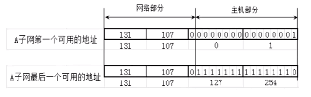
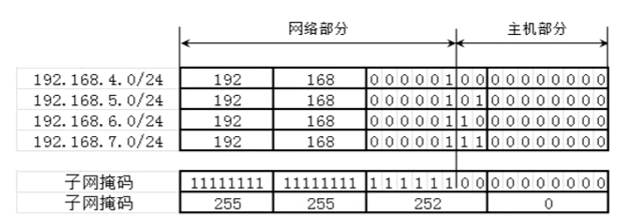

# 网络层 - 子网、超网


<br>

## 一、子网

### 0x01 为什么要进行子网划分？

假如张三开个公司，公司有 200 个人。那这 200 个人上网只需要给一个 C 类 IP 地址就能满足要求。如 192.168.1.0/24, 最多可以连接 254 个主机，完全满足 200 个人上网的需求， 资源也没有浪费。

有天公司公司规模扩大，公司变成 500 人，那一个 C 类 IP 地址就不能满足需求。有两种解决思路

- 给两个 C 类 IP 地址，但是这样将会跨网段

- 给一个 B 类 IP 地址, 不会跨网段

但是一个 B 类 IP 地址 (如 191.1.0.0/16) 最多可以连接 256 * 256 - 2 = 65534 个主机，而公司只需要 500 个，这就造成极大的资源浪费。为了避免这种资源浪费，我们需要进行子网划分。

**子网划分：借用现有的主机位作子网位，划分出多个子网**。有两种划分方式：

- 等长子网划分：将一个网段等分成多个子网，每个子网可用的 IP 地址数量一样

- 变成子网划分：每个子网的可用 IP 地址数量可以不一样

子网划分的任务包括两部分：

- 确定子网的子网掩码的长度

- 确定子网中的第一个和最后一个可用的 IP 地址

### 0x02 等长子网划分

#### 将一个 C 类 IP 地址等分成 2 个子网

如将 192.168.0.0/24 等分成 2 个子网，首先我们需要从主机位借一位当作子网位

```
// 192.168.0.0/24
192.168.0.0       10000000.10101000.00000000.00000000
255.255.255.0     11111111.11111111.11111111.00000000
```

借一位

```
// 192.168.0.0/25
192.168.0.0       10000000.10101000.00000000.0 0000000
255.255.255.128   11111111.11111111.11111111.1 0000000
```
A 子网第四部分最高位固定为 0，B 子网第四部分最高位固定为 1，子网掩码都是 255.255.255.128, 如下图


由于主机位全为0(网段)或全为 1 (广播)的地址保留所以

- A 子网主机可用 IP 地址： 192.168.0.1(0 0000001) ~ 192.168.0.126(0 1111111)

- B 子网主机可用 IP 地址： 192.168.0.129(1 0000001) ~ 192.168.0.254(1 1111110)


#### 将一个 C 类 IP 地址等分成 4 个子网

如将 192.168.0.0/24 等分成 4 个子网，我们需要从主机位借两位当作子网位。这样 IP 地址的第四部分最高两位可以分别取值 00、01、10、11， 子网掩码都是 255.255.255.192。 如下图


由于主机位全为0(网段)或全为 1 (广播)的地址保留所以

- A 子网主机可用 IP 地址： 192.168.0.1(00 000001) ~ 192.168.0.63 (00 111110)

- B 子网主机可用 IP 地址： 192.168.0.65(01 000001) ~ 192.168.0.126(01 111110)

- C 子网主机可用 IP 地址： 192.168.0.129(10 000001) ~ 192.168.0.190(10 111110)

- D 子网主机可用 IP 地址： 192.168.0.193(11 000001) ~ 192.168.0.254(11 111110)

#### 将一个 C 类 IP 地址等分成 8 个子网

如将 192.168.0.0/24 等分成 8 个子网，我们需要从主机位借三位当作子网位。这样 IP 地址的第四部分最高三位可以分别取值 000、001、010、011、100、101、110、111，子网掩码都是 255.255.255.224。 如下图


由于主机位全为0(网段)或全为 1 (广播)的地址保留所以

- A 子网主机可用 IP 地址： 192.168.0.1(000 00001) ~ 192.168.0.30 (000 11110)

- B 子网主机可用 IP 地址： 192.168.0.33(001 00001) ~ 192.168.0.62(001 11110)

- C 子网主机可用 IP 地址： 192.168.0.65(010 00001) ~ 192.168.0.94(010 11110)

- D 子网主机可用 IP 地址： 192.168.0.97(011 00001) ~ 192.168.0.126(011 11110)

- D 子网主机可用 IP 地址： 192.168.0.129(100 00001) ~ 192.168.0.158(100 11110)

- E 子网主机可用 IP 地址： 192.168.0.161(101 00001) ~ 192.168.0.190 (101 11110)

- G 子网主机可用 IP 地址： 192.168.0.193(110 00001) ~ 192.168.0.222(110 11110)

- H 子网主机可用 IP 地址： 192.168.0.225(111 00001) ~ 192.168.0.254(111 11110)

#### B 类子网划分

将 131.107.0.0/16 等分成两个子网，同样需要借一位主机位当作子网位。子网掩码就变成 255.255.128.0。


由于主机位全为0(网段)或全为 1 (广播)的地址保留所以

- A 子网主机可用 IP 地址： 131.107.0.1 ~ 131.107.127.254



- B 子网主机可用 IP 地址： 131.107.128.1 ~ 131.107.255.254


#### A 类子网划分

将 42.0.0.0/8 等分成四个子网，需要借两位主机位当作子网位。子网掩码就变成 255.192.0.0。


### 0x03 变成子网划分

等长子网划分出来的每个子网可用的 IP 地址数量一样，如四等分一个 C 类地址，则每个子网 IP 地址数量都是 62。但有时我们需要将一个 IP 地址划分成可用 IP 地址数量不同的子网。

如上面的 200 人公司，分为 A、B、C、D 四个部门。每个部门分别有 25、25、50、100 人。要求四个部门处在不同的网段。若分配四个 C 类地址，对于只有 25 人的部门有点浪费资源。若等长划分子网，对于 100 人的部门主机不够分配。这时我们就需要变长子网划分。


变长子网划分的规律：如果一个子网地址块的长度是原网段的 (1/2)^n， 那么

- 子网的子网掩码就是在原网段的基础上后移 n 位

- 不等长的子网，子网掩码也不同

如上图对 192.168.0.0/24 进行变长子网划分, 先将其等分成两份D、D', 子网掩码往后移一位

```
   10000000.10101000.00000000.00000000

D' 10000000.10101000.00000000.0 0000000
D  10000000.10101000.00000000.1 0000000
```

在对 D' 等分成两份C、C', 子网掩码再往后移一位

```
D' 10000000.10101000.00000000.0 0000000

C' 10000000.10101000.00000000.00 000000
C  10000000.10101000.00000000.01 000000
```

在对 C' 等分成两份A、B, 子网掩码再往后移一位

```
C' 10000000.10101000.00000000.000 00000

A  10000000.10101000.00000000.000 00000
B  10000000.10101000.00000000.001 00000
```

- D 网段的子网掩码 255.255.255.128, IP 地址 192.168.0.129(1 0000001) ~ 192.168.0.254(1 1111110)

- C 网段的子网掩码 255.255.255.192, IP 地址 192.168.0.65(01 000001) ~ 192.168.0.126(01 111110)

- B 网段的子网掩码 255.255.255.224, IP 地址 192.168.0.33(001 00001) ~ 192.168.0.62(001 11110)

- A 网段的子网掩码 255.255.255.224, IP 地址 192.168.0.1(000 00001) ~ 192.168.0.30(000 11110)

### 0x04 子网划分的注意点

- **将一个网络等分成 2 个子网，每个子网肯定是原来的一半**

- 子网地址的范围不能重叠

<br>

## 二、超网

上面说到 200 人公司扩大 500 人公司，可以将一个 B 类网络划分成不同网段的子网，达到节约资源的目的。若用等分子网划分的话，需要将 B 类网等分成 131 份，这样做太麻烦。既然可以将"大"网划分成"小"网，那我们可不可以将"小"网合并成"大"网？这就是要说的超网的概念，我们可以将两个 C 类地址合并成一个网段，就能连接256 * 2 - 2 = 510 个主机，刚好够用。

超网：将多个连续的网段合并成一个更大的网段，这时网络部分需要借位，即子网掩码需要往左移动。

### 0x01 使用超网合并网段

如将 192.168.0.0/24 、192.168.1.0/24 合并成一个网段


子网掩码是 255.255.254.0，IP 地址范围是 192.168.0.1 ~ 192.168.1.255

```
                   网络部分                 | 主机部分
192.168.0.1   => 10000000.10101000.0000000 | 0.00000000  
192.168.1.255 => 10000000.10101000.0000000 | 1.11111110
```

注意合并之后 192.168.0.255/23 就可以给计算机使用，因为它的主机位不全是 1


### 0x02 合并网段的规律

- 子网掩码往左移一位能够合并两个连续的网段，但并不是任意连续的网段都能合并。

如 192.168.1.0/24、192.168.1.0/24 就不能合并


因为 192.168.1.1/23 的网段是 192.168.1.0，而 192.168.2.1/23 的网段是 192.168.2.0，很明显不是同一个网段。

- 若第一个网段的网络号能被 n 整除，那由它开始连续的 n 个网段，能够通过左移 k 位子网掩码合并成一个新网段(其中 2^k = n, k >= 1)

如 192.168.4.0/24、192.168.5.0/24、192.168.6.0/24、192.168.7.0/24 能合并成一个超网，子网掩码是 255.255.252.0



如 192.168.1.0/24、192.168.2.0/24、192.168.3.0/24、192.168.4.0/24 不能合并成一个超网，第一个网络号 192.168.1.0 不能被 4 整除。

<br>

## 三、判断一个网段是子网还是超网


- 先看网段，A 类子网掩码默认是 8 位，B 类子网掩码默认是 16 位，C 类子网掩码默认是 24 位

- 若该网段的子网掩码的位数比默认子网掩码位数少，则是超网

- 若该网段的子网掩码的位数比默认子网掩码位数多，则是子网

- 如 192.168.1.0/23 是 C 类超网，40.0.0.0/16 是 A 类子网

<br>

<br>