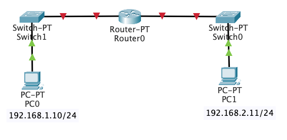
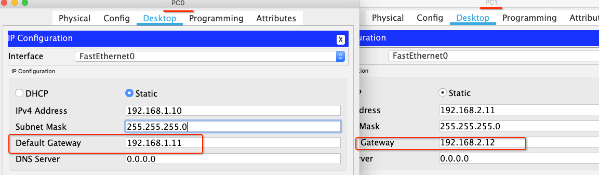

# 网络层 - 静态路由

<br>

用 Packet Tracer 模拟两个相同网段的计算机用网线直连通信。PC0 的 IP 地址设置为 192.168.1.10/24，PC1 的 IP 地址设置为 192.168.1.11/24


在 PC0 上 `ping 192.168.1.11`，可以看到数据包是能正常收发的

```
$ ping 192.168.1.11

Pinging 192.168.1.11 with 32 bytes of data:
Reply from 192.168.1.11: bytes=32 time=14ms TTL=128
Reply from 192.168.1.11: bytes=32 time<1ms TTL=128
Reply from 192.168.1.11: bytes=32 time<1ms TTL=128
Reply from 192.168.1.11: bytes=32 time<1ms TTL=128

Ping statistics for 192.168.1.11:
    Packets: Sent = 4, Received = 4, Lost = 0 (0% loss),
Approximate round trip times in milli-seconds:
    Minimum = 0ms, Maximum = 14ms, Average = 3ms
```

当我们用交换机连接两个相同网段的计算机，也是能通信


```
$ ping 192.168.1.11

Pinging 192.168.1.11 with 32 bytes of data:
Reply from 192.168.1.11: bytes=32 time=1ms TTL=128
Reply from 192.168.1.11: bytes=32 time=1ms TTL=128
Reply from 192.168.1.11: bytes=32 time<1ms TTL=128
Reply from 192.168.1.11: bytes=32 time<1ms TTL=128

Ping statistics for 192.168.1.11:
    Packets: Sent = 4, Received = 4, Lost = 0 (0% loss),
Approximate round trip times in milli-seconds:
    Minimum = 0ms, Maximum = 1ms, Average = 0ms
```

但用网线或交换机连接两个不同网段的计算机是无法通信的，将 PC1 的 IP 地址修改为 192.168.2.11/24


然后在 PC0 上 `ping 192.168.2.11`，可以看到数据包超时

```
$ ping 192.168.2.11

Pinging 192.168.2.11 with 32 bytes of data:
Request timed out.
Request timed out.
Request timed out.
Request timed out.

Ping statistics for 192.168.2.11:
    Packets: Sent = 4, Received = 0, Lost = 4 (100% loss),
```

在不同网段之间转发数据，需要路由器的支持。

- 直接路由：就是直接连接网段的路由，就是连接在各个路由器接口网段的路由，都是在路由器启动的时候可以直接得到的路由网段

- 静态路由：路由项（routing entry）由管理员手动配置，是固定的，不会改变，即使网络状况已经改变或是重新被组态依然不会变化。适用于小规模网络。

- 动态路由：通过路由选择协议（RIP、OSPF）自动获取路由信息。适用于大规模网络。

<br>

## 一、直连路由

如下图，用 Packet Tracer 模拟两个不同网段的计算机用路由器通信。PC0 的 IP 地址设置为 192.168.1.10/24，PC1 的 IP 地址设置为 192.168.2.11/24



设置路由器的以太网口，勾选之后红色三角变成绿色三角说明 PC0 连接的是 FastEthernet0/0。并设置 IP 地址 192.168.1.11/24


同理设置  FastEthernet1/0  IP 地址为 192.168.2.12/24，可以看到全部变成绿色三角


但在 PC0 上 `ping 192.168.2.11`，可以看到数据包仍然超时

```
$ ping 192.168.2.11

Pinging 192.168.2.12 with 32 bytes of data:
Request timed out.
Request timed out.
Request timed out.
Request timed out.

Ping statistics for 192.168.2.12:
    Packets: Sent = 4, Received = 0, Lost = 4 (100% loss),
```

这是因为没有设置计算机的网关，设置 PC0 的默认网关为 192.168.1.11，PC1 的默认网关为 192.168.2.12



然后在 PC0 上 `ping 192.168.2.11`，可以看到数据收发正常（第一次为啥失败后面会说到）

```
$ ping 192.168.2.11

Pinging 192.168.2.11 with 32 bytes of data:
Request timed out.
Reply from 192.168.2.11: bytes=32 time=2ms TTL=127
Reply from 192.168.2.11: bytes=32 time=1ms TTL=127
Reply from 192.168.2.11: bytes=32 time=2ms TTL=127

Ping statistics for 192.168.2.11:
    Packets: Sent = 4, Received = 3, Lost = 1 (25% loss),
Approximate round trip times in milli-seconds:
    Minimum = 1ms, Maximum = 2ms, Average = 1ms
```

当 PC0 向 PC1 发送数据包经过路由器时，路由器解析数据包得到目标 IP 地址的网段和自身 FastEthernet1/0 处在同一个网段，则路由器会将数据包转发到 FastEthernet1/0 再传送给 PC1。


<br>

## 二、静态路由


<br>


<br>

<br>