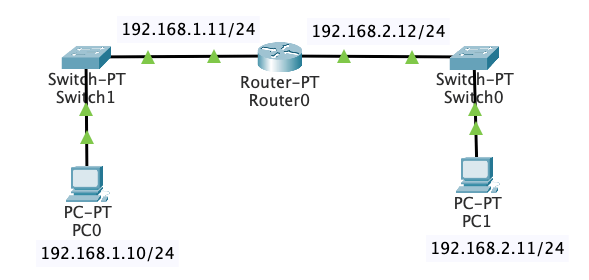
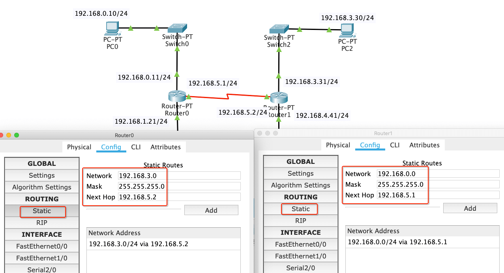
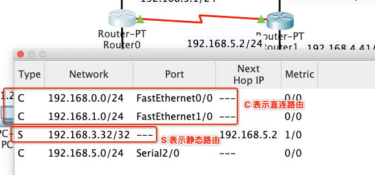
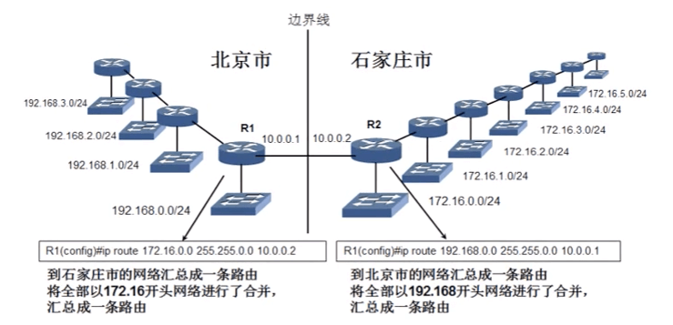
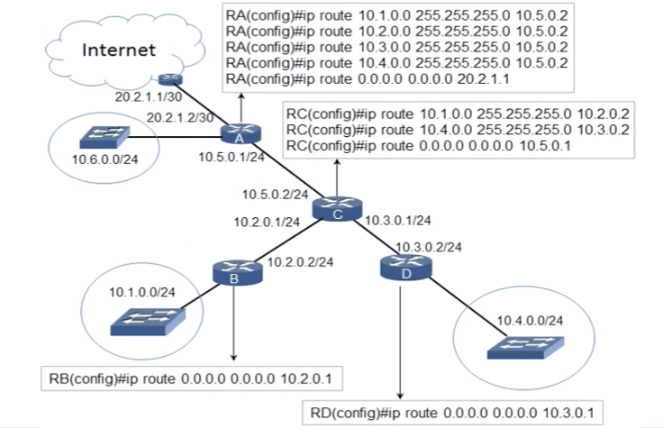
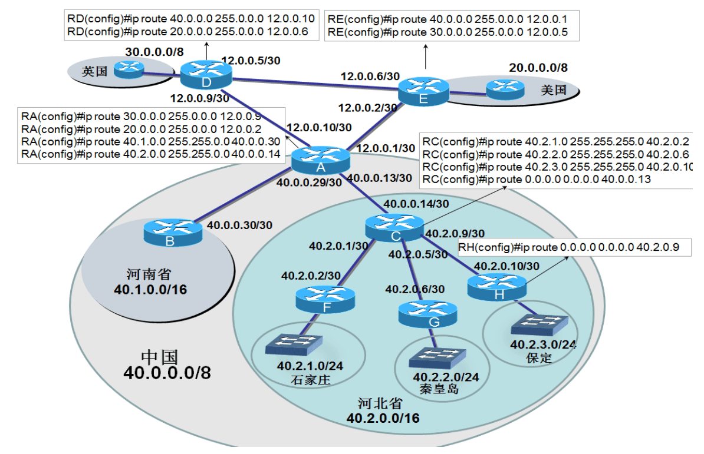

# 网络层 - 静态路由

<br>

用 Packet Tracer 模拟两个相同网段的计算机用网线直连通信。PC0 的 IP 地址设置为 192.168.1.10/24，PC1 的 IP 地址设置为 192.168.1.11/24


在 PC0 上 `ping 192.168.1.11`，可以看到数据包是能正常收发的

```
$ ping 192.168.1.11

Pinging 192.168.1.11 with 32 bytes of data:
Reply from 192.168.1.11: bytes=32 time=14ms TTL=128
Reply from 192.168.1.11: bytes=32 time<1ms TTL=128
Reply from 192.168.1.11: bytes=32 time<1ms TTL=128
Reply from 192.168.1.11: bytes=32 time<1ms TTL=128

Ping statistics for 192.168.1.11:
    Packets: Sent = 4, Received = 4, Lost = 0 (0% loss),
Approximate round trip times in milli-seconds:
    Minimum = 0ms, Maximum = 14ms, Average = 3ms
```

当我们用交换机连接两个相同网段的计算机，也是能通信


```
$ ping 192.168.1.11

Pinging 192.168.1.11 with 32 bytes of data:
Reply from 192.168.1.11: bytes=32 time=1ms TTL=128
Reply from 192.168.1.11: bytes=32 time=1ms TTL=128
Reply from 192.168.1.11: bytes=32 time<1ms TTL=128
Reply from 192.168.1.11: bytes=32 time<1ms TTL=128

Ping statistics for 192.168.1.11:
    Packets: Sent = 4, Received = 4, Lost = 0 (0% loss),
Approximate round trip times in milli-seconds:
    Minimum = 0ms, Maximum = 1ms, Average = 0ms
```

但用网线或交换机连接两个不同网段的计算机是无法通信的，将 PC1 的 IP 地址修改为 192.168.2.11/24


然后在 PC0 上 `ping 192.168.2.11`，可以看到数据包超时

```
$ ping 192.168.2.11

Pinging 192.168.2.11 with 32 bytes of data:
Request timed out.
Request timed out.
Request timed out.
Request timed out.

Ping statistics for 192.168.2.11:
    Packets: Sent = 4, Received = 0, Lost = 4 (100% loss),
```

在不同网段之间转发数据，需要路由器的支持。

- 直接路由：直接连接网段的路由，就是连接在各个路由器接口网段的路由，都是在路由器启动的时候可以直接得到的路由网段

- 静态路由：路由项（routing entry）由管理员手动配置，是固定的，不会改变，即使网络状况已经改变或是重新被组态依然不会变化。适用于小规模网络。

- 动态路由：通过路由选择协议（RIP、OSPF）自动获取路由信息。适用于大规模网络。

<br>

## 一、直连路由

如下图，用 Packet Tracer 模拟两个不同网段的计算机用路由器通信。PC0 的 IP 地址设置为 192.168.1.10/24，PC1 的 IP 地址设置为 192.168.2.11/24


设置路由器的以太网口，勾选之后红色三角变成绿色三角说明 PC0 连接的是 FastEthernet0/0。并设置 IP 地址 192.168.1.11/24


同理设置  FastEthernet1/0  IP 地址为 192.168.2.12/24，可以看到全部变成绿色三角



但在 PC0 上 `ping 192.168.2.11`，可以看到数据包仍然超时

```
$ ping 192.168.2.11

Pinging 192.168.2.12 with 32 bytes of data:
Request timed out.
Request timed out.
Request timed out.
Request timed out.

Ping statistics for 192.168.2.12:
    Packets: Sent = 4, Received = 0, Lost = 4 (100% loss),
```

这是因为没有设置计算机的网关，设置 PC0 的默认网关为 192.168.1.11，PC1 的默认网关为 192.168.2.12


然后在 PC0 上 `ping 192.168.2.11`，可以看到数据收发正常（第一次为啥失败后面会说到）

```
$ ping 192.168.2.11

Pinging 192.168.2.11 with 32 bytes of data:
Request timed out.
Reply from 192.168.2.11: bytes=32 time=2ms TTL=127
Reply from 192.168.2.11: bytes=32 time=1ms TTL=127
Reply from 192.168.2.11: bytes=32 time=2ms TTL=127

Ping statistics for 192.168.2.11:
    Packets: Sent = 4, Received = 3, Lost = 1 (25% loss),
Approximate round trip times in milli-seconds:
    Minimum = 1ms, Maximum = 2ms, Average = 1ms
```

默认情况下，路由器只知道跟它直连的网段。当 PC0 向 PC1 发送数据包经过路由器时，路由器解析数据包得到目标 IP 地址的网段和自身 FastEthernet1/0 处在同一个网段，则路由器会将数据包转发到 FastEthernet1/0 再传送给 PC1。

对于非直连的网段需要手动设置（静态路由）或通过协议（动态路由）来告诉它。

<br>

## 二、静态路由

### 0x01 两个路由器相连的不同网段之间的通信

用两个路由器连接四个计算机，并对计算机和路由器进行如图配置


通过前面的学习我们知道 192.168.0.0/24、192.168.1.0/24 两个网段通过 Router0 直连，是可以相互通信的。192.168.3.0/24、192.168.4.0/24 两个网段通过 Router1 直连，也是可以相互通信的。那192.168.0.0/24 和 192.168.3.0/24、192.168.4.0/24 是否能正常通信呢?

在 PC0 上 `ping 192.168.3.10`，提示 Destination host unreachable

```
$ ping 192.168.3.30

Pinging 192.168.3.30 with 32 bytes of data:
Reply from 192.168.0.11: Destination host unreachable.
Reply from 192.168.0.11: Destination host unreachable.
Request timed out.
Reply from 192.168.0.11: Destination host unreachable.

Ping statistics for 192.168.3.30:
    Packets: Sent = 4, Received = 0, Lost = 4 (100% loss)
```

同样在 PC2 上 `ping 192.168.0.10`，也会提示 Destination host unreachable

```
$ ping 192.168.0.10

Pinging 192.168.0.10 with 32 bytes of data:
Reply from 192.168.3.31: Destination host unreachable.
Reply from 192.168.3.31: Destination host unreachable.
Reply from 192.168.3.31: Destination host unreachable.
Reply from 192.168.3.31: Destination host unreachable.

Ping statistics for 192.168.0.10:
    Packets: Sent = 4, Received = 0, Lost = 4 (100% loss)
```

对于非直连网段之间的通信，我们可以通过设置静态路由来告诉路由器数据包该往哪转发。如图设置 Router0 的 Serial2/0 的 IP 地址为 192.168.5.1/24,  Router1 的 Serial2/0 的 IP 地址为 192.168.5.2/24。


然后配置 Router0、Router1 的静态路由，如图



当 PC0 和 PC3 通信时，数据包来到路由器解析得到目标 IP 地址的网段是 192.168.3.0/24，查看路由表知道要转发给 192.168.3.0/24 网段，需要先转发给 IP 地址是 192.168.5.2 的 Router1 （下一跳）。然后当数据包来到 Router1 发现 192.168.3.0/24 网段是我的直连网段，继续转发给 PC2。

数据包从 PC3 回到 PC0 要从 Router1 的路由表中得知 192.168.0.0/24 的下一跳地址是 192.168.5.1，再通过路由器的直连网段转发到 PC0


这时 PC0 和 PC4 仍然不能通信，因为当数据包从 PC0 发出到 Router0 时，Router0 并不知道目标 IP 地址是 192.168.4.40/24 该往哪转发。使用命令行给 Router0 添加静态路由

```
## ip route ip_address subnet_mask next_hop

Router(config)# ip route 192.168.4.0 255.255.255.0 192.168.5.2
```

可以看到 Router0 多了一个静态路由的配置


在 PC0 上 `ping 192.168.4.40`，可以看到网络畅通

```
$ ping 192.168.4.40

Pinging 192.168.4.40 with 32 bytes of data:
Request timed out.
Reply from 192.168.4.40: bytes=32 time=6ms TTL=126
Reply from 192.168.4.40: bytes=32 time=2ms TTL=126
Reply from 192.168.4.40: bytes=32 time=1ms TTL=126

Ping statistics for 192.168.4.40:
    Packets: Sent = 4, Received = 3, Lost = 1 (25% loss),
Approximate round trip times in milli-seconds:
    Minimum = 1ms, Maximum = 6ms, Average = 3ms
```

上面是添加某个网段的静态路由，我们还可以添加具体 IP 地址的静态路由。在 192.168.3.0/24 网段中多加一台计算机 PC4，并重新设置 Router0 的静态路由

```
Router(config)# ip route 192.168.3.32 255.255.255.255 192.168.5.2
```

可以看到在 PC0 上 `ping 192.168.3.32 `能通，但 `ping 192.168.3.30` 网络不通。


但是一般我们不这么做，因为每个 IP 地址对应一个静态路由操作起来太麻烦。

既然能添加具体 IP 地址的静态路由，那也能将 192.168.3.0/24、192.168.4.0/24 对应的静态路由合并成一条静态路由，这就所说的路由汇总。

### 0x02 查看路由表

- 视图查看

点击 Packet Tracer 放大镜标志的图标，再点击路由器，选择 `Routing Table`


可以看到路由器的直连路由和静态路由



- 命令行查看

```
$ show ip route
Codes: C - connected, S - static, I - IGRP, R - RIP, M - mobile, B - BGP
       D - EIGRP, EX - EIGRP external, O - OSPF, IA - OSPF inter area
       N1 - OSPF NSSA external type 1, N2 - OSPF NSSA external type 2
       E1 - OSPF external type 1, E2 - OSPF external type 2, E - EGP
       i - IS-IS, L1 - IS-IS level-1, L2 - IS-IS level-2, ia - IS-IS inter area
       * - candidate default, U - per-user static route, o - ODR
       P - periodic downloaded static route

Gateway of last resort is not set

C    192.168.0.0/24 is directly connected, FastEthernet0/0
C    192.168.1.0/24 is directly connected, FastEthernet1/0
     192.168.3.0/32 is subnetted, 1 subnets
S       192.168.3.32 [1/0] via 192.168.5.2
C    192.168.5.0/24 is directly connected, Serial2/0
```

### 0x03 路由汇总

Internet 是全球最大的互联网，如果 Internet 上的路由器把全球的网段都添加到路由表中，那将是一个非常庞大的路由表。路由器每转发一个数据包都要检查路由表为该数据包选择转发接口，而庞大的路由表势必会增加处理时延。


如上图，北京市要想和石家庄市正常通信，需要分别给路由器 R1、R2 添加静态路由

```
R1(config)# ip route 172.16.0.0 255.255.255.0 10.0.0.2
R1(config)# ip route 172.16.1.0 255.255.255.0 10.0.0.2
R1(config)# ip route 172.16.2.0 255.255.255.0 10.0.0.2
.
.
R1(config)# ip route 172.16.255.0 255.255.255.0 10.0.0.2
```

```
R2(config)# ip route 192.168.0.0 255.255.255.0 10.0.0.1
R2(config)# ip route 192.168.1.0 255.255.255.0 10.0.0.1
R2(config)# ip route 192.168.2.0 255.255.255.0 10.0.0.1
.
.
R2(config)# ip route 192.168.255.0 255.255.255.0 10.0.0.1
```

假如再有个上海市的边界路由器 R3 也想加入此网络(网段分别为 193.169.0.0/24、193.169.1.0/24、... 193.169.255.0/24)，那 R1、R2、R3 的路由表的数量将会成倍数增长。

仔细观察可以发现北京市和石家庄市的网段都被规划的很整齐，没有必要添加 256 条静态路由。我们可以通过合并网段来简化路由表。 R1、R2 的静态路都只需要添加一条就可以了。

```
R1(config)# ip route 172.16.0.0 255.255.0.0 10.0.0.2
```

```
R2(config)# ip route 192.168.0.0 255.255.0.0 10.0.0.1
```



通过合理的地址规划，将物理地址连续、网络分配地址连续的网段，在边界路由器上合并成一条路由，这就是路由汇总。

### 0x04 路由汇总例外

当网络地址分配不是那么整齐，如有一个 172.16.10.0/24 的网段出现在北京市，可以针对例外的网段单独添加一条静态路由。这样当路由器 R1 收到目标 IP 地址为 172.16.10.2 的数据包，会使用最长前缀匹配算法进行最精确的匹配，所以会优先选择第二条路由来转发。


### 0x05 无类域间路由 （CIDR）

我们可以通过改变子网掩码的长度来合并网段，达到简化路由表的目的。这种合并之后的网段打破传统的 A 类、B类、C类地址，我们称之为无类。


但并不是任意连续的网段都能左移子网掩码合并网段，可以点击这里[查看合并规则](https://github.com/zhaoName/Notes/blob/master/Netwotk/%E7%BD%91%E7%BB%9C%E5%B1%82-%E5%AD%90%E7%BD%91%E8%B6%85%E7%BD%91.md)

### 0x06 默认路由

上面说到可以将 192.168.0.0/24、192.168.1.0/24、... 192.168.255.0/24 合并成一个网段 192.168.0.0/16 达到简化路由表的目的。那我们也可以将 192.0.0.0/16、192.1.0.0/16、... 192.255.0.0/16 再合并成 192.0.0.0/8 网段。这样能通信的 IP 地址会更多。

再偷懒点我们可以添加 0.0.0.0/0 为静态路由，这样所有的网络地址都能通信。0.0.0.0 也被称为默认路由。

使用默认路由指向 Internet 的路由



- 对于路由器 B、D 来说若想连接其他网段都需要经过路由 C，所以只需要在 RB、RD 上添加一条默认路由，下一跳指向 RC 即可。

- 对于 RC 来说，数据包除了要转发给 RB、RD 之外，其他的都需要转发给 RA。所以我们可以对 RB、RD 单独添加，其他的添加默认路由。

- 对于 RA 只需要单独配置 10.1.0.0/24、10.2.0.0/24、10.3.0.0/24、10.4.0.0/24 网段，Internet 使用默认路由即可。

- 对 RA 来说可以使用合并上述四个网段，只配置两个静态路由

```
RA(config)# ip route 10.0.0.0 255.0.0.0 10.5.0.2
RA(config)# ip route 0.0.0.0 0.0.0.0 10.5.0.2
```

### 0x07 使用默认路由和路由汇总简化 Internet 上的路由表



- 对于末端网络（如石家庄、秦皇岛、保定等）只需添加一条默认路由指向省级路由器即可。

- 省级路由器（如C），数据包除了到石庄家、秦皇岛和保定的网络外，其余要么出省，要么出国，都需要转发到路由器 A。因此默认路由指向 A，而指向省内的那三个网络可以单独添加 3 条路由。

- 对于中国的国际出口路由器 A，需要添加到英国和美国的两条路由。还要添加河南及河北的两条路由。

- 美国的国际出口路由器 E，需要添加到中国和英国的两条路由。同理英国的路由器 E 也需要添加到中国和美国的两条路由。


### 0x08 默认路由造成的往复转发

默认路由能够简化路由表，从而减少数据转发查找路由表的处理时延。但默认路由使用不当会造成往复转发的问题。


在计算机A 上`ping` 计算机B，当数据包来到 RA 只有默认路由，下一跳指向 RB。然后将数据包转发给 RB，发现 172.18.0.0/24 是 RB 直连的网段，将数据包转发给计算机B。数据包从计算机 B 回到计算机 A 一样。

但在计算机A 上 `ping 172.18.1.1` ，数据包来到 RA 发现不是我直连的网段则走默认路由，数据包转发给 RB。RB 发现 172.18.1.0/24 也不是我直连的网段，又只有默认路由可走，数据包又回到 RA。这样往复转发知道 TTL 为0，丢弃此数据包。

<br>


<br>

<br>