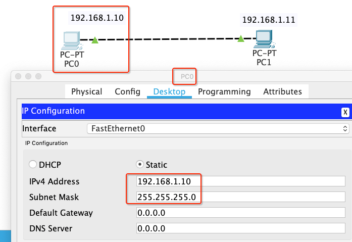
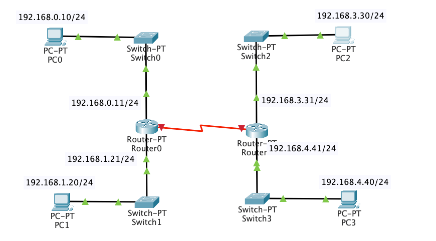
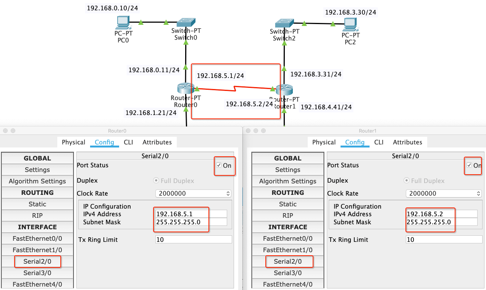

# 网络层 - 静态路由

<br>

用 Packet Tracer 模拟两个相同网段的计算机用网线直连通信。PC0 的 IP 地址设置为 192.168.1.10/24，PC1 的 IP 地址设置为 192.168.1.11/24



在 PC0 上 `ping 192.168.1.11`，可以看到数据包是能正常收发的

```
$ ping 192.168.1.11

Pinging 192.168.1.11 with 32 bytes of data:
Reply from 192.168.1.11: bytes=32 time=14ms TTL=128
Reply from 192.168.1.11: bytes=32 time<1ms TTL=128
Reply from 192.168.1.11: bytes=32 time<1ms TTL=128
Reply from 192.168.1.11: bytes=32 time<1ms TTL=128

Ping statistics for 192.168.1.11:
    Packets: Sent = 4, Received = 4, Lost = 0 (0% loss),
Approximate round trip times in milli-seconds:
    Minimum = 0ms, Maximum = 14ms, Average = 3ms
```

当我们用交换机连接两个相同网段的计算机，也是能通信


```
$ ping 192.168.1.11

Pinging 192.168.1.11 with 32 bytes of data:
Reply from 192.168.1.11: bytes=32 time=1ms TTL=128
Reply from 192.168.1.11: bytes=32 time=1ms TTL=128
Reply from 192.168.1.11: bytes=32 time<1ms TTL=128
Reply from 192.168.1.11: bytes=32 time<1ms TTL=128

Ping statistics for 192.168.1.11:
    Packets: Sent = 4, Received = 4, Lost = 0 (0% loss),
Approximate round trip times in milli-seconds:
    Minimum = 0ms, Maximum = 1ms, Average = 0ms
```

但用网线或交换机连接两个不同网段的计算机是无法通信的，将 PC1 的 IP 地址修改为 192.168.2.11/24


然后在 PC0 上 `ping 192.168.2.11`，可以看到数据包超时

```
$ ping 192.168.2.11

Pinging 192.168.2.11 with 32 bytes of data:
Request timed out.
Request timed out.
Request timed out.
Request timed out.

Ping statistics for 192.168.2.11:
    Packets: Sent = 4, Received = 0, Lost = 4 (100% loss),
```

在不同网段之间转发数据，需要路由器的支持。

- 直接路由：就是直接连接网段的路由，就是连接在各个路由器接口网段的路由，都是在路由器启动的时候可以直接得到的路由网段

- 静态路由：路由项（routing entry）由管理员手动配置，是固定的，不会改变，即使网络状况已经改变或是重新被组态依然不会变化。适用于小规模网络。

- 动态路由：通过路由选择协议（RIP、OSPF）自动获取路由信息。适用于大规模网络。

<br>

## 一、直连路由

如下图，用 Packet Tracer 模拟两个不同网段的计算机用路由器通信。PC0 的 IP 地址设置为 192.168.1.10/24，PC1 的 IP 地址设置为 192.168.2.11/24


设置路由器的以太网口，勾选之后红色三角变成绿色三角说明 PC0 连接的是 FastEthernet0/0。并设置 IP 地址 192.168.1.11/24


同理设置  FastEthernet1/0  IP 地址为 192.168.2.12/24，可以看到全部变成绿色三角


但在 PC0 上 `ping 192.168.2.11`，可以看到数据包仍然超时

```
$ ping 192.168.2.11

Pinging 192.168.2.12 with 32 bytes of data:
Request timed out.
Request timed out.
Request timed out.
Request timed out.

Ping statistics for 192.168.2.12:
    Packets: Sent = 4, Received = 0, Lost = 4 (100% loss),
```

这是因为没有设置计算机的网关，设置 PC0 的默认网关为 192.168.1.11，PC1 的默认网关为 192.168.2.12


然后在 PC0 上 `ping 192.168.2.11`，可以看到数据收发正常（第一次为啥失败后面会说到）

```
$ ping 192.168.2.11

Pinging 192.168.2.11 with 32 bytes of data:
Request timed out.
Reply from 192.168.2.11: bytes=32 time=2ms TTL=127
Reply from 192.168.2.11: bytes=32 time=1ms TTL=127
Reply from 192.168.2.11: bytes=32 time=2ms TTL=127

Ping statistics for 192.168.2.11:
    Packets: Sent = 4, Received = 3, Lost = 1 (25% loss),
Approximate round trip times in milli-seconds:
    Minimum = 1ms, Maximum = 2ms, Average = 1ms
```

默认情况下，路由器只知道跟它直连的网段。当 PC0 向 PC1 发送数据包经过路由器时，路由器解析数据包得到目标 IP 地址的网段和自身 FastEthernet1/0 处在同一个网段，则路由器会将数据包转发到 FastEthernet1/0 再传送给 PC1。

对于非直连的网段需要手动设置（静态路由）或通过协议（动态路由）来告诉它。

<br>

## 二、静态路由

用两个路由器连接四个计算机，并对计算机和路由器进行如图配置



通过前面的学习我们知道 192.168.0.0/24、192.168.1.0/24 两个网段通过 Router0 直连，是可以相互通信的。192.168.3.0/24、192.168.4.0/24 两个网段通过 Router1 直连，也是可以相互通信的。那192.168.0.0/24 和 192.168.3.0/24、192.168.4.0/24 是否能正常通信呢?

在 PC0 上 `ping 192.168.3.10`，提示 Destination host unreachable

```
$ ping 192.168.3.30

Pinging 192.168.3.30 with 32 bytes of data:
Reply from 192.168.0.11: Destination host unreachable.
Reply from 192.168.0.11: Destination host unreachable.
Request timed out.
Reply from 192.168.0.11: Destination host unreachable.

Ping statistics for 192.168.3.30:
    Packets: Sent = 4, Received = 0, Lost = 4 (100% loss)
```

同样在 PC2 上 `ping 192.168.0.10`，也会提示 Destination host unreachable

```
$ ping 192.168.0.10

Pinging 192.168.0.10 with 32 bytes of data:
Reply from 192.168.3.31: Destination host unreachable.
Reply from 192.168.3.31: Destination host unreachable.
Reply from 192.168.3.31: Destination host unreachable.
Reply from 192.168.3.31: Destination host unreachable.

Ping statistics for 192.168.0.10:
    Packets: Sent = 4, Received = 0, Lost = 4 (100% loss)
```

对于非直连网段之间的通信，我们可以通过设置静态路由来告诉路由器数据包该往哪转发。如图设置 Router0 的 Serial2/0 的 IP 地址为 192.168.5.1/24,  Router1 的 Serial2/0 的 IP 地址为 192.168.5.2/24。



然后配置 Router0、Router1 的静态路由，如图


当 PC0 和 PC3 通信时，数据包来到路由器解析得到目标 IP 地址的网段是 192.168.3.0/24，查看路由表知道要转发给 192.168.3.0/24 网段，需要先转发给 IP 地址是 192.168.5.2 的 Router1 （下一跳）。然后当数据包来到 Router1 发现 192.168.3.0/24 网段是我的直连网段，则转发给 PC2。

数据包从 PC3 回到 PC0 也要从 Router1 的路由表中得知 192.168.0.0/24 的下一跳地址是 192.168.5.1，再通过路由器的直连网段转发到 PC0


<br>


<br>

<br>