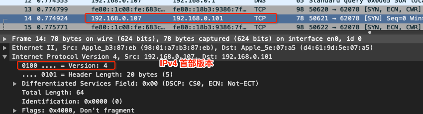
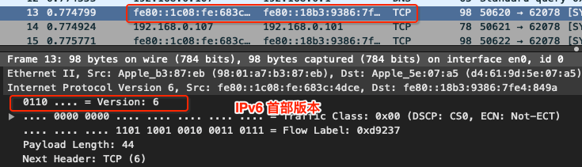

# 网络层 - 首部

 

IP 数据包由首部和数据两部分组成。首部的前一部分是固定 20 字节长度，是所有的 IP 数据包必须有的。在首部的固定部分后面是一些可选部分字段，其长度是可变的。

#### 0x01 版本

版本：占 4 个二进制位。0b0100: IPv4，0b0110: IPv6

#### 0x02 首部长度

首部长度(Header Length)：占 4 个二进制位，最大十进制数是 15。但注意这个字段的单位是 32 位二进制数(4 字节)。所以首部长度为 20 ~ 60 字节，也就是说首部变长内容最多40字节。

#### 0x03 区分服务

区分服务(Differentited Sevices Field)：占 8 个二进制位，可用于提高网络的服务质量 (Quality of Service QoS)

配置计算机给特定应用程序的数据包添加一个标记，然后在配置网络中的路由器优先转发这些带标记的数据包，在网络比较紧张的情况下，也能确保这种应用的带宽有保障。如常用的设置"下载优先"。

#### 0x04 总长度

总长度(Total Length)：占 16 个二进制位，首部 + 数据之和，最大 2^16 - 1 = 65535 字节。

但数据链路层帧的数据部分不能超过 1500 字节，所以长度太大的数据包要分片传给数据链路层。每一片都有自己的网络层首部，并且首部中有个标记，标记其属于哪个数据包。以便在接收方的网络层将其组装成一个完整的数据包。

#### 0x05 标识

标识 (Identification)：占 16 个二进制位。数据包的 ID，当数据包长度超过 1500 字节就会分片，且同一个数据包所有片的标识是一样的。如 `ping ke.qq.com -s 4000`

#### 0x06 标志

标志(Flags): 占 3 个二进制位。

- 第一位：保留位(Reserved bit)
- 第二位：Don't fragment，1 表示不允许分片 0 表示允许分片
- 第三位：More fragment，1 表示不是最后一片， 0 表示为最后一片

#### 0x07 片偏移

 

 

 

