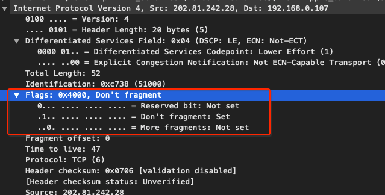

# 网络层 - 首部

<br>

## 一、首部

IP 数据包由首部和数据两部分组成。首部的前一部分是固定 20 字节长度，是所有的 IP 数据包必须有的。在首部的固定部分后面是一些可选部分字段，其长度是可变的。


#### 0x01 版本

版本：占 4 个二进制位。0b0100: IPv4，0b0110: IPv6


#### 0x02 首部长度

首部长度(Header Length)：占 4 个二进制位，最大十进制数是 15。但注意这个字段的单位是 32 位二进制数(4 字节)。所以首部长度为 20 ~ 60 字节，也就是说首部变长内容最多40字节。


#### 0x03 区分服务

区分服务(Differentited Sevices Field)：占 8 个二进制位，可用于提高网络的服务质量 (Quality of Service QoS)


配置计算机给特定应用程序的数据包添加一个标记，然后在配置网络中的路由器优先转发这些带标记的数据包，在网络比较紧张的情况下，也能确保这种应用的带宽有保障。如常用的设置"下载优先"。

#### 0x04 总长度

总长度(Total Length)：占 16 个二进制位，首部 + 数据之和，最大 2^16 - 1 = 65535 字节。


但数据链路层帧的数据部分不能超过 1500 字节，所以长度太大的数据包要分片传给数据链路层。每一片都有自己的网络层首部，并且首部中有个标记，标记其属于哪个数据包。以便在接收方的网络层将其组装成一个完整的数据包。


#### 0x05 标识

标识 (Identification)：占 16 个二进制位。数据包的 ID，当数据包长度超过 1500 字节就会分片，且同一个数据包所有片的标识是一样的。如 `ping ke.qq.com -s 4000`


#### 0x06 标志

标志(Flags): 占 3 个二进制位。



- 第一位：保留位(Reserved bit)
- 第二位：Don't fragment，1 表示不允许分片 0 表示允许分片
- 第三位：More fragment，1 表示不是最后一片， 0 表示为最后一片

#### 0x07 片偏移

片偏移(Fragment offset)占 13 位二进制。片偏移指出较长的数据包在分片后，某片在原数据包中相对位置。片偏移以 8 字节为偏移单位，也就是说每个分片的长度肯定是 8 的倍数。


#### 0x08 生存时间

生存时间 (Time To Live, TTL) 占 8 位二进制, 用来限制数据包能够通过路由器的数量。每个路由器在转发之前都会将 TTL 减 1，一旦发现 TTL = 0 ，路由器就会返回错误报告。

```
## mac 环境下
$ ping baidu.com -m 2

PING baidu.com (39.156.69.79): 56 data bytes
92 bytes from 192.168.1.1 (192.168.1.1): Time to live exceeded
Vr HL TOS  Len   ID Flg  off TTL Pro  cks      Src      Dst
 4  5  00 5400 b954   0 0000  01  01 d256 192.168.0.107  39.156.69.79

Request timeout for icmp_seq 0
92 bytes from 192.168.1.1 (192.168.1.1): Time to live exceeded
Vr HL TOS  Len   ID Flg  off TTL Pro  cks      Src      Dst
 4  5  00 5400 7f35   0 0000  01  01 0c76 192.168.0.107  39.156.69.79
```

各操作系统发送数据包时默认 TTL 值

| 操作系统 | 版本 | 默认 TLL |
| ---- | ---- | ---- |
| Windows | Server 2003、XP、Window 7、Window 10 | 128 |
| Linux | 2.0.x kernel、Red Hat 9 | 64 |
| Linux | 2.2.14 kernel、2.4 kernel | 255 |
| Mac OS |  | 60 |
| Mac OS X |  | 64 |

#### 0x09 协议

协议 (Protocol) 占 8 位二进制，该字段指出此数据包携带的数据是使用何种协议。

| 协议名 | ICMP | IGMP | IP | TCP | EGP | IGP | UDP | IPv6 | ESP | OSPF |
| ---- | ---- | ---- | ---- | ---- | ---- | ---- | ---- | ---- | ---- | ---- | 
| 值(十进制) | 1 | 2 | 4 |  6 |  8 | 9 | 17 | 41 | 50 | 89 | 

#### 0x0a 首部检验和

首部检验和 (Header Checksum) 占 16 位二进制。用于检验首部是否有错误。

<br>

## 二、分片

<br>

## 三、TTL

<br>

<br>

