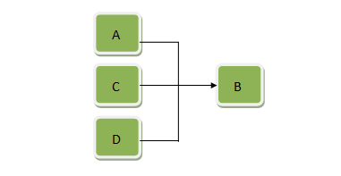

#  充分条件 & 必要条件

 

### 0x01 充分条件

如果条件 A 是结论 B 的充分条件：A 与其他条件是并连关系，即 A、C、D….中任意一个存在都可以使得 B 成立，如下图：

- 如果条件 A 存在，B 肯定成立，即 A→B（箭头表示能够推导出）

- 如果 B 不成立，则说明所有可能的条件都不存在，因此 A 肯定也不存在，即非 B→非 A

- 如果条件 A 不存在，而条件 C、D 可能存在，也可以使得 B 成立，即不能导出非 A→非 B

 

### 0x02 必要条件

条件 A 是结论 B 的必要条件：A 与其他条件是串联关系，即条件 A 必须存在，且条件 C、D….也全部存在才可能导致 B 结论。 

- 如果 B 成立了，说明所有条件都存在，肯定存在条件 A。即 B→A。

- 如果条件 A 不存在，串联少了一个条件，B 也肯定不能成立，即 非A→非 B。

- 如果 B 不成立，可能是 C，D 不存在但 A 存在，只是C、D 掉链子了，即不能导出 非 B→非 A

 

### 0x03 如果 p 是 q 的充分条件，那么 q 一定是 p 的必要条件

解释：“p 是 q 的充分条件”，根据充分条件图

如果q（B）不成立，则说明所有可能的条件都不存在，因此p（A）肯定也不存在，也就是说 q 的存在对于 p 的存在是必要的。因此 q 一定是 p 的必要条件。

 

### 0x04 如果 p 是 q 的必要条件，q 一定是 p 的充分条件

解释：“p 是 q 的必要条件”，根据必要条件图：

如果 q（B）成立，则说明包括 p（A）在内所有可能的条件肯定都存在，因此 p（A）肯定也存在，也就是说 q 的存在对于 p 的存在已经很充分，不需要别的其他条件。因此 q 一定是 p 的充分条件。

 

### 0x05 p 对于 q 是不充分的，q 对于 p 一定不必要

分两种情况：

1 ) p 对于 q 是必要不充分的，那么 q 对于 p 一定是充分不必要条件

解释：“p 对于 q 是必要不充分的”，根据必要条件图：

- 如果 q（B）成立，则说明包括 p（A）在内所有可能的条件肯定都存在，因此 p（A）肯定也存在，也就是说q 的存在对于 p 的存在已经很充分，不需要别的其他条件。因此 q 一定是 p 的充分条件。

- “p 对于 q 不充分”是说除了p必须还有其他条件共同存在才能导致 q 存在。只能推断出 p 和 q 不是充分必要条件。这句话不能得出其他推论。

- 在“q 是 p 的充分条件”的基础上，假如q也是p的必要条件，那么q 就是 p 的充分必要条件，那么 p 也是 q 的充分必要条件，与1）“p 对于 q 是必要不充分的”相矛盾，且与“p 和 q 不是充分必要条件”相矛盾，因此 q 不是 p 的必要条件。

- 因此，q 对于 p 一定是充分不必要条件。

2 ) p 对于 q 是不必要不充分的，那么 q 对于 p 不充分也不必要。

- 解释：“p 对于 q 是不必要不充分的”，则 p 和 q 没有任何关系，因此 q 对于 p 不充分也不必要

**综上 q 对于 p 一定不必要**

 

### 0x06 如果 p 对于 q 不必要，q 对于 p一定不充分

 分两种情况：

1）p 对于 q 充分不必要，那么 q 对于 p 一定必要不充分

解释：“p 对于 q 是充分不必要的”，根据充分条件图:

- “p 对于 q 是充分的”，就是说如果 q（B）不成立，则说明所有可能的条件都不存在，因此 p（A）肯定也不存在，也就是说 q 的存在对于 p 的存在是很必要的。因此 q 一定是 p 的必要条件。

- “p 对于 q 是不必要的”，说明不一定需要 p 存在，而是存在其他条件也能够导致 q 存在，因此 q 存在不一定是因为 p 存在，还有可能是其他条件存在，因此 q 的存在不能推导出 p 存在，因此 q 是 p 的不充分条件。

- 因此，q 对于 p 一定是必要不充分条件。

2）p 对于 q 不充分不必要，那么 q 对于 p 一定不必要也不充分。

- 解释：“p 对于 q 是不充分不必要”，则 p 和 q 没有任何关系，因此 q 对于 p 不必要也不充分。

**综上 q 对于 p 一定不充分。**

 

 

本文取自 [暮野](https://www.zhihu.com/question/30469121) 的回答。