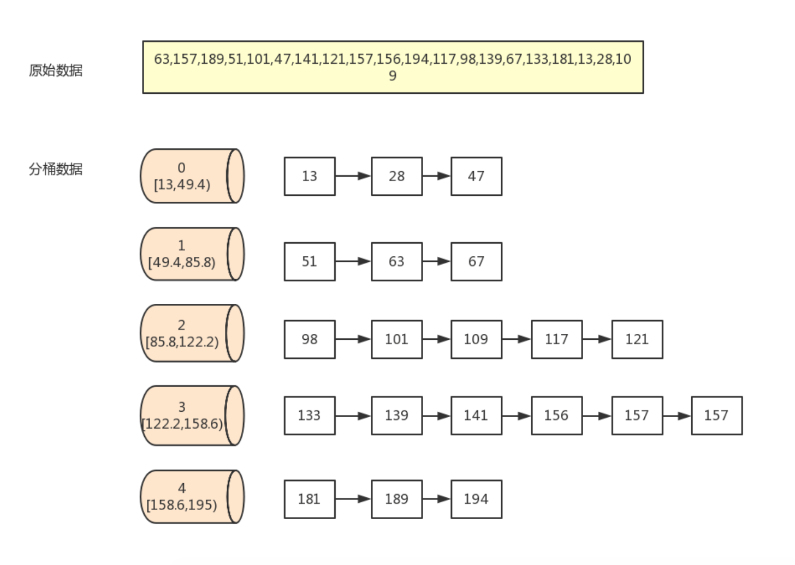

# 桶排序

<br>

桶排序 (Bucket sort) 或所谓的箱排序，是一个排序算法，工作的原理是将数组分到有限数量的桶子里。每个桶子再个别排序（有可能再使用别的排序算法或是以递归方式继续使用桶排序进行排序）。为了使桶排序更加高效，我们需要做到这两点：

- 在额外空间充足的情况下，尽量增大桶的数量

- 使用的映射函数能够将输入的 N 个数据均匀的分配到 K 个桶中

同时，对于桶中元素的排序，选择何种比较排序算法对于性能的影响至关重要。

**当输入的数据可以均匀的分配到每一个桶中，排序最快；当输入的数据被分配到了同一个桶中，排序最慢。**


### 算法原理

- 找到数组中的最大值 max 和最小值 min，然后根据桶数为 BucketCount，计算出每个桶的大小为 `bucketSize = floor((max - min) / BucketCount) + 1`

- 遍历所给数据，找到 arr[i] 对应的桶`floor((arr[i] - min) / bucketSize)`，将 arr[i] 放入该桶中

- 对每个桶进行排序，然后合并桶。得到的数据就是有序的。


### 图片展示




### OC 代码实现

```
- (void)bucketSort:(NSMutableArray *)arr
{
    if (arr.count < 2) return;
    
    int maxValue = [arr[0] intValue];
    int minValue = [arr[0] intValue];
    int bucketCount = 5; // 桶的个数
    
    for (int i=1; i<arr.count; i++) {
        if (maxValue < [arr[i] intValue]) {
            maxValue = [arr[i] intValue];
        }
        if (minValue > [arr[i] intValue]) {
            minValue = [arr[i] intValue];
        }
    }
    
    // 每个桶的大小。注意+1  防止越界
    int bucketSize = floorf((maxValue - minValue) / bucketCount) + 1;
    // 构造二维数组 并初始化
    NSMutableArray *buckets = [[NSMutableArray alloc] init];
    for (int i=0; i<bucketCount; i++) {
        [buckets addObject:[NSMutableArray array]];
    }
    
    for (int i=0; i<arr.count; i++) {
        // 计算 arr[i] 所在的桶
        int index = floorf(([arr[i] intValue] - minValue) / bucketSize);
        [buckets[index] addObject:arr[i]];
    }
    
    [arr removeAllObjects];
    for (int i=0; i<bucketCount; i++)
    {
        for (int j=0; j<[buckets[i] count]; j++) {
            // 借助插入排序 对每个桶排序
            [self insertionSort2:buckets[i]];
            //
            [arr addObject:buckets[i][j]];
        }
        [self printfArr:arr];
    }
}

// 打印结果
2019-08-26 10:40:18.812186+0800 Sort[29701:2925254] 13 28 47
2019-08-26 10:40:18.812383+0800 Sort[29701:2925254] 13 28 47 51 63 67
2019-08-26 10:40:18.812556+0800 Sort[29701:2925254] 13 28 47 51 63 67 98 101 109 117 121
2019-08-26 10:40:18.812732+0800 Sort[29701:2925254] 13 28 47 51 63 67 98 101 109 117 121 139 141 156 156 157 157
2019-08-26 10:40:18.812955+0800 Sort[29701:2925254] 13 28 47 51 63 67 98 101 109 117 121 139 141 156 156 157 157 181 189 194
```


<br>

**参考：**

- [排序算法之桶排序的深入理解以及性能分析](https://dailc.github.io/2016/12/03/baseKnowlenge_algorithm_sort_bucketSort.html)

- [Bucket Sort](https://github.com/hustcc/JS-Sorting-Algorithm/blob/master/9.bucketSort.md)

写于2019-08-25

<br>