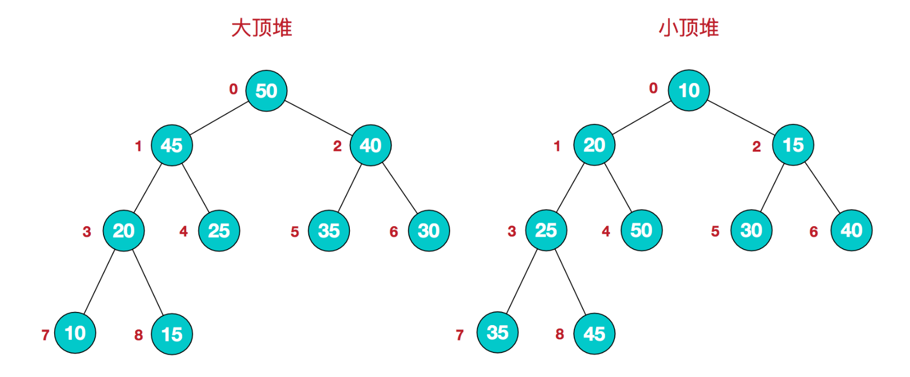
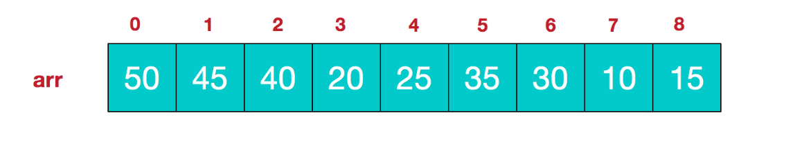

# 堆排序

<br>

堆排序(Heap Sort)是指利用堆这种数据结构所设计的一种排序算法。堆积是一个近似完全二叉树的结构，并同时满足堆积的性质：即子结点的键值或索引总是小于（或者大于）它的父节点。堆排序可以说是一种利用堆的概念来排序的选择排序。分为两种方法：

- 大顶堆：每个节点的值都大于或等于其子节点的值，在堆排序算法中用于升序排列；

- 小顶堆：每个节点的值都小于或等于其子节点的值，在堆排序算法中用于降序排列；

堆排序的平均时间复杂度为 Ο(nlogn)。在介绍堆排序前，先了解堆结构。


## 一、堆结构

堆是具有以下性质的完全二叉树：每个结点的值都大于或等于其左右孩子结点的值，称为大顶堆；或者每个结点的值都小于或等于其左右孩子结点的值，称为小顶堆。





同时，我们对堆中的结点按层进行编号，将这种逻辑结构映射到数组中就是下面这个样子:



该数组从逻辑上讲就是一个堆结构，我们用简单的公式来描述一下堆的定义就是：

**大顶堆：arr[i] >= arr[2i+1] && arr[i] >= arr[2i+2]**

**小顶堆：arr[i] <= arr[2i+1] && arr[i] <= arr[2i+2]**  


## 二、堆排序


### 算法原理

- 将待排序数据构造成一个大顶堆(小顶堆)，此时整个序列的最大值就是堆顶的根节点。

- 交换数列的首末元素，将最大值放到数列末尾。

- 对剩下的数列构成一个大顶堆，得到数列中的次小值，放到对应位置。

- 重复上述步骤，最终能得到一个有序数列。


### 动画展示


### OC 代码实现

```
- (void)heapSort:(NSMutableArray *)arr
{
    int len = (int)arr.count;
    
    // 构造大顶堆 即将最大值放到数组的首元素
    [self fetchMaxHeap:arr sortLen:len];
    
    for (int i=len-1; i>=0; i--) {
        // 交换位置 将最大值放到数组末尾
        [arr exchangeObjectAtIndex:0 withObjectAtIndex:i];
        NSLog(@"-----------");
        [self printfArr:arr];
        // 对剩余元素继续构造大顶堆
        len--;
        [self heapify:arr i:0 len:len];
    }
    [self printfArr:arr];
}

- (void)fetchMaxHeap:(NSMutableArray *)arr sortLen:(int)len
{
    for (int i = len / 2 - 1; i>=0; i--) {
        [self heapify:arr i:i len:len];
        [self printfArr:arr];
    }
}

- (void)heapify:(NSMutableArray *)arr i:(int)i len:(int)len
{
    int largest = i;
    int left = i * 2 + 1;
    int right = i *2 + 2;
    
    if (left < len && [arr[left] intValue] > [arr[largest] intValue]) {
        largest = left;
    }
    
    if (right < len && [arr[right] intValue] > [arr[largest] intValue]) {
        largest = right;
    }
    
    if (largest != i) {
        // 找到较大值 交换位置
        [arr exchangeObjectAtIndex:i withObjectAtIndex:largest];
        // 递归查找其父节点 是否有较大值
        [self heapify:arr i:largest len:len];
    }
}

2020-03-21 16:32:09.607703+0800 Sort[51091:1410407] 5 10 1 15 19 12 9 8 22 6
2020-03-21 16:32:09.608090+0800 Sort[51091:1410407] 5 10 1 22 19 12 9 8 15 6
2020-03-21 16:32:09.608318+0800 Sort[51091:1410407] 5 10 12 22 19 1 9 8 15 6
2020-03-21 16:32:09.608461+0800 Sort[51091:1410407] 5 22 12 15 19 1 9 8 10 6
2020-03-21 16:32:09.608621+0800 Sort[51091:1410407] 22 19 12 15 6 1 9 8 10 5
2020-03-21 16:32:09.608763+0800 Sort[51091:1410407] -----------
2020-03-21 16:32:09.608933+0800 Sort[51091:1410407] 5 19 12 15 6 1 9 8 10 22
2020-03-21 16:32:09.609100+0800 Sort[51091:1410407] -----------
2020-03-21 16:32:09.609281+0800 Sort[51091:1410407] 5 15 12 10 6 1 9 8 19 22
2020-03-21 16:32:09.609426+0800 Sort[51091:1410407] -----------
2020-03-21 16:32:09.609704+0800 Sort[51091:1410407] 5 10 12 8 6 1 9 15 19 22
2020-03-21 16:32:09.609944+0800 Sort[51091:1410407] -----------
2020-03-21 16:32:09.610295+0800 Sort[51091:1410407] 5 10 9 8 6 1 12 15 19 22
2020-03-21 16:32:09.610449+0800 Sort[51091:1410407] -----------
2020-03-21 16:32:09.610815+0800 Sort[51091:1410407] 1 8 9 5 6 10 12 15 19 22
2020-03-21 16:32:09.611008+0800 Sort[51091:1410407] -----------
2020-03-21 16:32:09.828844+0800 Sort[51091:1410407] 6 8 1 5 9 10 12 15 19 22
2020-03-21 16:32:09.828987+0800 Sort[51091:1410407] -----------
2020-03-21 16:32:09.829169+0800 Sort[51091:1410407] 5 6 1 8 9 10 12 15 19 22
2020-03-21 16:32:09.829292+0800 Sort[51091:1410407] -----------
2020-03-21 16:32:09.829445+0800 Sort[51091:1410407] 1 5 6 8 9 10 12 15 19 22
2020-03-21 16:32:09.829547+0800 Sort[51091:1410407] -----------
2020-03-21 16:32:09.829699+0800 Sort[51091:1410407] 1 5 6 8 9 10 12 15 19 22
2020-03-21 16:32:09.829809+0800 Sort[51091:1410407] -----------
2020-03-21 16:32:09.829951+0800 Sort[51091:1410407] 1 5 6 8 9 10 12 15 19 22
```

### C 代码实现

```
void c_heapSort(int arr[], int len)
{
    c_fetchMaxHeap(arr, len);
    
    int lll = len;
    
    for (int i=len -1; i>=0; i--) {
        
        swap(arr, 0, i);
        c_printfArr(arr, lll);
        
        len--;
        c_fetchMaxHeap(arr, len);
    }
}

void c_fetchMaxHeap(int arr[], int sortLen)
{
    for (int i = sortLen / 2 - 1; i>=0; i--) {
        c_heapify(arr, i, sortLen);
    }
}

void c_heapify(int arr[], int i, int sortLen)
{
    int largest = i;
    int left = i * 2 + 1;
    int right = i * 2 + 2;
    
    if (left < sortLen && arr[left] > arr[largest]) {
        largest = left;
    }
    
    if (right < sortLen && arr[right] > arr[largest]) {
        largest = right;
    }
    
    if (largest != i) {
        swap(arr, i, largest);
        c_heapify(arr, largest, sortLen);
    }
}

void swap(int arr[], int i, int j)
{
    int temp = arr[j];
    arr[j] = arr[i];
    arr[i] = temp;
}

// 打印结果
5 19 12 15 6 1 9 8 10 22 
5 15 12 10 6 1 9 8 19 22 
5 10 12 8 6 1 9 15 19 22 
5 10 9 8 6 1 12 15 19 22 
1 8 9 5 6 10 12 15 19 22 
6 8 1 5 9 10 12 15 19 22 
5 6 1 8 9 10 12 15 19 22 
1 5 6 8 9 10 12 15 19 22 
1 5 6 8 9 10 12 15 19 22 
1 5 6 8 9 10 12 15 19 22 
```


<br>

**参考：**

- [图解排序算法(三)之堆排序](https://www.cnblogs.com/chengxiao/p/6129630.html)

- [Heap Sort](https://github.com/hustcc/JS-Sorting-Algorithm/blob/master/7.heapSort.md)

写于2019-08-23

<br>