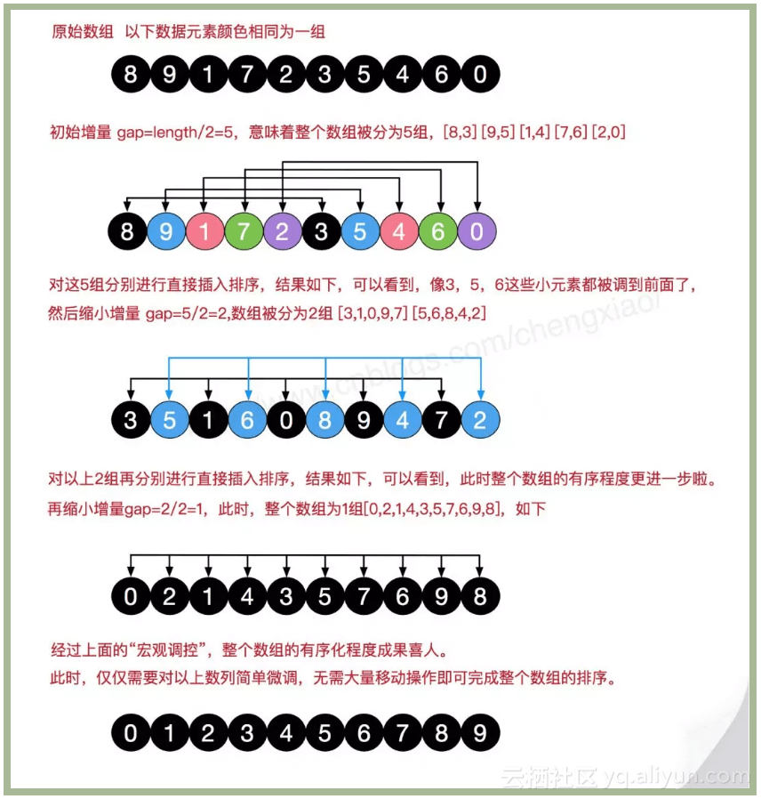

# 希尔排序

<br>

希尔排序是插入排序的优化版，是一种非稳定的排序算法。根据其排序特点希尔排序也称缩小增量排序。


### 算法原理

- 将无序序列按照一定的增量(间隔)分为几组，再将这几组的无序序列按掺入排序方式排序

- 然后缩小增量分组，再将分组后的数据按插入排序的方式排序

- 直至增量为1，再按插入排序的方式排序，这样整个无序序列就是有序的了。由于经过前面分组排序，无序序列已整体基本有序，所以分为一组排序时会很快就完成排序。

### 图片展示




### 性能分析

希尔排序是插入排序的优化版，最坏情况时间复杂度为O(nlog²n)，优于插入排序的O(n²)。
插入排序一次只能移动一个元素，不适用于大型数组排序，而希尔排序是先对数据进行分组排序，比较适合大型数组排序。

对于增量的选择，直接影响其性能，但现在还无法证明某个序列最好。一般用折半增量。


### OC 代码实现

```
- (void)shellSort:(NSMutableArray *)arr
{
    // 记录交换的次数
    int exchangeCount = 0;
    // 折半选取增量
    for (int gap = floor(arr.count / 2.0); gap > 0; gap = floor(gap / 2.0))
    {
        for (int i=gap; i<arr.count; i++)
        {
            int j = i - gap;
            id temp = arr[i];
            while (j>=0 && [arr[j] intValue] > [temp intValue]) {
                arr[j+gap] = arr[j];
                j -= gap;
                
                exchangeCount++;
            }
            arr[j+gap] = temp;
            [self printfArr:arr];
        }
        NSLog(@"--------------");
    }
    NSLog(@"exchangeCount：%d", exchangeCount);
}

// 打印结果
2019-08-19 14:20:22.633938+0800 Sort[74947:1371070] 5 10 1 15 6 12 9 8 22 19
2019-08-19 14:20:22.634274+0800 Sort[74947:1371070] 5 9 1 15 6 12 10 8 22 19
2019-08-19 14:20:22.634432+0800 Sort[74947:1371070] 5 9 1 15 6 12 10 8 22 19
2019-08-19 14:20:22.634729+0800 Sort[74947:1371070] 5 9 1 15 6 12 10 8 22 19
2019-08-19 14:20:22.635212+0800 Sort[74947:1371070] 5 9 1 15 6 12 10 8 22 19
2019-08-19 14:20:22.635741+0800 Sort[74947:1371070] --------------
2019-08-19 14:20:22.635898+0800 Sort[74947:1371070] 1 9 5 15 6 12 10 8 22 19
2019-08-19 14:20:22.636198+0800 Sort[74947:1371070] 1 9 5 15 6 12 10 8 22 19
2019-08-19 14:20:22.636760+0800 Sort[74947:1371070] 1 9 5 15 6 12 10 8 22 19
2019-08-19 14:20:22.636915+0800 Sort[74947:1371070] 1 9 5 12 6 15 10 8 22 19
2019-08-19 14:20:22.637046+0800 Sort[74947:1371070] 1 9 5 12 6 15 10 8 22 19
2019-08-19 14:20:22.637438+0800 Sort[74947:1371070] 1 8 5 9 6 12 10 15 22 19
2019-08-19 14:20:22.637865+0800 Sort[74947:1371070] 1 8 5 9 6 12 10 15 22 19
2019-08-19 14:20:22.638378+0800 Sort[74947:1371070] 1 8 5 9 6 12 10 15 22 19
2019-08-19 14:20:22.638787+0800 Sort[74947:1371070] --------------
2019-08-19 14:20:22.639289+0800 Sort[74947:1371070] 1 8 5 9 6 12 10 15 22 19
2019-08-19 14:20:22.639737+0800 Sort[74947:1371070] 1 5 8 9 6 12 10 15 22 19
2019-08-19 14:20:22.645498+0800 Sort[74947:1371070] 1 5 8 9 6 12 10 15 22 19
2019-08-19 14:20:22.645891+0800 Sort[74947:1371070] 1 5 6 8 9 12 10 15 22 19
...
2019-08-19 14:20:22.648150+0800 Sort[74947:1371070] --------------
2019-08-19 14:20:22.648602+0800 Sort[74947:1371070] exchangeCount：11
```


### C 代码实现

```
void c_shellSort(int arr[], int len)
{
    for (int gap = floor(len/2.0); gap>0; gap = gap /2.0)
    {
        for (int i=gap; i<len; i++)
        {
            int j = i - gap;
            int temp = arr[i];
            while (j>=0 && arr[j] > temp) {
                arr[j+gap] = arr[j];
                j -= gap;
            }
            arr[j+gap] = temp;
            c_printfArr(arr, len);
        }
        printf("--------------\n");
    }
}

// 打印结果
5 10 1 15 6 12 9 8 22 19 
5 9 1 15 6 12 10 8 22 19 
... 
--------------
1 9 5 15 6 12 10 8 22 19 
1 9 5 15 6 12 10 8 22 19 
1 9 5 15 6 12 10 8 22 19 
1 9 5 12 6 15 10 8 22 19 
1 9 5 12 6 15 10 8 22 19 
1 8 5 9 6 12 10 15 22 19 
...
--------------
1 8 5 9 6 12 10 15 22 19 
1 5 8 9 6 12 10 15 22 19 
1 5 8 9 6 12 10 15 22 19 
1 5 6 8 9 12 10 15 22 19
...
--------------
```


<br>

**参考：** 

- [程序猿修仙之路--算法之希尔排序](https://yq.aliyun.com/articles/674091?spm=a2c4e.11155472.0.0.436e56c2zHuliY)

- [ShellSort](https://github.com/hustcc/JS-Sorting-Algorithm/blob/master/4.shellSort.md)

写于2019-08-19

<br>

