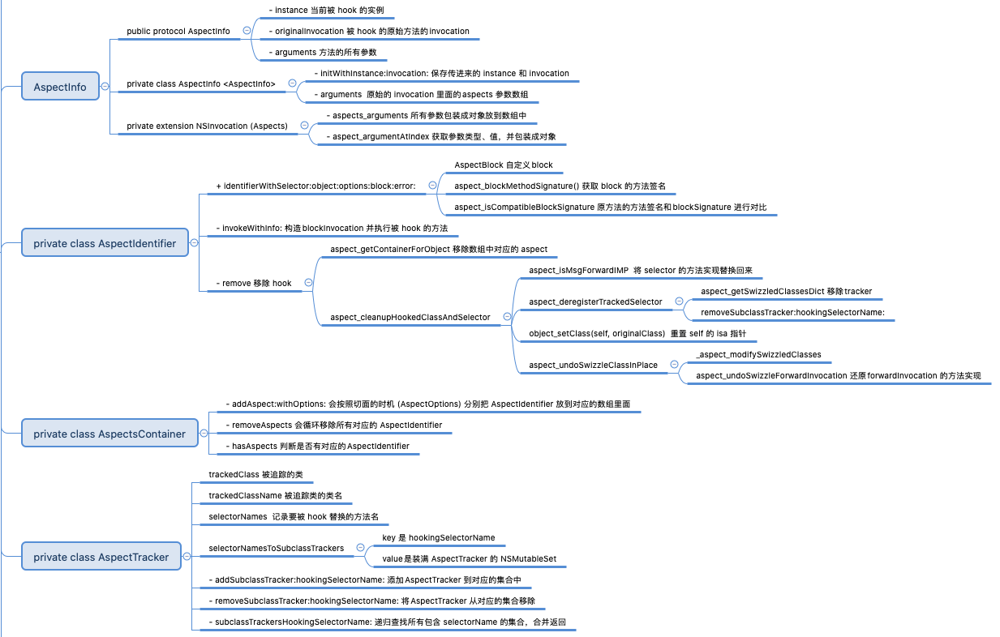

# Aspects - 01


本文介绍 `Aspects.m `中定义的四个类 `AspectInfo `、`AspectIdentifier `、`AspectsContainer `、`AspectTracker ` 的实现细节。


<br>

## 一、AspectInfo

### 0x01 `@protocol AspectInfo`

`@protocol AspectInfo` 的定义如下：

```Objective-C
/// The AspectInfo protocol is the first parameter of our block syntax.
@protocol AspectInfo <NSObject>

/// The instance that is currently hooked.
- (id)instance;

/// The original invocation of the hooked method.
- (NSInvocation *)originalInvocation;

/// All method arguments, boxed. This is lazily evaluated.
- (NSArray *)arguments;

@end
```

从注释可知：

- `protocol AspectInfo` 是 block 语法的第一个参数

- `instance` 当前被 hook 的实例对象
- `originalInvocation` 被 hooked 方法的原始的 invocation
- `arguments` 方法的所有参数，懒加载实现

<br>

### 0x02 `class AspectInfo`

`AspectInfo.h` 定义如下

```Objective-C
@interface AspectInfo : NSObject <AspectInfo>
- (id)initWithInstance:(__unsafe_unretained id)instance invocation:(NSInvocation *)invocation;
@property (nonatomic, unsafe_unretained, readonly) id instance;
@property (nonatomic, strong, readonly) NSArray *arguments;
@property (nonatomic, strong, readonly) NSInvocation *originalInvocation;
@end
```

`AspectInfo.m` 定义如下

```Objective-C
@implementation AspectInfo

@synthesize arguments = _arguments;

- (id)initWithInstance:(__unsafe_unretained id)instance invocation:(NSInvocation *)invocation {
    NSCParameterAssert(instance);
    NSCParameterAssert(invocation);
    if (self = [super init]) {
        _instance = instance;
        _originalInvocation = invocation;
    }
    return self;
}

- (NSArray *)arguments {
    // Lazily evaluate arguments, boxing is expensive.
    if (!_arguments) {
        _arguments = self.originalInvocation.aspects_arguments;
    }
    return _arguments;
}
```

`AspectInfo` 是继承于 `NSObject`，并且遵循 `AspectInfo` 协议。

`- (id)initWithInstance:invocation:`方法，把外面传进来的实例`instance` 和原始的 `invocation` 保存到 `AspectInfo` 实例对应的成员变量中。

`- (NSArray *)arguments` 是一个懒加载方法，返回的是原始的 `invocation` 里面的`aspects` 参数数组。其内部调用 `aspects_arguments `。

`aspects_arguments` 这个 `getter` 方法是怎么实现的呢？作者是通过一个为`NSInvocation` 添加一个分类来实现的。

<br>

### 0x03 `NSInvocation (Aspects)`

`NSInvocation+Aspects.h` 定义如下：

```Objective-C
@interface NSInvocation (Aspects)
- (NSArray *)aspects_arguments;
@end
```

`NSInvocation+Aspects.m` 定义如下：

```Objective-C
@implementation NSInvocation (Aspects)
...
- (NSArray *)aspects_arguments {
    NSMutableArray *argumentsArray = [NSMutableArray array];
    for (NSUInteger idx = 2; idx < self.methodSignature.numberOfArguments; idx++) {
        [argumentsArray addObject:[self aspect_argumentAtIndex:idx] ?: NSNull.null];
    }
    return [argumentsArray copy];
}

@end
```

作者为原始的 `NSInvocation` 类添加一个 `Aspects` 分类，这个分类中只向外暴露了一个方法 `aspects_arguments`，返回值是一个数组，数组里面包含了当前 `invocation` 的所有参数。

`aspects_arguments`方法内部实现很简单，就是一层for循环，把 `methodSignature` 方法签名里面的参数，都加入到数组里，最后把数组返回。

有两个地方需要详细说明。一是为什么循环从 2 开始，二是 `[self aspect_argumentAtIndex:idx]` 内部是怎么实现的。

对于 OC 来说所有方法的调用都是走消息发送机制 `objc_msgSend(void /* id self, SEL op, ... */ )`。`objc_msgSend `固定包含两个参数，第一个参数是消息发送者 `self` ，第二个参数是方法名 `SEL` 。所以获取方法的入参要从下标为 2 的地方开始获取。

`[self aspect_argumentAtIndex:idx]` 内部实现如下：
 
```Objective-C
// Thanks to the ReactiveCocoa team for providing a generic solution for this.
- (id)aspect_argumentAtIndex:(NSUInteger)index {
    const char *argType = [self.methodSignature getArgumentTypeAtIndex:index];
    // Skip const type qualifier.
    if (argType[0] == _C_CONST) argType++;
    
    #define WRAP_AND_RETURN(type) do { type val = 0; [self getArgument:&val atIndex:(NSInteger)index]; return @(val); } while (0)
    if (strcmp(argType, @encode(id)) == 0 || strcmp(argType, @encode(Class)) == 0) {
        __autoreleasing id returnObj;
        [self getArgument:&returnObj atIndex:(NSInteger)index];
        return returnObj;
    } else if (strcmp(argType, @encode(SEL)) == 0) {
        SEL selector = 0;
        [self getArgument:&selector atIndex:(NSInteger)index];
        return NSStringFromSelector(selector);
    } else if (strcmp(argType, @encode(Class)) == 0) {
        __autoreleasing Class theClass = Nil;
        [self getArgument:&theClass atIndex:(NSInteger)index];
        return theClass;
        // Using this list will box the number with the appropriate constructor, instead of the generic NSValue.
    } else if (strcmp(argType, @encode(char)) == 0) {
        WRAP_AND_RETURN(char);
    } else if (strcmp(argType, @encode(int)) == 0) {
        WRAP_AND_RETURN(int);
    } else if (strcmp(argType, @encode(short)) == 0) {
        WRAP_AND_RETURN(short);
    } else if (strcmp(argType, @encode(long)) == 0) {
        WRAP_AND_RETURN(long);
    } else if (strcmp(argType, @encode(long long)) == 0) {
        WRAP_AND_RETURN(long long);
    } else if (strcmp(argType, @encode(unsigned char)) == 0) {
        WRAP_AND_RETURN(unsigned char);
    } else if (strcmp(argType, @encode(unsigned int)) == 0) {
        WRAP_AND_RETURN(unsigned int);
    } else if (strcmp(argType, @encode(unsigned short)) == 0) {
        WRAP_AND_RETURN(unsigned short);
    } else if (strcmp(argType, @encode(unsigned long)) == 0) {
        WRAP_AND_RETURN(unsigned long);
    } else if (strcmp(argType, @encode(unsigned long long)) == 0) {
        WRAP_AND_RETURN(unsigned long long);
    } else if (strcmp(argType, @encode(float)) == 0) {
        WRAP_AND_RETURN(float);
    } else if (strcmp(argType, @encode(double)) == 0) {
        WRAP_AND_RETURN(double);
    } else if (strcmp(argType, @encode(BOOL)) == 0) {
        WRAP_AND_RETURN(BOOL);
    } else if (strcmp(argType, @encode(bool)) == 0) {
        WRAP_AND_RETURN(BOOL);
    } else if (strcmp(argType, @encode(char *)) == 0) {
        WRAP_AND_RETURN(const char *);
    } else if (strcmp(argType, @encode(void (^)(void))) == 0) {
        __unsafe_unretained id block = nil;
        [self getArgument:&block atIndex:(NSInteger)index];
        return [block copy];
    } else {
        NSUInteger valueSize = 0;
        NSGetSizeAndAlignment(argType, &valueSize, NULL);
        
        unsigned char valueBytes[valueSize];
        [self getArgument:valueBytes atIndex:(NSInteger)index];
        
        return [NSValue valueWithBytes:valueBytes objCType:argType];
    }
    return nil;
    #undef WRAP_AND_RETURN
}
```

`_C_CONST` 是一个常量，用来判断 encoding 的字符串是不是 CONST 常量。

```Objective-C

#define _C_ID       '@'
#define _C_CLASS    '#'
#define _C_SEL      ':'
#define _C_CHR      'c'
#define _C_UCHR     'C'
#define _C_SHT      's'
#define _C_USHT     'S'
#define _C_INT      'i'
#define _C_UINT     'I'
#define _C_LNG      'l'
#define _C_ULNG     'L'
#define _C_LNG_LNG  'q'
#define _C_ULNG_LNG 'Q'
#define _C_FLT      'f'
#define _C_DBL      'd'
#define _C_BFLD     'b'
#define _C_BOOL     'B'
#define _C_VOID     'v'
#define _C_UNDEF    '?'
#define _C_PTR      '^'
#define _C_CHARPTR  '*'
#define _C_ATOM     '%'
#define _C_ARY_B    '['
#define _C_ARY_E    ']'
#define _C_UNION_B  '('
#define _C_UNION_E  ')'
#define _C_STRUCT_B '{'
#define _C_STRUCT_E '}'
#define _C_VECTOR   '!'
#define _C_CONST    'r'
```

`WRAP_AND_RETURN` 是一个宏定义。这个宏定义里面调用的 `getArgument:atIndex:` 方法是用来在 `NSInvocation` 中根据 `index` 得到对应的`Argument`，最后 `return` 的时候把 `val` 包装成对象，返回出去。

再下面的 `if-else` 中是对字符的比较，如 `strcmp(argType, @encode(id)) == 0` 牵扯到 一个叫 [Type Encoding](https://github.com/zhaoName/Notes/blob/master/iOS/TypeEncodings.md) 的东西。判断参数类型，返回相应的结果。

如上代码依次判断了 `id，class，SEL`，接着是一大推基本类型，`char`、`int`、`short`、`long`、`long long`、`unsigned char`、`unsigned int`、`unsigned short`、`unsigned long`、`unsigned long long`、`float`、`double`、`BOOL`、`bool`、`char *`这些基本类型都会利用 `WRAP_AND_RETURN` 打包成对象返回。最后判断 block 和 struct 结构体，也会返回对应的对象。

假如 hook 了如下方法:

```Objective-C
- (NSArray *)testTypes:(NSObject *)obj isShow:(BOOL)isShow
{
    NSLog(@"%s", __func__);
    return  @[@1];
}
```

执行完 `aspects_arguments`，数组里面装的的是：
 
 ```Objective-C
(
    "<NSObject: 0x6000024b84c0>",
    1
)
 ```


**总结：`AspectInfo` 里面主要是 `NSInvocation` 信息。将 `NSInvocation` 包装一层，比如参数信息等。**

<br>

## 二、AspectIdentifier

`AspectIdentifier.h` 定义如下：

```Objective-C
// Tracks a single aspect.
@interface AspectIdentifier : NSObject
+ (instancetype)identifierWithSelector:(SEL)selector object:(id)object options:(AspectOptions)options block:(id)block error:(NSError **)error;
- (BOOL)invokeWithInfo:(id<AspectInfo>)info;
@property (nonatomic, assign) SEL selector;
@property (nonatomic, strong) id block;
@property (nonatomic, strong) NSMethodSignature *blockSignature;
@property (nonatomic, weak) id object;
@property (nonatomic, assign) AspectOptions options;
@end
```

`AspectIdentifier.m` 实现如下：

```Objective-C
@implementation AspectIdentifier

+ (instancetype)identifierWithSelector:(SEL)selector object:(id)object options:(AspectOptions)options block:(id)block error:(NSError **)error {
    NSCParameterAssert(block);
    NSCParameterAssert(selector);
    NSMethodSignature *blockSignature = aspect_blockMethodSignature(block, error); // TODO: check signature compatibility, etc.
    if (!aspect_isCompatibleBlockSignature(blockSignature, object, selector, error)) {
        return nil;
    }

    AspectIdentifier *identifier = nil;
    if (blockSignature) {
        identifier = [AspectIdentifier new];
        identifier.selector = selector;
        identifier.block = block;
        identifier.blockSignature = blockSignature;
        identifier.options = options;
        identifier.object = object; // weak
    }
    return identifier;
}

- (BOOL)invokeWithInfo:(id<AspectInfo>)info {
    NSInvocation *blockInvocation = [NSInvocation invocationWithMethodSignature:self.blockSignature];
    NSInvocation *originalInvocation = info.originalInvocation;
    NSUInteger numberOfArguments = self.blockSignature.numberOfArguments;

    // Be extra paranoid. We already check that on hook registration.
    if (numberOfArguments > originalInvocation.methodSignature.numberOfArguments) {
        AspectLogError(@"Block has too many arguments. Not calling %@", info);
        return NO;
    }

    // The `self` of the block will be the AspectInfo. Optional.
    if (numberOfArguments > 1) {
        [blockInvocation setArgument:&info atIndex:1];
    }
    
	void *argBuf = NULL;
    for (NSUInteger idx = 2; idx < numberOfArguments; idx++) {
        const char *type = [originalInvocation.methodSignature getArgumentTypeAtIndex:idx];
		NSUInteger argSize;
		NSGetSizeAndAlignment(type, &argSize, NULL);
        
		if (!(argBuf = reallocf(argBuf, argSize))) {
            AspectLogError(@"Failed to allocate memory for block invocation.");
			return NO;
		}
        
		[originalInvocation getArgument:argBuf atIndex:idx];
		[blockInvocation setArgument:argBuf atIndex:idx];
    }
    
    // 执行 hook 的方法
    [blockInvocation invokeWithTarget:self.block];
    
    if (argBuf != NULL) {
        free(argBuf);
    }
    return YES;
}

- (NSString *)description {
    return [NSString stringWithFormat:@"<%@: %p, SEL:%@ object:%@ options:%tu block:%@ (#%tu args)>", self.class, self, NSStringFromSelector(self.selector), self.object, self.options, self.block, self.blockSignature.numberOfArguments];
}

- (BOOL)remove {
    return aspect_remove(self, NULL);
}

@end
```

在 `AspectIdentifier` 的初始化方法 `+ identifierWithSelector:object:options:block:error:` 中首先调用 `aspect_blockMethodSignature()` 方法获取传进来的 `block` 的方法签名。

<br>

### 0x01 `AspectBlock`

`AspectBlock` 的定义如下：

```Objective-C
// Block internals.
typedef NS_OPTIONS(int, AspectBlockFlags) {
    // 是否需要 Copy 和 Dispose 的 Helpers
	AspectBlockFlagsHasCopyDisposeHelpers = (1 << 25),
    // 是否需要方法签名 Signature
	AspectBlockFlagsHasSignature          = (1 << 30)
};

typedef struct _AspectBlock {
	__unused Class isa;
	AspectBlockFlags flags;
	__unused int reserved;
	void (__unused *invoke)(struct _AspectBlock *block, ...);
	struct {
		unsigned long int reserved;
		unsigned long int size;
		// requires AspectBlockFlagsHasCopyDisposeHelpers
		void (*copy)(void *dst, const void *src);
		void (*dispose)(const void *);
		// requires AspectBlockFlagsHasSignature
		const char *signature;
		const char *layout;
	} *descriptor;
	// imported variables
} *AspectBlockRef;
```

这里定义了一个 Aspects 内部使用的 block 类型。对系统的 Block 很熟悉的同学一眼就会感觉两者很像。不熟悉的可以参考[Block本质(一)](https://github.com/zhaoName/Notes/blob/master/iOS/Block%E6%9C%AC%E8%B4%A8(%E4%B8%80).md) 。

<br>

### 0x02 `aspect_blockMethodSignature()` 

`aspect_blockMethodSignature ` 的实现如下：

```Objective-C
static NSMethodSignature *aspect_blockMethodSignature(id block, NSError **error) {
    AspectBlockRef layout = (__bridge void *)block;
    // 是否包含 AspectBlockFlagsHasSignature 标志，没有直接报错
	if (!(layout->flags & AspectBlockFlagsHasSignature)) {
        NSString *description = [NSString stringWithFormat:@"The block %@ doesn't contain a type signature.", block];
        AspectError(AspectErrorMissingBlockSignature, description);
        return nil;
    }
	void *desc = layout->descriptor;
    // 指针指到 reserved 和 size 后
	desc += 2 * sizeof(unsigned long int);
    // 若有 AspectBlockFlagsHasCopyDisposeHelpers 标志，也就是包含 copy 和dispose 函数，再往后指 2 个 Void* 大小
	if (layout->flags & AspectBlockFlagsHasCopyDisposeHelpers) {
		desc += 2 * sizeof(void *);
    }
    // 到这里 desc 就指向 signature，若为空则报错
	if (!desc) {
        NSString *description = [NSString stringWithFormat:@"The block %@ doesn't has a type signature.", block];
        AspectError(AspectErrorMissingBlockSignature, description);
        return nil;
    }
    // 若不为空则 转化成 NSMethodSignature
	const char *signature = (*(const char **)desc);
	return [NSMethodSignature signatureWithObjCTypes:signature];
}
```

先把入参 `block` 强制转换成 `AspectBlockRef` 类型，然后判断是否有`AspectBlockFlagsHasSignature` 的标志位，如果没有，报不包含方法签名的 `error`。如下：

```Objective-C
AspectBlockRef layout = (__bridge void *)block;
// 是否包含 AspectBlockFlagsHasSignature 标志，没有直接报错
if (!(layout->flags & AspectBlockFlagsHasSignature)) {
    NSString *description = [NSString stringWithFormat:@"The block %@ doesn't contain a type signature.", block];
    AspectError(AspectErrorMissingBlockSignature, description);
    return nil;
}
```

`desc` 为 `block` 里面对应的 `descriptor` 指针。然后 `descriptor` 指针往下偏移 2 个`unsigned long int` 大小的位置，若包含 `Copy` 和 `Dispose` 函数，那么继续往下偏移 2 个`(void *)` 的大小。这时指针肯定移动到了`const char *signature`的位置。若 `desc` 为空则报错，该 `block` 不包含方法签名。如下：

```Objective-C
void *desc = layout->descriptor;
// 指针指到 reserved 和 size 后
desc += 2 * sizeof(unsigned long int);
// 若有 AspectBlockFlagsHasCopyDisposeHelpers 标志，也就是包含 copy 和dispose 函数，再往后指 2 个 Void* 大小
if (layout->flags & AspectBlockFlagsHasCopyDisposeHelpers) {
    desc += 2 * sizeof(void *);
}
// 到这里 desc 就指向 signature，若为空则报错
if (!desc) {
    NSString *description = [NSString stringWithFormat:@"The block %@ doesn't has a type signature.", block];
    AspectError(AspectErrorMissingBlockSignature, description);
    return nil;
}
```

最后调用 `NSMethodSignature` 的 `signatureWithObjCTypes` 方法，返回方法签名。如下：

```Objective-C
// 若不为空则 转化成 NSMethodSignature
const char *signature = (*(const char **)desc);
return [NSMethodSignature signatureWithObjCTypes:signature];
```

举例说明下转化前后 `signature` 是啥样的：

```Objective-C
[self aspect_hookSelector:@selector(testTypes:isShow:) withOptions:AspectPositionInstead usingBlock:^(id<AspectInfo> aspects, NSObject *obj, BOOL isShow) {
    NSLog(@"hook======");
} error:nil];
```

`const char *signature` 最终获得的字符串是这样：

```Objective-C
const char *signature = "v28@?0@\"<AspectInfo>\"8@\"NSObject\"16B24"
```

- `v` 是返回值类型，总共占用 28 大小

- `@?` 是指 `block` 类型，偏移量是 0
- `@"<AspectInfo>"` 是指 block 的第一个参数类型，偏移量是 8
- `@"NSObject"` 是指 block 的第二个参数类型，偏移量是 16
- `B` 是 block 的第三个参数类型也就是 `BOOL`, 偏移量是 24

用 lldb 打印转化后的 `NSMethodSignature` 如下：

```Objective-C
<NSMethodSignature: 0x6000014136c0>
    number of arguments = 4
    frame size = 224
    is special struct return? NO
    return value: -------- -------- -------- --------
        type encoding (v) 'v'
        flags {}
        modifiers {}
        frame {offset = 0, offset adjust = 0, size = 0, size adjust = 0}
        memory {offset = 0, size = 0}
    argument 0: -------- -------- -------- --------
        type encoding (@) '@?'
        flags {isObject, isBlock}
        modifiers {}
        frame {offset = 0, offset adjust = 0, size = 8, size adjust = 0}
        memory {offset = 0, size = 8}
    argument 1: -------- -------- -------- --------
        type encoding (@) '@"<AspectInfo>"'
        flags {isObject}
        modifiers {}
        frame {offset = 8, offset adjust = 0, size = 8, size adjust = 0}
        memory {offset = 0, size = 8}
            conforms to protocol 'AspectInfo'
    argument 2: -------- -------- -------- --------
        type encoding (@) '@"NSObject"'
        flags {isObject}
        modifiers {}
        frame {offset = 16, offset adjust = 0, size = 8, size adjust = 0}
        memory {offset = 0, size = 8}
            class 'NSObject'
    argument 3: -------- -------- -------- --------
        type encoding (B) 'B'
        flags {}
        modifiers {}
        frame {offset = 24, offset adjust = 0, size = 8, size adjust = -7}
        memory {offset = 0, size = 1}
```

<br>

回到 `AspectIdentifier` 中继续看 `+ identifierWithSelector:object:options:block:error:` 方法，获取到了传入的 `block` 的方法签名之后，又调用了 `aspect_isCompatibleBlockSignature` 方法。

### 0x03 `aspect_isCompatibleBlockSignature`

`aspect_isCompatibleBlockSignature`的实现如下：

```Objective-C
static BOOL aspect_isCompatibleBlockSignature(NSMethodSignature *blockSignature, id object, SEL selector, NSError **error) {
    // 防空判断
    NSCParameterAssert(blockSignature);
    NSCParameterAssert(object);
    NSCParameterAssert(selector);
    
    BOOL signaturesMatch = YES;
    // 获取传进来 selector 的方法签名
    NSMethodSignature *methodSignature = [[object class] instanceMethodSignatureForSelector:selector];
    if (blockSignature.numberOfArguments > methodSignature.numberOfArguments) {
        // 若 block方法签名中参数的个数大于 seletor方法签名中参数的个数，则报错
        signaturesMatch = NO;
    }else {
        if (blockSignature.numberOfArguments > 1) {
            // blockSignature 的第一个参数必为 @"<AspectInfo>" 类型，也就是 blockType[0] = '@'
            const char *blockType = [blockSignature getArgumentTypeAtIndex:1];
            if (blockType[0] != '@') {
                signaturesMatch = NO;
            }
        }
        // Argument 0 is self/block, argument 1 is SEL or id<AspectInfo>. We start comparing at argument 2.
        // The block can have less arguments than the method, that's ok.
        if (signaturesMatch) {
            for (NSUInteger idx = 2; idx < blockSignature.numberOfArguments; idx++) {
                const char *methodType = [methodSignature getArgumentTypeAtIndex:idx];
                const char *blockType = [blockSignature getArgumentTypeAtIndex:idx];
                // Only compare parameter, not the optional type data.
                if (!methodType || !blockType || methodType[0] != blockType[0]) {
                    signaturesMatch = NO; break;
                }
            }
        }
    }

    if (!signaturesMatch) {
        NSString *description = [NSString stringWithFormat:@"Block signature %@ doesn't match %@.", blockSignature, methodSignature];
        AspectError(AspectErrorIncompatibleBlockSignature, description);
        return NO;
    }
    return YES;
}
```

这个函数的作用是把我们要替换的方法 `block` 的方法签名和原方法的方法签名，进行对比。

先判断若 `block` 方法签名中参数的个数大于原方法签名中参数的个数，则`signaturesMatch = NO`。若小于等于，则判断 `blockSignature` 的第一个参数(若有)的 Type Encoding 类型是否包含 `@` 。若不是 `signaturesMatch = NO` 。如下：

```Objective-C
// 获取传进来 selector 的方法签名
NSMethodSignature *methodSignature = [[object class] instanceMethodSignatureForSelector:selector];
if (blockSignature.numberOfArguments > methodSignature.numberOfArguments) {
    // 若 block方法签名中参数的个数大于 seletor方法签名中参数的个数，则报错
    signaturesMatch = NO;
}else {
    if (blockSignature.numberOfArguments > 1) {
        // blockSignature 的第一个参数必为 @"<AspectInfo>" 类型，也就是 blockType[0] = '@'
        const char *blockType = [blockSignature getArgumentTypeAtIndex:1];
        if (blockType[0] != '@') {
            signaturesMatch = NO;
        }
    }
	...
```

若上面两条都满足，则来到真正的方法签名对比：

```Objective-C
// Argument 0 is self/block, argument 1 is SEL or id<AspectInfo>. We start comparing at argument 2.
// The block can have less arguments than the method, that's ok.
if (signaturesMatch) {
    for (NSUInteger idx = 2; idx < blockSignature.numberOfArguments; idx++) {
        const char *methodType = [methodSignature getArgumentTypeAtIndex:idx];
        const char *blockType = [blockSignature getArgumentTypeAtIndex:idx];
        // Only compare parameter, not the optional type data.
        if (!methodType || !blockType || methodType[0] != blockType[0]) {
            signaturesMatch = NO; break;
        }
    }
}
``` 

这里的循环也是从 2 开始。用之前的 `testTypes:isShow:` 来说明为什么从2 开始。

|  | return value |  argument 0  | argument 1 | argument 2 | argument 3 |
| --- | :---: | :---: | :---: | :---: | :---: |
| blockSignature | v | @? | @"Aspect"  | @"NSObject" | B | 
| originalMethodSignature | v | @ (self) | : (_cmd) | @ | B |

- `originalMethodSignature` 和 `blockSignature` 的 `return value` 都是`void`，所以对应的都是`v`。

- `originalMethodSignature `的 `argument 0` 是隐含参数 `self`，对应的是`@`。`blockSignature` 的 `argument 0`是 `block`，对应的是`@?`。
- `originalMethodSignature `的`argument 1` 是隐含参数 `_cmd`，所以对应的是`:`。`blockSignature`的`argument 1` 是，所以对应的是`@""`。
- 从`argument 2`开始才是方法签名后面的对应可能出现差异，需要比较的参数列表。

如果经过上面的比较 `signaturesMatch` 都为 `NO`，那么就抛出 `error`，`Block` 无法匹配与方法的方法签名。

如果匹配成功了，就会将传进来的 `block` 等全部都赋值给`AspectIdentifier`。


### 0x04 `invokeWithInfo:`

`AspectIdentifier` 还有另外一个方法 `invokeWithInfo` 实现如下：

```Objective-C
- (BOOL)invokeWithInfo:(id<AspectInfo>)info {
    NSInvocation *blockInvocation = [NSInvocation invocationWithMethodSignature:self.blockSignature];
    NSInvocation *originalInvocation = info.originalInvocation;
    NSUInteger numberOfArguments = self.blockSignature.numberOfArguments;

    // Be extra paranoid. We already check that on hook registration.
    if (numberOfArguments > originalInvocation.methodSignature.numberOfArguments) {
        AspectLogError(@"Block has too many arguments. Not calling %@", info);
        return NO;
    }

    // The `self` of the block will be the AspectInfo. Optional.
    // 首先把 id<AspectInfo> 放到第一个参数中
    if (numberOfArguments > 1) {
        [blockInvocation setArgument:&info atIndex:1];
    }
    
	void *argBuf = NULL;
    for (NSUInteger idx = 2; idx < numberOfArguments; idx++) {
        // 从 idx = 2开始，取原方法的方法签名中参数的类型
        const char *type = [originalInvocation.methodSignature getArgumentTypeAtIndex:idx];
		NSUInteger argSize;
        // 占用大小
		NSGetSizeAndAlignment(type, &argSize, NULL);
        
		if (!(argBuf = reallocf(argBuf, argSize))) {
            AspectLogError(@"Failed to allocate memory for block invocation.");
			return NO;
		}
        // 取原方法的参数的值
		[originalInvocation getArgument:argBuf atIndex:idx];
        // 将原方法的参数的值 放到block对应方法签名的参数中
		[blockInvocation setArgument:argBuf atIndex:idx];
    }
    
    // 执行 hook 的方法
    [blockInvocation invokeWithTarget:self.block];
    
    if (argBuf != NULL) {
        free(argBuf);
    }
    return YES;
}
```

首先把 `id<AspectInfo>` 放到 `blockInvocation` 的第一个参数中

然后循环从 `originalInvocation` 的方法签名中取出参数，赋值到 `argBuf` 中，然后再赋值到`blockInvocation` 里面。

最后把 `self.block` 赋值给 `blockInvocation` 的 `Target`。执行 hook 的方法。


**总结：`AspectIdentifier`是一个切片 `Aspect` 的具体内容。里面会包含了单个的 `Aspect` 的具体信息，包括执行时机，要执行 `block` 所需要用到的具体信息：包括方法签名、参数等等。初始化`AspectIdentifier`的过程实质是把我们传入的`block`打包成`AspectIdentifier`。**

<br>

## 三、AspectsContainer 

`AspectsContainer.h` 定义如下：

```Objective-C
// Tracks all aspects for an object/class.
@interface AspectsContainer : NSObject
- (void)addAspect:(AspectIdentifier *)aspect withOptions:(AspectOptions)injectPosition;
- (BOOL)removeAspect:(id)aspect;
- (BOOL)hasAspects;
@property (atomic, copy) NSArray *beforeAspects;
@property (atomic, copy) NSArray *insteadAspects;
@property (atomic, copy) NSArray *afterAspects;
@end
```

`AspectsContainer.m` 实现如下：

```Objective-C
@implementation AspectsContainer

- (BOOL)hasAspects {
    return self.beforeAspects.count > 0 || self.insteadAspects.count > 0 || self.afterAspects.count > 0;
}

- (void)addAspect:(AspectIdentifier *)aspect withOptions:(AspectOptions)options {
    NSParameterAssert(aspect);
    NSUInteger position = options&AspectPositionFilter;
    switch (position) {
        case AspectPositionBefore:  self.beforeAspects  = [(self.beforeAspects ?:@[]) arrayByAddingObject:aspect]; break;
        case AspectPositionInstead: self.insteadAspects = [(self.insteadAspects?:@[]) arrayByAddingObject:aspect]; break;
        case AspectPositionAfter:   self.afterAspects   = [(self.afterAspects  ?:@[]) arrayByAddingObject:aspect]; break;
    }
}

- (BOOL)removeAspect:(id)aspect {
    for (NSString *aspectArrayName in @[NSStringFromSelector(@selector(beforeAspects)),
                                        NSStringFromSelector(@selector(insteadAspects)),
                                        NSStringFromSelector(@selector(afterAspects))]) {
        NSArray *array = [self valueForKey:aspectArrayName];
        NSUInteger index = [array indexOfObjectIdenticalTo:aspect];
        if (array && index != NSNotFound) {
            NSMutableArray *newArray = [NSMutableArray arrayWithArray:array];
            [newArray removeObjectAtIndex:index];
            [self setValue:newArray forKey:aspectArrayName];
            return YES;
        }
    }
    return NO;
}

- (NSString *)description {
    return [NSString stringWithFormat:@"<%@: %p, before:%@, instead:%@, after:%@>", self.class, self, self.beforeAspects, self.insteadAspects, self.afterAspects];
}

@end
```

`AspectsContainer` 代码比较好理解。`- addAspect:withOptions:` 会按照切面的时机 (`AspectOptions`) 分别把切片 `Aspects` 放到对应的数组里面。`- removeAspects` 会循环移除所有对应的 `Aspects`。`- hasAspects` 判断是否有对应的`Aspects`。


值得我们注意的是这里数组是通过 `atomic` 修饰的。关于 `atomic` 需要注意在默认情况下，由编译器所合成的方法会通过锁定机制确保其原子性(`atomicity`)。如果属性具备`nonatomic` 特质，则不需要同步锁。


**总结：`AspectsContainer` 主要是将所有的 Aspects 按切片时机不同(`AspectOptionAutomaticRemoval` 除外)记录在对应的数组，并提供查询和删除功能。**

<br>

## 四、AspectTracker

`AspectTracker.h` 定义如下：

```Objective-C
@interface AspectTracker : NSObject
- (id)initWithTrackedClass:(Class)trackedClass;
@property (nonatomic, strong) Class trackedClass;
@property (nonatomic, readonly) NSString *trackedClassName;
@property (nonatomic, strong) NSMutableSet *selectorNames;
@property (nonatomic, strong) NSMutableDictionary *selectorNamesToSubclassTrackers;
- (void)addSubclassTracker:(AspectTracker *)subclassTracker hookingSelectorName:(NSString *)selectorName;
- (void)removeSubclassTracker:(AspectTracker *)subclassTracker hookingSelectorName:(NSString *)selectorName;
- (BOOL)subclassHasHookedSelectorName:(NSString *)selectorName;
- (NSSet *)subclassTrackersHookingSelectorName:(NSString *)selectorName;
@end
```

`AspectTracker.h` 实现如下：

```Objective-C
@implementation AspectTracker

- (id)initWithTrackedClass:(Class)trackedClass {
    if (self = [super init]) {
        _trackedClass = trackedClass;
        _selectorNames = [NSMutableSet new];
        _selectorNamesToSubclassTrackers = [NSMutableDictionary new];
    }
    return self;
}

- (BOOL)subclassHasHookedSelectorName:(NSString *)selectorName {
    return self.selectorNamesToSubclassTrackers[selectorName] != nil;
}

- (void)addSubclassTracker:(AspectTracker *)subclassTracker hookingSelectorName:(NSString *)selectorName {
    NSMutableSet *trackerSet = self.selectorNamesToSubclassTrackers[selectorName];
    if (!trackerSet) {
        trackerSet = [NSMutableSet new];
        self.selectorNamesToSubclassTrackers[selectorName] = trackerSet;
    }
    [trackerSet addObject:subclassTracker];
}
- (void)removeSubclassTracker:(AspectTracker *)subclassTracker hookingSelectorName:(NSString *)selectorName {
    NSMutableSet *trackerSet = self.selectorNamesToSubclassTrackers[selectorName];
    [trackerSet removeObject:subclassTracker];
    if (trackerSet.count == 0) {
        [self.selectorNamesToSubclassTrackers removeObjectForKey:selectorName];
    }
}
- (NSSet *)subclassTrackersHookingSelectorName:(NSString *)selectorName {
    NSMutableSet *hookingSubclassTrackers = [NSMutableSet new];
    for (AspectTracker *tracker in self.selectorNamesToSubclassTrackers[selectorName]) {
        if ([tracker.selectorNames containsObject:selectorName]) {
            [hookingSubclassTrackers addObject:tracker];
        }
        [hookingSubclassTrackers unionSet:[tracker subclassTrackersHookingSelectorName:selectorName]];
    }
    return hookingSubclassTrackers;
}
- (NSString *)trackedClassName {
    return NSStringFromClass(self.trackedClass);
}

- (NSString *)description {
    return [NSString stringWithFormat:@"<%@: %@, trackedClass: %@, selectorNames:%@, subclass selector names: %@>", self.class, self, NSStringFromClass(self.trackedClass), self.selectorNames, self.selectorNamesToSubclassTrackers.allKeys];
}

@end
```

`AspectTracker`这个类是用来跟踪要被 hook 的类。

`trackedClass` 是被追踪的类。`trackedClassName` 是被追踪类的类名。`selectorNames` 是一个 `NSMutableSet`，这里会记录要被 hook 替换的方法名，用 `NSMutableSet` 是为了防止重复替换方法。`selectorNamesToSubclassTrackers` 是一个字典，`key` 是 `hookingSelectorName`，`value`是装满 `AspectTracker` 的 `NSMutableSet`。

`addSubclassTracker:hookingSelectorName:`方法是把 `AspectTracker` 加入到对应`selectorName` 的集合中。

`removeSubclassTracker:hookingSelectorName:`方法是把 `AspectTracker` 从对应的 `selectorName` 的集合中移除。

`subclassTrackersHookingSelectorName:` 方法是一个并查集，传入一个 `selectorName`，通过递归查找，找到所有包含这个 `selectorName` 的 `set`，最后把这些 `set` 合并在一起作为返回值返回。


<br>



<br>

参考： [iOS 如何实现 Aspect Oriented Programming](https://github.com/halfrost/Halfrost-Field/blob/master/contents/iOS/Aspect/ios_aspect.md)

<br>