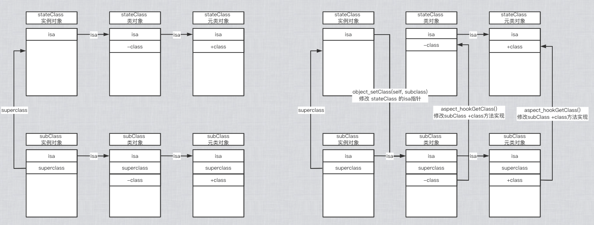

# Aspects - 02

本文介绍 Aspects 如何 hook 方法。

<br>

## 一、hook 前准备

Aspects 整个库里面就只有两个供外部调用的方法，如下。Aspects 是 `NSobject` 的一个`extension`，只要是 `NSObject`，都可以使用这两个方法。这两个方法名字都是同一个，入参和返回值也一样，唯一不同的是一个是加号方法一个是减号方法。一个是用来 hook 类方法，一个是用来 hook 实例方法。

```Objective-C
/**
 Aspects uses Objective-C message forwarding to hook into messages. This will create some overhead. Don't add aspects to methods that are called a lot. Aspects is meant for view/controller code that is not called a 1000 times per second.

 Adding aspects returns an opaque token which can be used to deregister again. All calls are thread safe.
 */
@interface NSObject (Aspects)

/// Adds a block of code before/instead/after the current `selector` for a specific class.
///
/// @param block Aspects replicates the type signature of the method being hooked.
/// The first parameter will be `id<AspectInfo>`, followed by all parameters of the method.
/// These parameters are optional and will be filled to match the block signature.
/// You can even use an empty block, or one that simple gets `id<AspectInfo>`.
///
/// @note Hooking static methods is not supported.
/// @return A token which allows to later deregister the aspect.
+ (id<AspectToken>)aspect_hookSelector:(SEL)selector
                           withOptions:(AspectOptions)options
                            usingBlock:(id)block
                                 error:(NSError **)error;

/// Adds a block of code before/instead/after the current `selector` for a specific instance.
- (id<AspectToken>)aspect_hookSelector:(SEL)selector
                           withOptions:(AspectOptions)options
                            usingBlock:(id)block
                                 error:(NSError **)error;

@end
```

从注释可知：

- Aspects 利用的 OC 的消息转发机制，hook 消息。这样会有一些性能开销。不要把Aspects 加到经常被使用的方法里面。Aspects 是用来设计给 `view/controller` 代码使用的，而不是用来 hook 每秒调用 1000 次的方法的。

- 添加 Aspects 之后，会返回一个隐式的 token，这个 token 会被用来注销 hook 方法的
- 所有的调用都是线程安全的。
- 可以传不带参数的 block ，但若有参数，则第一个参数必为 `id<AspectInfo>`

`NSObject+Aspects.m` 的实现如下：

```Objective-C
@implementation NSObject (Aspects)

+ (id<AspectToken>)aspect_hookSelector:(SEL)selector
                      withOptions:(AspectOptions)options
                       usingBlock:(id)block
                            error:(NSError **)error {
    return aspect_add((id)self, selector, options, block, error);
}

/// @return A token which allows to later deregister the aspect.
- (id<AspectToken>)aspect_hookSelector:(SEL)selector
                      withOptions:(AspectOptions)options
                       usingBlock:(id)block
                            error:(NSError **)error {
    return aspect_add(self, selector, options, block, error);
}
```

这两个方法内部都会调用`aspect_add(self, selector, options, block, error)` 方法，所以我们可以从 `aspect_add` 开始研究，

```Objective-C
static id aspect_add(id self, SEL selector, AspectOptions options, id block, NSError **error) {
    NSCParameterAssert(self);
    NSCParameterAssert(selector);
    NSCParameterAssert(block);

    __block AspectIdentifier *identifier = nil;
    aspect_performLocked(^{
        // 判断传入的 selector 是否允许被 hook
        if (aspect_isSelectorAllowedAndTrack(self, selector, options, error)) {
            // 用runtime的关联对象给 self 增加一个 aspectContainer 属性
            AspectsContainer *aspectContainer = aspect_getContainerForObject(self, selector);
            // 获取 block 的方法签名，并与原方法的方法签名对比
            identifier = [AspectIdentifier identifierWithSelector:selector object:self options:options block:block error:error];
            if (identifier) {
                // identifier 放入对应的数组中
                [aspectContainer addAspect:identifier withOptions:options];

                // Modify the class to allow message interception.
                aspect_prepareClassAndHookSelector(self, selector, error);
            }
        }
    });
    return identifier;
}
```

其函数调用栈如下：

```Objective-C
- aspect_hookSelector:(SEL)selector withOptions:(AspectOptions)options usingBlock:(id)block error:(NSError **)error
└── aspect_add(self, selector, options, block, error);
    └── aspect_performLocked
        ├── aspect_isSelectorAllowedAndTrack
        ├── aspect_getContainerForObject
        └── aspect_prepareClassAndHookSelector
```

<br>

### 0x01 `aspect_performLocked`

`aspect_performLocked` 中使用效率较高的自旋锁 `OSSpinLock` 来保证线程安全。

```Objective-C
static void aspect_performLocked(dispatch_block_t block) {
    static OSSpinLock aspect_lock = OS_SPINLOCK_INIT;
    OSSpinLockLock(&aspect_lock);
    block();
    OSSpinLockUnlock(&aspect_lock);
}
```

但从 iOS10 开始系统就弃用了 `OSSpinLock`，原因在这[不再安全的 OSSpinLock](http://blog.ibireme.com/2016/01/16/spinlock_is_unsafe_in_ios/)


<br>

### 0x02 `aspect_isSelectorAllowedAndTrack`

`aspect_isSelectorAllowedAndTrack` 先定义一个黑名单，里面包含不允许被 hook 的函数名。如下：

```Objective-C
static NSSet *disallowedSelectorList;
static dispatch_once_t pred;
dispatch_once(&pred, ^{
disallowedSelectorList = [NSSet setWithObjects:@"retain", @"release", @"autorelease", @"forwardInvocation:", nil];
});

// Check against the blacklist.
NSString *selectorName = NSStringFromSelector(selector);
if ([disallowedSelectorList containsObject:selectorName]) {
    NSString *errorDescription = [NSString stringWithFormat:@"Selector %@ is blacklisted.", selectorName];
    AspectError(AspectErrorSelectorBlacklisted, errorDescription);
    return NO;
}
```

当检测到 `selector` 的函数名是黑名单里面的函数名，立即报错。

再检查如果要 hook  的是 `dealloc` 方法，则切片时间只能在 `dealloc` 之前，如果不是`AspectPositionBefore`，也要报错。如下：

```Objective-C
// Additional checks.
AspectOptions position = options&AspectPositionFilter;
if ([selectorName isEqualToString:@"dealloc"] && position != AspectPositionBefore) {
    NSString *errorDesc = @"AspectPositionBefore is the only valid position when hooking dealloc.";
    AspectError(AspectErrorSelectorDeallocPosition, errorDesc);
    return NO;
}
```

然后判断该方法是否存在。如果 `self` 和 `self.class` 里面都找不到该 `selector`，会报错找不到该方法。如下：

```Objective-C
if (![self respondsToSelector:selector] && ![self.class instancesRespondToSelector:selector]) {
    NSString *errorDesc = [NSString stringWithFormat:@"Unable to find selector -[%@ %@].", NSStringFromClass(self.class), selectorName];
    AspectError(AspectErrorDoesNotRespondToSelector, errorDesc);
    return NO;
}
```

若不是元类，且到此都没有报错，则此方法允许被 hook。

若是元类，则需要判断元类里面是否允许此方法被 hook。

首先调用 `subclassHasHookedSelectorName` 检查此方法是不是已经被 hook，若是则直接报错。

```Objective-C
AspectTracker *tracker = swizzledClassesDict[currentClass];
// 若当前方法已被 hook 则报错
if ([tracker subclassHasHookedSelectorName:selectorName]) {
    NSSet *subclassTracker = [tracker subclassTrackersHookingSelectorName:selectorName];
    NSSet *subclassNames = [subclassTracker valueForKey:@"trackedClassName"];
    NSString *errorDescription = [NSString stringWithFormat:@"Error: %@ already hooked subclasses: %@. A method can only be hooked once per class hierarchy.", selectorName, subclassNames];
    AspectError(AspectErrorSelectorAlreadyHookedInClassHierarchy, errorDescription);
    return NO;
}
```

在这个 do-while 循环中，`currentClass = class_getSuperclass(currentClass)`这个判断会从`currentClass`的`superclass`开始，一直往上找，直到这个类为根类`NSObject`。若找到 `tracker `，则比较类是否一样。如下：

```Objective-C
do {
    tracker = swizzledClassesDict[currentClass];
    if ([tracker.selectorNames containsObject:selectorName]) {
        if (klass == currentClass) {
            // Already modified and topmost!
            return YES;
        }
        NSString *errorDescription = [NSString stringWithFormat:@"Error: %@ already hooked in %@. A method can only be hooked once per class hierarchy.", selectorName, NSStringFromClass(currentClass)];
        AspectError(AspectErrorSelectorAlreadyHookedInClassHierarchy, errorDescription);
        return NO;
    }
} while ((currentClass = class_getSuperclass(currentClass)));
```

若 `tracker ` 为空或类不一样，则构造 `AspectTracker`，将 `class`、`seletor` 等存储到 `AspectTracker` 中。如下：

```Objective-C
// Add the selector as being modified.
currentClass = klass;
AspectTracker *subclassTracker = nil;
do {
    tracker = swizzledClassesDict[currentClass];
    if (!tracker) {
        tracker = [[AspectTracker alloc] initWithTrackedClass:currentClass];
        swizzledClassesDict[(id<NSCopying>)currentClass] = tracker;
    }
    if (subclassTracker) {
        [tracker addSubclassTracker:subclassTracker hookingSelectorName:selectorName];
    } else {
        [tracker.selectorNames addObject:selectorName];
    }
    
    // All superclasses get marked as having a subclass that is modified.
    subclassTracker = tracker;
}while ((currentClass = class_getSuperclass(currentClass)));
```

通过了 `selector` 是否能被 hook 合法性的检查之后，就要获取或者创建 `AspectsContainer` 容器了。

<br>

### 0x03 `aspect_getContainerForObject`

在读取或者创建 `AspectsContainer` 之前，先对 `selector` 加一个通用前缀 `aspects_`

```Objective-C
static NSString *const AspectsMessagePrefix = @"aspects_";

static SEL aspect_aliasForSelector(SEL selector) {
    NSCParameterAssert(selector);
	return NSSelectorFromString([AspectsMessagePrefix stringByAppendingFormat:@"_%@", NSStringFromSelector(selector)]);
}
```

然后用这个加了前缀的 `aliasSelector` 当关联对象中的 `key`, 来获取 `AspectsContainer` 。若获取不到就创建，并用关联对象存储。

```Objective-C
// Loads or creates the aspect container.
static AspectsContainer *aspect_getContainerForObject(NSObject *self, SEL selector) {
    NSCParameterAssert(self);
    SEL aliasSelector = aspect_aliasForSelector(selector);
    AspectsContainer *aspectContainer = objc_getAssociatedObject(self, aliasSelector);
    if (!aspectContainer) {
        aspectContainer = [AspectsContainer new];
        objc_setAssociatedObject(self, aliasSelector, aspectContainer, OBJC_ASSOCIATION_RETAIN);
    }
    return aspectContainer;
}
```
<br>

### 0x04 创建 `AspectIdentifier `

得到 `aspectContainer` 之后，就可以开始准备我们要 hook 方法的一些信息。这些信息都装在`AspectIdentifier` 中，所以我们需要新建一个 `AspectIdentifier`。

调用 `AspectIdentifier` 的类方法对其初始化，在这个类方法中会获取 `block` 的方法签名，并与原方法的方法签名对比。若失败则返回 `nil`，否则保存 `self`、`selector` 、`options`、`block` 等信息。如下：

```Objective-C
// 获取 block 的方法签名，并与原方法的方法签名对比
identifier = [AspectIdentifier identifierWithSelector:selector object:self options:options block:block error:error];
```

`aspectContainer` 容器会通过 `options` 选项将 `identifier` 分别添加到容器中的`beforeAspects`、`insteadAspects`、`afterAspects` 三个数组。如下

```Objective-C
if (identifier) {
    // identifier 放入对应的数组中
    [aspectContainer addAspect:identifier withOptions:options];
    ...
}
```

### 0x05 总结 `aspect_add`

- 首先调用 `aspect_performLocked` ，利用自旋锁，保证整个操作的线程安全

- 接着调用 `aspect_isSelectorAllowedAndTrack` 对传进来的参数进行强校验，保证参数合法性。
- 接着创建`AspectsContainer`容器，利用`AssociatedObject`关联对象动态添加到NSObject分类中作为属性的。
- 然后在 `AspectIdentifier` 实例验证 `block` 的方法签名。`AspectIdentifier` 主要包含了单个的  `Aspect` 的具体信息，包括执行时机，要执行 `block` 所需要用到的具体信息。
- 再然后 `aspectContainer` 容器会通过 `options` 选项将 `identifier` 分别添加到容器中的`beforeAspects`、`insteadAspects`、`afterAspects` 三个数组。
- 最后调用 `prepareClassAndHookSelector` 准备hook。

<br>


## 二、hook 过程详解

`aspect_prepareClassAndHookSelector` 函数调用栈如下：

```Objective-C

- aspect_prepareClassAndHookSelector(self, selector, error);
  ├── aspect_hookClass(self, error)
  │    ├──aspect_swizzleClassInPlace
  │    ├──aspect_swizzleForwardInvocation
  │    │  └──__ASPECTS_ARE_BEING_CALLED__
  │    │       ├──aspect_aliasForSelector
  │    │       ├──aspect_getContainerForClass
  │    │       ├──aspect_invoke
  │    │       └──aspect_remove
  │    └── aspect_hookedGetClass
  ├── aspect_isMsgForwardIMP
  ├── aspect_aliasForSelector(selector)
  └── aspect_getMsgForwardIMP
```


### 0x01 `aspect_hookClass`

在说`aspect_hookClass` 前，先了解 `class` 和 `object_getClass `的实现。在 objc4 源码中可以查看代码如下：

- 若是实例对象调用，则 `class` 和 `object_getClass` 返回的结果是一样的，都指向 isa 指针，也就是当前实例的类对象(若 isa 指针没被修改)。

- 若是类对象调用，则 `class` 返回是类对象本身，`object_getClass` 返回类的 isa 指针，也就是当前类的元类对象(若 isa 指针没被修改)。

```Objective-C
// NSObject.mm
+ (Class)class {
    return self;
}

- (Class)class {
    return object_getClass(self);
}

// objc-class.mm
Class object_getClass(id obj)
{
    if (obj) return obj->getIsa();
    else return Nil;
}
```

所以 `aspect_hookClass` 方法中的 `statedClass` 和 `baseClass` 是有区别的。

```Objective-C
// 类对象调用 class 方法，直接返回本身
// 实例对象调用 class 方法，class 方法的内部调用 object_getClass，返回的是类对象
Class statedClass = self.class;
// object_getClass 获取对象的 isa 指针
// 若 self 是元类对象，则 baseClass 是基类 NSObject 的元类对象
// 若 self 是实例对象，则 baseClass == statedClass 是对应的类对象
// 若 self 是实例对象，且已经被 hook，此时 self 的 isa 会指向其子类，也就是说 baseClass 是 xxx_Aspects_
// 若 self 是实例对象，且已经 KVO 过，此时 self 的 isa 会指向其子类，也就是说 baseClass 是 NSKVONotifying_xxx
Class baseClass = object_getClass(self);
NSLog(@"statedClass:%@---baseClass:%@", statedClass, baseClass);

// 若该类已被hook 则类名为 xxx_Aspects_, 否则 statedClass == baseClass (KVO除外)
NSString *className = NSStringFromClass(baseClass);
```

以 hook `viewWillAppear:` 方法为例：

```Objective-C
[self aspect_hookSelector:@selector(viewWillAppear:) withOptions:AspectPositionInstead usingBlock:^() {
    NSLog(@"hook======1");
} error:nil];

[self aspect_hookSelector:@selector(viewWillAppear:) withOptions:AspectPositionInstead usingBlock:^() {
    NSLog(@"hook======2");
} error:nil];
```

打印 `statedClass` 和 `baseClass` 可以看到，第一次 hook 时 `statedClass` 和 `baseClass` 一样，都是类对象 `ViewController `。第二次打印 `baseClass` 是 `ViewController_Aspects_ `，也就是传进来的实例对象的 isa 指针被修改了(怎么修改后面会说)，指向 `ViewController_Aspects_ ` 类。

```
// statedClass:ViewController---baseClass:ViewController   第一次 
// statedClass:ViewController---baseClass:ViewController_Aspects_   第二次
```

再往后看，先判断 `className` 是否包含 `_Aspects_ `，若包含说明已经类已经被 hook 直接返回。

若 `baseClass` 是元类对象，则调用 `aspect_swizzleClassInPlace ` 方法。

若也不是元类，再判断 `statedClass` 和 `baseClass` 是否相等。如果不相等，说明为 KVO 过的对象，因为 KVO 的对象 isa 指针会指向一个中间类。对 KVO 中间类调用`aspect_swizzleClassInPlace`。代码如下：

```Objective-C
static NSString *const AspectsSubclassSuffix = @"_Aspects_";

if ([className hasSuffix:AspectsSubclassSuffix]) {
    // Already subclassed (若类名中包含 “_Aspects_” 后缀，则说明此类已被 hook)
    return baseClass;
}else if (class_isMetaClass(baseClass)) {
    // We swizzle a class object, not a single object.
    return aspect_swizzleClassInPlace((Class)self);
}else if (statedClass != baseClass) {
    // Probably a KVO'ed class. Swizzle in place. Also swizzle meta classes in place.
    return aspect_swizzleClassInPlace(baseClass);
}
```

这里注意下，若是 KVO 过的对象，直接对使用 KVO 动态生成的子类 `NSKVONotifying_xxx`，不会再新建类名 `xxx_Aspects_` 的子类。示例：

```Objective-C
[self addObserver:self forKeyPath:@"age" options: NSKeyValueObservingOptionNew context:nil];

[self aspect_hookSelector:@selector(viewWillAppear:) withOptions:AspectPositionInstead usingBlock:^() {
    NSLog(@"hook======1");
} error:nil];

[self aspect_hookSelector:@selector(viewWillAppear:) withOptions:AspectPositionInstead usingBlock:^() {
    NSLog(@"hook======2");
} error:nil];

// 打印结果
// statedClass:ViewController---baseClass:NSKVONotifying_ViewController  第一次 
// statedClass:ViewController---baseClass:NSKVONotifying_ViewController  第二次
```

先把 `aspect_hookClass` 看完，后面再说 `aspect_swizzleClassInPlace ` (hook 类方法或 hook 已经 KVO 过的对象的实例方法)。

当 `className` 没有包含 `_Aspects_` 后缀，也不是元类，也不是KVO的中间类，即 `statedClass == baseClass` 的情况，动态创建一个名为 `xxx_Aspects_` 的子类(hook 实例方法的情况)。如下：

先调用 `objc_getClass` 查找是否有名为 `xxx_Aspects_` 的类。这时若返回 `nil`，就去调用 `objc_allocateClassPair` 创建这个类。`objc_getClass` 和 `objc_allocateClassPair` 在 objc4 中都可以找到源码，这里不做过多叙述。

```Objective-C
// Default case. Create dynamic subclass.
const char *subclassName = [className stringByAppendingString:AspectsSubclassSuffix].UTF8String;
Class subclass = objc_getClass(subclassName);

if (subclass == nil) {
    // 动态创建名为 xxx_Aspects_ 子类，父类是当前类
    subclass = objc_allocateClassPair(baseClass, subclassName, 0);
    if (subclass == nil) {
        NSString *errrorDesc = [NSString stringWithFormat:@"objc_allocateClassPair failed to allocate class %s.", subclassName];
        AspectError(AspectErrorFailedToAllocateClassPair, errrorDesc);
        return nil;
    }
    
    // 替换当前类 forwardInvocation 方法的实现为 __ASPECTS_ARE_BEING_CALLED__
    aspect_swizzleForwardInvocation(subclass);
    // 修改subclass类中的 -class 方法实现 使其指向 statedClass
    aspect_hookedGetClass(subclass, statedClass);
    // 修改subclass元类中的 +class 方法实现 使其指向 statedClass
    aspect_hookedGetClass(object_getClass(subclass), statedClass);
    // 注册动态生成的子类
    objc_registerClassPair(subclass);
}

// 修改 self 的isa指针 指向动态生成的 xxx_Aspects_ 子类
object_setClass(self, subclass);
```

需要注意的是 `aspect_hookedGetClass` 方法，实现如下: 

```Objective-C
static void aspect_hookedGetClass(Class class, Class statedClass) {
    NSCParameterAssert(class);
    NSCParameterAssert(statedClass);
    Method method = class_getInstanceMethod(class, @selector(class));
    IMP newIMP = imp_implementationWithBlock(^(id self) {
        return statedClass;
    });
    // 替换 class 的 class 方法的方法实现(IMP)，使其返回 statedClass 类型
    class_replaceMethod(class, @selector(class), newIMP, method_getTypeEncoding(method));
}
```

`aspect_hookedGetClass` 是把 `subclass` 类或元类中的 `class` 方法的方法实现替换了，使其返回 `statedClass ` 类型。**但是没有改变 `subclass` 的 `isa` 指针**。

类对象、元类对象的本质结构都是 `struct objc_class`, 我们自己构造一个和 `struct objc_class` 类似的结构体：

```Objective-C
struct zz_objc_class {
    Class isa;
    Class superclass;
};
```

然后初始化一个 `subclass` 类型的实例对象，再获取 `subclass ` 的类对象和元类对象。将类对象和元类对象强转成 `struct zz_objc_class`，查看 `aspect_hookedGetClass` 前后 isa 指针的变化。同时打印 `aspect_hookedGetClass` 前后，`subclass` 调用 `class` 方法的变化。

```Objective-C
id sub = [subclass new];
struct zz_objc_class *subClass = (__bridge struct zz_objc_class *)(object_getClass(sub));
struct zz_objc_class *subMetaClass = (__bridge struct zz_objc_class *)(object_getClass(subclass));

NSLog(@"aspect_hookedGetClass之前,调用subClass的 class方法-----%@-----%@", [sub class], [subclass class]);
NSLog(@"aspect_hookedGetClass之前获取subClass的isa-----%@-----%@", object_getClass(sub), object_getClass(subclass));

...
// 修改subclass类的 -class 方法实现 使其指向 statedClass
aspect_hookedGetClass(subclass, statedClass);
// 修改subclass元类的 +class 方法实现 使其指向 statedClass
aspect_hookedGetClass(object_getClass(subclass), statedClass);
...

NSLog(@"aspect_hookedGetClass之后,调用subClass的 class方法-----%@-----%@", [sub class], [subclass class]);
NSLog(@"aspect_hookedGetClass之后获取subClass的isa-----%@-----%@", object_getClass(sub), object_getClass(subclass));
```


再来看 `aspect_hookClass`  方法中的最后一句代码

```Objective-C
// 修改 self 的isa指针 指向动态生成的 xxx_Aspects_ 子类
object_setClass(self, subclass);
```

同样我们也获取实例对象 `self` 的类对象和元类对象，然后对比调用`object_setClass` 前后实例对象 `self` 的 isa 指针变化

```Objective-C
struct zz_objc_class *selfClass = (__bridge struct zz_objc_class *)(object_getClass(self));
struct zz_objc_class *selfMetaClass = (__bridge struct zz_objc_class *)(object_getClass([self class]));
```


总结：以 hook 实例方法为例(KVO 过的类除外)，经过 `aspect_hookedGetClass ` 和 `object_setClass ` 之后，`subclass` 和 `stateClass` 的关系如下：



至此，对于 hook 实例方法来说， hookClass 阶段就完成了，成功的把 `self` hook 成了其子类 `xxx_Aspects_`。

<br>

### 0x02 `aspect_swizzleClassInPlace`

前面说过若 `baseClass` 不是元类或在 `statedClass != baseClass` 情况下，会调用 `aspect_swizzleClassInPlace` 方法，实现如下：

```Objective-C
/// hook类方法，或hook已经KVO过的对象的实例方法 会来到这里
static Class aspect_swizzleClassInPlace(Class klass) {
    NSCParameterAssert(klass);
    NSString *className = NSStringFromClass(klass);

    _aspect_modifySwizzledClasses(^(NSMutableSet *swizzledClasses) {
        // 没有 swizzled 的 class, 执行 aspect_swizzleForwardInvocation()
        if (![swizzledClasses containsObject:className]) {
            aspect_swizzleForwardInvocation(klass);
            [swizzledClasses addObject:className];
        }
    });
    return klass;
}
```

`_aspect_modifySwizzledClasses` 会传入一个入参为 `(NSMutableSet *swizzledClasses)`的 block，block 里面就是判断在这个 `Set` 里面是否包含当前的`ClassName`，如果不包含，就调用 `aspect_swizzleForwardInvocation()` 方法，并把`className` 加入到 `Set` 集合里面。

`_aspect_modifySwizzledClasses`方法里面使用 `dispatch_once` 保证了 `swizzledClasses` 这个 Set 集合是全局唯一的，并且给传入的 block 加上了线程锁`@synchronized()`，保证了 block 调用中线程是安全的。如下：

```Objective-C
static void _aspect_modifySwizzledClasses(void (^block)(NSMutableSet *swizzledClasses)) {
    static NSMutableSet *swizzledClasses;
    static dispatch_once_t pred;
    dispatch_once(&pred, ^{
        swizzledClasses = [NSMutableSet new];
    });
    @synchronized(swizzledClasses) {
        block(swizzledClasses);
    }
}
```

`aspect_swizzleClassInPlace` 和上面的 `aspect_hookClass` 内部都会调用`aspect_swizzleForwardInvocation` 方法。不过再说它之前我们需要了解一下 `class_replaceMethod`。

<br>

### 0x03 `class_replaceMethod` 

在 objc4 的 objc-runtime-new.mm 文件中可以找到 `class_replaceMethod` 方法的实现，如下：

```Objective-C
IMP class_replaceMethod(Class cls, SEL name, IMP imp, const char *types)
{
    if (!cls) return nil;

    mutex_locker_t lock(runtimeLock);
    return addMethod(cls, name, imp, types ?: "", YES);
}

static IMP addMethod(Class cls, SEL name, IMP imp, const char *types, bool replace)
{
    IMP result = nil;
    runtimeLock.assertLocked();
    checkIsKnownClass(cls);
    
    assert(types);
    assert(cls->isRealized());

    method_t *m;
    // 在 cls 中查找 name 方法
    if ((m = getMethodNoSuper_nolock(cls, name))) {
        // already exists
        if (!replace) {
            result = m->imp;
        } else {
            // 找到就将 name 对应的方法实现修改为传进来的参数 imp
            // 并返回 name 之前的imp
            result = _method_setImplementation(cls, m, imp);
        }
    } else {
        // 找不到 就新增一个 name 方法，对应方法实现为传进来 imp
        // fixme optimize
        method_list_t *newlist;
        newlist = (method_list_t *)calloc(sizeof(*newlist), 1);
        newlist->entsizeAndFlags = (uint32_t)sizeof(method_t) | fixed_up_method_list;
        newlist->count = 1;
        newlist->first.name = name;
        newlist->first.types = strdupIfMutable(types);
        newlist->first.imp = imp;

        prepareMethodLists(cls, &newlist, 1, NO, NO);
        cls->data()->methods.attachLists(&newlist, 1);
        flushCaches(cls);
        // 找不到 返回 nil
        result = nil;
    }
    return result;
}

static method_t *getMethodNoSuper_nolock(Class cls, SEL sel)
{
    runtimeLock.assertLocked();
    assert(cls->isRealized());
    
    for (auto mlists = cls->data()->methods.beginLists(), end = cls->data()->methods.endLists(); mlists != end; ++mlists) {
        method_t *m = search_method_list(*mlists, sel);
        if (m) return m;
    }
    return nil;
}
```

在结合注释

> Discussion
> 
> This function behaves in two different ways:
> 
> - If the method identified by name does not yet exist, it is added as if class_addMethod were called. The type encoding specified by types is used as given.
> 
> - If the method identified by name does exist, its IMP is replaced as if method_setImplementation were called. The type encoding specified by types is ignored.


得出结论：

- 若 name 方法不存在，就会像调用 `class_addMethod` 一样添加它，新增的方法的 `types ` 和 `IMP` 和传进来的参数一致。返回为 `nil`。

- 若 name 方法存在，将会像调用 `method_setImplementation` 方法一样，修改它的实现，并返回 name 方法之前的 imp 。

<br>

### 0x04 `aspect_swizzleForwardInvocation`

`aspect_swizzleForwardInvocation` 的实现如下：

```Objective-C
static NSString *const AspectsForwardInvocationSelectorName = @"__aspects_forwardInvocation:";

static void aspect_swizzleForwardInvocation(Class klass) {
    NSCParameterAssert(klass);
    // If there is no method, replace will act like class_addMethod.
    IMP originalImplementation = class_replaceMethod(klass, @selector(forwardInvocation:), (IMP)__ASPECTS_ARE_BEING_CALLED__, "v@:@");
    if (originalImplementation) {
        class_addMethod(klass, NSSelectorFromString(AspectsForwardInvocationSelectorName), originalImplementation, "v@:@");
    }
    AspectLog(@"Aspects: %@ is now aspect aware.", NSStringFromClass(klass));
}
```

若 hook 的是实例方法，则会动态生成一个 `xxx_Aspects_` 的子类。`xxx_Aspects_` 类对象中肯定没有 `forwardInvocation:`，那 `class_replaceMethod` 就会为 `xxx_Aspects_` 类对象新增一个 `forwardInvocation:` 方法，并将其方法实现指向 `(IMP)__ASPECTS_ARE_BEING_CALLED__`。

这时返回值是空，也就不会走 `if `判断。以 hook `ViewController` 中的 `viewWillAppear:` 为例

```Objective-C
// 获取类 (或元类) 的所有方法
static void zz_getAllMethods(Class cls)
{
    unsigned int count = 0;
    Method *methodList = class_copyMethodList(cls, &count);
    for (int i=0; i<count; i++) {
        NSLog(@"类:%@----方法名：%s-----方法签名：%s-----方法实现：%p",
              cls,
              method_getName(methodList[i]),
              method_getTypeEncoding(methodList[i]),
              method_getImplementation(methodList[i]));
    }
}
```


若 hook 的是类方法，不会动态生成子类。若我们自定义一个类 `Person`, 并重写 `+  forwardInvocation:` 方法，此时就会走 `if` 代码。交换 `+  forwardInvocation:` 方法与 `__ASPECTS_ARE_BEING_CALLED__` 方法的实现。` Person.m` 实现如下：

```Objective-C
@implementation Person

+ (void)classMethod:(NSString *)str
{
    NSLog(@"%s", __func__);
}

+ (void)forwardInvocation:(NSInvocation *)anInvocation
{
    NSLog(@"%s", __func__);
}

@end
```

hook `Person` 中的 `+ classMethod:` 

```Objective-C
[object_getClass([Person class]) aspect_hookSelector:@selector(classMethod:) withOptions:AspectPositionInstead usingBlock:^() {
    NSLog(@"hook======1");
} error:nil];
```


<br>

### 0x05 `__ASPECTS_ARE_BEING_CALLED__`

首先是 hook 前的准备工作：

- 获取原始的 `selector`

- 获取带有 `aspects_xxxx` 前缀的方法
- 替换 `invocation.selector`
- 获取实例对象的容器 `objectContainer`，这里是之前 `aspect_add` 方法中关联过的对象。
- 获取获得类对象容器` classContainer`
- 初始化 `AspectInfo`，传入 `self`、`invocation` 参数

```Objective-C
static void __ASPECTS_ARE_BEING_CALLED__(__unsafe_unretained NSObject *self, SEL selector, NSInvocation *invocation) {
    NSCParameterAssert(self);
    NSCParameterAssert(invocation);
    
    SEL originalSelector = invocation.selector;
    SEL aliasSelector = aspect_aliasForSelector(invocation.selector);
    invocation.selector = aliasSelector;
    
    AspectsContainer *objectContainer = objc_getAssociatedObject(self, aliasSelector);
    AspectsContainer *classContainer = aspect_getContainerForClass(object_getClass(self), aliasSelector);
    AspectInfo *info = [[AspectInfo alloc] initWithInstance:self invocation:invocation];
    
    NSArray *aspectsToRemove = nil;
    ...
}
```

调用宏定义执行 Aspects 切片功能。宏定义里面就做了两件事情，一个是执行了 `[aspect invokeWithInfo:info]` 方法，一个是把需要移除的 Aspects 加入等待被移除的数组中。如下：

`[aspect invokeWithInfo:info]` 方法在 [Aspects-01 ]()里面详细分析过了其实现。这个函数的主要目的是得到 `blockSignature`。然后处理参数，如果参数 `block` 中的参数大于 1 个，则把传入的 `AspectInfo` 放入 `blockInvocation` 中。然后从 `originalInvocation` 中取出参数给 `blockInvocation` 赋值。最后调用`[blockInvocation invokeWithTarget:self.block]` 这里 Target 设置为`self.block`。也就执行了我们 hook 方法的 block。

```Objective-C
#define aspect_invoke(aspects, info) \
for (AspectIdentifier *aspect in aspects) {\
    [aspect invokeWithInfo:info];\
    if (aspect.options & AspectOptionAutomaticRemoval) { \
        aspectsToRemove = [aspectsToRemove?:@[] arrayByAddingObject:aspect]; \
    } \
}
```

```Objective-C
// Before hooks.
aspect_invoke(classContainer.beforeAspects, info);
aspect_invoke(objectContainer.beforeAspects, info);
```

```
// After hooks.
aspect_invoke(classContainer.afterAspects, info);
aspect_invoke(objectContainer.afterAspects, info);
```


这里要注意若没有 `insteadAspects`，我们就需要调用判断当前继承链是否能响应 `aliasSelector ` 方法，如果能则直接调用 `aliasSelector`，也就是**调用原方法。** 如下：

```Objective-C
// Instead hooks.
BOOL respondsToAlias = YES;
if (objectContainer.insteadAspects.count || classContainer.insteadAspects.count) {
    aspect_invoke(classContainer.insteadAspects, info);
    aspect_invoke(objectContainer.insteadAspects, info);
}else {
    Class klass = object_getClass(invocation.target);
    do {
        // 调用 aliasSelector，也就是调用原方法
        // selector 和 aliasSelector 方法实现的修改 在 aspect_prepareClassAndHookSelector() 中
        if ((respondsToAlias = [klass instancesRespondToSelector:aliasSelector])) {
            [invocation invoke];
            break;
        }
    }while (!respondsToAlias && (klass = class_getSuperclass(klass)));
}
```

至此 before、instead、after 对应时间的 Aspects 切片的 hook 如果能被执行的，都执行完毕了。

但如果 hook 没有被正常执行，那就会尝试执行 `__aspects_forwardInvocation` 方法。由于 `forwardInvocation` 和 `__aspects_forwardInvocation ` 的方法实现已交换，也就是会尝试走正常消息转发流程。 

若当前没有对消息转发流程进行重写，就报出 `doesNotRecognizeSelector` 的错误。如下：

```Objective-C
// If no hooks are installed, call original implementation (usually to throw an exception)
if (!respondsToAlias) {
    invocation.selector = originalSelector;
    SEL originalForwardInvocationSEL = NSSelectorFromString(AspectsForwardInvocationSelectorName);
    if ([self respondsToSelector:originalForwardInvocationSEL]) {
        ((void( *)(id, SEL, NSInvocation *))objc_msgSend)(self, originalForwardInvocationSEL, invocation);
    }else {
        [self doesNotRecognizeSelector:invocation.selector];
    }
}

// Remove any hooks that are queued for deregistration.
[aspectsToRemove makeObjectsPerformSelector:@selector(remove)];
```

至此 `aspect_hookClass`  方法全部走完，我们回到 `aspect_prepareClassAndHookSelector` 。

<br>

### 0x06 `aspect_prepareClassAndHookSelector`

`aspect_prepareClassAndHookSelector` 实现如下：

首先调用 `aspect_hookClass ` 完成动态生成一个 `xxx_Aspects_` 的子类。并为子类添加 `forwardInvocation:` 方法，`forwardInvocation:` 方法实现为 `__ASPECTS_ARE_BEING_CALLED__` 。

```Objective-C
static void aspect_prepareClassAndHookSelector(NSObject *self, SEL selector, NSError **error) {
    NSCParameterAssert(selector);
    // 若 selector 是实例方法，则 klass 是self 动态生成一个子类, 并将 self 的 isa 指针指向子类
    // 若 selecotr 是类方法，则 klass 是元类对象
    Class klass = aspect_hookClass(self, error);
    
    Method targetMethod = class_getInstanceMethod(klass, selector);
    IMP targetMethodIMP = method_getImplementation(targetMethod);
    
    if (!aspect_isMsgForwardIMP(targetMethodIMP)) {
        // Make a method alias for the existing method implementation, it not already copied.
        const char *typeEncoding = method_getTypeEncoding(targetMethod);
        SEL aliasSelector = aspect_aliasForSelector(selector);
        if (![klass instancesRespondToSelector:aliasSelector]) {
            // 若子类没有 aspects__{selector} 方法则添加一个，并指向原方法的实现
            __unused BOOL addedAlias = class_addMethod(klass, aliasSelector, method_getImplementation(targetMethod), typeEncoding);
            NSCAssert(addedAlias, @"Original implementation for %@ is already copied to %@ on %@", NSStringFromSelector(selector), NSStringFromSelector(aliasSelector), klass);
        }
        
        // We use forwardInvocation to hook in.
        // 给子类添加的 selector 方法，并将方法实现转发给 _objc_msgForward
        class_replaceMethod(klass, selector, aspect_getMsgForwardIMP(self, selector), typeEncoding);
        
        AspectLog(@"Aspects: Installed hook for -[%@ %@].", klass, NSStringFromSelector(selector));
    }
}
```

然后判断 `targetMethodIMP` 是不是 `_objc_msgForward `，即判断当前IMP是不是消息转发。

```Objective-C
static BOOL aspect_isMsgForwardIMP(IMP impl) {
    return impl == _objc_msgForward
#if !defined(__arm64__)
    || impl == (IMP)_objc_msgForward_stret
#endif
    ;
}
```

若不是消息转发，且子类里面不能响应 `aliasSelector`，就为 `klass` 添加 `aliasSelector` 方法，方法的实现为原方法的实现。

再给子类添加的 `selector` 方法，并将方法实现转发给 `_objc_msgForward`。如下：

```Objective-C
if (!aspect_isMsgForwardIMP(targetMethodIMP)) {
    // Make a method alias for the existing method implementation, it not already copied.
    const char *typeEncoding = method_getTypeEncoding(targetMethod);
    SEL aliasSelector = aspect_aliasForSelector(selector);
    if (![klass instancesRespondToSelector:aliasSelector]) {
        // 若子类没有 aspects__{selector} 方法则添加一个，并指向原方法的实现
        __unused BOOL addedAlias = class_addMethod(klass, aliasSelector, method_getImplementation(targetMethod), typeEncoding);
        NSCAssert(addedAlias, @"Original implementation for %@ is already copied to %@ on %@", NSStringFromSelector(selector), NSStringFromSelector(aliasSelector), klass);
    }
    
    // We use forwardInvocation to hook in.
    // 给子类添加的 selector 方法，并将方法实现转发给 _objc_msgForward
    class_replaceMethod(klass, selector, aspect_getMsgForwardIMP(self, selector), typeEncoding);
}
```

由于我们将 `slector` 的方法实现指向 `_objc_msgForward` 或 `_objc_msgForward_stret`，可想而知，当`selector` 被执行的时候，会触发消息转发从而进入 `forwardInvocation:`，而我们又对`forwardInvacation` 进行了 swizzling，因此最终转入我们自己的处理逻辑代码 `__ASPECTS_ARE_BEING_CALLED__` 中。在 `__ASPECTS_ARE_BEING_CALLED__` 中会调用 hook 方法和原方法。


若 hook 实例方法或 KVO 过的类的实例方法(`subclass` 已换成 `NSKVONotifying_xxx` )，`aspect_prepareClassAndHookSelector` 方法执行完，`subclass` 和 `stateClass` 关系如下图：


若 hook 类方法，`aspect_prepareClassAndHookSelector` 中 `aspect_swizzleClassInPlace` 方法执行完，元类中方法如下图：


## 三、`aspect_remove`

有两个地方会调用 `remove`。一个是内部调用，在 `__ASPECTS_ARE_BEING_CALLED__` 方法中，若 `options` 为 `AspectOptionAutomaticRemoval`，则会在最后调用 `AspectIdentifier` 的 `remove` 方法。

另外一个是外部调用，在调用 `aspect_hookSelector` 会返回一个 `id<AspectToken>` 类型的值，然后调用协议 `AspectToken ` 中的 `remove` 方法。

这两种方式最终都会走到`AspectIdentifier` 的 `remove` 方法，并调用 `aspect_remove `，如下：

```Objective-C
- (BOOL)remove {
    return aspect_remove(self, NULL);
}

static BOOL aspect_remove(AspectIdentifier *aspect, NSError **error) {
    NSCAssert([aspect isKindOfClass:AspectIdentifier.class], @"Must have correct type.");

    __block BOOL success = NO;
    aspect_performLocked(^{
        id self = aspect.object; // strongify
        if (self) {
            AspectsContainer *aspectContainer = aspect_getContainerForObject(self, aspect.selector);
            success = [aspectContainer removeAspect:aspect];

            aspect_cleanupHookedClassAndSelector(self, aspect.selector);
            // destroy token
            aspect.object = nil;
            aspect.block = nil;
            aspect.selector = NULL;
        }else {
            NSString *errrorDesc = [NSString stringWithFormat:@"Unable to deregister hook. Object already deallocated: %@", aspect];
            AspectError(AspectErrorRemoveObjectAlreadyDeallocated, errrorDesc);
        }
    });
    return success;
}
```

`aspect_remove` 是整个 `aspect_add` 的逆过程，其函数调用栈如下：

```Objective-C
- aspect_remove(AspectIdentifier *aspect, NSError **error)
  └── aspect_cleanupHookedClassAndSelector
      ├──aspect_deregisterTrackedSelector
      │   └── aspect_getSwizzledClassesDict
      ├──aspect_destroyContainerForObject
      └── aspect_undoSwizzleClassInPlace
          └── _aspect_modifySwizzledClasses
                └──aspect_undoSwizzleForwardInvocation
```


首先获取 `AspectsContainer`, 将三个数组中对应要移除的 `aspect` 都移除。

```Objective-C
AspectsContainer *aspectContainer = aspect_getContainerForObject(self, aspect.selector);
// 移除数组中对应的 aspect
success = [aspectContainer removeAspect:aspect];
```

然后来到 `remove` 最关键的过程就是 `aspect_cleanupHookedClassAndSelector(self, aspect.selector)` 移除之前 hook 的 `class` 和 `selector`。


首先判断 `selector` 的方法实现是不是 `_objc_msgForward` 的方法实现，若是则将 `selector` 方法实现替换回来。如下：

```Objective-C
// Check if the method is marked as forwarded and undo that.
Method targetMethod = class_getInstanceMethod(klass, selector);
IMP targetMethodIMP = method_getImplementation(targetMethod);

// 在 aspect_prepareClassAndHookSelector 方法中我们将 selector 的方法实现替换成 _objc_msgForward
// 所以这里的 targetMethodIMP 就是 _objc_msgForward 的方法实现
if (aspect_isMsgForwardIMP(targetMethodIMP)) {
    // Restore the original method implementation.
    
    const char *typeEncoding = method_getTypeEncoding(targetMethod);
    SEL aliasSelector = aspect_aliasForSelector(selector);
    // 在 aspect_prepareClassAndHookSelector 方法中将 selector 的方法实现给了 aliasSelector
    Method originalMethod = class_getInstanceMethod(klass, aliasSelector);
    // 这里拿到的就是 selector(原方法) 的方法实现
    IMP originalIMP = method_getImplementation(originalMethod);
    NSCAssert(originalMethod, @"Original implementation for %@ not found %@ on %@", NSStringFromSelector(selector), NSStringFromSelector(aliasSelector), klass);
    
    // 将 selector 的方法实现替换回来
    class_replaceMethod(klass, selector, originalIMP, typeEncoding);
    AspectLog(@"Aspects: Removed hook for -[%@ %@].", klass, NSStringFromSelector(selector));
}
```

然后调用 `aspect_deregisterTrackedSelector` 将 `AspectTracker` 移除。

再判断若`container` 没有 `aspect`，则释放关联对象 `AspectsContainer`

```Objective-C
static void aspect_destroyContainerForObject(id<NSObject> self, SEL selector) {
    NSCParameterAssert(self);
    SEL aliasSelector = aspect_aliasForSelector(selector);
    objc_setAssociatedObject(self, aliasSelector, nil, OBJC_ASSOCIATION_RETAIN);
}
```

再判断是不是动态生成的子类`xxx_Aspects_`，若是则将重置 self 的 isa 指针，将它指向原来的类对象。如下:

```Objective-C
NSString *className = NSStringFromClass(klass);
if ([className hasSuffix:AspectsSubclassSuffix]) {
    Class originalClass = NSClassFromString([className stringByReplacingOccurrencesOfString:AspectsSubclassSuffix withString:@""]);
    NSCAssert(originalClass != nil, @"Original class must exist");
    // 重置 self 的 isa 指针
    object_setClass(self, originalClass);
    AspectLog(@"Aspects: %@ has been restored.", NSStringFromClass(originalClass));
}
```

若是元类或 KVO 过的类，则调用 `aspect_undoSwizzleClassInPlace` 方法，如下：

```Objective-C
else {
    // Class is most likely swizzled in place. Undo that.
    if (isMetaClass) {
        // 元类
        aspect_undoSwizzleClassInPlace((Class)self);
    }else if (self.class != klass) {
        // KVO过的类
        aspect_undoSwizzleClassInPlace(klass);
    }
}
```

```Objective-C
static void aspect_undoSwizzleClassInPlace(Class klass) {
    NSCParameterAssert(klass);
    NSString *className = NSStringFromClass(klass);

    _aspect_modifySwizzledClasses(^(NSMutableSet *swizzledClasses) {
        if ([swizzledClasses containsObject:className]) {
            aspect_undoSwizzleForwardInvocation(klass);
            [swizzledClasses removeObject:className];
        }
    });
}
```

`aspect_undoSwizzleClassInPlace` 内部调用 `aspect_undoSwizzleForwardInvocation` 方法将 `forwardInvocation` 的方法实现还原。如下： 


```Objective-C
static void aspect_undoSwizzleForwardInvocation(Class klass) {
    NSCParameterAssert(klass);
    Method originalMethod = class_getInstanceMethod(klass, NSSelectorFromString(AspectsForwardInvocationSelectorName));
    Method objectMethod = class_getInstanceMethod(NSObject.class, @selector(forwardInvocation:));
    // There is no class_removeMethod, so the best we can do is to retore the original implementation, or use a dummy.
    IMP originalImplementation = method_getImplementation(originalMethod ?: objectMethod);
    // 将 forwardInvocation: 的方法实现还原
    class_replaceMethod(klass, @selector(forwardInvocation:), originalImplementation, "v@:@");

    AspectLog(@"Aspects: %@ has been restored.", NSStringFromClass(klass));
}
```


<br>

## 四、总结

- 若 hook 的是实例方法或 hook KVO 过的类的实例方法，**则 hook 是在 runtime 中动态创建子类的基础上实现的**

- 若 hook 的是类方法，则在元类中修改 `selector` 的方法实现，不会动态创建子类。

这样做的好处是什么呢？

先说 hook 的是实例方法，实例对象可以有很多个，若我们在动态生成的子类中修改 selector 的方法实现，则 hook 只会对当前对象生效。以上面的 `Person` 为例:

```Objective-C
Person *per = [Person new];
Person *per1 = [Person new];

[per aspect_hookSelector:@selector(instanceMethod:) withOptions:AspectPositionAfter usingBlock:^() {
    NSLog(@"hook======2");
} error:nil];

[per instanceMethod:@"per123"];
[per1 instanceMethod:@"per456"];
```

`per1` 没有 hook `instanceMethod:`，那 `per1` 的 isa 指针没有被修改，调用 `instanceMethod:` 也就不会走 hook block 。


但对于类方法来说，因为类对象就一个，所以一旦某个类 hook 了类方法，那能影响的类对象也就一个。所以也就没有必要动态生成一个元类对象。

<br>

最后上两张图


<br>

参考： [iOS 如何实现 Aspect Oriented Programming](https://github.com/halfrost/Halfrost-Field/blob/master/contents/iOS/Aspect/ios_aspect.md)

<br>