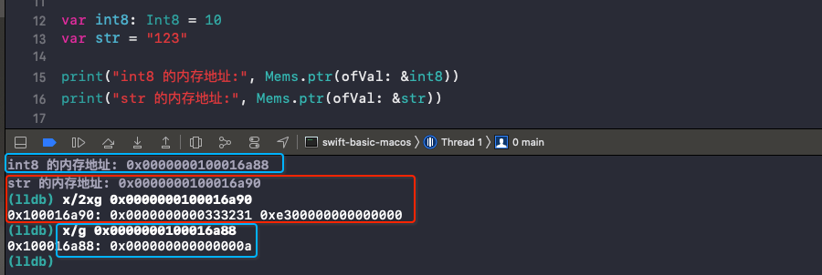
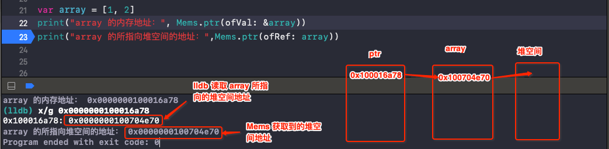

# Mems

[Mems](https://github.com/CoderMJLee/Mems) 是用来窥探 Swift 内存的小工具，由 MJ 开发。

Swift 中关于指针的使用可参考 [Pointer](https://github.com/zhaoName/Notes/blob/master/Swift/Pointer.md)

<br>

### 0x01 获取某个变量的内存地址

获取某个变量的内存地址，如下：

```swift
/// 获得变量的内存地址
public static func ptr(ofVal v: inout T) -> UnsafeRawPointer {
    return MemoryLayout.size(ofValue: v) == 0 ? _EMPTY_PTR : withUnsafePointer(to: &v) {
        UnsafeRawPointer($0)
    }
}
```

- 若变量占用的内存大小是 0，则直接返回 `0x01`

- 若变量占用的内存大小不为 0，用 `withUnsafePointer` 和 `UnsafeRawPointer` 获取变量的内存地址。

```swift
var int8: Int8 = 10
var str = "123"

print("int8 的内存地址:", Mems.ptr(ofVal: &int8))
print("str 的内存地址:", Mems.ptr(ofVal: &str))
```




<br>

### 0x02 获得引用所指向内存的地址

获得引用所指向内存的地址，可以理解为获取某个变量所指向的堆空间的地址值。这里只获取数组、类的实例、类、字符串(若开辟堆空间) 所指向的堆空间地址。

```swift
/// 获得引用所指向内存的地址
public static func ptr(ofRef v: T) -> UnsafeRawPointer {
    if v is Array<Any> // 数组类型
        || Swift.type(of: v) is AnyClass // 任意类
        || v is AnyClass { // 任意类型(X.Type)
        return UnsafeRawPointer(bitPattern: unsafeBitCast(v, to: UInt.self))!
    } else if v is String {
        var mstr = v as! String
        if mstr.mems.type() != .heap {
            return _EMPTY_PTR
        }
        return UnsafeRawPointer(bitPattern: unsafeBitCast(v, to: (UInt, UInt).self).1)!
    } else {
        return _EMPTY_PTR
    }
}
```


```swift
var array = [1, 2]

print("array 的内存地址：", Mems.ptr(ofVal: &array))
print("array 的所指向堆空间的地址：",Mems.ptr(ofRef: array))
```



<br>

### 0x03 `mems` & `type()`

Mems 对中获取某个字符串变量所指向的堆空间地址，做了特殊处理，如下：

```swift
var mstr = v as! String
if mstr.mems.type() != .heap {
    return _EMPTY_PTR
}
// 一个字符串占用16 个字节, 且堆空间的地址值在后8个字节
return UnsafeRawPointer(bitPattern: unsafeBitCast(v, to: (UInt, UInt).self).1)!
```

`mems` 是自定义的命名空间，具体实现代码如下

```swift
public struct MemsWrapper<Base> {
    public private(set) var base: Base
    public init(_ base: Base) {
        self.base = base
    }
}

public protocol MemsCompatible {}
public extension MemsCompatible {
    static var mems: MemsWrapper<Self>.Type {
        get { return MemsWrapper<Self>.self }
        set {}
    }
    var mems: MemsWrapper<Self> {
        get { return MemsWrapper(self) }
        set {}
    }
}

extension String: MemsCompatible {}
public extension MemsWrapper where Base == String {
    mutating func type() -> StringMemType {
        let ptr = Mems.ptr(ofVal: &base)
        return StringMemType(rawValue: (ptr + 15).load(as: UInt8.self) & 0xf0)
            ?? StringMemType(rawValue: (ptr + 7).load(as: UInt8.self) & 0xf0)
            ?? .unknow
    }
}
```

自定义命名空间的实现为什么这么写，可参考 [CustomNamespace](https://github.com/zhaoName/Notes/blob/master/Swift/CustomNamespace.md)，这里不做过多叙述。


`type()` 是在对字符串类型做判断，因为不是所有的字符串都会开辟堆空间来存储其内容。

```swift
public enum StringMemType : UInt8 {
    /// TEXT段（常量区）
    case text = 0xd0
    /// taggerPointer
    case tagPtr = 0xe0
    /// 堆空间
    case heap = 0xf0
    /// 未知
    case unknow = 0xff
}
```

字符串类型如何区分，可参考 [String](https://github.com/zhaoName/Notes/blob/master/Swift/String.md)，这里直接上结论。

- 一个字符串变量占用 16 个字节

- 若字符串长度小于等于 15，会将字符串的内容放直接到变量的内存中，标志位是最高位 `0xe0`，也就是第 16 个字节。

- 若字符串长度大于 15，字符串内容存放在 __TEXT.cstring 常量区中，标志位是第 8 个字节 `0xd0`

- `append()` 之后字符串长度大于 15，会开辟堆空间，标志位是最高位 `0xf0`，也就是第 16 个字节。

这样就刚好对应了 Mems 中定义的字符串类型。

判断字符串变量的类型前，要先取变量的地址，然后再取字符串变量地址的最高位 & `0xf0 `

```swift
let ptr = Mems.ptr(ofVal: &base)

StringMemType(rawValue: (ptr + 15).load(as: UInt8.self) & 0xf0)
```

若不是 `.tagPtr` 或 `.heap` 类型，再取字符串变量地址第 8 个字节判断是否是 `.text` 

```swift
StringMemType(rawValue: (ptr + 7).load(as: UInt8.self) & 0xf0)
```

然后根据字符串变量的类型，判断若字符串变量不是 `.heap` 类型也就没有开辟堆空间，直接返回 `0x01`。

```swift
if mstr.mems.type() != .heap {
    return _EMPTY_PTR
}
```

若是 `.heap` 类型，则堆空间的地址值在后 8 个字节。

```swift
// 一个字符串占用16 个字节, 且堆空间的地址值在后8个字节
return UnsafeRawPointer(bitPattern: unsafeBitCast(v, to: (UInt, UInt).self).1)!
```


示例：

```swift
var str1 = "123456"
print("str1 的内存地址：", Mems.ptr(ofVal: &str1))
print("str1 的所指向堆空间的地址：",Mems.ptr(ofRef: str1))

str1.append("7890ABCDEFG")
print("str1 的内存地址：", Mems.ptr(ofVal: &str1))
print("str1 的所指向堆空间的地址：",Mems.ptr(ofRef: str1))
```


<br>


### 0x04 `MemoryLayout` 与 `malloc_size`

Mems 中用到了`MemoryLayout.size`、`MemoryLayout.stride`、`malloc_size `，我们来看下它们的区别。

```swift
/// 获得变量所占用的内存大小
public static func size(ofVal v: inout T) -> Int {
    return MemoryLayout.size(ofValue: v) > 0 ? MemoryLayout.stride(ofValue: v) : 0
}

/// 获得引用所指向内存的大小
public static func size(ofRef v: T) -> Int {
    return malloc_size(ptr(ofRef: v))
}
```

`MemoryLayout ` 是用来获取变量所占用内存大小

```swift
struct Point  {
    var x = 11
    var y = 22
    var test = true
}

print("变量实际占用的内存大小：", MemoryLayout<Point>.size)
print("系统为变量实际分配的内存大小：", MemoryLayout<Point>.stride)
print("内存对齐：", MemoryLayout<Point>.alignment)

// 变量实际占用的内存大小： 17
// 系统为变量实际分配的内存大小： 24
// 内存对齐：8
```

`malloc_size` 是用来获取类对象真正占用的堆空间的大小。

```swift
class Point  {
    var x = 11
    var y = 22
}

let per = Point()
print("变量占用内存大小：", MemoryLayout.size(ofValue: per))
print("堆空间大小：", malloc_size(Mems.ptr(ofRef: per)))

// 变量占用内存大小： 8
// 堆空间大小： 32
```

<br>

### 0x05 获取变量或所指向内存存储的数据

```swift
/// 获得变量的内存数据（字符串格式）
///
/// - Parameter alignment: 决定了多少个字节为一组
public static func memStr(ofVal v: inout T, alignment: MemAlign? = nil) -> String {
    let p = ptr(ofVal: &v)
    return _memStr(p, MemoryLayout.stride(ofValue: v),
                   alignment != nil ? alignment!.rawValue : MemoryLayout.alignment(ofValue: v))
}

/// 获得引用所指向的内存数据（字符串格式）
///
/// - Parameter alignment: 决定了多少个字节为一组
public static func memStr(ofRef v: T, alignment: MemAlign? = nil) -> String {
    let p = ptr(ofRef: v)
    return _memStr(p, malloc_size(p),
                   alignment != nil ? alignment!.rawValue : MemoryLayout.alignment(ofValue: v))
}
```

无论是获取变量的内存数据还是获取引用所指向的内存数据(堆空间)，最终都会来到下面的方法

```swift
private static func _memStr(_ ptr: UnsafeRawPointer,
                            _ size: Int,
                            _ aligment: Int) ->String {
    if ptr == _EMPTY_PTR { return "" }
    
    var rawPtr = ptr
    var string = ""
    let fmt = "0x%0\(aligment << 1)lx"
    let count = size / aligment
    for i in 0..<count {
        if i > 0 {
            string.append(" ")
            rawPtr += aligment
        }
        let value: CVarArg
        switch aligment {
        case MemAlign.eight.rawValue:
            value = rawPtr.load(as: UInt64.self)
        case MemAlign.four.rawValue:
            value = rawPtr.load(as: UInt32.self)
        case MemAlign.two.rawValue:
            value = rawPtr.load(as: UInt16.self)
        default:
            value = rawPtr.load(as: UInt8.self)
        }
        string.append(String(format: fmt, value))
    }
    return string
}
```

这里要注意的就是 `rawPtr += aligment` 每次循环指针都要往后偏移 `aligment ` 个字节，也就是读取后面的内容。

```swift
var age = 10
print("age变量中存储的内容：", Mems.memStr(ofVal: &age))

var array = [1, 2]
print("array所指向堆空间的内容：", Mems.memStr(ofRef: array))


// age 的内存存储的内容： 0x000000000000000a
// array所指向堆空间的内容： 0x00007fff9a3ee1e0 0x0000000200000002 0x0000000000000002 0x0000000000000004 0x0000000000000001 0x0000000000000002
```

<br>

### 0x06 获得变量的内存数据（字节数组格式）

这两个函数是以占用内存大小为数组长度，再将存储的内容转成十进制存放到数组中。

```swift
/// 获得变量的内存数据（字节数组格式）
public static func memBytes(ofVal v: inout T) -> [UInt8] {
    return _memBytes(ptr(ofVal: &v), MemoryLayout.stride(ofValue: v))
}

/// 获得引用所指向的内存数据（字节数组格式）
public static func memBytes(ofRef v: T) -> [UInt8] {
    let p = ptr(ofRef: v)
    return _memBytes(p, malloc_size(p))
}

private static func _memBytes(_ ptr: UnsafeRawPointer,
                              _ size: Int) -> [UInt8] {
    var arr: [UInt8] = []
    if ptr == _EMPTY_PTR { return arr }
    for i in 0..<size {
        arr.append((ptr + i).load(as: UInt8.self))
    }
    return arr
}
```

示例：

```swift
var age = 10
print("age变量中存储的内容：", Mems.memBytes(ofVal: &age))

var array = [1, 2]
print("array所指向堆空间的内容：", Mems.memBytes(ofRef: array))

// age变量中存储的内容： [10, 0, 0, 0, 0, 0, 0, 0]
// array所指向堆空间的内容： [56, 228, 62, 154, 255, 127, 0, 0, 2, 0, 0, 0, 2, 0, 0, 0, 2, 0, 0, 0, 0, 0, 0, 0, 4, 0, 0, 0, 0, 0, 0, 0, 1, 0, 0, 0, 0, 0, 0, 0, 2, 0, 0, 0, 0, 0, 0, 0]
```

<br>

