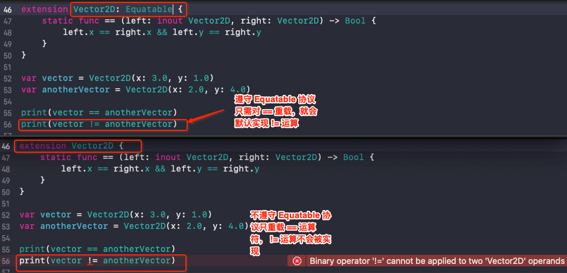

# Advanced Operators


<br>

## 一、溢出运算符 (Overflow Operators)

当向一个整数类型的常量或者变量赋予超过它容量的值时，Swift 默认会报错，而不是允许生成一个无效的数

```swift
let v1 = UInt8.max
// 崩溃: Thread 1: Swift runtime failure: arithmetic overflow
let v2 = v1 + 1

print("v2:", v2)
```

Swift 提供三种溢出运算符让系统支持溢出运算

- 溢出加法 `&+`

- 溢出减法 `&-`

- 溢出乘法 `&*`

### 0x01 溢出加法 `&+`

为简化运算过程，以 `UInt8` 为例，其取值范围是 0 ~ 255

```swift
let v1 = UInt8.max // 255
let v2 = v1 &+ 2

print("v2:", v2) // v2: 1
```

`UInt8.max &+ 2` 的结果是 `1`，转化成二进制看下是怎么计算得来的

```
    0 1111 1111  UInt.max = 255
+   0 0000 0010  2
--------------------------------
    1 0000 0001  257
&   0 1111 1111  UInt.max = 255
--------------------------------
    0 0000 0001  1
```

从二进制可以看出 `255 &+ 2` 等价于 `(255 + 2) & 255 = 1`


### 0x02 溢出减法 `&+`

```swift
let v1 = UInt8.min // 0
let v2 = v1 &- 2

print("v2:", v2) // 254
```

`UInt8.max &- 2` 的结果是 `254`，转化成二进制看下是怎么计算得来的

```
    0000 0000  UInt.min = 0
-   0000 0010  2
--------------------------------
    1111 1110  -2(计算机中以补码存储整数)
&   1111 1111  UInt.max = 255
--------------------------------
    1111 1110  254
```

从二进制可以看出 `0 &- 2` 等价于 `(0 - 2) & 255 = 1`


### 0x03 溢出乘法 `&*`

```swift
let v1: UInt8 = 10
let v2 = v1 &* 30

print("v2:", v2) // 44
```

`10 &* 30` 的结果是 `44`，转化成二进制看下是怎么计算得来的

```
    1 0010 1100  10 * 30 = 300
&   0 1111 1111  255
--------------------------------
    0 0010 1100  44
```

从二进制可以看出 `10 &* 30` 等价于 `(10 * 30) & 255 = 44`

总结：对于无符号与有符号整型数值来说，当出现上溢时，它们会从数值所能容纳的最大数变成最小数。同样地，当发生下溢时，它们会从所能容纳的最小数变成最大数。

<br>

## 二、运算符函数 (Operator Methods)

类和结构体可以为现有的运算符提供自定义的实现，这被称为运算符重载。

### 0x01 二元运算符重载

算术加法、减法运算符是一个二元运算符，因为它是对两个值进行运算，同时它还可以称为中缀运算符，因为它出现在两个值中间。

```swift
struct Vector2D {
    var x = 0.0, y = 0.0
    // 运算符重载必须加 static
    // 否则报错 Operator '+' declared in type 'Vector2D' must be 'static'
    static func + (left: Vector2D, right: Vector2D) -> Vector2D {
        return Vector2D(x: left.x + right.x, y: left.y + right.y)
    }
    
    static func - (left: Vector2D, right: Vector2D) -> Vector2D {
        return Vector2D(x: left.x - right.x, y: left.y - right.y)
    }
    
    static func += (left: inout Vector2D, right: Vector2D) {
        left = left + right
    }
}
```

```
let vector = Vector2D(x: 3.0, y: 1.0)
let anotherVector = Vector2D(x: 2.0, y: 4.0)

let addVector = vector + anotherVector
let subVector = vector - anotherVector
print("addVector:", addVector)
print("subVector:", subVector)

// 打印结果
addVector: Vector2D(x: 5.0, y: 5.0)
subVector: Vector2D(x: 1.0, y: -3.0)
```

### 0x02 前缀和后缀运算符

运算符还可以分为前缀运算符 (prefix)、中缀运算符 (infix)、后缀运算符 (postfix) 。重载运算符时如果不写默认是中缀运算符。

```swift
extension Vector2D {
    prefix static func - (vector: Vector2D) -> Vector2D {
        return Vector2D(x: -vector.x, y: -vector.y)
    }
    
    prefix static func ++ (vector: inout Vector2D) -> Vector2D {
        vector += Vector2D(x: 1, y: 1)
        return vector
    }
    
    postfix static func ++ (vector: inout Vector2D) -> Vector2D {
        let temp = vector
        vector += Vector2D(x: 1, y: 1)
        return temp
    }
}
```

```swift
let vector2 = ++vector
let vector3 = anotherVector++

print(-vector)
print(vector2, vector)
print(vector3, anotherVector)

// 打印结果
Vector2D(x: -4.0, y: -2.0)
Vector2D(x: 4.0, y: 2.0) Vector2D(x: 4.0, y: 2.0)
Vector2D(x: 2.0, y: 4.0) Vector2D(x: 3.0, y: 5.0)
```

**注意:** 不能对默认的赋值运算符 `=` 进行重载。只有复合赋值运算符可以被重载。同样地也无法对三元条件运算符 `a ? b : c` 进行重载。

### 0x03 等价运算符

重载相等运算符时，都会遵守 `Equatable ` 协议，因为 `Equatable ` 协议会帮我们默认实现 `!=` 

```swift
public protocol Equatable {
    /// Returns a Boolean value indicating whether two values are equal.
    ///
    /// Equality is the inverse of inequality. For any values `a` and `b`,
    /// `a == b` implies that `a != b` is `false`.
    ///
    /// - Parameters:
    ///   - lhs: A value to compare.
    ///   - rhs: Another value to compare.
    static func == (lhs: Self, rhs: Self) -> Bool
}
```

```swift
extension Vector2D: Equatable {
    static func == (left: inout Vector2D, right: Vector2D) -> Bool {
        left.x == right.x && left.y == right.y
    }
}
```

```swift
var vector = Vector2D(x: 3.0, y: 1.0)
var anotherVector = Vector2D(x: 2.0, y: 4.0)

print(vector == anotherVector) // false
print(vector != anotherVector) // true
```



<br>

## 三、自定义运算符

除了实现标准运算符，在 Swift 中还可以声明和实现自定义运算符。新的运算符要使用 `operator` 关键字在全局作用域内进行定义，同时还要指定 `prefix`、`infix` 或者 `postfix` 修饰符。

```swift
prefix operator +++
```

结构体 `Vector2D` 实现自定义运算符 `+++`

```swift
extension Vector2D {
    static prefix func +++ (vector: inout Vector2D) -> Vector2D {
        vector += vector
        return vector
    }
}

print(+++vector) // Vector2D(x: 6.0, y: 2.0)
```

### 0x01 自定义中缀运算符的优先级

每个自定义中缀运算符都属于某个优先级组。优先级组指定了这个运算符相对于其他中缀运算符的优先级和结合性。

优先级组用 `precedencegroup ` 声明，具体可参考[这里](https://developer.apple.com/documentation/swift/swift_standard_library/operator_declarations)

```swift
precedencegroup 优先级组 {
    associativity: 结合性(lft/right/none)
    higherThan: 比谁的优先级高
    lowerThan: 比谁的优先级低
    assignment: true 代表在可选链操作中拥有跟赋值运算符一样的优先级
}
```

而没有明确放入某个优先级组的自定义中缀运算符将会被放到一个默认的优先级组内，其优先级高于三元运算符。

下面以自定义中缀运算符 `+-` 为例

```swift
// `+-` 属于 PlusMiusPrecedence 优先级组
infix operator +- : PlusMiusPrecedence
 
// 定义 `+-` 运算符的优先级和结合性
precedencegroup PlusMiusPrecedence {
    associativity: none // 不具有结合性
    higherThan: AdditionPrecedence // 比加法优先级高
    lowerThan: MultiplicationPrecedence // 比乘法优先级低
    assignment: true
}

extension Vector2D {
    static func +- (left: Vector2D, right: Vector2D) -> Vector2D {
        return Vector2D(x: left.x + right.x, y: left.y - right.y)
    }
}
```

```swift
let resultVector = vector +- anotherVector
print(resultVector) // Vector2D(x: 5.0, y: -3.0)
```

`associativity: none` 表示不具有结合性


`associativity: left` 表示从左到右运算

```swift
let resultVector = vector +- anotherVector +- vector
print(resultVector)  // Vector2D(x: 8.0, y: -4.0)

// 运算过程：vector +- anotherVector +- vector = (3, 1) +- (2, 4) +- (3, 1) = (5, -3) +- (3, 1) = (8, -4)
```

`associativity: right` 表示从左到右运算

```swift
let resultVector = vector +- anotherVector +- vector
print(resultVector)  //Vector2D(x: 8.0, y: -2.0)

// 运算过程：vector +- anotherVector +- vector = (3, 1) +- (2, 4) +- (3, 1) = (3, 1) +- (5, 3) = (8, -2)
```

`higherThan: AdditionPrecedence ` 表示比加法优先级高

```swift
let resultVector = vector + anotherVector +- vector
print(resultVector)  // Vector2D(x: 8.0, y: 4.0)

// 运算过程：vector + anotherVector +- vector = (3, 1) + (2, 4) +- (3, 1) = (3, 1) + (5, 3) = (8, 4)
```


<br>

<br>

参考

- [Advanced Operators](https://docs.swift.org/swift-book/LanguageGuide/AdvancedOperators.html)

- [高级运算符](https://swiftgg.gitbook.io/swift/swift-jiao-cheng/27_advanced_operators#custom-operators)