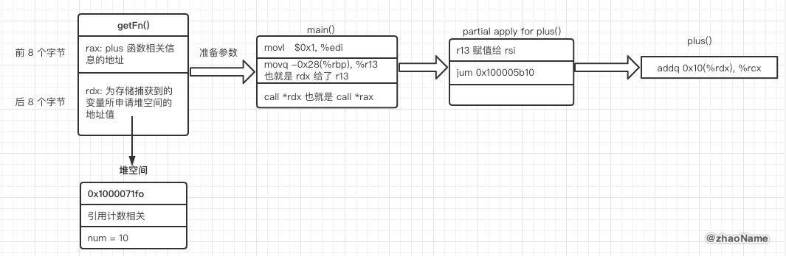

# Closure

闭包 (closure) 是自包含的函数代码块，可以在代码中被传递和使用。Swift 中的闭包与 C 和 Objective-C 中的代码块（`blocks`）以及其他一些编程语言中的匿名函数（`Lambdas`）比较相似。

Swift 中闭包有如下三种表达方式：

- 全局函数是一个有名字但不会捕获任何值的闭包

- 嵌套函数是一个有名字并可以捕获其封闭函数域内值的闭包
- 闭包表达式是一个利用轻量级语法所写的可以捕获其上下文中变量或常量值的匿名闭包


<br>

## 一、闭包表达式


### 0x01 闭包表达式

Swift 标准库提供了名为 `sorted(by:)` 的方法，它会基于你提供的排序闭包表达式的判断结果对数组中的值（类型确定）进行排序。

```swift
var names = ["Chris", "Alex", "Ewa", "Barry", "Daniella"]
```

可以写一个闭包函数 `backward(_:_:)` 当 `sorted(by:)` 的参数传进去


```swift
func backward(_ s1: String, _ s2: String) -> Bool {
    return s1 > s2
}
var reversedNames = names.sorted(by: backward)

// 打印结果
// reversedNames 为 ["Ewa", "Daniella", "Chris", "Barry", "Alex"]
```

为了 `s1 > s2` 这个表达式而写了个函数，有点浪费。我们还可以用闭包表达式来更好的构造一个内联闭包函数。

闭包表达式的语法

```swift
{ (parameters) -> return type in
    statements
}
```

所以排序函数还可以这样写：

```swift
names.sorted { (s1: String, s2: String) -> Bool in
    return s1 > s2
}
```

在内联闭包表达式中，函数和返回值类型都写在大括号内，而不是大括号外。

### 0x02 闭包表达式的语法优化

Swift 的闭包表达式拥有简洁的风格，并鼓励在常见场景中进行语法优化，主要优化如下：

- 利用上下文推断参数和返回值类型

```swift
names.sorted(by: { s1, s2 in return s1 > s2 } )
```

- 隐式返回单表达式闭包，即单表达式闭包可以省略 `return` 关键字

```swift
names.sorted(by: { s1, s2 in s1 > s2 } )
```

- 参数名称缩写

```swift
reversedNames = names.sorted(by: { $0 > $1 } )
```

- 运算符

Swift 的 `String` 类型定义了关于大于号（`>`）的字符串实现，其作为一个函数接受两个 `String` 类型的参数并返回 `Bool` 类型的值。Swift 可以自动推断找到系统自带的那个字符串函数的实现。

```swift
names.sorted(by: >)
```

- 尾随闭包语法

若将一个很长的闭包表达式作为函数的最后一个实参，使用尾随闭包可以增强函数的可读性。尾随闭包是一个书写在函数圆括号之后的闭包表达式，函数支持将其作为最后一个参数调用。

```swift
func someFunctionThatTakesAClosure(closure: () -> Void) {
    // 函数体部分
}

// 以下是不使用尾随闭包进行函数调用
someFunctionThatTakesAClosure(closure: {
    // 闭包主体部分
})

// 以下是使用尾随闭包进行函数调用
someFunctionThatTakesAClosure() {
    // 闭包主体部分
}
```

如果闭包表达式是函数或方法的唯一参数，则当你使用尾随闭包时，你甚至可以把 `()` 省略掉

```swift
someFunctionThatTakesAClosure {
    // 闭包主体部分
}
```

<br>


## 二、闭包中值捕获

闭包可以在其被定义的上下文中捕获常量或变量。即使定义这些常量和变量的原作用域已经不存在，闭包仍然可以在闭包函数体内引用和修改这些值。

Swift 中，可以捕获值的闭包的最简单形式是嵌套函数，嵌套函数可以捕获其外部函数所有的参数以及定义的常量和变量。


### 0x01 引入问题

```swift
typealias Fn = (Int) -> Int

func getFn() -> Fn {
    var num = 10
    
    func plus(_ i: Int) -> Int {
        num += i
        return num
    }
    
    return plus
}

let fn = getFn()
print(fn(1)) // 11
print(fn(2)) // 13
print(fn(3)) // 16
```

可以看到打印结果是 11、13、16，也就是说 `plus` 函数中关于 `num` 内存地址一直没有被释放。那么问题来了：

- 闭包捕获的基本数据类型的变量存储在哪？

- 闭包捕获的遍历如何和`plus` 函数关联起来的？

### 0x02 闭包捕获的基本数据类型的变量存储在哪?

分别在 `return plus` 和 `return num` 出打断点，进入汇编调试模式。可以看到断点到 `getFn` 函数中

```
swift-basic-macos`getFn():
    ...
    0x100005a8f <+15>: movl   $0x18, %esi
    0x100005a94 <+20>: movl   $0x7, %edx
    0x100005a99 <+25>: callq  0x100005f20               ; symbol stub for: swift_allocObject
    0x100005a9e <+30>: movq   %rax, %rdx
    0x100005aa1 <+33>: addq   $0x10, %rdx
    0x100005aa5 <+37>: movq   %rdx, %rsi
    0x100005aa8 <+40>: movq   $0xa, 0x10(%rax)
->  0x100005ab0 <+48>: movq   %rax, %rdi
    0x100005ab3 <+51>: movq   %rax, -0x8(%rbp)
    ...
```

从汇编代码可以看到 `getFn` 函数调用了 `swift_allocObject ` 函数，也就是向堆空间申请内存空间。调用函数的返回值存放到 `rax`，且汇编代码 `movq   $0xa, 0x10(%rax)` 表示将 `10` 存放到 `rax+0x10` 所指向的内存中。


至此我们可以猜测闭包捕获的变量应该存储到堆空间中。

放开断点让程序继续往下运行，进入到 `plus` 函数中。此时由于断点断在 `return num`，也就是说`num += i` 已经计算结束。若 `0x100738280 + 0x10` 中存放的是 `11`，就说明猜测正确。


继续执行 `lldb` 指令 `c` 过掉断点，可以看到`0x100738280 + 0x10` 就是我们要找的结果。


闭包捕获变量会向堆空间申请内存，并将捕获到的变量存放到堆空间中，准确来说是存到到所申请堆空间内存的第 16 个字节开始往后的 8 个字节中。

### 0x03 闭包捕获的变量如何和 `plus` 函数关联起来的？

闭包捕获的变量如何和 `plus` 函数关联起来的，这个问题还可以分为两个问题

- `let fn = getFn()` 中 `fn` 存放的是什么？

- 执行 `fn(1)` 时，捕获的变量(存储在堆空间)如何传到 `plus` 函数中(栈空间)？


#### `fn` 存放的是什么？

在 `let fn = getFn()` 处下断点，运行程序，程序断在 `callq  0x100005a80`。从注释也可以看出就是在调用 `getFn()` 函数

```
swift-basic-macos`main:
    0x1000059d0 <+0>:   pushq  %rbp
    0x1000059d1 <+1>:   movq   %rsp, %rbp
    0x1000059d4 <+4>:   pushq  %r13
    0x1000059d6 <+6>:   subq   $0x58, %rsp
    0x1000059da <+10>:  movl   %edi, -0xc(%rbp)
    0x1000059dd <+13>:  movq   %rsi, -0x18(%rbp)
->  0x1000059e1 <+17>:  callq  0x100005a80               ; swift_basic_macos.getFn() -> (Swift.Int) -> Swift.Int at main.swift:20
    0x1000059e6 <+22>:  movq   %rax, 0x2833(%rip)        ; swift_basic_macos.fn : (Swift.Int) -> Swift.Int
    0x1000059ed <+29>:  movq   %rdx, 0x2834(%rip)        ; swift_basic_macos.fn : (Swift.Int) -> Swift.Int + 8
    0x1000059f4 <+36>:  movq   0x2825(%rip), %rax        ; swift_basic_macos.fn : (Swift.Int) -> Swift.Int
    0x1000059fb <+43>:  movq   0x2826(%rip), %rdx        ; swift_basic_macos.fn : (Swift.Int) -> Swift.Int + 8
    0x100005a02 <+50>:  movq   %rdx, %rdi
    0x100005a05 <+53>:  movq   %rax, -0x20(%rbp)
    0x100005a09 <+57>:  movq   %rdx, -0x28(%rbp)
    0x100005a0d <+61>:  callq  0x100005f68               ; symbol stub for: swift_retain
    0x100005a12 <+66>:  movl   $0x1, %edi
    0x100005a17 <+71>:  movq   -0x28(%rbp), %r13
    0x100005a1b <+75>:  movq   -0x20(%rbp), %rdx
    0x100005a1f <+79>:  movq   %rax, -0x30(%rbp)
    0x100005a23 <+83>:  callq  *%rdx
    0x100005a25 <+85>:  movq   -0x28(%rbp), %rdi
    0x100005a29 <+89>:  movq   %rax, -0x38(%rbp)
    0x100005a2d <+93>:  callq  0x100005f62               ; symbol stub for: swift_release
    0x100005a32 <+98>:  movq   0x27e7(%rip), %rax        ; swift_basic_macos.fn : (Swift.Int) -> Swift.Int
    0x100005a39 <+105>: movq   0x27e8(%rip), %rdx        ; swift_basic_macos.fn : (Swift.Int) -> Swift.Int + 8
    0x100005a40 <+112>: movq   %rdx, %rdi
    0x100005a43 <+115>: movq   %rax, -0x40(%rbp)
    0x100005a47 <+119>: movq   %rdx, -0x48(%rbp)
    0x100005a4b <+123>: callq  0x100005f68               ; symbol stub for: swift_retain
    0x100005a50 <+128>: movl   $0x2, %edi
    0x100005a55 <+133>: movq   -0x48(%rbp), %r13
    0x100005a59 <+137>: movq   -0x40(%rbp), %rdx
    0x100005a5d <+141>: movq   %rax, -0x50(%rbp)
    0x100005a61 <+145>: callq  *%rdx
    0x100005a63 <+147>: movq   -0x48(%rbp), %rdi
    0x100005a67 <+151>: movq   %rax, -0x58(%rbp)
    0x100005a6b <+155>: callq  0x100005f62               ; symbol stub for: swift_release
    0x100005a70 <+160>: xorl   %eax, %eax
    0x100005a72 <+162>: addq   $0x58, %rsp
    0x100005a76 <+166>: popq   %r13
    0x100005a78 <+168>: popq   %rbp
    0x100005a79 <+169>: retq  
```

执行 `lldb` 执行 `si` 进入到 `getFn()` 函数。


```
swift-basic-macos`getFn():
->  0x100005a80 <+0>:  pushq  %rbp
    0x100005a81 <+1>:  movq   %rsp, %rbp
    0x100005a84 <+4>:  subq   $0x20, %rsp
    0x100005a88 <+8>:  leaq   0x1761(%rip), %rdi        ; type metadata for TestStruct #1 in swift_basic_macos.test() -> () + 40
    0x100005a8f <+15>: movl   $0x18, %esi
    0x100005a94 <+20>: movl   $0x7, %edx
    ; 向堆空间申请内存 大小是0x18 由于内存对齐实际返回的应该是0x20
    0x100005a99 <+25>: callq  0x100005f20               ; symbol stub for: swift_allocObject
    0x100005a9e <+30>: movq   %rax, %rdx
    0x100005aa1 <+33>: addq   $0x10, %rdx
    0x100005aa5 <+37>: movq   %rdx, %rsi
    ; 将 num 的值 10 赋值给 rax + 0x10
    0x100005aa8 <+40>: movq   $0xa, 0x10(%rax)
    0x100005ab0 <+48>: movq   %rax, %rdi
    ; 将 rax 暂存到 rbp-0x8
    0x100005ab3 <+51>: movq   %rax, -0x8(%rbp)
    0x100005ab7 <+55>: movq   %rdx, -0x10(%rbp)
    0x100005abb <+59>: callq  0x100005f68               ; symbol stub for: swift_retain
    0x100005ac0 <+64>: movq   -0x8(%rbp), %rdi
    0x100005ac4 <+68>: movq   %rax, -0x18(%rbp)
    0x100005ac8 <+72>: callq  0x100005f62               ; symbol stub for: swift_release
    0x100005acd <+77>: movq   -0x10(%rbp), %rax
    ; 计算(rip +0x138)包装 plus 函数的地址值(不是真正的 plus 函数)，并赋值给rax
    0x100005ad1 <+81>: leaq   0x138(%rip), %rax         ; partial apply forwarder for plus #1 (Swift.Int) -> Swift.Int in swift_basic_macos.getFn() -> (Swift.Int) -> Swift.Int at <compiler-generated>
    ; 将 rbp-0x8 中的内容赋值给 rdx，也就是将包含 num 的堆空间的地址赋值给 rdx
    0x100005ad8 <+88>: movq   -0x8(%rbp), %rdx
    0x100005adc <+92>: addq   $0x20, %rsp
    0x100005ae0 <+96>: popq   %rbp
    0x100005ae1 <+97>: retq  
```


执行完 `getFn` 函数之后，接下来执行 `main` 函数中的两句汇编代码如下

```
; rip + 0x2834 = 0x100008220
0x1000059e6 <+22>:  movq   %rax, 0x2833(%rip)        ; swift_basic_macos.fn : (Swift.Int) -> Swift.Int
; rip + 0x2834 = 0x100008228
0x1000059ed <+29>:  movq   %rdx, 0x2834(%rip)        ; swift_basic_macos.fn : (Swift.Int) -> Swift.Int + 8
```


至此我们知道 `fn` 总共占用 16 个字节的大小。前 8 个字节用来存放 `plus` 函数相关的信息(不是 `plus` 函数地址)，后 8 个字节用来存放堆空间的地址，也就是为存储捕获到的变量所申请的堆空间地址值。


#### 执行 `fn(1)` 时，捕获的变量(存储在堆空间)如何传到 `plus` 函数中(栈空间)？

`main` 函数继续执行下去，在第一个 `callq  *%rdx` 出下断点

```swift
0x1000059e6 <+22>:  movq   %rax, 0x2833(%rip)        ; swift_basic_macos.fn : (Swift.Int) -> Swift.Int
    0x1000059ed <+29>:  movq   %rdx, 0x2834(%rip)    ; swift_basic_macos.fn : (Swift.Int) -> Swift.Int + 8
    0x1000059f4 <+36>:  movq   0x2825(%rip), %rax    ; swift_basic_macos.fn : (Swift.Int) -> Swift.Int
    0x1000059fb <+43>:  movq   0x2826(%rip), %rdx    ; swift_basic_macos.fn : (Swift.Int) -> Swift.Int + 8
    0x100005a02 <+50>:  movq   %rdx, %rdi
    ; rax 暂存到 rbp-0x20
    0x100005a05 <+53>:  movq   %rax, -0x20(%rbp)
    ; rdx 暂存到 rbp-0x28
    0x100005a09 <+57>:  movq   %rdx, -0x28(%rbp)
    0x100005a0d <+61>:  callq  0x100005f68               ; symbol stub for: swift_retain
    ; 调用 plus 函数所传参数 1 即 fn(1)
    0x100005a12 <+66>:  movl   $0x1, %edi
    ; rbp-0x28(rdx) 赋值给 r13, 也就是将堆空间的地址值给 r13
    0x100005a17 <+71>:  movq   -0x28(%rbp), %r13
    ; rbp-0x20(rax) 赋值给 rdx, 也就是将封装了 plus 函数相关信息的地址给 rdx
    0x100005a1b <+75>:  movq   -0x20(%rbp), %rdx
    0x100005a1f <+79>:  movq   %rax, -0x30(%rbp)
    ; 取出 rdx 的前 8 个字节，并调用
->  0x100005a23 <+83>:  callq  *%rdx
```


那 `callq  *%rdx` 可能和调用 plus 函数有关系，执行 `lldb` 指令 `si`，进入到这个函数

```
swift-basic-macos`partial apply for plus #1 (_:) in getFn():
->  0x100005c10 <+0>: pushq  %rbp
    0x100005c11 <+1>: movq   %rsp, %rbp
    ; r13 赋值给 rsi，也就是将堆空间的地址给了 rsi
    0x100005c14 <+4>: movq   %r13, %rsi
    0x100005c17 <+7>: popq   %rbp
    0x100005c18 <+8>: jmp    0x100005b10               ; plus #1 (Swift.Int) -> Swift.Int in swift_basic_macos.getFn() -> (Swift.Int) -> Swift.Int at main.swift:23
```

在这里看到将堆空间的地址给了 `rsi`，且找到了 `plus` 函数的真正地址 `0x100005b10 `，跳转进去。

```
swift-basic-macos`plus #1 (_:) in getFn():
->  0x100005b10 <+0>:   pushq  %rbp
    0x100005b11 <+1>:   movq   %rsp, %rbp
    0x100005b14 <+4>:   subq   $0x90, %rsp
    0x100005b1b <+11>:  xorl   %eax, %eax
    0x100005b1d <+13>:  movl   %eax, %ecx
    0x100005b1f <+15>:  xorl   %eax, %eax
    0x100005b21 <+17>:  leaq   -0x8(%rbp), %rdx
    0x100005b25 <+21>:  movq   %rdi, -0x48(%rbp)
    0x100005b29 <+25>:  movq   %rdx, %rdi
    0x100005b2c <+28>:  movq   %rsi, -0x50(%rbp)
    0x100005b30 <+32>:  movl   %eax, %esi
    0x100005b32 <+34>:  movl   $0x8, %edx
    0x100005b37 <+39>:  movq   %rdx, -0x58(%rbp)
    0x100005b3b <+43>:  movq   %rcx, -0x60(%rbp)
    0x100005b3f <+47>:  movl   %eax, -0x64(%rbp)
    0x100005b42 <+50>:  callq  0x100005ef6               ; symbol stub for: memset
    0x100005b47 <+55>:  leaq   -0x10(%rbp), %rcx
    0x100005b4b <+59>:  movq   %rcx, %rdi
    0x100005b4e <+62>:  movl   -0x64(%rbp), %esi
    0x100005b51 <+65>:  movq   -0x58(%rbp), %rdx
    0x100005b55 <+69>:  callq  0x100005ef6               ; symbol stub for: memset
    0x100005b5a <+74>:  movq   -0x48(%rbp), %rcx
    0x100005b5e <+78>:  movq   %rcx, -0x8(%rbp)
    0x100005b62 <+82>:  movq   -0x50(%rbp), %rdx
    0x100005b66 <+86>:  addq   $0x10, %rdx
    0x100005b6a <+90>:  movq   %rdx, -0x10(%rbp)
    0x100005b6e <+94>:  movq   %rdx, %rdi
    0x100005b71 <+97>:  leaq   -0x28(%rbp), %rsi
    0x100005b75 <+101>: movl   $0x21, %r8d
    0x100005b7b <+107>: movq   %rdx, -0x70(%rbp)
    0x100005b7f <+111>: movq   %r8, %rdx
    0x100005b82 <+114>: movq   -0x60(%rbp), %rcx
    0x100005b86 <+118>: callq  0x100005f26               ; symbol stub for: swift_beginAccess
    0x100005b8b <+123>: movq   -0x48(%rbp), %rcx
    0x100005b8f <+127>: movq   -0x50(%rbp), %rdx
    0x100005b93 <+131>: addq   0x10(%rdx), %rcx
    ...
```

为了调用 `plus` 函数传进来的一个参数 `1`，在 `main` 中可知将 `1` 存放在寄存器 `edi`中。

在`swift-basic-macos partial apply for plus #1 (_:) in getFn():` 可知，为捕获变量所申请的堆空间的地址值存放在寄存器 `rsi` 中。


`plus` 函数中要做执行 `num += i` 加法操作，对应的就要执行 `add x, x` 汇编。我们看到第一个加法汇编指令是 `addq   $0x10, %rdx`，这个明显不对，加法操作中没有 16 这个数字。

在往下找 `addq   0x10(%rdx), %rcx` ，这个可能是的，因为 `num` 变量的值就是存放到所申请堆空间第 16 个字节起的 8 个字节所在的内存空间中。那我们证明 `rdx` 是堆空间的地址值，`rcx` 中存储的是 `1`，就说明找对地方了。

在 `addq   0x10(%rdx), %rcx` 出下断点，执行`lldb` 指令 `c` 跳转到此。用 `lldb` 指令可以证明 `rdx` 是堆空间的地址值，`rcx` 中存储的是 `1`。


 
执行完 `num += i` 之后再次查看堆空间中存储 `num` 对应内存中值得变化，变成了 `11`。
 


至此，我们可以认为：执行 `fn(1)` 时相当于传了两个参数，一个是调用时传进来的参数 `i`，另外一个是所申请堆空间的地址值。


把所有的流程串起来，大概是这样的。这就是闭包捕获变量，并对其修改的过程。



<br>


## 三、自动闭包


```swift
```


<br>

## 四、逃逸闭包


```swift
```

<br>

```swift
```

```swift
```

```swift
```

```swift
```

```swift
```


<br>


<br>

参考：

- [Closures](https://docs.swift.org/swift-book/LanguageGuide/Closures.html)

- [闭包](https://swiftgg.gitbook.io/swift/swift-jiao-cheng/07_closures)

<br>