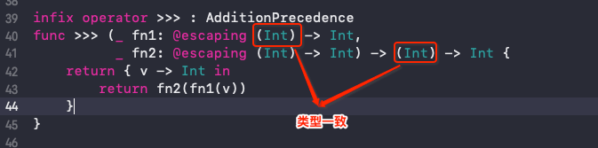
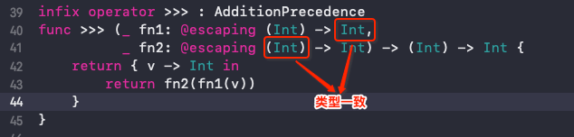
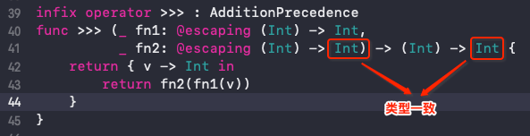
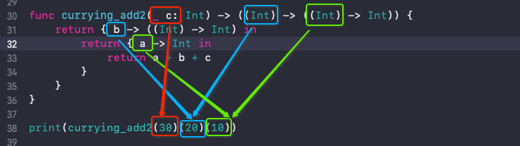
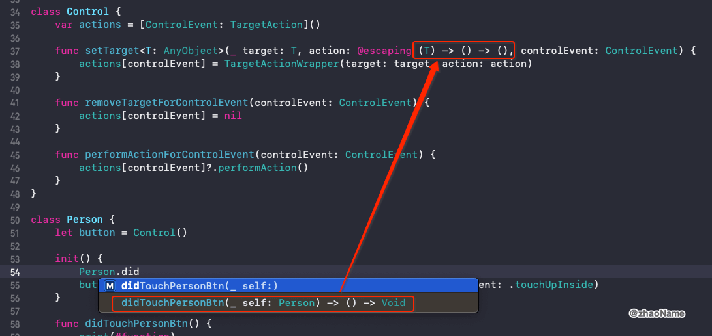

# Currying (柯里化)

Currying (柯里化) 是将一个接收多参数的函数转换成一系列只接收单个参数的函数。函数式的编程思想贯穿于 Swift 中，而函数的柯里化正是这门语言函数式特点的重要表现。


<br>

### 0x01 命令式编程下的函数

假如要计算 `((1 + 2) * 3 - 4) / 5 % 6` 传统做法如下：


```swift
func add(_ a: Int, _ b: Int) -> Int { a + b }

func sub(_ a: Int, _ b: Int) -> Int { a - b }

func multiple(_ a: Int, _ b: Int) -> Int { a * b }

func divide(_ a: Int, _ b: Int) -> Int { a / b }

func mod(_ a: Int, _ b: Int) -> Int { a % b }
```

调用函数计算最终结果

```swift
print(mod(divide(sub(multiple(add(1, 2), 3), 4), 5), 6))  // 1
```

虽然能计算出结果，但 `mod(divide(sub(multiple(add(1, 2), 3), 4), 5), 6)` 这样的代码可读性太低。我们将上述函数柯里化，再看看有什么不同。

<br>

### 0x02 函数式编程下的函数 - 柯里化

对 `add(_:, _:)` 函数柯里化，要将两个参数转化成一个参数。

```swift
func add(_ a: Int) -> ? { }
```

那它的返回值时什么类型的呢？首先可以肯定不是基本数据类型，因为还少一个参数。再想想柯里化是将一个接收多参数的函数转换成一系列只接收单个参数的函数，可以确定它的返回值类型是个函数。

```swift
func add(_ a: Int) -> ((Int) -> Int) {
    return { b -> Int in
        print("a=\(a), b=\(b)")
        return a + b
    }
}
```

`add` 接收一个需要与输入数字相加的数，返回值是类型为 `(Int) -> Int` 的函数。返回的函数将接收输入的数字本身，然后进行操作。


```swift
// 输入的数字是 1 
let fn = add(2)
print(fn(1))  // add(2)(1)

// 打印结果
// a=2, b=1
// 3
```

可以将 `add` 函数简化为：


```swift
func add(_ a: Int) -> ((Int) -> Int) { { $0 + a } }
```

同理将其它函数柯里化：

```swift
func sub(_ a: Int) -> ((Int) -> Int) { { $0 - a } }

func multiple(_ a: Int) -> ((Int) -> Int) { { $0 * a } }

func divide(_ a: Int) -> ((Int) -> Int) { { $0 / a } }

func mod(_ a: Int) -> ((Int) -> Int) { { $0 % a } }
```

再计算 `((1 + 2) * 3 - 4) / 5 % 6`

```swift
print(mod(6)(divide(5)(sub(4)(multiple(3)(add(2)(1))))))  // 1
```

我们将传统函数柯里化后并没有什么改变，好像代码的可读性变的更低了。

<br>

### 0x03 自定义运算符简化代码

理想中的代码类似于这种 `inputNum >>> add(2) >>> multiple(3) >>> divide(4) >>> mod(5)` 得到计算结果。这就需要我们将函数组合在一起，如下函数 `composite` 接收两个函数类型的参数，并且将 `fn1` 的返回值当作 `fn2` 的参数，然后将 `fn2` 的返回值返回出去。

```swift
func composite(_ fn1: @escaping (Int) -> Int,
               _ fn2: @escaping (Int) -> Int) -> (Int) -> Int {
    return { v -> Int in
        return fn2(fn1(v))
    }
}
```

输入数字 1 实现 `(1 + 2) * 3`

```swift
//    fn2(fn1(v))
// => fn2(fn1(1))
// => fn2(add(2)(1))
// => multiple(3)(add(2)(1))
let fn = composite(add(2), multiple(3))
print(fn(1))  // 9
```

输入数字 1 实现 `(1 + 2) * 3 - 4`

```swift
let fn = composite(composite(add(2), multiple(3)), sub(4))
print(fn(1))  // 5
```

`composite ` 能将两个柯里化函数组合在一起，但类似 `(1 + 2) * 3 - 4` 这种复杂计算还是函数嵌套，代码可读性还是不好。

注意到运算符 `+` 是将两个数字加在一起，那我们也可以自定义一个运算符将两个柯里化函数联系在一起。如下：

```swift
infix operator >>> : AdditionPrecedence
func >>> (_ fn1: @escaping (Int) -> Int,
          _ fn2: @escaping (Int) -> Int) -> (Int) -> Int {
    return { v -> Int in
        return fn2(fn1(v))
    }
}
```

使用运算符 `>>>` 实现 `(1 + 2) * 3 - 4`

```swift
let fn = add(2) >>> multiple(3) >>> sub(4)
print(fn(1))  // 5
```

使用运算符 `>>>` 实现 `((1 + 2) * 3 - 4) / 5 % 6`

```swift
let fn = add(2) >>> multiple(3) >>> sub(4) >>> divide(5) >>> mod(6)
print(fn(1))  // 1
```

<br>

### 0x04 `>>>` 泛型化

上述的运算符 `>>>` 只能接收和返回 `Int` 类型的数据，我们还可以将其一般化，或者叫泛型化。

- `>>>` 的返回函数的入参需要和 `fn1` 的参数进行计算，所以它俩的类型肯定一样



 - `fn1` 的返回值是 `fn2`的入参，所以它俩的类型肯定一样
 


 - `fn2` 的返回值就是 `>>>` 的返回值，所以它俩的类型肯定一样
 


所以可以将 `>>>` 泛型化为：

```swift
infix operator >>> : AdditionPrecedence
func >>><A, B, C> (_ fn1: @escaping (A) -> B,
          _ fn2: @escaping (B) -> C) -> (A) -> C {
    return { v -> C in
        return fn2(fn1(v))
    }
}
```

<br>

### 0x06 柯里化的一般化

先看一个将接收三个参数的函数柯里化的过程，如下计算 `a + b + c`


```swift
func add2(_ a: Int, _ b: Int, _ c: Int) -> Int {
    a + b + c
}
```

柯里化结果

```swift
func currying_add2(_ c: Int) -> ((Int) -> ((Int) -> Int)) {
    return { b -> ((Int) -> Int) in
        return { a -> Int in
            return a + b + c
        }
    }
}

print(currying_add2(30)(20)(10)) // 60
```

我们希望的是输入数字 10，对其进行加 20，再加 30 的操作。从对拥有两个参数的函数柯里化的经验来看，输入的数字对应的是返回函数的入参。`currying_add2 ` 返回值类型是个嵌套函数，输入的数字对应的就是最里面函数的入参。对应关系如下：



我们定义一个函数 `currying()`，它接收一个函数类型的参数 `fn`，并将这个函数 `fn` 柯里化。 意思就是将`add(10, 20) `  转化成 `currying(add)(20)(10)` 。

`currying(add)(20)(10)` 与接收三个参数的函数柯里化结果类似

```swift
func currying(_ fn: @escaping (Int, Int) -> Int) -> ((Int) -> ((Int) -> Int)) {
    return { b in
        return { a in
            return fn(a, b)
        }
    }
}
```

再将 `currying` 泛型化

```swift
func currying<A, B, C>(_ fn: @escaping (A, B) -> C) -> ((B) -> ((A) -> C)) {
    return { b in
        return { a in
            return fn(a, b)
        }
    }
}
```

<br>

### 0x07 柯里化在 `Selector`的实际应用

```swift
protocol TargetAction {
    func performAction()
}

struct TargetActionWrapper<T: AnyObject>: TargetAction {
    weak var target: T?
    weak var contrl: Control? = nil
    
    let action: (T) -> () -> ()
    
    func performAction() {
        if let t = target {
            action(t)()
        }
    }
}

enum ControlEvent {
    case touchUpInside
    case valueChanged
}

class Control {
    var actions = [ControlEvent: TargetAction]()
    
    func setTarget<T: AnyObject>(_ target: T, action: @escaping (T) -> () -> (), controlEvent: ControlEvent) {
        actions[controlEvent] = TargetActionWrapper(target: target, action: action)
    }
    
    func removeTargetForControlEvent(controlEvent: ControlEvent) {
        actions[controlEvent] = nil
    }
    
    func performActionForControlEvent(controlEvent: ControlEvent) {
        actions[controlEvent]?.performAction()
    }
}
```

使用

```swift
class Person {
    let button = Control()
    
    init() {
        button.setTarget(self, action: Person.didTouchPersonBtn, controlEvent: .touchUpInside)
    }
    
    func didTouchPersonBtn() {
        print(#function)
    }
}

let per = Person()
per.button.performActionForControlEvent(controlEvent: .touchUpInside)
//  didTouchPersonBtn()
```

感觉难点在于确定参数 `action` 的类型，这一点 Xcode 给了我们一定的提示，如下图：



<br>

参考

- [柯里化 (CURRYING)](https://swifter.tips/currying/)

<br>


