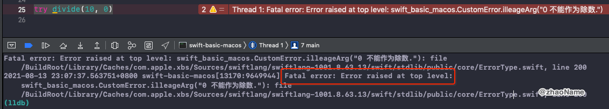
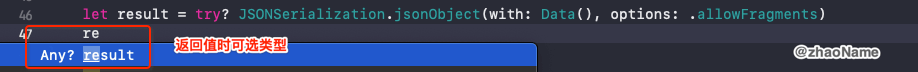

# Error Handling

错误处理 (Error Handling) 是对程序中的错误情况进行响应和恢复的过程。Swift 在运行时提供了抛出、捕获、传递和操作可恢复错误（recoverable errors）的一等支持（first-class support）。


<br>

## 一、抛出错误

如下当定义一个关于除法的函数，当 `num2` 为 0 时，程序会崩溃。为了提高代码的可读性，需要对一些错误进行处理。

```swift
func divide(_ num1: Int, _ num2: Int) -> Int {
    return num1 / num2
}
```

在 Swift 中，错误用遵循 Error 协议的类型的值来表示。这个空协议表明该类型可以用于错误处理。Swift 的枚举类型尤为适合构建一组相关的错误状态，枚举的关联值还可以提供错误状态的额外信息。

```swift
enum CustomError: Error {
    case illeageArg(String)
    case outOfBound(Int, Int)
    case outOfMemory
}

func divide(_ num1: Int, _ num2: Int) throws -> Int {
    if num2 == 0 {
        throw CustomError.illeageArg("0 不能作为除数.")
    }
    return num1 / num2
}
```

在函数中增加 `throws` 关键字表示抛出错误，但此时错误并没有处理，程序仍然会崩溃。

```
try divide(10, 0)
```




<br>

## 二、错误处理

### 0x01 `do-catch`

当某个函数抛出错误时，可以用 `do-catch` 处理。

```swift
do {
    print(try divide(10, 0))
} catch let CustomError.illeageArg(arg) {
    print("参数异常:", arg)
} catch let CustomError.outOfBound(size, index) {
    print("下标越界:size=\(size), index=\(index)")
} catch CustomError.outOfMemory {
    print("内存溢出")
} catch {
    print("其他错误")
}

// 打印结果
参数异常: 0 不能作为除数.
```

### 0x02 `try?`、`try!` 

可以使用 `try?` 通过将错误转换成一个可选值来处理错误。

```swift
let result = try? JSONSerialization.jsonObject(with: Data(), options: .allowFragments)
```



若某个 `throwing` 函数实际上在运行时是不会抛出错误的，在这种情况下，你可以在表达式前面写` try!` 来禁用错误传递。

```swift
func test2() {
    print("test2 start")
    test1()
}

func test1() {
    print("test1 start")
    print(try! divide(10, 10))
    print("test1 end")
}

test2()

// 打印结果
test2 start
test1 start
1
test1 end
```


### 0x03 `rethows`

若函数本身没有异常情况，但它的中的参数（闭包或函数）会向外抛出错误，可以用更精准的关键字`rethrows` 表示。

```swift
func testRethrow(_ fn: (Int, Int) throws -> Int, _ num1: Int, _ num2: Int) rethrows {
    print(try fn(num1, num2))
}
```


<br>


## 三、`defer`

有些时候我们需要在结束某个代码块执行前 (无论是由于抛出错误而离开，或是由于诸如 `return`、`break` 的语句)，做一些必要的清理工作，如释放内存、关闭文件。

`defer` 语句将代码的执行延迟到当前的作用域退出之前，延迟执行的语句不能包含任何控制转移语句(如 `break`、`return` 语句)。

**延迟执行的操作会按照它们声明的顺序从后往前执行。**

```swift
func processFile(filename: String) throws {
    if exists(filename) {
        let file = open(filename)
        defer {
            close(file)
        }
        while let line = try file.readline() {
            // 处理文件。
        }
        // close(file) 会在这里被调用，即作用域的最后。
    }
}
```

<br>


<br>

参考：

- [Error Handling](https://docs.swift.org/swift-book/LanguageGuide/ErrorHandling.html)

- [错误处理](https://swiftgg.gitbook.io/swift/swift-jiao-cheng/17_error_handling)

<br>